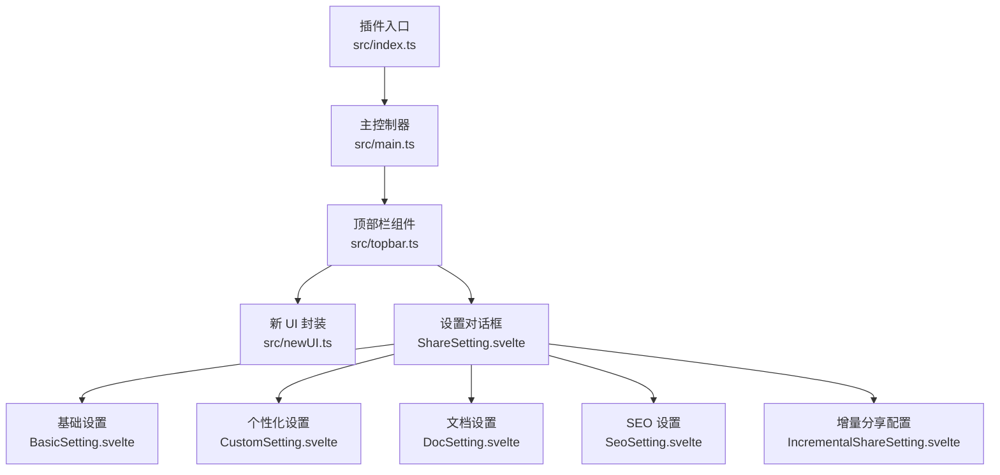
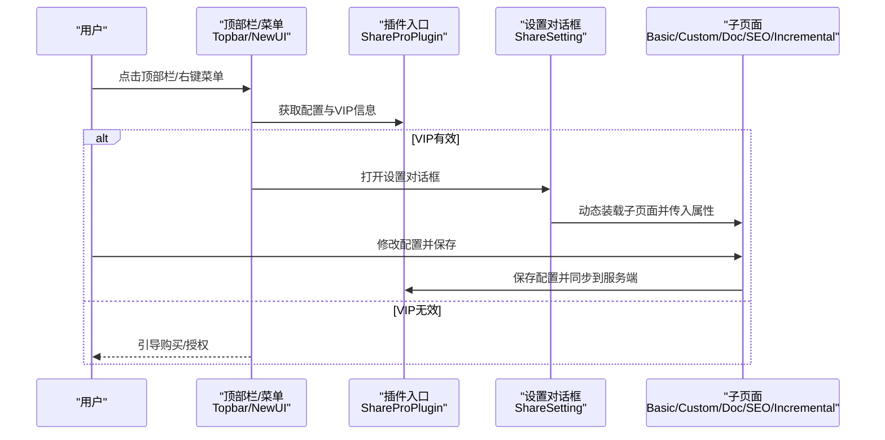
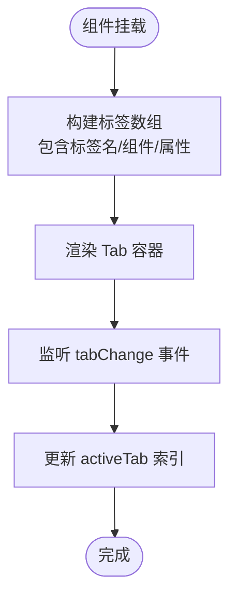
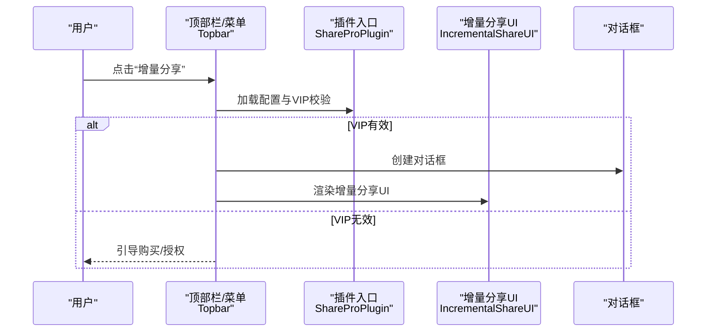
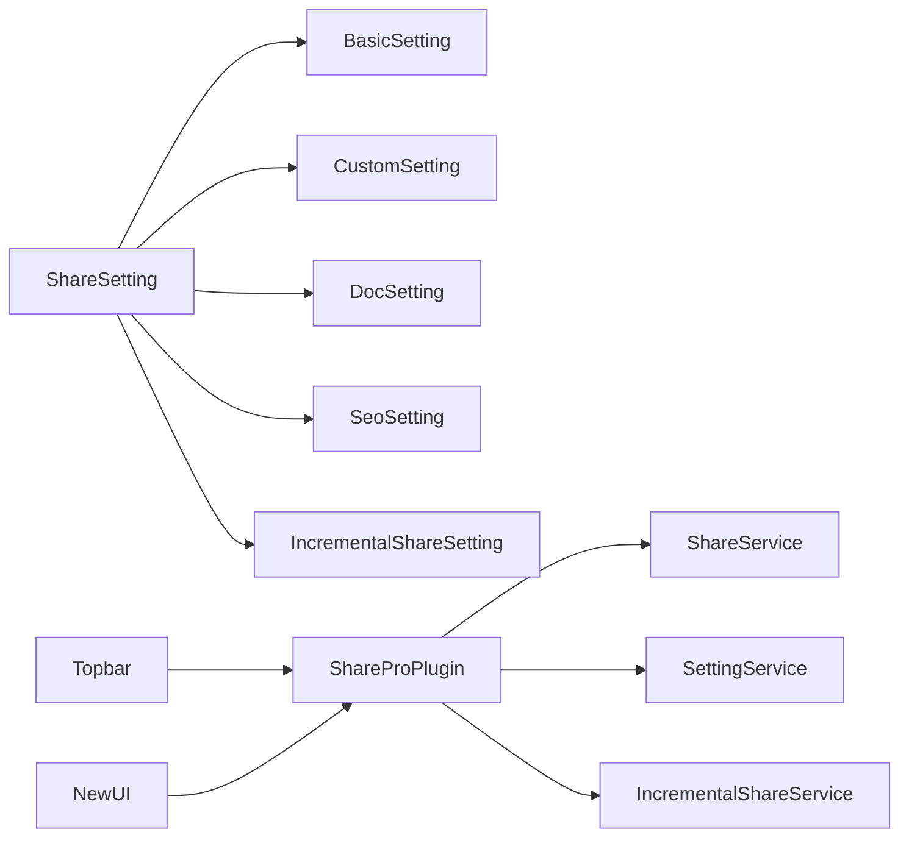

# 页面组件

<cite>
**本文引用的文件**
- [src/index.ts](file://src/index.ts)
- [src/main.ts](file://src/main.ts)
- [src/topbar.ts](file://src/topbar.ts)
- [src/newUI.ts](file://src/newUI.ts)
- [src/libs/pages/ShareSetting.svelte](file://src/libs/pages/ShareSetting.svelte)
- [src/libs/pages/setting/BasicSetting.svelte](file://src/libs/pages/setting/BasicSetting.svelte)
- [src/libs/pages/setting/CustomSetting.svelte](file://src/libs/pages/setting/CustomSetting.svelte)
- [src/libs/pages/setting/DocSetting.svelte](file://src/libs/pages/setting/DocSetting.svelte)
- [src/libs/pages/setting/SeoSetting.svelte](file://src/libs/pages/setting/SeoSetting.svelte)
- [src/libs/pages/setting/IncrementalShareSetting.svelte](file://src/libs/pages/setting/IncrementalShareSetting.svelte)
</cite>

## 目录
1. [简介](#简介)
2. [项目结构](#项目结构)
3. [核心组件](#核心组件)
4. [架构总览](#架构总览)
5. [详细组件分析](#详细组件分析)
6. [依赖关系分析](#依赖关系分析)
7. [性能考量](#性能考量)
8. [故障排查指南](#故障排查指南)
9. [结论](#结论)

## 简介
本文件聚焦“思源笔记分享专业版”的页面组件与设置界面，系统性梳理 ShareSetting 设置界面的多标签页架构、Tab 组件的动态内容加载与标签切换机制、属性传递模式；深入解析 IncrementalShareUI 增量分享界面的交互设计、状态管理与用户引导流程；阐述 ShareManage 分享管理界面的数据展示、操作控制与结果反馈机制；并文档化各设置子页面的功能职责与实现要点，涵盖生命周期管理、事件处理与服务层数据交互模式。

## 项目结构
- 插件入口与主控制器
  - 插件类负责加载配置、注入服务、打开设置对话框、暴露增量分享 UI 调用入口。
  - 主控制器负责启动顶部栏与菜单集成。
- 顶部栏与新 UI
  - 顶部栏组件提供分享入口、右键设置菜单、增量分享入口；支持新 UI 模式与传统菜单模式。
  - 新 UI 类封装了菜单内容挂载、VIP 校验、设置入口等逻辑。
- 设置界面与子页面
  - ShareSetting 作为多标签页容器，动态装配各设置子页面并传递属性。
  - 各子页面分别负责基础设置、个性化设置、文档设置、SEO 设置、增量分享配置等。

图表来源
- [src/index.ts:73-95](file://src/index.ts#L73-L95)
- [src/main.ts:21-30](file://src/main.ts#L21-L30)
- [src/topbar.ts:41-98](file://src/topbar.ts#L41-L98)
- [src/newUI.ts:53-122](file://src/newUI.ts#L53-L122)
- [src/libs/pages/ShareSetting.svelte:36-107](file://src/libs/pages/ShareSetting.svelte#L36-L107)

章节来源
- [src/index.ts:33-95](file://src/index.ts#L33-L95)
- [src/main.ts:12-31](file://src/main.ts#L12-L31)
- [src/topbar.ts:26-98](file://src/topbar.ts#L26-L98)
- [src/newUI.ts:35-122](file://src/newUI.ts#L35-L122)
- [src/libs/pages/ShareSetting.svelte:10-118](file://src/libs/pages/ShareSetting.svelte#L10-L118)

## 核心组件
- ShareProPlugin
  - 负责插件生命周期、加载/保存配置、注入服务、打开设置对话框、暴露增量分享 UI。
  - 提供安全加载配置与默认配置生成方法，保障首次安装与开发模式下的配置一致性。
- Main
  - 启动顶部栏，统一对外暴露增量分享 UI 展示入口。
- Topbar
  - 顶部栏入口、菜单构建、VIP 校验、分享/取消/查看文档、增量分享、分享管理等操作。
- NewUI
  - 新 UI 模式下的菜单内容挂载、VIP 校验、设置入口、分享 UI 弹窗。
- ShareSetting
  - 多标签页容器，动态构建标签数据、传递属性给子页面，监听标签切换事件。

章节来源
- [src/index.ts:33-177](file://src/index.ts#L33-L177)
- [src/main.ts:12-31](file://src/main.ts#L12-L31)
- [src/topbar.ts:26-293](file://src/topbar.ts#L26-L293)
- [src/newUI.ts:35-232](file://src/newUI.ts#L35-L232)
- [src/libs/pages/ShareSetting.svelte:10-118](file://src/libs/pages/ShareSetting.svelte#L10-L118)

## 架构总览
- 顶层入口
  - 插件类在加载时初始化服务与状态栏，提供打开设置对话框与增量分享 UI 的能力。
- 控制流
  - 用户点击顶部栏或右键菜单触发 Topbar 或 NewUI，进行 VIP 校验与菜单/弹窗构建。
  - 设置对话框由 ShareSetting 承载，内部通过 Tab 动态渲染子页面。
- 数据流
  - 配置通过插件实例安全加载与保存；子页面在保存时同步至服务端配置中心。
  - 增量分享 UI 由 Topbar 触发，基于当前配置与 VIP 信息决定是否允许。

图表来源
- [src/topbar.ts:41-98](file://src/topbar.ts#L41-L98)
- [src/newUI.ts:53-122](file://src/newUI.ts#L53-L122)
- [src/index.ts:73-95](file://src/index.ts#L73-L95)
- [src/libs/pages/ShareSetting.svelte:36-107](file://src/libs/pages/ShareSetting.svelte#L36-L107)

## 详细组件分析

### ShareSetting 多标签页架构与动态内容加载
- 动态内容加载机制
  - 在挂载后构建标签数组，每个标签包含标签名、子页面组件与属性对象。
  - 通过属性传递将插件实例、对话框实例、VIP 信息等注入子页面。
- 标签切换逻辑
  - 监听子组件发出的标签切换事件，更新当前激活标签索引。
- 属性传递模式
  - 统一以 props 形式向下传递，保证子页面可直接访问插件能力与上下文信息。
- 生命周期
  - 使用 Svelte 的 onMount 初始化标签数据，确保 DOM 可用后再渲染 Tab。

图表来源
- [src/libs/pages/ShareSetting.svelte:36-118](file://src/libs/pages/ShareSetting.svelte#L36-L118)

章节来源
- [src/libs/pages/ShareSetting.svelte:10-118](file://src/libs/pages/ShareSetting.svelte#L10-L118)

### IncrementalShareUI 增量分享界面
- 交互设计
  - 基于 VIP 校验决定是否允许使用增量分享功能。
  - 通过对话框承载 UI，适配移动端与桌面端尺寸。
- 状态管理
  - 通过插件实例加载配置与 VIP 信息，决定是否显示入口与行为。
  - 对话框销毁与 UI 渲染解耦，便于复用与扩展。
- 用户引导流程
  - 若未授权，引导用户前往购买页面；若已授权，提供增量分享入口。
  - 右键菜单与顶部栏入口均可触发，满足不同使用场景。

图表来源
- [src/topbar.ts:264-293](file://src/topbar.ts#L264-L293)
- [src/index.ts:174-176](file://src/index.ts#L174-L176)

章节来源
- [src/topbar.ts:264-293](file://src/topbar.ts#L264-L293)
- [src/index.ts:174-176](file://src/index.ts#L174-L176)

### ShareManage 分享管理界面
- 数据展示
  - 通过服务调用获取分享列表与状态，结合 UI 展示。
- 操作控制
  - 支持取消分享、重新分享、查看文章等操作，并对异常状态进行提示。
- 结果反馈
  - 操作成功与失败均通过消息提示反馈给用户，保证可观测性。

章节来源
- [src/topbar.ts:113-259](file://src/topbar.ts#L113-L259)

### 设置子页面功能职责与实现要点

#### 基础设置（BasicSetting）
- 职责
  - 注册信息展示、新 UI 开关、注册码输入、自动填充思源 API 地址。
- 实现要点
  - 保存时可选择同步到服务端配置中心；对话框关闭即销毁。
  - 默认启用新 UI，提升用户体验。

章节来源
- [src/libs/pages/setting/BasicSetting.svelte:10-70](file://src/libs/pages/setting/BasicSetting.svelte#L10-L70)
- [src/libs/pages/setting/BasicSetting.svelte:34-53](file://src/libs/pages/setting/BasicSetting.svelte#L34-L53)

#### 个性化设置（CustomSetting）
- 职责
  - 主题选择、自定义 CSS 同步、标题修复开关、域名与文档路径配置。
- 实现要点
  - 从服务端拉取作者维度的配置覆盖本地默认值。
  - 支持从思源内核请求片段资源，实现自定义 CSS 同步。

章节来源
- [src/libs/pages/setting/CustomSetting.svelte:10-119](file://src/libs/pages/setting/CustomSetting.svelte#L10-L119)
- [src/libs/pages/setting/CustomSetting.svelte:43-99](file://src/libs/pages/setting/CustomSetting.svelte#L43-L99)

#### 文档设置（DocSetting）
- 职责
  - 文档树层级、文档大纲层级、子文档分享、引用文档分享、全局密码保护与可见性。
- 实现要点
  - 通过服务端配置覆盖本地默认值，保证作者维度一致性。
  - 开关与下拉联动，增强配置灵活性。

章节来源
- [src/libs/pages/setting/DocSetting.svelte:10-122](file://src/libs/pages/setting/DocSetting.svelte#L10-L122)
- [src/libs/pages/setting/DocSetting.svelte:70-82](file://src/libs/pages/setting/DocSetting.svelte#L70-L82)

#### SEO 设置（SeoSetting）
- 职责
  - 站点标题/标语/描述、自定义头部/底部、分享模板。
- 实现要点
  - 从服务端作者配置读取默认值，支持保存并同步到服务端。

章节来源
- [src/libs/pages/setting/SeoSetting.svelte:10-76](file://src/libs/pages/setting/SeoSetting.svelte#L10-L76)
- [src/libs/pages/setting/SeoSetting.svelte:41-51](file://src/libs/pages/setting/SeoSetting.svelte#L41-L51)

#### 增量分享配置（IncrementalShareSetting）
- 职责
  - 控制增量分享功能的启用状态。
- 实现要点
  - 默认启用，仅在显式保存后才关闭；优先读取服务端配置覆盖本地。

章节来源
- [src/libs/pages/setting/IncrementalShareSetting.svelte:10-94](file://src/libs/pages/setting/IncrementalShareSetting.svelte#L10-L94)
- [src/libs/pages/setting/IncrementalShareSetting.svelte:37-62](file://src/libs/pages/setting/IncrementalShareSetting.svelte#L37-L62)

## 依赖关系分析
- 组件耦合
  - ShareSetting 与各子页面为松耦合的动态装载关系，通过 props 传递共享上下文。
  - Topbar 与 NewUI 通过插件实例与服务层交互，避免直接依赖具体 UI 细节。
- 外部依赖
  - 对话框组件 Dialog、菜单组件 Menu、消息提示 showMessage。
  - 服务层包括 ShareService、SettingService、IncrementalShareService 等。
- 配置与同步
  - 本地配置通过插件实例保存；子页面保存时可同步到服务端配置中心。

图表来源
- [src/libs/pages/ShareSetting.svelte:16-23](file://src/libs/pages/ShareSetting.svelte#L16-L23)
- [src/topbar.ts:26-39](file://src/topbar.ts#L26-L39)
- [src/newUI.ts:45-49](file://src/newUI.ts#L45-L49)
- [src/index.ts:49-58](file://src/index.ts#L49-L58)

章节来源
- [src/libs/pages/ShareSetting.svelte:16-23](file://src/libs/pages/ShareSetting.svelte#L16-L23)
- [src/topbar.ts:26-39](file://src/topbar.ts#L26-L39)
- [src/newUI.ts:45-49](file://src/newUI.ts#L45-L49)
- [src/index.ts:49-58](file://src/index.ts#L49-L58)

## 性能考量
- 动态装载与懒渲染
  - 通过 ShareSetting 的动态标签装载减少初始渲染压力，按需渲染子页面。
- 配置同步策略
  - 保存时可选择同步到服务端，避免频繁网络请求；必要时再进行同步。
- 对话框与菜单
  - 对话框与菜单在使用后及时销毁，降低内存占用。

## 故障排查指南
- 设置对话框无法打开
  - 检查插件实例是否正确注入 Dialog 容器；确认 i18n 与版本号拼接无误。
- 增量分享入口不可用
  - 校验 VIP 信息返回码；若非 0，需引导用户购买/授权。
- 子页面保存失败
  - 关注保存回调中的错误消息提示；检查服务端同步接口返回。
- 配置未生效
  - 确认本地保存与服务端同步顺序；必要时强制刷新服务端配置。

章节来源
- [src/index.ts:73-95](file://src/index.ts#L73-L95)
- [src/topbar.ts:264-293](file://src/topbar.ts#L264-L293)
- [src/libs/pages/setting/BasicSetting.svelte:34-48](file://src/libs/pages/setting/BasicSetting.svelte#L34-L48)
- [src/libs/pages/setting/CustomSetting.svelte:43-52](file://src/libs/pages/setting/CustomSetting.svelte#L43-L52)
- [src/libs/pages/setting/DocSetting.svelte:70-82](file://src/libs/pages/setting/DocSetting.svelte#L70-L82)
- [src/libs/pages/setting/SeoSetting.svelte:41-51](file://src/libs/pages/setting/SeoSetting.svelte#L41-L51)
- [src/libs/pages/setting/IncrementalShareSetting.svelte:37-62](file://src/libs/pages/setting/IncrementalShareSetting.svelte#L37-L62)

## 结论
该页面组件体系以 ShareSetting 为核心，采用多标签页动态装载模式，清晰分离各设置子页面职责；通过 Topbar 与 NewUI 提供一致的入口体验；配合服务层实现配置的本地持久化与远端同步。IncrementalShareUI 则以对话框形式提供增量分享能力，结合 VIP 校验与用户引导，形成完整的分享生态。整体架构具备良好的可维护性与扩展性，适合后续迭代与功能拓展。