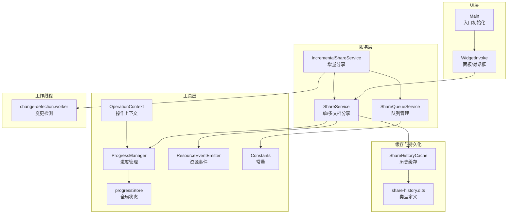
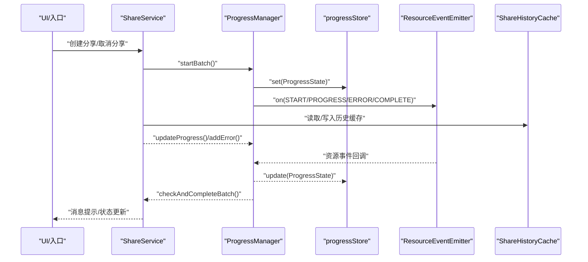
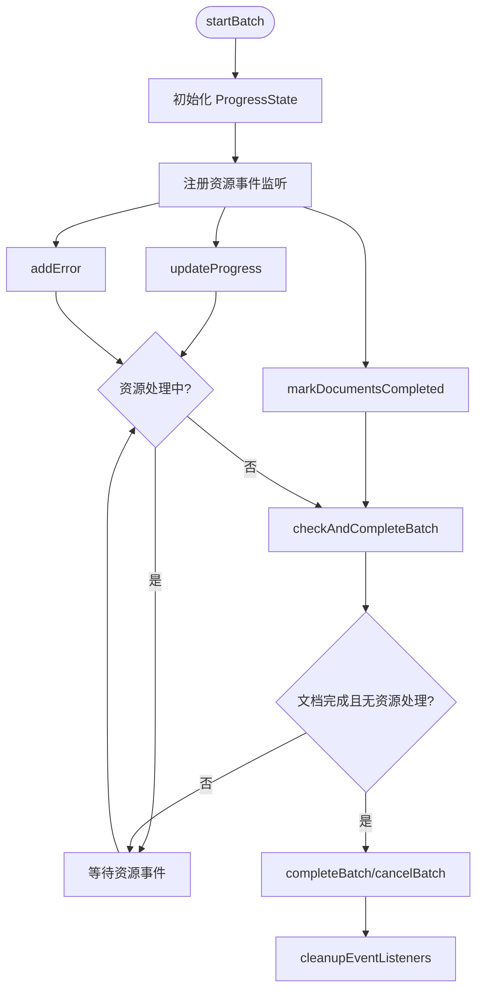
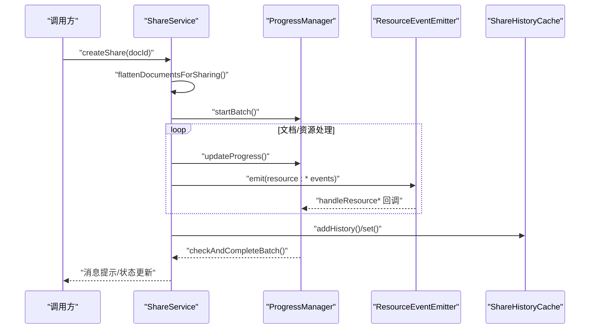
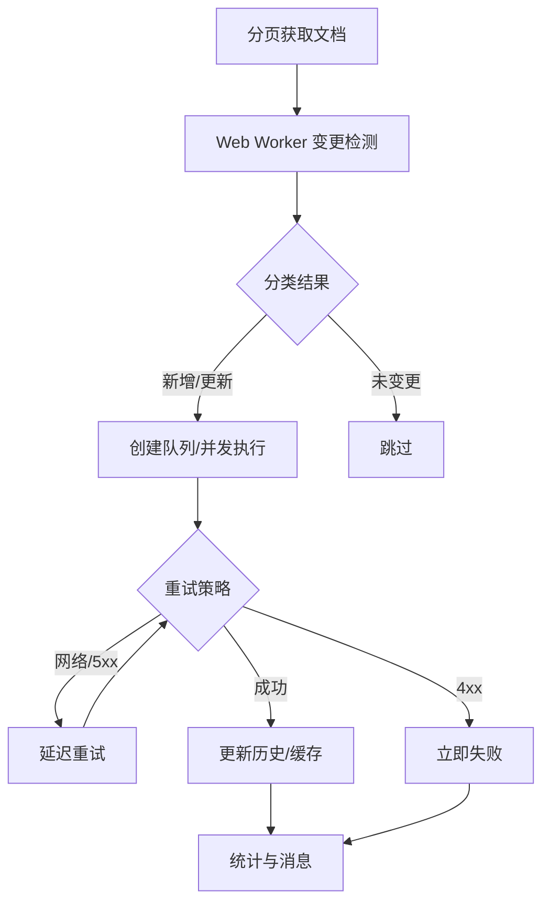
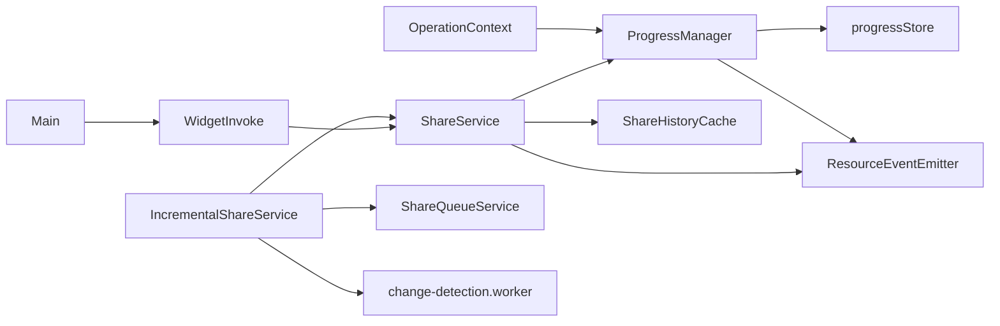

# 数据流架构

<cite>
**本文引用的文件**
- [src/utils/progress/ProgressManager.ts](file://src/utils/progress/ProgressManager.ts)
- [src/utils/progress/progressStore.ts](file://src/utils/progress/progressStore.ts)
- [src/utils/progress/ResourceEventEmitter.ts](file://src/utils/progress/ResourceEventEmitter.ts)
- [src/utils/progress/ProgressState.ts](file://src/utils/progress/ProgressState.ts)
- [src/utils/message/OperationContext.ts](file://src/utils/message/OperationContext.ts)
- [src/utils/message/index.ts](file://src/utils/message/index.ts)
- [src/service/ShareService.ts](file://src/service/ShareService.ts)
- [src/service/IncrementalShareService.ts](file://src/service/IncrementalShareService.ts)
- [src/service/ShareQueueService.ts](file://src/service/ShareQueueService.ts)
- [src/workers/change-detection.worker.ts](file://src/workers/change-detection.worker.ts)
- [src/utils/ShareHistoryCache.ts](file://src/utils/ShareHistoryCache.ts)
- [src/types/share-history.d.ts](file://src/types/share-history.d.ts)
- [src/invoke/widgetInvoke.ts](file://src/invoke/widgetInvoke.ts)
- [src/main.ts](file://src/main.ts)
- [src/Constants.ts](file://src/Constants.ts)
</cite>

## 目录
1. [引言](#引言)
2. [项目结构](#项目结构)
3. [核心组件](#核心组件)
4. [架构总览](#架构总览)
5. [详细组件分析](#详细组件分析)
6. [依赖关系分析](#依赖关系分析)
7. [性能考量](#性能考量)
8. [故障排查指南](#故障排查指南)
9. [结论](#结论)
10. [附录](#附录)

## 引言
本文件面向“思源笔记分享专业版”的数据流与状态管理，系统性梳理从用户交互到后台服务的完整数据通路，重点覆盖以下主题：
- 进度跟踪系统：ProgressManager 的批处理进度管理、资源处理进度联动与最终完成判定
- 状态管理：progressStore 的全局状态存储与响应式更新
- 事件驱动：ResourceEventEmitter 的资源事件发布订阅模型
- 操作上下文：OperationContext 的消息传递与异步处理流程
- 架构分层：服务层、工作线程、缓存与持久化之间的数据传递
- 缓存策略与同步：内存缓存、队列持久化与增量同步
- 数据验证、错误传播与回滚：重试机制、失败任务恢复与进度回显
- 优化策略、内存管理与性能监控：并发控制、Web Worker、TTL缓存与进度回调

## 项目结构
项目采用“服务层 + 工具层 + 类型与常量 + UI入口”的分层组织。核心数据流围绕服务层展开，通过工具层的进度与事件系统、工作线程的变更检测、以及缓存与持久化实现高效、可观察、可恢复的数据处理。

图表来源
- [src/main.ts:1-34](file://src/main.ts#L1-L34)
- [src/invoke/widgetInvoke.ts:1-80](file://src/invoke/widgetInvoke.ts#L1-L80)
- [src/service/ShareService.ts:1-1251](file://src/service/ShareService.ts#L1-L1251)
- [src/service/IncrementalShareService.ts:1-690](file://src/service/IncrementalShareService.ts#L1-L690)
- [src/service/ShareQueueService.ts:1-299](file://src/service/ShareQueueService.ts#L1-L299)
- [src/utils/message/OperationContext.ts:1-187](file://src/utils/message/OperationContext.ts#L1-L187)
- [src/utils/progress/ProgressManager.ts:1-238](file://src/utils/progress/ProgressManager.ts#L1-L238)
- [src/utils/progress/progressStore.ts:1-15](file://src/utils/progress/progressStore.ts#L1-L15)
- [src/utils/progress/ResourceEventEmitter.ts:1-11](file://src/utils/progress/ResourceEventEmitter.ts#L1-L11)
- [src/workers/change-detection.worker.ts:1-148](file://src/workers/change-detection.worker.ts#L1-L148)
- [src/utils/ShareHistoryCache.ts:1-91](file://src/utils/ShareHistoryCache.ts#L1-L91)
- [src/types/share-history.d.ts:1-59](file://src/types/share-history.d.ts#L1-L59)
- [src/Constants.ts:1-20](file://src/Constants.ts#L1-L20)

章节来源
- [src/main.ts:1-34](file://src/main.ts#L1-L34)
- [src/invoke/widgetInvoke.ts:1-80](file://src/invoke/widgetInvoke.ts#L1-L80)
- [src/Constants.ts:1-20](file://src/Constants.ts#L1-L20)

## 核心组件
- ProgressManager：批处理进度管理器，负责启动/更新/完成批次，聚合文档与资源两类进度，并在合适时机触发完成
- progressStore：基于 Svelte writable 的全局进度状态存储，提供响应式更新能力
- ResourceEventEmitter：基于 eventemitter3 的资源事件发布订阅中心，承载图片/附件等资源处理事件
- OperationContext：操作上下文管理器，统一处理单/批量、文档/资源两类操作的消息提示与状态记录
- ShareService：统一分享入口，协调文档扁平化、资源处理、历史记录与进度上报
- IncrementalShareService：增量分享服务，结合队列、黑名单、重试与变更检测实现高可靠批量分享
- ShareQueueService：队列持久化与状态管理，提供进度回调、失败重试与暂停/继续控制
- change-detection.worker：Web Worker 执行变更检测，避免主线程阻塞
- ShareHistoryCache：内存级 TTL 缓存，加速历史记录读取与变更检测
- 类型与常量：share-history.d.ts 定义历史项结构；Constants 提供全局常量

章节来源
- [src/utils/progress/ProgressManager.ts:1-238](file://src/utils/progress/ProgressManager.ts#L1-L238)
- [src/utils/progress/progressStore.ts:1-15](file://src/utils/progress/progressStore.ts#L1-L15)
- [src/utils/progress/ResourceEventEmitter.ts:1-11](file://src/utils/progress/ResourceEventEmitter.ts#L1-L11)
- [src/utils/message/OperationContext.ts:1-187](file://src/utils/message/OperationContext.ts#L1-L187)
- [src/service/ShareService.ts:1-1251](file://src/service/ShareService.ts#L1-L1251)
- [src/service/IncrementalShareService.ts:1-690](file://src/service/IncrementalShareService.ts#L1-L690)
- [src/service/ShareQueueService.ts:1-299](file://src/service/ShareQueueService.ts#L1-L299)
- [src/workers/change-detection.worker.ts:1-148](file://src/workers/change-detection.worker.ts#L1-L148)
- [src/utils/ShareHistoryCache.ts:1-91](file://src/utils/ShareHistoryCache.ts#L1-L91)
- [src/types/share-history.d.ts:1-59](file://src/types/share-history.d.ts#L1-L59)
- [src/Constants.ts:1-20](file://src/Constants.ts#L1-L20)

## 架构总览
下图展示从 UI 触发到后台服务的端到端数据流，强调事件驱动、状态驱动与异步处理：

图表来源
- [src/service/ShareService.ts:1-1251](file://src/service/ShareService.ts#L1-L1251)
- [src/utils/progress/ProgressManager.ts:1-238](file://src/utils/progress/ProgressManager.ts#L1-L238)
- [src/utils/progress/progressStore.ts:1-15](file://src/utils/progress/progressStore.ts#L1-L15)
- [src/utils/progress/ResourceEventEmitter.ts:1-11](file://src/utils/progress/ResourceEventEmitter.ts#L1-L11)
- [src/utils/ShareHistoryCache.ts:1-91](file://src/utils/ShareHistoryCache.ts#L1-L91)

## 详细组件分析

### 进度跟踪系统：ProgressManager
- 批次生命周期：startBatch → updateProgress → markDocumentsCompleted → checkAndCompleteBatch → completeBatch/cancelBatch
- 资源进度联动：监听 START/PROGRESS/ERROR/COMPLETE 事件，动态累加资源计数并判断资源阶段结束
- 完成判定：当文档标记完成且资源处理完毕（或未开启资源处理）时，综合错误状态决定最终状态
- 清理策略：完成/取消时移除事件监听，防止内存泄漏

图表来源
- [src/utils/progress/ProgressManager.ts:1-238](file://src/utils/progress/ProgressManager.ts#L1-L238)

章节来源
- [src/utils/progress/ProgressManager.ts:1-238](file://src/utils/progress/ProgressManager.ts#L1-L238)

### 状态管理：progressStore
- 基于 Svelte writable 的全局可订阅状态，提供 set/update 两种更新方式
- 与 ProgressManager 协同：由 ProgressManager 负责状态计算与更新，UI 层通过订阅实时渲染

章节来源
- [src/utils/progress/progressStore.ts:1-15](file://src/utils/progress/progressStore.ts#L1-L15)

### 事件驱动：ResourceEventEmitter
- 事件类型：START、PROGRESS、ERROR、COMPLETE
- 发布方：资源处理流程（图片/附件等）
- 订阅方：ProgressManager（聚合资源进度）、ShareService（单文档资源错误处理）

章节来源
- [src/utils/progress/ResourceEventEmitter.ts:1-11](file://src/utils/progress/ResourceEventEmitter.ts#L1-L11)
- [src/service/ShareService.ts:1-1251](file://src/service/ShareService.ts#L1-L1251)

### 操作上下文：OperationContext
- 目标：统一单/批量、文档/资源两类操作的消息策略，避免重复与混乱提示
- 关键行为：start/updateProgress/recordSuccess/recordError/recordWarning/complete
- 与进度系统的衔接：可通过外部调用配合 ProgressManager 实现更精细的用户反馈

章节来源
- [src/utils/message/OperationContext.ts:1-187](file://src/utils/message/OperationContext.ts#L1-L187)
- [src/utils/message/index.ts:1-21](file://src/utils/message/index.ts#L1-L21)

### 分享服务：ShareService
- 统一入口：createShare → handleOne 或 批量处理
- 文档扁平化：支持子文档与引用文档的扁平化收集，分页获取并去重
- 资源处理：异步处理媒体资源（图片/DataViews），通过事件驱动与进度管理协同
- 历史记录：成功/失败均写入本地历史与缓存，便于变更检测与 UI 展示

图表来源
- [src/service/ShareService.ts:1-1251](file://src/service/ShareService.ts#L1-L1251)
- [src/utils/progress/ProgressManager.ts:1-238](file://src/utils/progress/ProgressManager.ts#L1-L238)
- [src/utils/progress/ResourceEventEmitter.ts:1-11](file://src/utils/progress/ResourceEventEmitter.ts#L1-L11)
- [src/utils/ShareHistoryCache.ts:1-91](file://src/utils/ShareHistoryCache.ts#L1-L91)

章节来源
- [src/service/ShareService.ts:1-1251](file://src/service/ShareService.ts#L1-L1251)

### 增量分享：IncrementalShareService
- 变更检测：分页拉取文档，使用 Web Worker 进行变更检测，区分新增/更新/未变更
- 队列管理：创建队列、并发控制、暂停/继续、失败重试
- 重试策略：网络错误指数退避、5xx 延迟重试、4xx 直接失败
- 缓存与同步：使用内存缓存加速历史查询，分享完成后清理缓存并同步配置

图表来源
- [src/service/IncrementalShareService.ts:1-690](file://src/service/IncrementalShareService.ts#L1-L690)
- [src/workers/change-detection.worker.ts:1-148](file://src/workers/change-detection.worker.ts#L1-L148)
- [src/service/ShareQueueService.ts:1-299](file://src/service/ShareQueueService.ts#L1-L299)
- [src/utils/ShareHistoryCache.ts:1-91](file://src/utils/ShareHistoryCache.ts#L1-L91)

章节来源
- [src/service/IncrementalShareService.ts:1-690](file://src/service/IncrementalShareService.ts#L1-L690)
- [src/workers/change-detection.worker.ts:1-148](file://src/workers/change-detection.worker.ts#L1-L148)
- [src/service/ShareQueueService.ts:1-299](file://src/service/ShareQueueService.ts#L1-L299)
- [src/utils/ShareHistoryCache.ts:1-91](file://src/utils/ShareHistoryCache.ts#L1-L91)

### 队列服务：ShareQueueService
- 队列状态：idle/running/paused/completed
- 任务状态：pending/processing/success/failed/skipped
- 进度回调：getProgress 提供估算剩余时间，onProgress 注册 UI 回调
- 持久化：队列状态保存至插件配置，支持启动时恢复

章节来源
- [src/service/ShareQueueService.ts:1-299](file://src/service/ShareQueueService.ts#L1-L299)

### 变更检测工作线程：change-detection.worker
- 独立线程：避免主线程阻塞
- 输入输出：标准化消息类型，输入文档与历史映射，输出分类结果
- 性能优化：黑名单集合 O(1) 查询，历史映射快速比对

章节来源
- [src/workers/change-detection.worker.ts:1-148](file://src/workers/change-detection.worker.ts#L1-L148)

### 历史缓存：ShareHistoryCache
- TTL 缓存：默认 5 分钟，命中率高时显著降低数据库/网络访问
- 失效策略：主动失效与过期清理，保证数据一致性
- 统计接口：size/ttl，便于监控与调试

章节来源
- [src/utils/ShareHistoryCache.ts:1-91](file://src/utils/ShareHistoryCache.ts#L1-L91)
- [src/types/share-history.d.ts:1-59](file://src/types/share-history.d.ts#L1-L59)

## 依赖关系分析
- 组件耦合
  - ShareService 依赖 ProgressManager、ResourceEventEmitter、ShareHistoryCache
  - IncrementalShareService 依赖 ShareService、ShareQueueService、ChangeDetectionWorkerUtil、BlacklistService
  - ProgressManager 依赖 progressStore 与 ResourceEventEmitter
  - UI 层通过 WidgetInvoke 与 Main 初始化，间接依赖服务层
- 外部依赖
  - eventemitter3：事件发布订阅
  - siyuan：消息提示、窗口与标签页打开
  - zhi-lib-base：日志与通用工具
- 潜在循环依赖
  - 通过模块化拆分避免直接循环导入；服务层之间通过接口与工具函数解耦

图表来源
- [src/utils/message/OperationContext.ts:1-187](file://src/utils/message/OperationContext.ts#L1-L187)
- [src/utils/progress/ProgressManager.ts:1-238](file://src/utils/progress/ProgressManager.ts#L1-L238)
- [src/utils/progress/progressStore.ts:1-15](file://src/utils/progress/progressStore.ts#L1-L15)
- [src/utils/progress/ResourceEventEmitter.ts:1-11](file://src/utils/progress/ResourceEventEmitter.ts#L1-L11)
- [src/service/ShareService.ts:1-1251](file://src/service/ShareService.ts#L1-L1251)
- [src/service/IncrementalShareService.ts:1-690](file://src/service/IncrementalShareService.ts#L1-L690)
- [src/service/ShareQueueService.ts:1-299](file://src/service/ShareQueueService.ts#L1-L299)
- [src/workers/change-detection.worker.ts:1-148](file://src/workers/change-detection.worker.ts#L1-L148)
- [src/utils/ShareHistoryCache.ts:1-91](file://src/utils/ShareHistoryCache.ts#L1-L91)
- [src/invoke/widgetInvoke.ts:1-80](file://src/invoke/widgetInvoke.ts#L1-L80)
- [src/main.ts:1-34](file://src/main.ts#L1-L34)

## 性能考量
- 并发控制
  - 批量分享与取消采用并发限制（如 5/10），避免服务端压力与资源争用
- Web Worker
  - 变更检测在独立线程执行，主线程保持流畅
- 缓存策略
  - ShareHistoryCache 使用 TTL，减少重复查询；变更检测前后清理缓存，保证一致性
- 状态更新
  - progressStore 采用最小化更新策略，避免不必要的 UI 重渲染
- 日志与监控
  - 使用 simpleLogger 输出关键路径日志，便于定位性能瓶颈

[本节为通用性能建议，无需具体文件引用]

## 故障排查指南
- 进度不更新
  - 检查 ProgressManager.startBatch 是否正确传入 id，updateProgress 的 id 是否匹配
  - 确认资源事件是否正确发布与消费
- 资源处理错误未计入
  - 核对 ResourceEventEmitter 的 ERROR 事件是否被监听并写入 resourceErrors
- 增量分享失败
  - 查看重试日志与状态码提取逻辑，确认 4xx/5xx 分支处理
  - 检查队列状态与失败任务重试
- 队列恢复异常
  - 确认持久化字段与恢复流程一致，注意运行中队列转为暂停态

章节来源
- [src/utils/progress/ProgressManager.ts:1-238](file://src/utils/progress/ProgressManager.ts#L1-L238)
- [src/service/IncrementalShareService.ts:1-690](file://src/service/IncrementalShareService.ts#L1-L690)
- [src/service/ShareQueueService.ts:1-299](file://src/service/ShareQueueService.ts#L1-L299)

## 结论
本架构以事件驱动与状态驱动为核心，通过 ProgressManager 与 progressStore 实现清晰的批处理进度可视化，借助 ResourceEventEmitter 将资源处理纳入统一进度体系。服务层在保证高并发与可靠性的同时，通过 Web Worker、内存缓存与队列持久化提升用户体验。建议在后续版本中进一步完善错误回滚与重试策略的可观测性，并扩展进度回调的 UI 展示维度。

[本节为总结性内容，无需具体文件引用]

## 附录
- 常量与配置
  - 全局常量集中于 Constants，便于统一管理 API 地址、页面尺寸与存储键名
- UI 入口
  - Main 负责顶部栏初始化，WidgetInvoke 提供面板/对话框入口，便于用户触发分享与管理操作

章节来源
- [src/Constants.ts:1-20](file://src/Constants.ts#L1-L20)
- [src/main.ts:1-34](file://src/main.ts#L1-L34)
- [src/invoke/widgetInvoke.ts:1-80](file://src/invoke/widgetInvoke.ts#L1-L80)