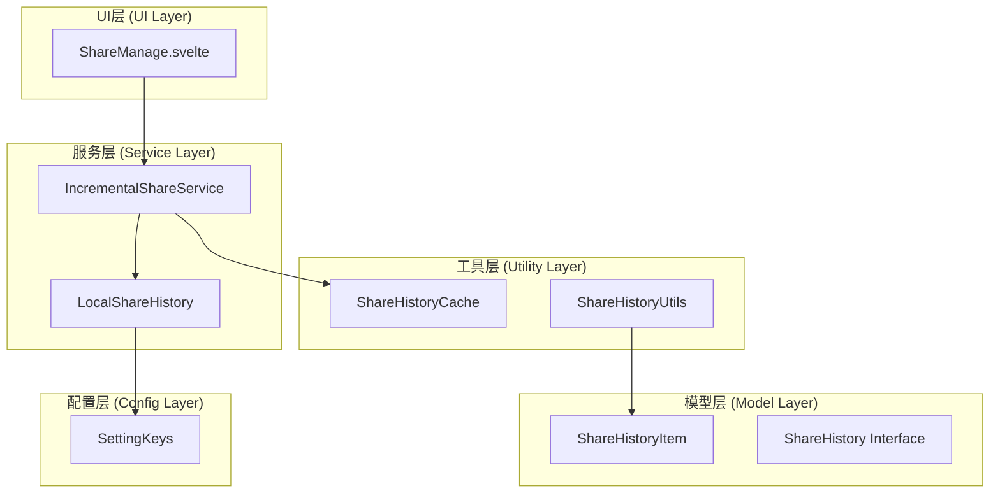
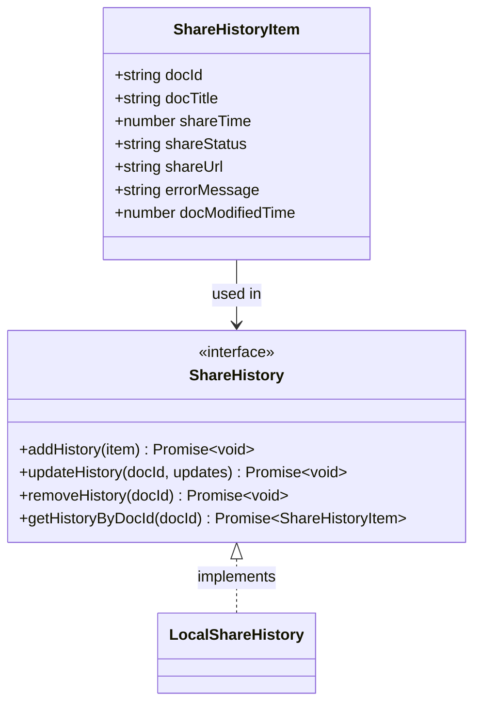
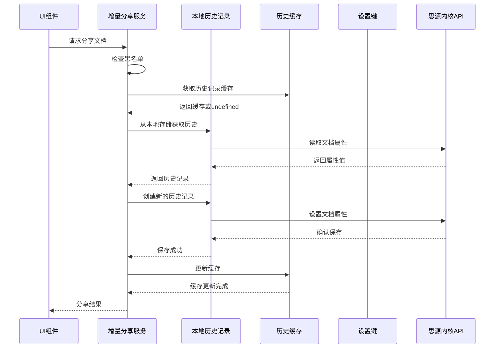
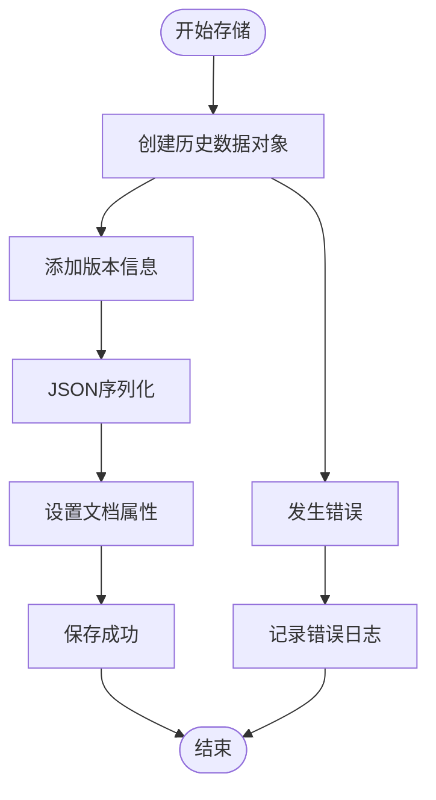
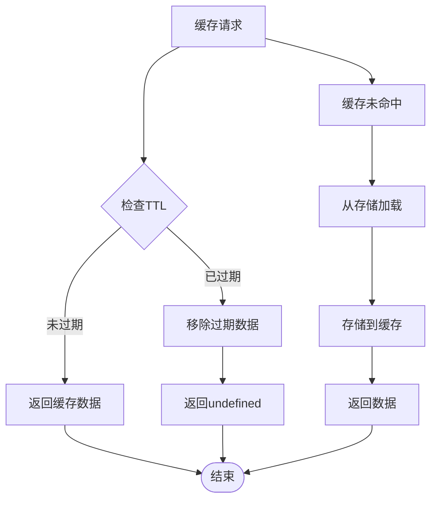
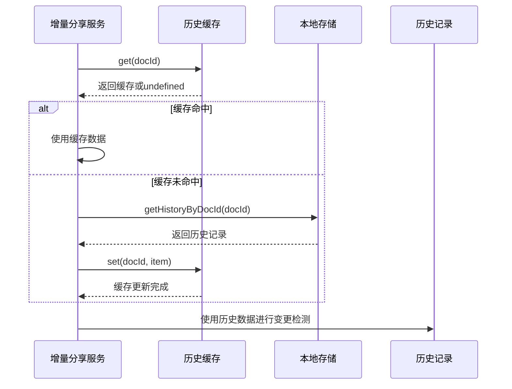
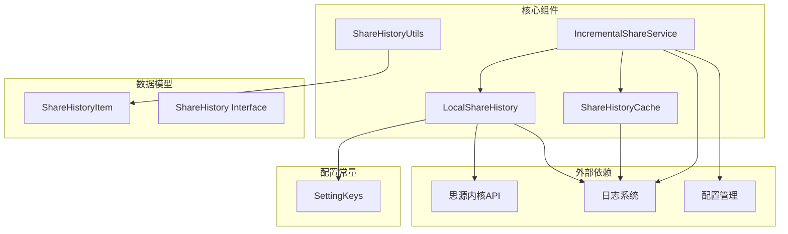
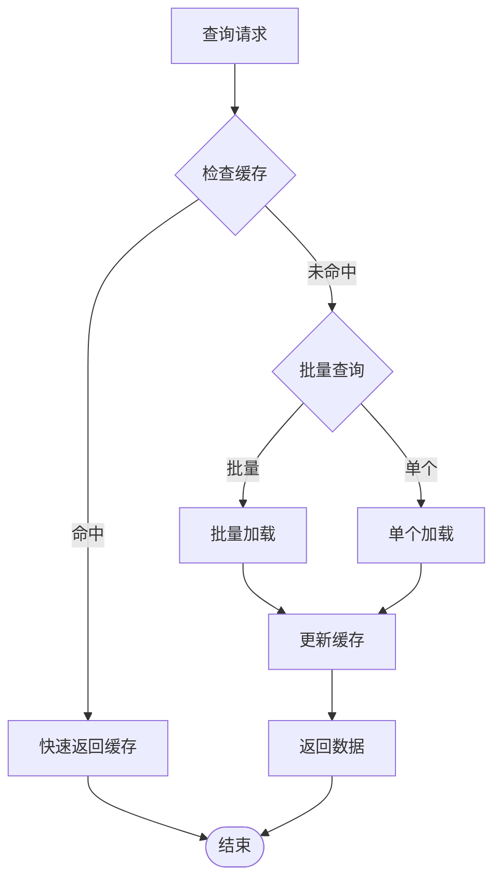
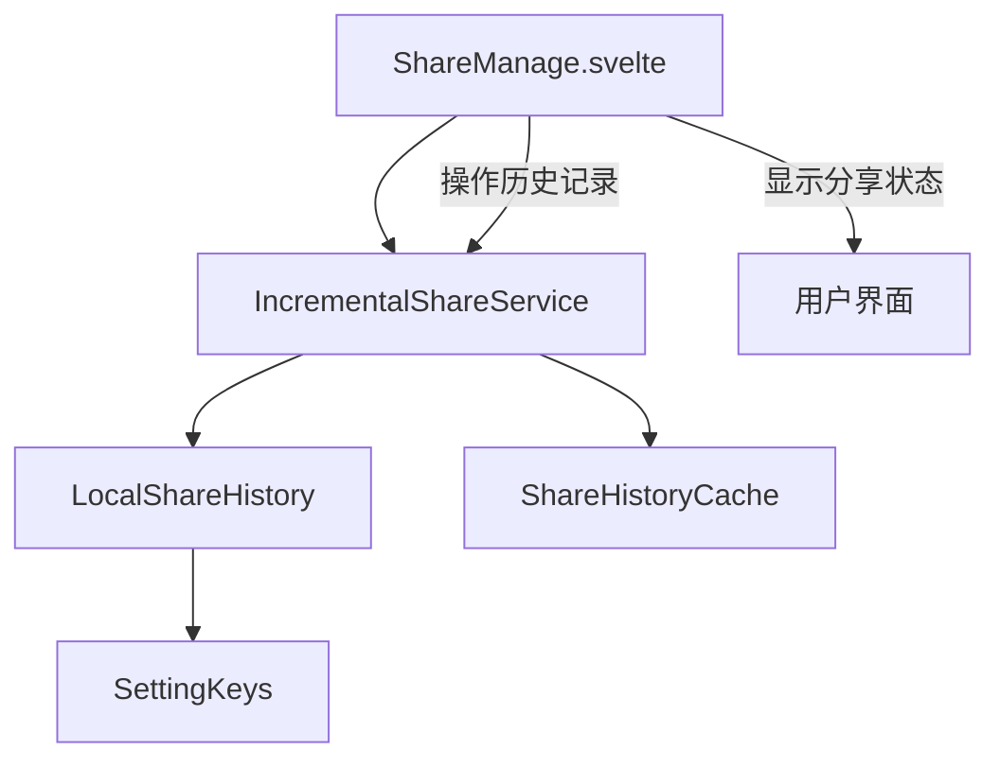

# 分享历史服务 (ShareHistoryService)

<cite>
**本文档引用的文件**
- [LocalShareHistory.ts](file://src/service/LocalShareHistory.ts)
- [ShareHistoryCache.ts](file://src/utils/ShareHistoryCache.ts)
- [ShareHistoryUtils.ts](file://src/utils/ShareHistoryUtils.ts)
- [ShareHistory.ts](file://src/models/ShareHistory.ts)
- [share-history.d.ts](file://src/types/share-history.d.ts)
- [IncrementalShareService.ts](file://src/service/IncrementalShareService.ts)
- [SettingKeys.ts](file://src/utils/SettingKeys.ts)
- [ShareManage.svelte](file://src/libs/pages/ShareManage.svelte)
- [incremental-share-context-2025-12-08.md](file://docs/incremental-share-context-2025-12-08.md)
</cite>

## 目录
1. [简介](#简介)
2. [项目结构](#项目结构)
3. [核心组件](#核心组件)
4. [架构概览](#架构概览)
5. [详细组件分析](#详细组件分析)
6. [依赖关系分析](#依赖关系分析)
7. [性能考虑](#性能考虑)
8. [故障排除指南](#故障排除指南)
9. [结论](#结论)
10. [附录](#附录)

## 简介

分享历史服务是思源笔记分享专业版的核心组件之一，负责管理文档分享的历史记录。该服务提供了完整的分享历史生命周期管理，包括历史记录的创建、存储、查询和清理机制。系统采用本地存储策略，将分享历史与文档属性绑定，确保数据的一致性和可靠性。

该服务主要包含三个核心组件：
- **LocalShareHistory**: 本地存储实现，基于思源笔记的文档属性系统
- **ShareHistoryCache**: 内存缓存系统，提供LRU缓存和TTL过期机制
- **ShareHistoryUtils**: 工具函数集合，处理历史记录转换和统计分析

## 项目结构

分享历史服务位于项目的 `src/service` 和 `src/utils` 目录中，采用模块化设计，便于维护和扩展。



**图表来源**
- [LocalShareHistory.ts:23-128](file://src/service/LocalShareHistory.ts#L23-L128)
- [ShareHistoryCache.ts:19-90](file://src/utils/ShareHistoryCache.ts#L19-L90)
- [ShareHistoryUtils.ts:15-29](file://src/utils/ShareHistoryUtils.ts#L15-L29)
- [IncrementalShareService.ts:98-129](file://src/service/IncrementalShareService.ts#L98-L129)

**章节来源**
- [LocalShareHistory.ts:1-129](file://src/service/LocalShareHistory.ts#L1-L129)
- [ShareHistoryCache.ts:1-91](file://src/utils/ShareHistoryCache.ts#L1-L91)
- [ShareHistoryUtils.ts:1-30](file://src/utils/ShareHistoryUtils.ts#L1-L30)

## 核心组件

### ShareHistoryItem 数据模型

ShareHistoryItem 是分享历史的核心数据结构，定义了文档分享的所有相关信息：



**图表来源**
- [ShareHistory.ts:13-48](file://src/models/ShareHistory.ts#L13-L48)
- [ShareHistory.ts:53-73](file://src/models/ShareHistory.ts#L53-L73)

### LocalShareHistory 本地存储实现

LocalShareHistory 是分享历史服务的主要实现类，负责与思源笔记内核API交互，将历史记录存储在文档属性中。

**章节来源**
- [LocalShareHistory.ts:23-128](file://src/service/LocalShareHistory.ts#L23-L128)

## 架构概览

分享历史服务采用分层架构设计，实现了清晰的关注点分离：



**图表来源**
- [IncrementalShareService.ts:218-240](file://src/service/IncrementalShareService.ts#L218-L240)
- [LocalShareHistory.ts:31-52](file://src/service/LocalShareHistory.ts#L31-L52)
- [ShareHistoryCache.ts:31-56](file://src/utils/ShareHistoryCache.ts#L31-L56)

## 详细组件分析

### LocalShareHistory 本地存储策略

LocalShareHistory 采用文档属性存储策略，将分享历史与对应的文档绑定，确保数据的完整性和一致性。

#### 存储机制

系统使用 `custom-share-history` 属性键存储历史记录，采用JSON序列化格式：



**图表来源**
- [LocalShareHistory.ts:36-47](file://src/service/LocalShareHistory.ts#L36-L47)

#### 数据结构设计

历史记录包含以下关键字段：
- **基础信息**: 文档ID、标题、分享时间戳
- **状态信息**: 分享状态（success/failed/pending）
- **元数据**: 分享URL、错误信息、文档修改时间
- **版本控制**: 内部版本号和更新时间戳

**章节来源**
- [LocalShareHistory.ts:36-41](file://src/service/LocalShareHistory.ts#L36-L41)
- [ShareHistory.ts:13-48](file://src/models/ShareHistory.ts#L13-L48)

### ShareHistoryCache 缓存系统

ShareHistoryCache 提供内存级别的缓存机制，显著提升查询性能，采用LRU缓存策略和TTL过期机制。

#### 缓存策略

```mermaid
classDiagram
class ShareHistoryCache {
-Map~string, ShareHistoryItem~ cache
-Map~string, number~ timestamps
-number TTL
+get(docId) ShareHistoryItem
+set(docId, item) void
+clear() void
+invalidate(docId) void
+getStats() object
}
note for ShareHistoryCache : "TTL : 5分钟<br/>LRU : 基于访问时间<br/>过期自动清理"
```

**图表来源**
- [ShareHistoryCache.ts:19-90](file://src/utils/ShareHistoryCache.ts#L19-L90)

#### 缓存生命周期



**图表来源**
- [ShareHistoryCache.ts:31-44](file://src/utils/ShareHistoryCache.ts#L31-L44)

**章节来源**
- [ShareHistoryCache.ts:19-90](file://src/utils/ShareHistoryCache.ts#L19-L90)

### ShareHistoryUtils 工具函数

ShareHistoryUtils 提供历史记录转换和处理的工具函数，简化数据处理流程。

#### 主要功能


**图表来源**
- [ShareHistoryUtils.ts:15-29](file://src/utils/ShareHistoryUtils.ts#L15-L29)

**章节来源**
- [ShareHistoryUtils.ts:15-29](file://src/utils/ShareHistoryUtils.ts#L15-L29)

### IncrementalShareService 集成模式

IncrementalShareService 作为核心协调者，集成了所有历史服务组件：

#### 缓存集成流程



**图表来源**
- [IncrementalShareService.ts:218-240](file://src/service/IncrementalShareService.ts#L218-L240)

**章节来源**
- [IncrementalShareService.ts:218-240](file://src/service/IncrementalShareService.ts#L218-L240)

## 依赖关系分析

分享历史服务的依赖关系清晰明确，遵循依赖倒置原则：



**图表来源**
- [LocalShareHistory.ts:10-15](file://src/service/LocalShareHistory.ts#L10-L15)
- [ShareHistoryCache.ts:10-12](file://src/utils/ShareHistoryCache.ts#L10-L12)
- [IncrementalShareService.ts:19-24](file://src/service/IncrementalShareService.ts#L19-L24)

**章节来源**
- [LocalShareHistory.ts:10-15](file://src/service/LocalShareHistory.ts#L10-L15)
- [ShareHistoryCache.ts:10-12](file://src/utils/ShareHistoryCache.ts#L10-L12)
- [IncrementalShareService.ts:19-24](file://src/service/IncrementalShareService.ts#L19-L24)

## 性能考虑

### 缓存优化策略

系统采用多层缓存策略来优化性能：

1. **内存缓存**: 5分钟TTL的LRU缓存
2. **批量查询**: 支持批量历史记录获取
3. **智能重试**: 分享失败时的智能重试机制

### 查询性能优化



**图表来源**
- [IncrementalShareService.ts:218-240](file://src/service/IncrementalShareService.ts#L218-L240)

### 内存管理

系统采用自动过期机制防止内存泄漏：
- **TTL过期**: 5分钟自动清理过期缓存
- **容量控制**: 基于Map的数据结构，自动管理内存
- **手动清理**: 提供clear()和invalidate()方法

## 故障排除指南

### 常见问题及解决方案

#### 1. 历史记录无法读取

**症状**: 分享历史显示为空白或显示错误

**诊断步骤**:
1. 检查文档属性是否存在
2. 验证JSON格式是否正确
3. 确认版本兼容性

**解决方法**:
```typescript
// 检查文档属性
const attrs = await kernelApi.getBlockAttrs(docId)
console.log('文档属性:', attrs)

// 验证JSON格式
try {
    const item = JSON.parse(attrs[SettingKeys.CUSTOM_SHARE_HISTORY])
    console.log('解析结果:', item)
} catch (error) {
    console.error('JSON解析失败:', error)
}
```

#### 2. 缓存失效问题

**症状**: 缓存数据陈旧或不准确

**诊断步骤**:
1. 检查TTL设置是否合理
2. 验证缓存更新逻辑
3. 监控缓存命中率

**解决方法**:
```typescript
// 清除特定文档缓存
shareHistoryCache.invalidate(docId)

// 清空所有缓存
shareHistoryCache.clear()

// 检查缓存状态
const stats = shareHistoryCache.getStats()
console.log('缓存统计:', stats)
```

#### 3. 存储权限问题

**症状**: 无法写入历史记录或出现权限错误

**诊断步骤**:
1. 检查插件权限配置
2. 验证内核API访问权限
3. 确认文档属性写入权限

**解决方法**:
```typescript
// 检查内核API连接
const { kernelApi } = await ApiUtils.getSiyuanKernelApi(this.pluginInstance)

// 验证权限
if (!kernelApi) {
    throw new Error('内核API连接失败')
}

// 检查文档存在性
const docExists = await kernelApi.getBlockAttrs(docId)
if (!docExists) {
    throw new Error('文档不存在')
}
```

**章节来源**
- [LocalShareHistory.ts:48-51](file://src/service/LocalShareHistory.ts#L48-L51)
- [ShareHistoryCache.ts:61-76](file://src/utils/ShareHistoryCache.ts#L61-L76)

## 结论

分享历史服务通过精心设计的架构和实现，为思源笔记分享专业版提供了可靠的历史记录管理能力。系统采用本地存储策略，确保数据的一致性和可靠性；通过内存缓存机制显著提升了查询性能；通过工具函数简化了数据处理流程。

该服务的主要优势包括：
- **数据一致性**: 基于文档属性的存储机制确保数据完整性
- **性能优化**: 多层缓存策略提供高效的查询体验
- **可扩展性**: 模块化设计便于功能扩展和维护
- **可靠性**: 完善的错误处理和故障恢复机制

未来可以考虑的改进方向：
- 实现历史数据的定期清理机制
- 增加历史记录的统计分析功能
- 优化批量操作的性能表现
- 增强数据迁移和备份功能

## 附录

### 使用示例

#### 查询历史记录

```typescript
// 获取单个文档的历史记录
const history = await localShareHistory.getHistoryByDocId(docId)

// 批量获取历史记录
const docIds = ['doc1', 'doc2', 'doc3']
const histories = await getLocalHistoryByIds(docIds)
```

#### 统计分享效果

```typescript
// 统计分享状态分布
const statusCounts = histories.reduce((acc, history) => {
    acc[history.shareStatus] = (acc[history.shareStatus] || 0) + 1
    return acc
}, {} as Record<string, number>)
```

#### 清理过期数据

```typescript
// 清除所有缓存
shareHistoryCache.clear()

// 清除特定文档缓存
shareHistoryCache.invalidate(docId)

// 清理本地存储的历史记录
await localShareHistory.removeHistory(docId)
```

### UI组件集成

分享历史服务与UI组件的集成主要体现在分享管理界面中：



**图表来源**
- [ShareManage.svelte:250-287](file://src/libs/pages/ShareManage.svelte#L250-L287)
- [IncrementalShareService.ts:98-129](file://src/service/IncrementalShareService.ts#L98-L129)