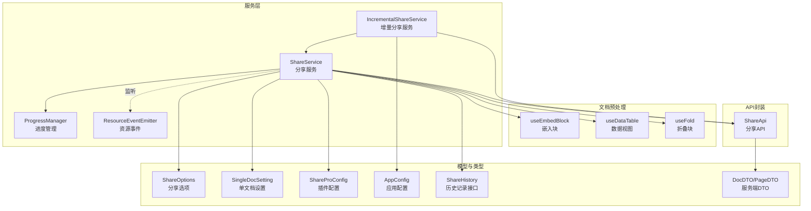
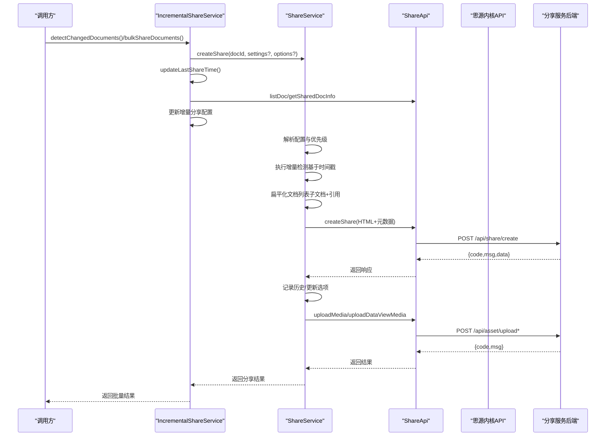
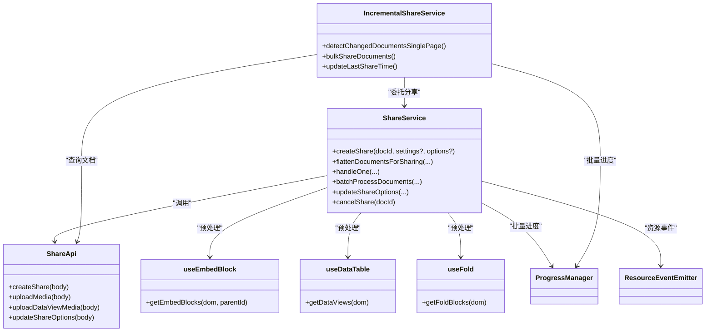

# 分享服务（ShareService）

<cite>
**本文引用的文件**
- [src/service/ShareService.ts](file://src/service/ShareService.ts)
- [src/service/IncrementalShareService.ts](file://src/service/IncrementalShareService.ts)
- [src/composables/useEmbedBlock.ts](file://src/composables/useEmbedBlock.ts)
- [src/composables/useDataTable.ts](file://src/composables/useDataTable.ts)
- [src/composables/useFold.ts](file://src/composables/useFold.ts)
- [src/api/share-api.ts](file://src/api/share-api.ts)
- [src/models/ShareOptions.ts](file://src/models/ShareOptions.ts)
- [src/models/ShareProConfig.ts](file://src/models/ShareProConfig.ts)
- [src/models/SingleDocSetting.ts](file://src/models/SingleDocSetting.ts)
- [src/models/ShareHistory.ts](file://src/models/ShareHistory.ts)
- [src/models/AppConfig.ts](file://src/models/AppConfig.ts)
- [src/utils/progress/ProgressManager.ts](file://src/utils/progress/ProgressManager.ts)
- [src/utils/progress/ResourceEventEmitter.ts](file://src/utils/progress/ResourceEventEmitter.ts)
- [src/utils/ShareHistoryUtils.ts](file://src/utils/ShareHistoryUtils.ts)
- [src/utils/ChangeDetectionWorkerUtil.ts](file://src/utils/ChangeDetectionWorkerUtil.ts)
- [src/types/service-api.d.ts](file://src/types/service-api.d.ts)
- [src/types/service-dto.d.ts](file://src/types/service-dto.d.ts)
</cite>

## 更新摘要
**所做更改**
- 新增了基于时间戳的增量分享功能，包括handleOne方法中的文档变更检测逻辑
- 更新了引用文档分享部分，反映了getReferencedDocuments方法的重构
- 新增了SQL查询策略、递归算法和性能优化的详细说明
- 完善了递归深度控制、循环引用检测和去重机制的技术细节
- 新增了增量分享配置管理和时间戳更新机制

## 目录
1. [简介](#简介)
2. [项目结构](#项目结构)
3. [核心组件](#核心组件)
4. [架构总览](#架构总览)
5. [详细组件分析](#详细组件分析)
6. [依赖关系分析](#依赖关系分析)
7. [性能考量](#性能考量)
8. [故障排查指南](#故障排查指南)
9. [结论](#结论)
10. [附录](#附录)

## 简介
本文件系统性阐述"思源笔记分享专业版"的分享服务（ShareService）设计与实现，重点覆盖以下能力：
- 单文档分享与批量文档分享
- 子文档扁平化处理与引用文档分享
- **新增** 增量分享功能：基于时间戳的文档变更检测与自动跳过未变更文档
- 文档预处理：嵌入块、数据视图、折叠块
- 媒体资源处理机制（常规媒体与DataViews媒体）
- 分享选项更新、历史记录管理、错误处理策略
- 配置优先级（文档级 vs 全局级）
- 性能优化（分页获取、并发控制）
- 与API层的交互模式与数据流转

## 项目结构
分享服务位于 src/service/ShareService.ts，围绕其构建了配套的组合式工具（composables）与API封装（api/share-api.ts），并通过进度与资源事件系统（progress/）实现批量与资源处理的可观测性。同时集成了增量分享服务（IncrementalShareService.ts）以支持基于时间戳的文档变更检测。

**图表来源**
- [src/service/ShareService.ts:40-1251](file://src/service/ShareService.ts#L40-L1251)
- [src/service/IncrementalShareService.ts:98-691](file://src/service/IncrementalShareService.ts#L98-L691)
- [src/composables/useEmbedBlock.ts:23-85](file://src/composables/useEmbedBlock.ts#L23-L85)
- [src/composables/useDataTable.ts:22-101](file://src/composables/useDataTable.ts#L22-L101)
- [src/composables/useFold.ts:23-102](file://src/composables/useFold.ts#L23-L102)
- [src/api/share-api.ts:16-240](file://src/api/share-api.ts#L16-L240)
- [src/models/ShareOptions.ts:16-27](file://src/models/ShareOptions.ts#L16-L27)
- [src/models/SingleDocSetting.ts:18-85](file://src/models/SingleDocSetting.ts#L18-L85)
- [src/models/ShareProConfig.ts:13-40](file://src/models/ShareProConfig.ts#L13-L40)
- [src/models/AppConfig.ts:68-81](file://src/models/AppConfig.ts#L68-L81)
- [src/models/ShareHistory.ts:13-74](file://src/models/ShareHistory.ts#L13-L74)
- [src/types/service-dto.d.ts:13-134](file://src/types/service-dto.d.ts#L13-L134)

**章节来源**
- [src/service/ShareService.ts:40-1251](file://src/service/ShareService.ts#L40-L1251)
- [src/service/IncrementalShareService.ts:98-691](file://src/service/IncrementalShareService.ts#L98-L691)
- [src/api/share-api.ts:16-240](file://src/api/share-api.ts#L16-L240)

## 核心组件
- ShareService：统一入口、配置解析、文档扁平化、单/多文档处理、媒体资源处理、历史记录与错误处理。
- **新增** IncrementalShareService：增量分享核心服务，负责基于时间戳的文档变更检测、批量分享管理和配置更新。
- ShareApi：对后端分享服务的HTTP封装，统一鉴权与请求构造。
- useEmbedBlock/useDataTable/useFold：文档预处理组合式函数，分别负责嵌入块、数据视图、折叠块的提取与渲染。
- ProgressManager/ResourceEventEmitter：批量与资源处理的进度与事件驱动框架。
- 模型与类型：ShareOptions、SingleDocSetting、ShareProConfig、AppConfig、ShareHistory、DocDTO/PageDTO。

**章节来源**
- [src/service/ShareService.ts:40-1251](file://src/service/ShareService.ts#L40-L1251)
- [src/service/IncrementalShareService.ts:98-691](file://src/service/IncrementalShareService.ts#L98-L691)
- [src/api/share-api.ts:16-240](file://src/api/share-api.ts#L16-L240)
- [src/composables/useEmbedBlock.ts:23-85](file://src/composables/useEmbedBlock.ts#L23-L85)
- [src/composables/useDataTable.ts:22-101](file://src/composables/useDataTable.ts#L22-L101)
- [src/composables/useFold.ts:23-102](file://src/composables/useFold.ts#L23-L102)
- [src/utils/progress/ProgressManager.ts:8-238](file://src/utils/progress/ProgressManager.ts#L8-L238)
- [src/utils/progress/ResourceEventEmitter.ts:1-11](file://src/utils/progress/ResourceEventEmitter.ts#L1-L11)
- [src/models/ShareOptions.ts:16-27](file://src/models/ShareOptions.ts#L16-L27)
- [src/models/SingleDocSetting.ts:18-85](file://src/models/SingleDocSetting.ts#L18-L85)
- [src/models/ShareProConfig.ts:13-40](file://src/models/ShareProConfig.ts#L13-L40)
- [src/models/AppConfig.ts:68-81](file://src/models/AppConfig.ts#L68-L81)
- [src/models/ShareHistory.ts:13-74](file://src/models/ShareHistory.ts#L13-L74)
- [src/types/service-dto.d.ts:13-134](file://src/types/service-dto.d.ts#L13-L134)

## 架构总览
下图展示了从调用入口到后端服务的数据流与职责划分，包括新增的增量分享功能。

**图表来源**
- [src/service/IncrementalShareService.ts:269-351](file://src/service/IncrementalShareService.ts#L269-L351)
- [src/service/ShareService.ts:255-322](file://src/service/ShareService.ts#L255-L322)
- [src/service/ShareService.ts:587-730](file://src/service/ShareService.ts#L587-L730)
- [src/service/ShareService.ts:1032-1076](file://src/service/ShareService.ts#L1032-L1076)
- [src/api/share-api.ts:46-71](file://src/api/share-api.ts#L46-L71)

## 详细组件分析

### ShareService：统一分享入口与处理编排
- 统一入口
  - createShare：根据配置决定单文档或批量处理；若启用子文档，则先扁平化再并发处理。
- 文档扁平化
  - flattenDocumentsForSharing：基于配置与文档设置，合并主文档、子文档与引用文档，去重并应用数量限制与分页获取。
  - 配置优先级：文档级设置（SingleDocSetting）优先于全局（ShareProConfig.appConfig）。
- 单文档处理（handleOne）
  - **新增** 增量检测：内置基于时间戳的文档变更检测，自动跳过未变更的文档
  - 预处理：嵌入块、数据视图、折叠块；写入文档属性（发布时间、单文档设置）。
  - 发布：调用 ShareApi.createShare，保存成功/失败历史。
  - 选项更新：updateShareOptions 支持仅更新分享选项（如密码）而不重复上传内容。
  - 媒体处理：processAllMediaResources 顺序处理常规媒体与DataViews媒体，触发资源事件。
- 批量处理
  - batchProcessDocuments：使用并发控制（processWithConcurrency）处理多个文档，结合 ProgressManager 实时更新进度与错误。
- 取消分享
  - cancelShare/cancelOne：支持单/多文档取消，清理本地历史并删除远端文档。
- 错误处理
  - 单文档：handleOne 内捕获并记录历史；资源错误通过 ResourceEventEmitter 与 handleResourceErrorForSingleDoc 统一提示。
  - 批量：ProgressManager 聚合错误并在完成后标记最终状态。

**章节来源**
- [src/service/ShareService.ts:255-322](file://src/service/ShareService.ts#L255-L322)
- [src/service/ShareService.ts:101-226](file://src/service/ShareService.ts#L101-L226)
- [src/service/ShareService.ts:587-730](file://src/service/ShareService.ts#L587-L730)
- [src/service/ShareService.ts:1153-1229](file://src/service/ShareService.ts#L1153-L1229)
- [src/service/ShareService.ts:404-496](file://src/service/ShareService.ts#L404-L496)
- [src/service/ShareService.ts:1240-1247](file://src/service/ShareService.ts#L1240-L1247)

#### 增量分享功能（新增）
- **内置增量检测**：handleOne方法中实现了基于时间戳的文档变更检测逻辑
- **自动跳过未变更文档**：通过比较文档的当前修改时间与历史记录中的docModifiedTime，自动跳过未变更的文档
- **进度跟踪**：当文档未变更时，会显示相应的进度跟踪信息和跳过提示
- **配置管理**：IncrementalShareService负责管理增量分享配置，包括enabled状态和lastShareTime时间戳

**章节来源**
- [src/service/ShareService.ts:266-282](file://src/service/ShareService.ts#L266-L282)
- [src/service/IncrementalShareService.ts:369-389](file://src/service/IncrementalShareService.ts#L369-L389)

#### 配置优先级（文档级 vs 全局级）
- 文档树与大纲：docTreeEnable/docTreeLevel、outlineEnable/outlineLevel，均采用"文档级 > 全局"策略。
- 子文档与引用：shareSubdocuments、shareReferences、maxSubdocuments，同样遵循上述优先级。
- 限制与安全：maxSubdocuments=-1 表示无限制，但存在最大上限约束与警告日志。

**章节来源**
- [src/service/ShareService.ts:127-171](file://src/service/ShareService.ts#L127-L171)
- [src/models/SingleDocSetting.ts:18-85](file://src/models/SingleDocSetting.ts#L18-L85)
- [src/models/ShareProConfig.ts:13-40](file://src/models/ShareProConfig.ts#L13-L40)

#### 文档预处理流程
- 嵌入块（useEmbedBlock）
  - 通过 Cheerio 解析 editorDom，定位 data-type="NodeBlockQueryEmbed" 的节点，调用内核接口获取默认视图内容，返回映射与顺序。
- 数据视图（useDataTable）
  - 识别 data-av-type="table" 的节点，获取默认视图与其它视图，使用 Promise.all 并发渲染，合并为单一结果。
- 折叠块（useFold）
  - 仅处理 data-type="NodeHeading" 且 fold="1" 的节点，借助事务接口临时展开并提取内容，返回映射与顺序。

**章节来源**
- [src/composables/useEmbedBlock.ts:33-77](file://src/composables/useEmbedBlock.ts#L33-L77)
- [src/composables/useDataTable.ts:26-95](file://src/composables/useDataTable.ts#L26-L95)
- [src/composables/useFold.ts:33-94](file://src/composables/useFold.ts#L33-L94)

#### 媒体资源处理机制
- 常规媒体（processShareMedia）
  - 分批（每批5个）抓取 base64，构造参数并调用 ShareApi.uploadMedia；支持进度回调与错误回调。
- DataViews 媒体（processDataViewMedia）
  - 与常规媒体类似，但标识 source=dataviews，并携带 cellId 以便后端识别。
- 顺序处理（processAllMediaResources）
  - 先常规媒体，后 DataViews 媒体，避免并发导致的后端处理混乱；通过 ResourceEventEmitter 发布 START/PROGRESS/ERROR/COMPLETE 事件，供进度管理联动。

**章节来源**
- [src/service/ShareService.ts:732-878](file://src/service/ShareService.ts#L732-L878)
- [src/service/ShareService.ts:885-1026](file://src/service/ShareService.ts#L885-L1026)
- [src/service/ShareService.ts:1032-1076](file://src/service/ShareService.ts#L1032-L1076)
- [src/utils/progress/ResourceEventEmitter.ts:1-11](file://src/utils/progress/ResourceEventEmitter.ts#L1-L11)

#### 引用文档分享
- getReferencedDocuments：重构后的递归查询策略
  - SQL查询策略：使用内核API执行SQL查询，从refs表中获取def_block_root_id，过滤掉当前文档ID，确保自引用保护。
  - 递归算法：采用深度优先搜索（DFS），支持最大递归深度控制（默认3层）。
  - 性能优化：实现循环引用检测和去重机制，使用Set数据结构跟踪已处理文档ID，避免无限递归和重复处理。
  - 错误处理：每个文档获取都有独立的try-catch块，单个文档失败不影响整体流程。
  - 扁平化合并：与子文档列表合并，形成最终分享清单。

**更新** 重构了引用文档获取的实现，从原有的简单递归改为基于SQL查询的优化策略

**章节来源**
- [src/service/ShareService.ts:430-512](file://src/service/ShareService.ts#L430-L512)

#### 分享选项更新与历史记录
- updateShareOptions：仅更新分享选项（如密码），不重新上传内容。
- 历史记录：无论成功/失败均写入本地历史（LocalShareHistory），并更新缓存；支持按 docIds 查询历史。

**章节来源**
- [src/service/ShareService.ts:519-541](file://src/service/ShareService.ts#L519-L541)
- [src/service/ShareService.ts:554-574](file://src/service/ShareService.ts#L554-L574)
- [src/models/ShareHistory.ts:13-74](file://src/models/ShareHistory.ts#L13-L74)
- [src/utils/ShareHistoryUtils.ts:15-29](file://src/utils/ShareHistoryUtils.ts#L15-L29)

### API 层交互模式
- ShareApi：集中封装 /api/share/* 与 /api/asset/* 等接口，统一鉴权头与请求体构造。
- ServiceResponse：统一响应结构（code/msg/data），便于上层一致处理。
- DTO：DocDTO/PageDTO 等服务端数据结构，用于历史与列表查询。

**章节来源**
- [src/api/share-api.ts:16-240](file://src/api/share-api.ts#L16-L240)
- [src/types/service-dto.d.ts:98-134](file://src/types/service-dto.d.ts#L98-L134)
- [src/types/service-api.d.ts:13-17](file://src/types/service-api.d.ts#L13-L17)

### 并发与进度
- 并发控制（processWithConcurrency）：滑动窗口实现，保证最大并发与结果顺序一致性，单任务错误不影响整体流程。
- 进度管理（ProgressManager）：批量开始/更新/完成/取消，同时监听资源事件，实现文档与资源双维度进度。

**章节来源**
- [src/service/ShareService.ts:1086-1145](file://src/service/ShareService.ts#L1086-L1145)
- [src/utils/progress/ProgressManager.ts:12-238](file://src/utils/progress/ProgressManager.ts#L12-L238)

### 增量分享服务（新增）
- **变更检测**：detectChangedDocumentsSinglePage - 支持单页文档变更检测，基于时间戳比较判断文档状态
- **批量分享**：bulkShareDocuments - 支持并发控制和队列管理的批量分享
- **配置管理**：updateLastShareTime - 更新最后分享时间戳，用于后续增量检测
- **缓存机制**：使用内存缓存和共享缓存减少重复查询
- **黑名单过滤**：集成黑名单检查，避免分享黑名单中的文档
- **智能重试**：支持网络错误和服务器错误的智能重试机制

**章节来源**
- [src/service/IncrementalShareService.ts:160-210](file://src/service/IncrementalShareService.ts#L160-L210)
- [src/service/IncrementalShareService.ts:269-351](file://src/service/IncrementalShareService.ts#L269-L351)
- [src/service/IncrementalShareService.ts:369-389](file://src/service/IncrementalShareService.ts#L369-L389)

## 依赖关系分析

**图表来源**
- [src/service/ShareService.ts:40-1251](file://src/service/ShareService.ts#L40-L1251)
- [src/service/IncrementalShareService.ts:98-691](file://src/service/IncrementalShareService.ts#L98-L691)
- [src/api/share-api.ts:16-240](file://src/api/share-api.ts#L16-L240)
- [src/composables/useEmbedBlock.ts:23-85](file://src/composables/useEmbedBlock.ts#L23-L85)
- [src/composables/useDataTable.ts:22-101](file://src/composables/useDataTable.ts#L22-L101)
- [src/composables/useFold.ts:23-102](file://src/composables/useFold.ts#L23-L102)
- [src/utils/progress/ProgressManager.ts:8-238](file://src/utils/progress/ProgressManager.ts#L8-L238)
- [src/utils/progress/ResourceEventEmitter.ts:1-11](file://src/utils/progress/ResourceEventEmitter.ts#L1-L11)

## 性能考量
- 分页获取子文档：默认分页大小50，避免一次性拉取过多子文档造成内存压力。
- 并发控制：批量分享默认并发10，既提升吞吐又避免后端过载。
- 限制与上限：maxSubdocuments=-1 表示无限制，但实际受最大上限与警告约束，防止超大规模导致性能问题。
- 媒体分批：每批5个，减少单次请求负载与网络抖动影响。
- 顺序处理媒体：避免并发导致的后端处理冲突，保证稳定性。
- 引用文档优化：重构后的SQL查询策略减少了JavaScript递归开销，循环引用检测避免了无限递归。
- **新增** 增量分享优化：基于时间戳的文档变更检测，避免重复分享未变更文档，显著提升性能。
- **新增** 缓存机制：增量分享服务使用5分钟缓存，减少重复查询和计算开销。

**章节来源**
- [src/service/ShareService.ts:174-175](file://src/service/ShareService.ts#L174-L175)
- [src/service/ShareService.ts](file://src/service/ShareService.ts#L1159)
- [src/service/ShareService.ts:741-745](file://src/service/ShareService.ts#L741-L745)
- [src/service/ShareService.ts:894-898](file://src/service/ShareService.ts#L894-L898)
- [src/service/ShareService.ts:1032-1076](file://src/service/ShareService.ts#L1032-L1076)
- [src/service/IncrementalShareService.ts:108-111](file://src/service/IncrementalShareService.ts#L108-L111)

## 故障排查指南
- 分享失败
  - 单文档：handleOne 捕获异常并记录历史，同时弹窗提示；可检查日志与历史记录。
  - 批量：ProgressManager 聚合错误，可在进度界面查看具体失败项。
- 媒体处理失败
  - processShareMedia/processDataViewMedia 对单个批次失败有容错；可通过资源事件监听定位错误。
- 取消分享
  - cancelShare/cancelOne：支持单/多文档取消，失败时返回错误码与消息，本地历史同步清理。
- 配置问题
  - 若未初始化分享服务端地址，ShareApi 会提示"未找到分享服务"，请检查配置。
- 引用文档问题
  - 循环引用：系统会自动检测并跳过，避免无限递归。
  - 性能问题：可通过降低递归深度或禁用引用文档分享来缓解。
- **新增** 增量分享问题
  - 时间戳异常：检查incrementalShareConfig.lastShareTime是否正确设置
  - 配置失效：确认incrementalShareConfig.enabled是否为true
  - 缓存问题：使用clearCache()方法清除缓存后重试

**章节来源**
- [src/service/ShareService.ts:692-730](file://src/service/ShareService.ts#L692-L730)
- [src/service/ShareService.ts:1213-1218](file://src/service/ShareService.ts#L1213-L1218)
- [src/service/ShareService.ts:732-878](file://src/service/ShareService.ts#L732-L878)
- [src/service/ShareService.ts:885-1026](file://src/service/ShareService.ts#L885-L1026)
- [src/service/ShareService.ts:404-496](file://src/service/ShareService.ts#L404-L496)
- [src/api/share-api.ts:177-209](file://src/api/share-api.ts#L177-L209)
- [src/service/IncrementalShareService.ts:259-265](file://src/service/IncrementalShareService.ts#L259-L265)

## 结论
ShareService 以清晰的职责边界与完善的预处理、并发与事件机制，实现了从单文档到批量分享的全链路能力。通过"文档级 > 全局"的配置优先级、分页与并发控制等优化手段，在保证稳定性的同时兼顾性能与可维护性。配合 ShareApi 与进度/资源事件系统，为用户提供了可观测、可回溯的分享体验。

**新增** 增量分享功能进一步提升了性能和用户体验，通过基于时间戳的文档变更检测，自动跳过未变更的文档，显著减少了重复分享的工作量。配合缓存机制和智能重试，为大规模文档管理提供了高效的解决方案。

## 附录

### 使用示例（参数配置、返回值与异常处理）
- 单文档分享
  - 入口：调用 createShare(docId, settings?, options?)。
  - 设置：SingleDocSetting（如 docTreeEnable/docTreeLevel、outlineEnable/outlineLevel、shareSubdocuments、maxSubdocuments、shareReferences）。
  - 选项：ShareOptions（如 passwordEnabled/password）。
  - 返回：Promise<ServiceResponse>，包含 code/msg/data。
  - 异常：handleOne 内捕获并记录历史，必要时抛出或由调用方处理。
- 批量分享
  - 入口：createShare 自动根据配置进入批量分支；也可直接调用 batchProcessDocuments。
  - 并发：默认并发10，可通过参数调整。
  - 进度：通过 ProgressManager 获取实时进度与错误列表。
- **新增** 增量分享
  - 入口：IncrementalShareService.detectChangedDocumentsSinglePage() 检测变更。
  - 批量：IncrementalShareService.bulkShareDocuments() 执行批量分享。
  - 配置：AppConfig.incrementalShareConfig 管理增量分享设置。
  - 时间戳：自动更新 lastShareTime 用于下次检测。
- 媒体处理
  - 常规媒体：processShareMedia；DataViews媒体：processDataViewMedia。
  - 事件：通过 ResourceEventEmitter 监听资源处理进度与错误。
- 历史记录
  - getHistoryByIds：按 docIds 查询历史；本地历史由 LocalShareHistory 管理。

**章节来源**
- [src/service/ShareService.ts:235-258](file://src/service/ShareService.ts#L235-L258)
- [src/service/ShareService.ts:1153-1229](file://src/service/ShareService.ts#L1153-L1229)
- [src/service/ShareService.ts:1032-1076](file://src/service/ShareService.ts#L1032-L1076)
- [src/service/ShareService.ts:554-574](file://src/service/ShareService.ts#L554-L574)
- [src/service/IncrementalShareService.ts:269-351](file://src/service/IncrementalShareService.ts#L269-L351)
- [src/models/SingleDocSetting.ts:18-85](file://src/models/SingleDocSetting.ts#L18-L85)
- [src/models/ShareOptions.ts:16-27](file://src/models/ShareOptions.ts#L16-L27)
- [src/models/AppConfig.ts:68-81](file://src/models/AppConfig.ts#L68-L81)
- [src/api/share-api.ts:46-71](file://src/api/share-api.ts#L46-L71)
- [src/utils/progress/ProgressManager.ts:12-238](file://src/utils/progress/ProgressManager.ts#L12-L238)
- [src/utils/progress/ResourceEventEmitter.ts:1-11](file://src/utils/progress/ResourceEventEmitter.ts#L1-L11)