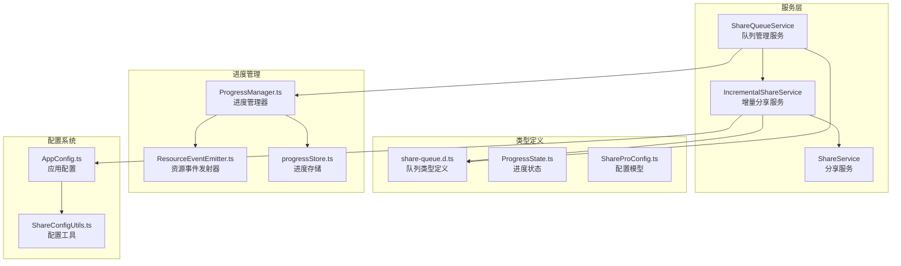
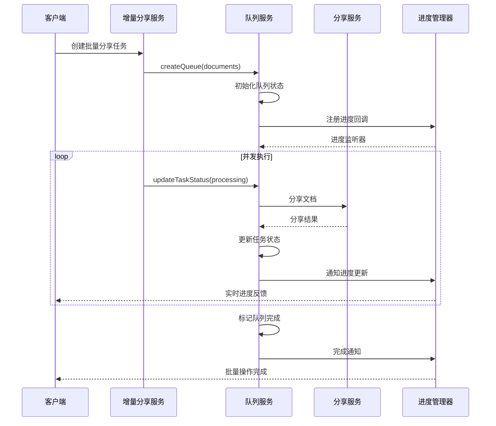
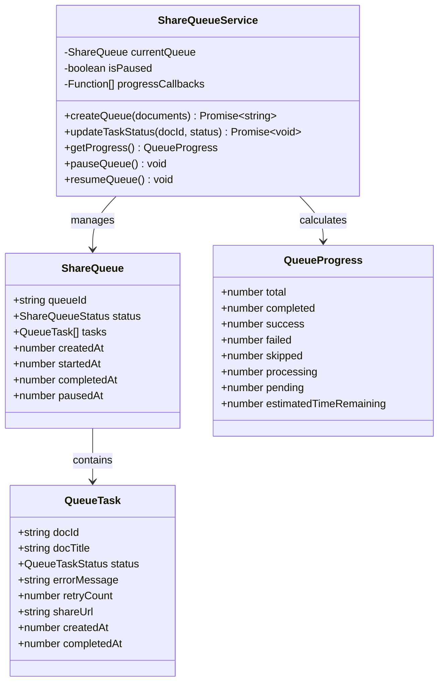
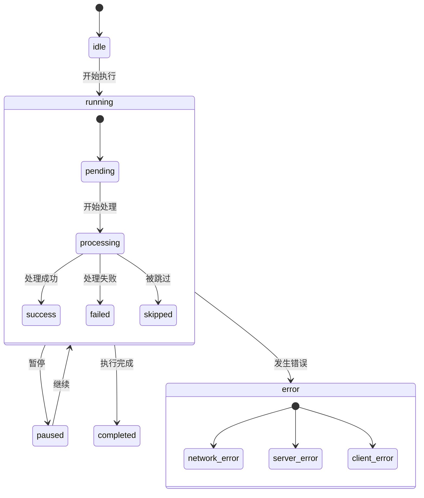
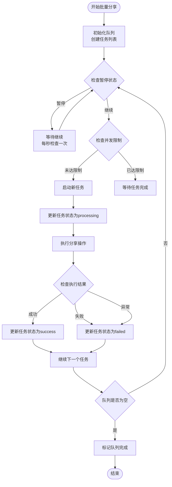
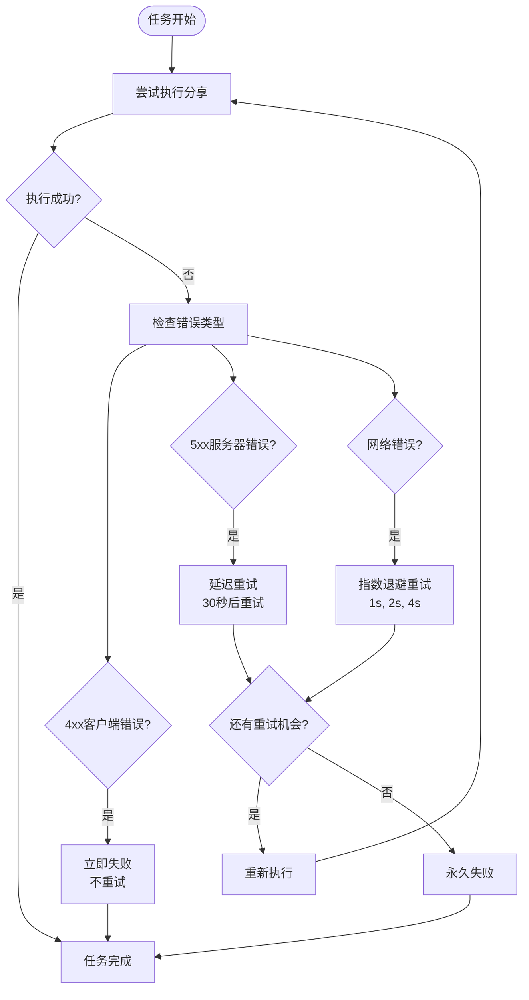
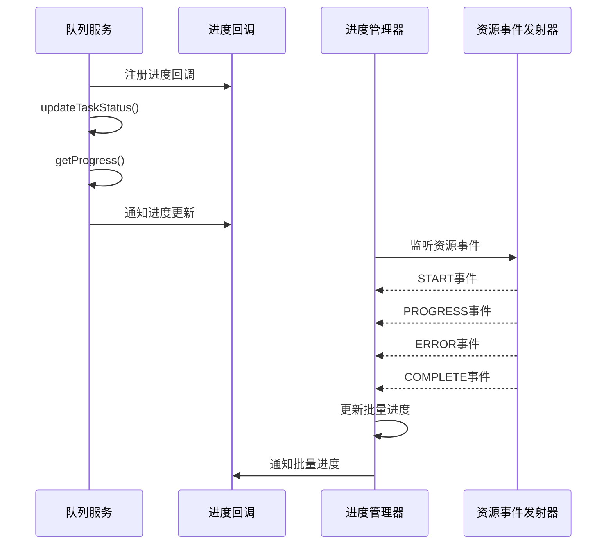
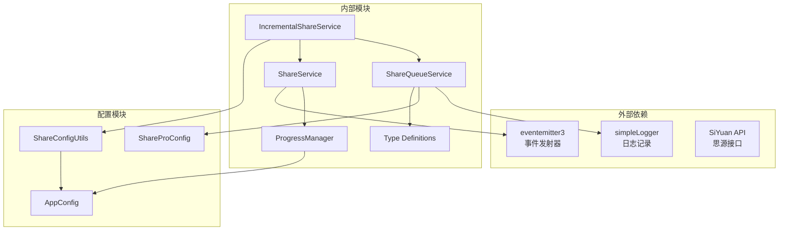

# 分享队列服务 (ShareQueueService)

<cite>
**本文档引用的文件**
- [ShareQueueService.ts](file://src/service/ShareQueueService.ts)
- [share-queue.d.ts](file://src/types/share-queue.d.ts)
- [IncrementalShareService.ts](file://src/service/IncrementalShareService.ts)
- [ShareService.ts](file://src/service/ShareService.ts)
- [ProgressManager.ts](file://src/utils/progress/ProgressManager.ts)
- [ProgressState.ts](file://src/utils/progress/ProgressState.ts)
- [progressStore.ts](file://src/utils/progress/progressStore.ts)
- [ResourceEventEmitter.ts](file://src/utils/progress/ResourceEventEmitter.ts)
- [ShareProConfig.ts](file://src/models/ShareProConfig.ts)
- [AppConfig.ts](file://src/models/AppConfig.ts)
- [ShareConfigUtils.ts](file://src/utils/ShareConfigUtils.ts)
- [TESTING_CHECKLIST.md](file://TESTING_CHECKLIST.md)
</cite>

## 目录
1. [简介](#简介)
2. [项目结构](#项目结构)
3. [核心组件](#核心组件)
4. [架构概览](#架构概览)
5. [详细组件分析](#详细组件分析)
6. [依赖关系分析](#依赖关系分析)
7. [性能考虑](#性能考虑)
8. [故障排除指南](#故障排除指南)
9. [结论](#结论)
10. [附录](#附录)

## 简介
分享队列服务是思源笔记分享专业版的核心组件，负责管理批量分享任务的完整生命周期。该服务实现了先进的队列管理机制，包括任务调度、优先级控制、并发限制、错误重试策略、进度跟踪和事件通知等功能。

该服务采用现代化的异步编程模式，支持实时进度监控、动态暂停/继续控制、智能重试机制，并与进度管理系统无缝集成，为用户提供流畅的批量分享体验。

## 项目结构
分享队列服务位于插件的service目录中，与相关的类型定义、进度管理和配置模块共同构成了完整的队列管理生态系统。



**图表来源**
- [ShareQueueService.ts:1-299](file://src/service/ShareQueueService.ts#L1-L299)
- [IncrementalShareService.ts:1-200](file://src/service/IncrementalShareService.ts#L1-L200)
- [ProgressManager.ts:1-238](file://src/utils/progress/ProgressManager.ts#L1-L238)

**章节来源**
- [ShareQueueService.ts:1-299](file://src/service/ShareQueueService.ts#L1-L299)
- [share-queue.d.ts:1-149](file://src/types/share-queue.d.ts#L1-L149)

## 核心组件
分享队列服务包含以下核心组件：

### 队列管理器 (ShareQueueService)
负责队列的创建、状态管理、持久化存储和进度通知。提供完整的队列生命周期管理功能。

### 类型系统 (Type Definitions)
定义了队列、任务、进度和状态的完整类型体系，确保类型安全和开发体验。

### 进度管理系统 (Progress Management)
与队列服务集成，提供实时进度跟踪、资源处理监控和事件通知机制。

### 配置系统 (Configuration)
支持全局和局部配置，包括并发设置、重试策略和主题配置。

**章节来源**
- [ShareQueueService.ts:24-33](file://src/service/ShareQueueService.ts#L24-L33)
- [share-queue.d.ts:10-149](file://src/types/share-queue.d.ts#L10-L149)
- [ProgressManager.ts:8-102](file://src/utils/progress/ProgressManager.ts#L8-L102)

## 架构概览
分享队列服务采用分层架构设计，各组件职责明确，耦合度低，便于维护和扩展。



**图表来源**
- [IncrementalShareService.ts:479-577](file://src/service/IncrementalShareService.ts#L479-L577)
- [ShareQueueService.ts:105-125](file://src/service/ShareQueueService.ts#L105-L125)
- [ProgressManager.ts:107-126](file://src/utils/progress/ProgressManager.ts#L107-L126)

## 详细组件分析

### 队列数据结构设计
队列系统采用层次化的数据结构设计，确保数据完整性和一致性。



**图表来源**
- [share-queue.d.ts:68-103](file://src/types/share-queue.d.ts#L68-L103)
- [share-queue.d.ts:23-63](file://src/types/share-queue.d.ts#L23-L63)
- [share-queue.d.ts:108-148](file://src/types/share-queue.d.ts#L108-L148)
- [ShareQueueService.ts:24-33](file://src/service/ShareQueueService.ts#L24-L33)

### 任务状态管理机制
队列服务实现了完整的任务状态生命周期管理，支持多种状态转换和条件判断。



**图表来源**
- [share-queue.d.ts:13](file://src/types/share-queue.d.ts#L13)
- [share-queue.d.ts:18](file://src/types/share-queue.d.ts#L18)
- [ShareQueueService.ts:105-125](file://src/service/ShareQueueService.ts#L105-L125)

### 并发控制与调度算法
增量分享服务实现了智能的并发控制机制，支持动态调整并发度和任务调度。



**图表来源**
- [IncrementalShareService.ts:479-577](file://src/service/IncrementalShareService.ts#L479-L577)
- [ShareQueueService.ts:494-499](file://src/service/IncrementalShareService.ts#L494-L499)

### 错误重试策略
实现了多层次的智能重试机制，针对不同类型的错误采用不同的处理策略。



**图表来源**
- [IncrementalShareService.ts:585-659](file://src/service/IncrementalShareService.ts#L585-L659)

### 进度跟踪与事件通知
集成了完整的进度跟踪系统，支持实时进度监控和事件通知。



**图表来源**
- [ShareQueueService.ts:271-297](file://src/service/ShareQueueService.ts#L271-L297)
- [ProgressManager.ts:35-101](file://src/utils/progress/ProgressManager.ts#L35-L101)
- [ResourceEventEmitter.ts:1-11](file://src/utils/progress/ResourceEventEmitter.ts#L1-L11)

**章节来源**
- [ShareQueueService.ts:38-60](file://src/service/ShareQueueService.ts#L38-L60)
- [IncrementalShareService.ts:479-577](file://src/service/IncrementalShareService.ts#L479-L577)
- [IncrementalShareService.ts:585-659](file://src/service/IncrementalShareService.ts#L585-L659)

## 依赖关系分析



**图表来源**
- [ShareQueueService.ts:10-14](file://src/service/ShareQueueService.ts#L10-L14)
- [IncrementalShareService.ts:10-25](file://src/service/IncrementalShareService.ts#L10-L25)
- [ShareService.ts:30-32](file://src/service/ShareService.ts#L30-L32)

**章节来源**
- [ShareQueueService.ts:10-14](file://src/service/ShareQueueService.ts#L10-L14)
- [IncrementalShareService.ts:10-25](file://src/service/IncrementalShareService.ts#L10-L25)

## 性能考虑
分享队列服务在设计时充分考虑了性能优化，采用了多种策略来提升执行效率和用户体验。

### 并发优化
- 动态并发控制：根据系统负载自动调整并发度
- 任务批处理：支持批量任务的高效处理
- 内存管理：及时清理已完成任务的内存占用

### 网络优化
- 智能重试：针对不同错误类型采用最优重试策略
- 超时控制：合理的超时设置避免长时间阻塞
- 连接复用：重用网络连接减少建立开销

### 存储优化
- 增量持久化：只保存必要的队列状态信息
- 异步写入：避免阻塞主线程
- 数据压缩：减少存储空间占用

## 故障排除指南

### 常见问题诊断
1. **队列无法启动**
   - 检查队列状态是否为idle
   - 验证任务列表是否为空
   - 确认配置参数是否正确

2. **任务执行失败**
   - 查看错误日志获取详细信息
   - 检查网络连接状态
   - 验证目标服务可用性

3. **进度不更新**
   - 确认进度回调是否正确注册
   - 检查事件发射器是否正常工作
   - 验证进度存储状态

### 调试工具
- 控制台日志：查看详细的执行日志
- 进度监控：实时观察任务执行状态
- 错误追踪：定位具体的失败原因

**章节来源**
- [TESTING_CHECKLIST.md:120-153](file://TESTING_CHECKLIST.md#L120-L153)
- [ShareQueueService.ts:258-266](file://src/service/ShareQueueService.ts#L258-L266)

## 结论
分享队列服务为思源笔记分享专业版提供了强大而灵活的批量分享能力。通过精心设计的架构和完善的组件体系，该服务能够高效地管理复杂的批量分享任务，提供优秀的用户体验。

主要优势包括：
- **可靠性**：完善的错误处理和重试机制
- **可扩展性**：模块化设计支持功能扩展
- **可观测性**：全面的进度跟踪和状态监控
- **易用性**：简洁的API接口和丰富的配置选项

该服务为构建企业级的批量分享解决方案奠定了坚实的基础。

## 附录

### 配置参数说明
| 参数名称 | 类型 | 默认值 | 描述 |
|---------|------|--------|------|
| maxConcurrent | number | 5 | 最大并发任务数 |
| maxRetries | number | 3 | 最大重试次数 |
| initialDelay | number | 1000 | 初始延迟时间(毫秒) |
| serverErrorDelay | number | 30000 | 服务器错误延迟(毫秒) |
| memoryLimit | number | 100MB | 内存使用限制 |

### 使用示例
```typescript
// 创建批量分享任务
const documents = [
  { docId: 'doc1', docTitle: '文档1' },
  { docId: 'doc2', docTitle: '文档2' }
];

// 提交批量任务
const queueId = await incrementalShareService.queueService.createQueue(documents);

// 监控执行进度
incrementalShareService.queueService.onProgress((progress) => {
  console.log(`已完成: ${progress.completed}/${progress.total}`);
});

// 暂停/继续队列
incrementalShareService.queueService.pauseQueue();
incrementalShareService.queueService.resumeQueue();

// 处理异常情况
const failedTasks = incrementalShareService.queueService.getFailedTasks();
await incrementalShareService.queueService.retryFailedTasks();
```

### 事件通知机制
- **进度更新**：实时通知任务执行进度
- **状态变化**：队列状态改变时的通知
- **错误报告**：任务执行错误的详细信息
- **完成通知**：批量操作完成的最终状态