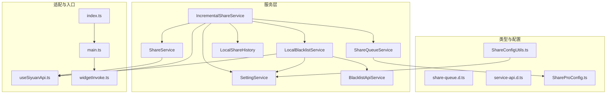
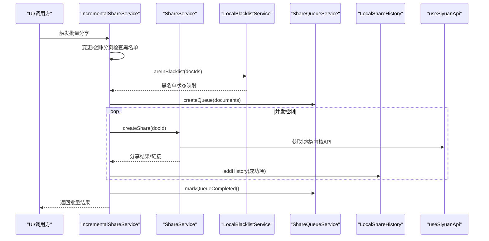
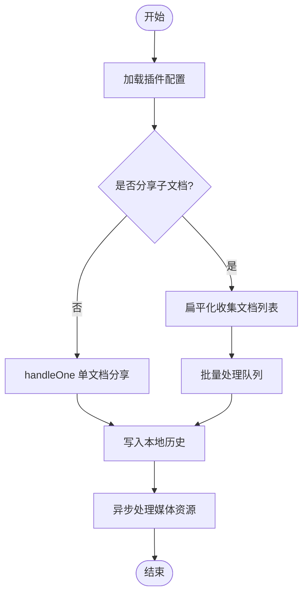
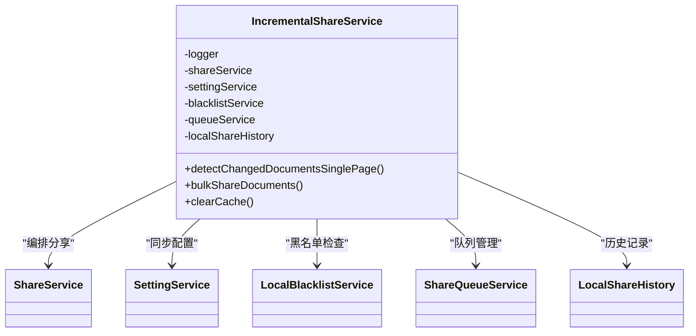
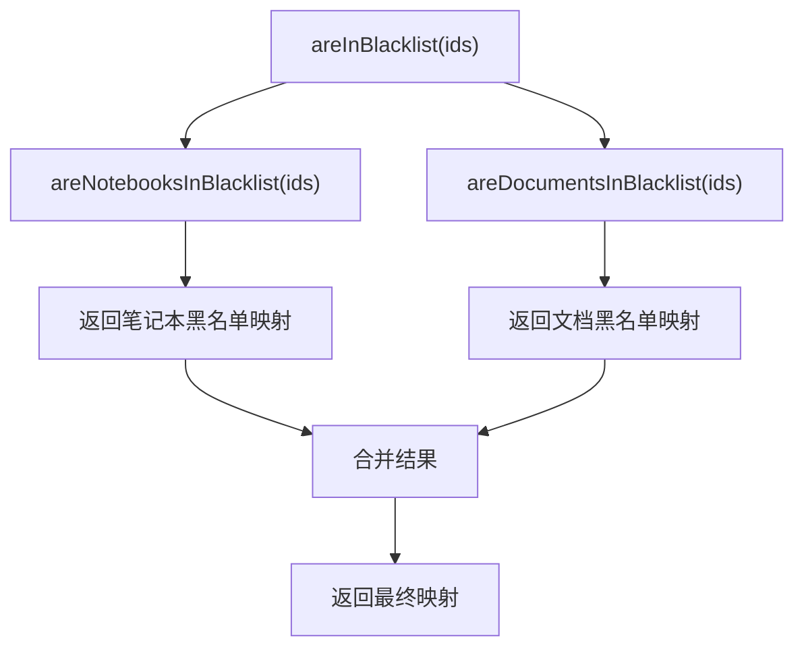
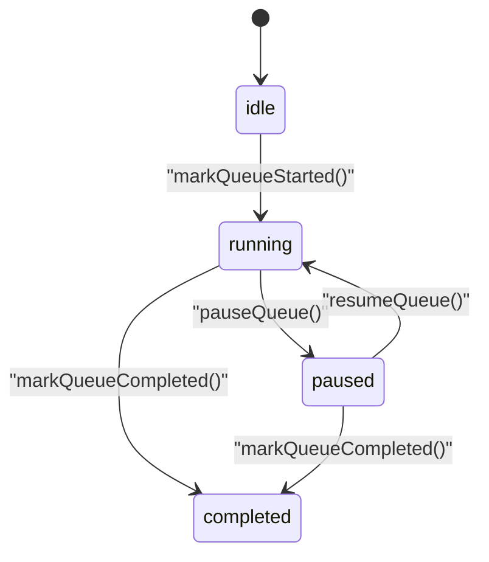
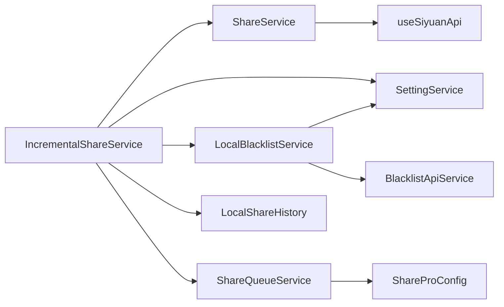

# 服务层架构

<cite>
**本文引用的文件**
- [src/service/ShareService.ts](file://src/service/ShareService.ts)
- [src/service/IncrementalShareService.ts](file://src/service/IncrementalShareService.ts)
- [src/service/SettingService.ts](file://src/service/SettingService.ts)
- [src/service/LocalBlacklistService.ts](file://src/service/LocalBlacklistService.ts)
- [src/service/BlacklistApiService.ts](file://src/service/BlacklistApiService.ts)
- [src/service/ShareQueueService.ts](file://src/service/ShareQueueService.ts)
- [src/service/LocalShareHistory.ts](file://src/service/LocalShareHistory.ts)
- [src/types/share-queue.d.ts](file://src/types/share-queue.d.ts)
- [src/types/service-api.d.ts](file://src/types/service-api.d.ts)
- [src/models/ShareProConfig.ts](file://src/models/ShareProConfig.ts)
- [src/utils/ShareConfigUtils.ts](file://src/utils/ShareConfigUtils.ts)
- [src/composables/useSiyuanApi.ts](file://src/composables/useSiyuanApi.ts)
- [src/index.ts](file://src/index.ts)
- [src/main.ts](file://src/main.ts)
- [src/invoke/widgetInvoke.ts](file://src/invoke/widgetInvoke.ts)
</cite>

## 目录
1. [简介](#简介)
2. [项目结构](#项目结构)
3. [核心组件](#核心组件)
4. [架构总览](#架构总览)
5. [详细组件分析](#详细组件分析)
6. [依赖分析](#依赖分析)
7. [性能考量](#性能考量)
8. [故障排查指南](#故障排查指南)
9. [结论](#结论)
10. [附录](#附录)

## 简介
本文件系统化梳理“思源笔记分享专业版”的服务层架构，聚焦分层设计、职责分离、依赖注入与协作关系，重点覆盖以下服务类及其职责边界：
- ShareService：统一分享入口与核心分享流程编排
- IncrementalShareService：增量分享算法与批量调度
- SettingService：配置同步与作者维度设置拉取
- LocalBlacklistService：本地黑名单机制（笔记本/文档两级）
- ShareQueueService：分享队列生命周期与进度管理
- LocalShareHistory：本地分享历史记录持久化
- BlacklistApiService：黑名单相关内核API封装

同时阐述服务间交互、数据传递模式、异常处理策略、扩展点设计、接口抽象与插件化架构，并给出生命周期管理、资源清理与性能优化建议。

## 项目结构
服务层位于 src/service 目录，围绕“分享”主题形成清晰的分层与职责划分：
- 服务类：负责业务编排与领域逻辑
- 类型定义：统一服务间契约与数据模型
- 工具与配置：配置加载、默认配置与同步工具
- 适配器与组合式函数：与底层内核API交互的适配层

图表来源
- [src/service/ShareService.ts:40-56](file://src/service/ShareService.ts#L40-L56)
- [src/service/IncrementalShareService.ts:98-129](file://src/service/IncrementalShareService.ts#L98-L129)
- [src/service/LocalBlacklistService.ts:31-41](file://src/service/LocalBlacklistService.ts#L31-L41)
- [src/service/ShareQueueService.ts:24-33](file://src/service/ShareQueueService.ts#L24-L33)
- [src/service/LocalShareHistory.ts:23-29](file://src/service/LocalShareHistory.ts#L23-L29)
- [src/types/share-queue.d.ts:68-103](file://src/types/share-queue.d.ts#L68-L103)
- [src/types/service-api.d.ts:13-16](file://src/types/service-api.d.ts#L13-L16)
- [src/models/ShareProConfig.ts:13-37](file://src/models/ShareProConfig.ts#L13-L37)
- [src/utils/ShareConfigUtils.ts:74-80](file://src/utils/ShareConfigUtils.ts#L74-L80)
- [src/composables/useSiyuanApi.ts:24-54](file://src/composables/useSiyuanApi.ts#L24-L54)
- [src/index.ts:126-177](file://src/index.ts#L126-L177)
- [src/main.ts:12-31](file://src/main.ts#L12-L31)
- [src/invoke/widgetInvoke.ts:17-79](file://src/invoke/widgetInvoke.ts#L17-L79)

章节来源
- [src/service/ShareService.ts:40-56](file://src/service/ShareService.ts#L40-L56)
- [src/service/IncrementalShareService.ts:98-129](file://src/service/IncrementalShareService.ts#L98-L129)
- [src/service/LocalBlacklistService.ts:31-41](file://src/service/LocalBlacklistService.ts#L31-L41)
- [src/service/ShareQueueService.ts:24-33](file://src/service/ShareQueueService.ts#L24-L33)
- [src/service/LocalShareHistory.ts:23-29](file://src/service/LocalShareHistory.ts#L23-L29)
- [src/types/share-queue.d.ts:68-103](file://src/types/share-queue.d.ts#L68-L103)
- [src/types/service-api.d.ts:13-16](file://src/types/service-api.d.ts#L13-L16)
- [src/models/ShareProConfig.ts:13-37](file://src/models/ShareProConfig.ts#L13-L37)
- [src/utils/ShareConfigUtils.ts:74-80](file://src/utils/ShareConfigUtils.ts#L74-L80)
- [src/composables/useSiyuanApi.ts:24-54](file://src/composables/useSiyuanApi.ts#L24-L54)
- [src/index.ts:126-177](file://src/index.ts#L126-L177)
- [src/main.ts:12-31](file://src/main.ts#L12-L31)
- [src/invoke/widgetInvoke.ts:17-79](file://src/invoke/widgetInvoke.ts#L17-L79)

## 核心组件
- ShareService：统一分享入口，负责文档扁平化、引用文档发现、单/多文档分享、历史记录写入、资源处理与错误日志；对外暴露创建分享、取消分享、更新选项、历史查询等能力。
- IncrementalShareService：增量分享算法与批量调度核心，负责变更检测、黑名单过滤、并发控制、队列管理、智能重试与进度统计。
- SettingService：配置同步与作者维度设置拉取，支撑全局配置下发与一致性。
- LocalBlacklistService：本地黑名单机制，支持笔记本/文档两级黑名单，提供分页查询、批量检查、增删改与同步至服务端。
- ShareQueueService：分享队列生命周期管理，支持暂停/继续、进度统计、失败重试、持久化恢复与进度回调。
- LocalShareHistory：本地分享历史记录持久化，基于文档属性存储，支持新增、更新、删除与版本兼容。
- BlacklistApiService：黑名单相关内核API封装，提供文档/笔记本搜索能力。

章节来源
- [src/service/ShareService.ts:40-56](file://src/service/ShareService.ts#L40-L56)
- [src/service/IncrementalShareService.ts:98-129](file://src/service/IncrementalShareService.ts#L98-L129)
- [src/service/SettingService.ts:18-36](file://src/service/SettingService.ts#L18-L36)
- [src/service/LocalBlacklistService.ts:31-41](file://src/service/LocalBlacklistService.ts#L31-L41)
- [src/service/ShareQueueService.ts:24-33](file://src/service/ShareQueueService.ts#L24-L33)
- [src/service/LocalShareHistory.ts:23-29](file://src/service/LocalShareHistory.ts#L23-L29)
- [src/service/BlacklistApiService.ts:22-28](file://src/service/BlacklistApiService.ts#L22-L28)

## 架构总览
服务层采用“组合式服务 + 适配器 + 类型契约”的分层设计，通过构造函数注入与共享配置对象实现解耦与可测试性。核心交互如下：

图表来源
- [src/service/IncrementalShareService.ts:269-351](file://src/service/IncrementalShareService.ts#L269-L351)
- [src/service/IncrementalShareService.ts:396-474](file://src/service/IncrementalShareService.ts#L396-L474)
- [src/service/IncrementalShareService.ts:479-577](file://src/service/IncrementalShareService.ts#L479-L577)
- [src/service/ShareService.ts:587-730](file://src/service/ShareService.ts#L587-L730)
- [src/service/LocalBlacklistService.ts:221-249](file://src/service/LocalBlacklistService.ts#L221-L249)
- [src/service/ShareQueueService.ts:38-60](file://src/service/ShareQueueService.ts#L38-L60)
- [src/service/LocalShareHistory.ts:31-52](file://src/service/LocalShareHistory.ts#L31-L52)
- [src/composables/useSiyuanApi.ts:24-54](file://src/composables/useSiyuanApi.ts#L24-L54)

## 详细组件分析

### ShareService：统一分享编排
- 职责边界
  - 文档扁平化：支持子文档与引用文档的扁平化收集，分页获取并去重
  - 引用文档递归发现：基于内核refs表递归查询引用文档，深度限制与循环引用防护
  - 单/多文档分享：统一入口 createShare，内部根据配置选择单文档或批量处理
  - 历史记录：成功/失败均写入本地历史，支持缓存与持久化
  - 资源处理：异步处理媒体资源，保证顺序执行
  - 错误处理：捕获异常并记录历史，向UI反馈
- 关键流程
  - 扁平化收集 → 批量处理队列 → 并发分享 → 历史记录写入 → 媒体资源处理
- 依赖注入
  - 通过构造函数注入 ShareProPlugin、ShareApi、LocalShareHistory
  - 通过 useSiyuanApi 获取博客/内核API实例
- 异常策略
  - 区分单/多文档场景，统一记录历史并提示用户

图表来源
- [src/service/ShareService.ts:235-258](file://src/service/ShareService.ts#L235-L258)
- [src/service/ShareService.ts:101-226](file://src/service/ShareService.ts#L101-L226)
- [src/service/ShareService.ts:587-730](file://src/service/ShareService.ts#L587-L730)

章节来源
- [src/service/ShareService.ts:40-56](file://src/service/ShareService.ts#L40-L56)
- [src/service/ShareService.ts:101-226](file://src/service/ShareService.ts#L101-L226)
- [src/service/ShareService.ts:235-258](file://src/service/ShareService.ts#L235-L258)
- [src/service/ShareService.ts:587-730](file://src/service/ShareService.ts#L587-L730)

### IncrementalShareService：增量分享与队列调度
- 职责边界
  - 变更检测：分页检测新增/更新文档，结合本地历史与缓存
  - 黑名单过滤：分页检查黑名单，避免对黑名单文档发起分享
  - 并发控制：固定并发上限，保障服务端压力可控
  - 队列管理：创建/暂停/继续/恢复/完成队列，持久化存储
  - 智能重试：网络错误指数退避、5xx延迟重试、4xx立即失败
  - 结果统计：成功/失败/跳过计数与明细
- 关键流程
  - detectChangedDocumentsSinglePage → checkBlacklist → createQueue → 并发分享 → updateLastShareTime → markQueueCompleted
- 依赖注入
  - 通过构造函数注入 ShareService、SettingService、LocalBlacklistService、ShareQueueService
  - 通过 ShareApi 与 LocalShareHistory 访问远端与本地数据
- 异常策略
  - 任务失败更新任务状态并记录错误，支持重试失败任务

图表来源
- [src/service/IncrementalShareService.ts:98-129](file://src/service/IncrementalShareService.ts#L98-L129)
- [src/service/IncrementalShareService.ts:269-351](file://src/service/IncrementalShareService.ts#L269-L351)
- [src/service/IncrementalShareService.ts:396-474](file://src/service/IncrementalShareService.ts#L396-L474)
- [src/service/IncrementalShareService.ts:479-577](file://src/service/IncrementalShareService.ts#L479-L577)

章节来源
- [src/service/IncrementalShareService.ts:98-129](file://src/service/IncrementalShareService.ts#L98-L129)
- [src/service/IncrementalShareService.ts:160-210](file://src/service/IncrementalShareService.ts#L160-L210)
- [src/service/IncrementalShareService.ts:269-351](file://src/service/IncrementalShareService.ts#L269-L351)
- [src/service/IncrementalShareService.ts:396-474](file://src/service/IncrementalShareService.ts#L396-L474)
- [src/service/IncrementalShareService.ts:479-577](file://src/service/IncrementalShareService.ts#L479-L577)

### SettingService：配置管理
- 职责边界
  - 同步配置：将应用配置同步到服务端
  - 拉取作者设置：按作者维度获取配置
- 依赖注入
  - 通过 ShareApi 与服务端交互
- 扩展点
  - 与 ShareConfigUtils 配合，实现配置同步与校验

章节来源
- [src/service/SettingService.ts:18-36](file://src/service/SettingService.ts#L18-L36)
- [src/utils/ShareConfigUtils.ts:74-80](file://src/utils/ShareConfigUtils.ts#L74-L80)

### LocalBlacklistService：本地黑名单机制
- 职责边界
  - 笔记本黑名单：存储于插件配置，支持分页、搜索、同步到服务端
  - 文档黑名单：存储于文档属性，支持分页查询、批量检查、增删改
  - 统一检查：areInBlacklist 支持混合ID集合的批量检查
- 依赖注入
  - 依赖 SettingService 进行配置同步，依赖 BlacklistApiService 进行搜索
- 扩展点
  - 支持未来扩展更多黑名单类型（如标签、作者等）

图表来源
- [src/service/LocalBlacklistService.ts:221-249](file://src/service/LocalBlacklistService.ts#L221-L249)
- [src/service/LocalBlacklistService.ts:393-414](file://src/service/LocalBlacklistService.ts#L393-L414)
- [src/service/LocalBlacklistService.ts:631-656](file://src/service/LocalBlacklistService.ts#L631-L656)

章节来源
- [src/service/LocalBlacklistService.ts:31-41](file://src/service/LocalBlacklistService.ts#L31-L41)
- [src/service/LocalBlacklistService.ts:221-249](file://src/service/LocalBlacklistService.ts#L221-L249)
- [src/service/LocalBlacklistService.ts:393-414](file://src/service/LocalBlacklistService.ts#L393-L414)
- [src/service/LocalBlacklistService.ts:631-656](file://src/service/LocalBlacklistService.ts#L631-L656)

### ShareQueueService：队列生命周期管理
- 职责边界
  - 队列创建/恢复/暂停/继续/完成
  - 任务状态更新与进度统计
  - 失败任务重试与进度回调
- 数据模型
  - 队列状态、任务状态、进度指标（总任务、已完成、成功、失败、跳过、处理中、待处理、预估剩余时间）

图表来源
- [src/service/ShareQueueService.ts:24-33](file://src/service/ShareQueueService.ts#L24-L33)
- [src/service/ShareQueueService.ts:38-60](file://src/service/ShareQueueService.ts#L38-L60)
- [src/service/ShareQueueService.ts:69-100](file://src/service/ShareQueueService.ts#L69-L100)
- [src/service/ShareQueueService.ts:199-217](file://src/service/ShareQueueService.ts#L199-L217)
- [src/types/share-queue.d.ts:13-18](file://src/types/share-queue.d.ts#L13-L18)
- [src/types/share-queue.d.ts:68-103](file://src/types/share-queue.d.ts#L68-L103)
- [src/types/share-queue.d.ts:108-148](file://src/types/share-queue.d.ts#L108-L148)

章节来源
- [src/service/ShareQueueService.ts:24-33](file://src/service/ShareQueueService.ts#L24-L33)
- [src/service/ShareQueueService.ts:69-100](file://src/service/ShareQueueService.ts#L69-L100)
- [src/service/ShareQueueService.ts:199-217](file://src/service/ShareQueueService.ts#L199-L217)
- [src/types/share-queue.d.ts:13-18](file://src/types/share-queue.d.ts#L13-L18)
- [src/types/share-queue.d.ts:68-103](file://src/types/share-queue.d.ts#L68-L103)
- [src/types/share-queue.d.ts:108-148](file://src/types/share-queue.d.ts#L108-L148)

### LocalShareHistory：本地历史记录
- 职责边界
  - 基于文档属性存储分享历史，支持新增、更新、删除与版本兼容
- 依赖注入
  - 通过内核API写入/读取文档属性

章节来源
- [src/service/LocalShareHistory.ts:23-29](file://src/service/LocalShareHistory.ts#L23-L29)
- [src/service/LocalShareHistory.ts:31-52](file://src/service/LocalShareHistory.ts#L31-L52)
- [src/service/LocalShareHistory.ts:101-127](file://src/service/LocalShareHistory.ts#L101-L127)

### BlacklistApiService：黑名单API封装
- 职责边界
  - 文档/笔记本搜索，供黑名单UI与配置使用
- 依赖注入
  - 通过 useSiyuanApi 获取内核API

章节来源
- [src/service/BlacklistApiService.ts:22-28](file://src/service/BlacklistApiService.ts#L22-L28)
- [src/service/BlacklistApiService.ts:34-49](file://src/service/BlacklistApiService.ts#L34-L49)
- [src/service/BlacklistApiService.ts:55-74](file://src/service/BlacklistApiService.ts#L55-L74)

## 依赖分析
- 服务间耦合
  - IncrementalShareService 依赖 ShareService、SettingService、LocalBlacklistService、ShareQueueService、LocalShareHistory
  - LocalBlacklistService 依赖 SettingService 与 BlacklistApiService
  - ShareService 依赖 useSiyuanApi 与 LocalShareHistory
- 外部依赖
  - ShareApi：服务端接口封装
  - useSiyuanApi：内核API适配器
  - ShareProConfig：插件配置模型
- 循环依赖
  - 未见循环依赖，服务间通过接口与构造函数注入解耦

图表来源
- [src/service/IncrementalShareService.ts:98-129](file://src/service/IncrementalShareService.ts#L98-L129)
- [src/service/LocalBlacklistService.ts:31-41](file://src/service/LocalBlacklistService.ts#L31-L41)
- [src/service/ShareService.ts:40-56](file://src/service/ShareService.ts#L40-L56)
- [src/service/ShareQueueService.ts:24-33](file://src/service/ShareQueueService.ts#L24-L33)
- [src/models/ShareProConfig.ts:13-37](file://src/models/ShareProConfig.ts#L13-L37)
- [src/composables/useSiyuanApi.ts:24-54](file://src/composables/useSiyuanApi.ts#L24-L54)

章节来源
- [src/service/IncrementalShareService.ts:98-129](file://src/service/IncrementalShareService.ts#L98-L129)
- [src/service/LocalBlacklistService.ts:31-41](file://src/service/LocalBlacklistService.ts#L31-L41)
- [src/service/ShareService.ts:40-56](file://src/service/ShareService.ts#L40-L56)
- [src/service/ShareQueueService.ts:24-33](file://src/service/ShareQueueService.ts#L24-L33)
- [src/models/ShareProConfig.ts:13-37](file://src/models/ShareProConfig.ts#L13-L37)
- [src/composables/useSiyuanApi.ts:24-54](file://src/composables/useSiyuanApi.ts#L24-L54)

## 性能考量
- 并发控制
  - 增量分享默认并发限制，避免服务端压力过大
- 分页与缓存
  - 文档列表分页获取，黑名单与历史记录使用缓存减少重复查询
- 资源处理
  - 媒体资源异步处理，避免阻塞主线程
- 队列持久化
  - 队列状态持久化，支持重启后恢复，提升可靠性
- 配置同步
  - 配置变更同步至服务端，避免本地与服务端不一致

## 故障排查指南
- 常见问题
  - 分享失败：查看历史记录与错误日志，确认网络状态与服务端响应
  - 黑名单导致跳过：检查笔记本/文档黑名单配置
  - 队列卡住：检查暂停状态与失败任务，必要时重试失败任务
- 排查步骤
  - 启用调试日志，定位具体服务与方法
  - 检查配置加载与同步是否成功
  - 验证内核API可用性与权限
- 相关实现参考
  - 历史记录写入与错误处理
  - 队列状态更新与进度回调
  - 黑名单批量检查与过滤

章节来源
- [src/service/ShareService.ts:692-730](file://src/service/ShareService.ts#L692-L730)
- [src/service/IncrementalShareService.ts:543-557](file://src/service/IncrementalShareService.ts#L543-L557)
- [src/service/LocalBlacklistService.ts:221-249](file://src/service/LocalBlacklistService.ts#L221-L249)
- [src/service/ShareQueueService.ts:105-125](file://src/service/ShareQueueService.ts#L105-L125)

## 结论
服务层通过清晰的职责划分与依赖注入，实现了高内聚、低耦合的架构设计。核心服务围绕“分享”主题协同工作，配合队列、历史与黑名单机制，提供了稳定、可扩展、可维护的增量分享能力。建议在后续迭代中进一步抽象接口、增强可观测性与监控告警，持续优化并发与缓存策略。

## 附录
- 入口与UI集成
  - 插件入口通过 index.ts 加载配置并初始化主程序
  - UI通过 widgetInvoke 打开管理面板与对话框
- 类型与配置
  - 服务API配置接口与分享配置模型统一契约
  - 默认配置与同步工具保障一致性

章节来源
- [src/index.ts:126-177](file://src/index.ts#L126-L177)
- [src/main.ts:12-31](file://src/main.ts#L12-L31)
- [src/invoke/widgetInvoke.ts:17-79](file://src/invoke/widgetInvoke.ts#L17-L79)
- [src/types/service-api.d.ts:13-16](file://src/types/service-api.d.ts#L13-L16)
- [src/models/ShareProConfig.ts:13-37](file://src/models/ShareProConfig.ts#L13-L37)
- [src/utils/ShareConfigUtils.ts:16-42](file://src/utils/ShareConfigUtils.ts#L16-L42)