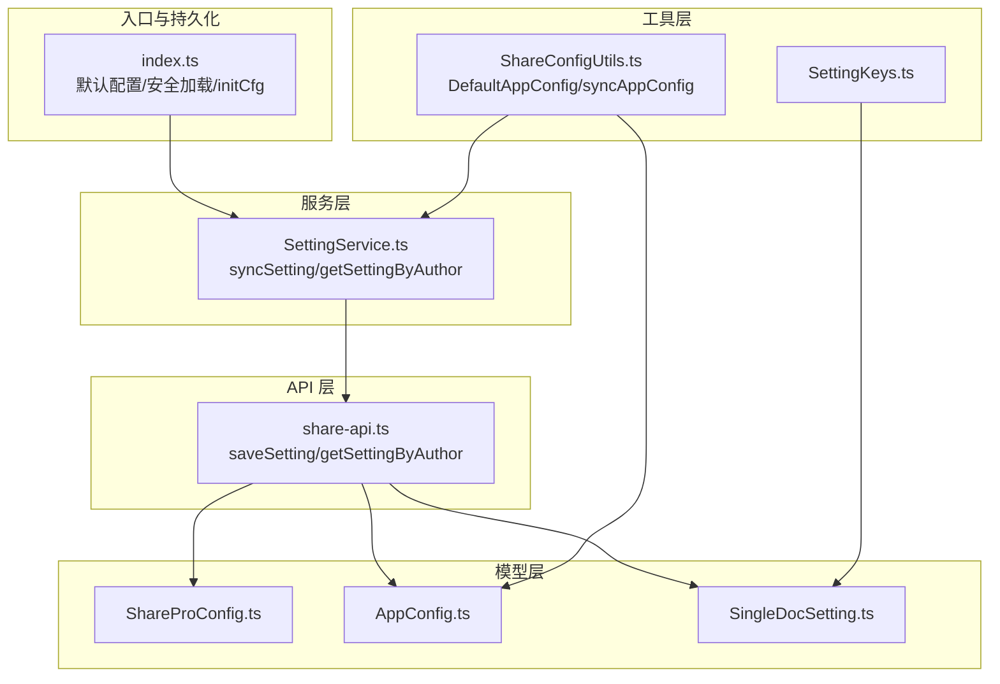
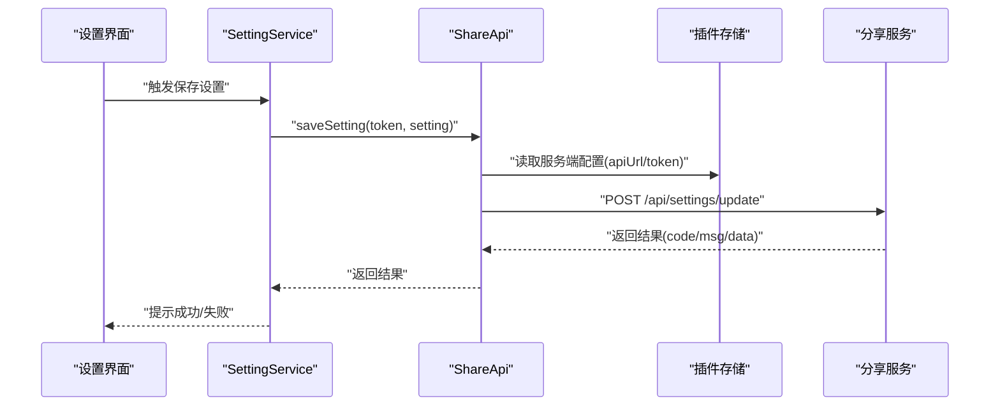
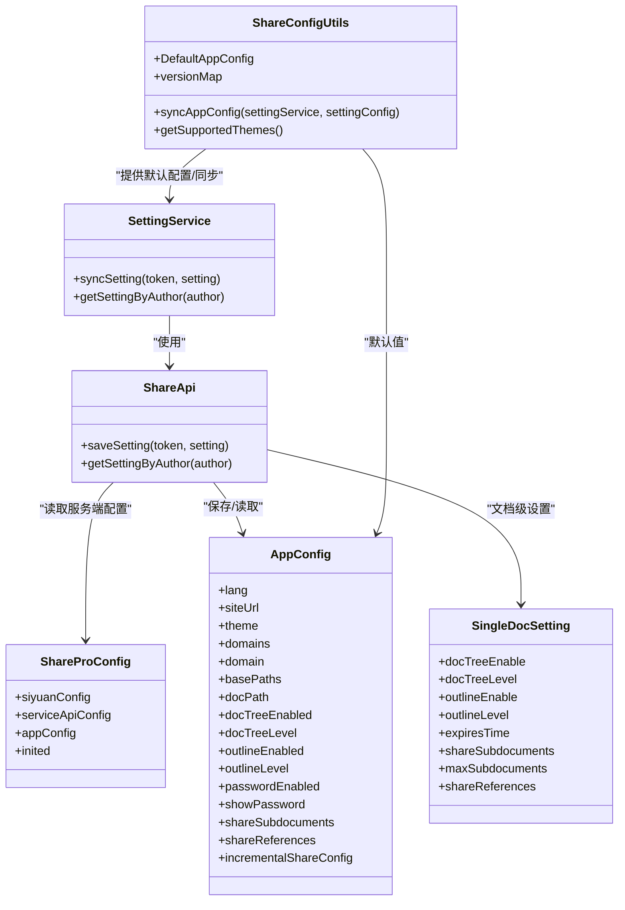

# 设置服务 (SettingService)

<cite>
**本文引用的文件**
- [src/service/SettingService.ts](file://src/service/SettingService.ts)
- [src/api/share-api.ts](file://src/api/share-api.ts)
- [src/models/ShareProConfig.ts](file://src/models/ShareProConfig.ts)
- [src/models/AppConfig.ts](file://src/models/AppConfig.ts)
- [src/models/SingleDocSetting.ts](file://src/models/SingleDocSetting.ts)
- [src/utils/SettingKeys.ts](file://src/utils/SettingKeys.ts)
- [src/utils/ShareConfigUtils.ts](file://src/utils/ShareConfigUtils.ts)
- [src/index.ts](file://src/index.ts)
- [plugin.json](file://plugin.json)
</cite>

## 目录
1. [简介](#简介)
2. [项目结构](#项目结构)
3. [核心组件](#核心组件)
4. [架构总览](#架构总览)
5. [详细组件分析](#详细组件分析)
6. [依赖分析](#依赖分析)
7. [性能考虑](#性能考虑)
8. [故障排查指南](#故障排查指南)
9. [结论](#结论)
10. [附录](#附录)

## 简介
本文件系统性梳理“在线分享专业版”插件的设置服务（SettingService）与相关配置模型，覆盖配置生命周期（加载、验证、持久化、同步）、优先级规则（全局 vs 文档级）、默认值与迁移策略、热更新与实时生效检查、备份与恢复、以及配置与 UI 组件的双向绑定机制。目标是帮助开发者与高级用户正确理解并定制分享行为、SEO 优化、权限控制等。

## 项目结构
围绕设置服务的关键目录与文件如下：
- 服务层：SettingService 负责云端设置的同步与读取
- API 层：ShareApi 封装与后端服务的交互，包括设置的保存与查询
- 模型层：ShareProConfig、AppConfig、SingleDocSetting 描述配置结构
- 工具层：SettingKeys 定义文档级设置键；ShareConfigUtils 提供默认配置与同步工具
- 入口与持久化：index.ts 提供默认配置、安全加载与初始化逻辑

图表来源
- [src/index.ts:100-178](file://src/index.ts#L100-L178)
- [src/service/SettingService.ts:18-36](file://src/service/SettingService.ts#L18-L36)
- [src/api/share-api.ts:79-102](file://src/api/share-api.ts#L79-L102)
- [src/models/ShareProConfig.ts:13-37](file://src/models/ShareProConfig.ts#L13-L37)
- [src/models/AppConfig.ts:12-85](file://src/models/AppConfig.ts#L12-L85)
- [src/models/SingleDocSetting.ts:18-82](file://src/models/SingleDocSetting.ts#L18-L82)
- [src/utils/SettingKeys.ts:13-72](file://src/utils/SettingKeys.ts#L13-L72)
- [src/utils/ShareConfigUtils.ts:16-82](file://src/utils/ShareConfigUtils.ts#L16-L82)

章节来源
- [src/index.ts:100-178](file://src/index.ts#L100-L178)
- [src/service/SettingService.ts:18-36](file://src/service/SettingService.ts#L18-L36)
- [src/api/share-api.ts:79-102](file://src/api/share-api.ts#L79-L102)
- [src/models/ShareProConfig.ts:13-37](file://src/models/ShareProConfig.ts#L13-L37)
- [src/models/AppConfig.ts:12-85](file://src/models/AppConfig.ts#L12-L85)
- [src/models/SingleDocSetting.ts:18-82](file://src/models/SingleDocSetting.ts#L18-L82)
- [src/utils/SettingKeys.ts:13-72](file://src/utils/SettingKeys.ts#L13-L72)
- [src/utils/ShareConfigUtils.ts:16-82](file://src/utils/ShareConfigUtils.ts#L16-L82)

## 核心组件
- SettingService：对外暴露设置同步与按作者获取设置的能力，内部通过 ShareApi 与后端交互
- ShareApi：封装服务端接口调用，负责设置的保存与查询，同时负责校验服务端地址与令牌
- ShareProConfig：顶层配置容器，包含思源侧配置、服务端 API 配置、应用全局配置等
- AppConfig：应用全局配置，涵盖站点信息、主题、域名与路径、密码保护、子文档/引用文档分享、增量分享等
- SingleDocSetting：文档级设置，覆盖文档树/大纲开关与层级、过期时间、子文档/引用文档分享等
- SettingKeys：文档级设置键枚举，用于标记文档属性（如是否开启文档树、大纲、有效期等）
- ShareConfigUtils：提供默认 AppConfig、主题映射、以及将本地 AppConfig 同步到云端的工具函数

章节来源
- [src/service/SettingService.ts:18-36](file://src/service/SettingService.ts#L18-L36)
- [src/api/share-api.ts:79-102](file://src/api/share-api.ts#L79-L102)
- [src/models/ShareProConfig.ts:13-37](file://src/models/ShareProConfig.ts#L13-L37)
- [src/models/AppConfig.ts:12-85](file://src/models/AppConfig.ts#L12-L85)
- [src/models/SingleDocSetting.ts:18-82](file://src/models/SingleDocSetting.ts#L18-L82)
- [src/utils/SettingKeys.ts:13-72](file://src/utils/SettingKeys.ts#L13-L72)
- [src/utils/ShareConfigUtils.ts:16-82](file://src/utils/ShareConfigUtils.ts#L16-L82)

## 架构总览
设置服务的调用链路从 UI 触发，经由 SettingService 调用 ShareApi，最终落到服务端接口。配置的持久化由插件入口负责，首次加载时生成默认配置并写入存储。

图表来源
- [src/service/SettingService.ts:29-31](file://src/service/SettingService.ts#L29-L31)
- [src/api/share-api.ts:90-102](file://src/api/share-api.ts#L90-L102)
- [src/index.ts:150-169](file://src/index.ts#L150-L169)

章节来源
- [src/service/SettingService.ts:29-31](file://src/service/SettingService.ts#L29-L31)
- [src/api/share-api.ts:90-102](file://src/api/share-api.ts#L90-L102)
- [src/index.ts:150-169](file://src/index.ts#L150-L169)

## 详细组件分析

### SettingService：设置同步与读取
- 职责
  - 提供云端设置同步能力：将本地或计算后的 AppConfig 发送到服务端
  - 提供按作者获取设置能力：用于跨设备或团队共享配置
- 关键方法
  - syncSetting(token, setting)：调用 ShareApi.saveSetting
  - getSettingByAuthor(author)：调用 ShareApi.getSettingByAuthor
- 依赖
  - ShareApi：封装网络请求与鉴权头
  - 插件实例：用于日志与上下文

章节来源
- [src/service/SettingService.ts:18-36](file://src/service/SettingService.ts#L18-L36)

### ShareApi：服务端交互与鉴权
- 职责
  - 将设置保存到服务端（/api/settings/update）
  - 按作者获取设置（/api/settings/byAuthor）
  - 统一封装鉴权头（Authorization）
  - 校验服务端地址与令牌，避免空配置导致的请求失败
- 关键实现要点
  - 从插件存储读取 ShareProConfig.serviceApiConfig，拼接请求 URL
  - 若服务端地址为空，直接提示错误并返回
  - 支持在开发模式下输出调试日志
- 与 SettingService 的协作
  - SettingService 仅负责调用，ShareApi 负责实际网络请求与错误处理

章节来源
- [src/api/share-api.ts:79-102](file://src/api/share-api.ts#L79-L102)
- [src/api/share-api.ts:173-209](file://src/api/share-api.ts#L173-L209)
- [src/index.ts:173-177](file://src/index.ts#L173-L177)

### ShareProConfig：顶层配置容器
- 字段概览
  - siyuanConfig：包含 apiUrl、token、cookie 及偏好设置（标题修复、文档树/大纲开关与层级）
  - serviceApiConfig：包含分享服务端的 apiUrl 与 token
  - appConfig：应用全局配置（AppConfig）
  - isCustomCssEnabled、isNewUIEnabled：功能开关
  - inited：初始化标志
- 作用
  - 作为插件存储的根对象，承载全局配置与服务端连接信息

章节来源
- [src/models/ShareProConfig.ts:13-37](file://src/models/ShareProConfig.ts#L13-L37)

### AppConfig：应用全局配置
- 字段概览（节选）
  - 站点信息：lang、siteUrl、siteTitle、siteSlogan、siteDescription、homePageId、header、footer、shareTemplate
  - 主题：mode、lightTheme、darkTheme、themeVersion、logo
  - 自定义 CSS：customCss 数组
  - 域名与路径：domains、domain、basePaths、docPath
  - 文档树/大纲：docTreeEnabled、docTreeLevel、outlineEnabled、outlineLevel
  - 密码保护：passwordEnabled、showPassword
  - 子文档分享：shareSubdocuments（专业版专属）
  - 引用文档分享：shareReferences（专业版专属）
  - 增量分享：incrementalShareConfig.enabled、lastShareTime、notebookBlacklist
  - 动态扩展：[key: string]: any
- 用途
  - 控制站点外观、导航、分享模板、SEO 相关字段
  - 控制分享范围与权限（域名、路径、密码）

章节来源
- [src/models/AppConfig.ts:12-85](file://src/models/AppConfig.ts#L12-L85)

### SingleDocSetting：文档级设置
- 字段概览（节选）
  - 文档树：docTreeEnable、docTreeLevel
  - 大纲：outlineEnable、outlineLevel
  - 有效期：expiresTime（秒，0 表示永久）
  - 子文档分享：shareSubdocuments
  - 子文档数量限制：maxSubdocuments（-1 表示无限制，最大 999）
  - 引用文档分享：shareReferences
- 用途
  - 在单篇文档分享时覆盖全局配置，实现细粒度控制

章节来源
- [src/models/SingleDocSetting.ts:18-82](file://src/models/SingleDocSetting.ts#L18-L82)

### SettingKeys：文档级设置键
- 作用
  - 定义文档属性键，确保文档级设置的统一命名与兼容性
- 关键键值（节选）
  - CUSTOM_DOC_TREE_ENABLE/CUSTOM_DOC_TREE_LEVEL：文档树开关与层级
  - CUSTOM_OUTLINE_ENABLE/CUSTOM_OUTLINE_LEVEL：大纲开关与层级
  - CUSTOM_EXPIRES：分享有效期
  - CUSTOM_SHARE_SUBDOCUMENTS/CUSTOM_SHARE_REFERENCES：子/引用文档分享开关
- 与 SingleDocSetting 的关系
  - SingleDocSetting 的字段与 SettingKeys 的键一一对应，便于序列化/反序列化与 UI 绑定

章节来源
- [src/utils/SettingKeys.ts:13-72](file://src/utils/SettingKeys.ts#L13-L72)
- [src/models/SingleDocSetting.ts:18-82](file://src/models/SingleDocSetting.ts#L18-L82)

### ShareConfigUtils：默认配置与同步工具
- DefaultAppConfig：提供 AppConfig 的默认值，包括语言、站点信息、主题、增量分享默认启用、子文档分享默认禁用等
- syncAppConfig：将本地 AppConfig 同步到云端，若返回 code 非 1 则抛出异常
- getSupportedThemes/versionMap：主题支持与版本映射，供 UI 展示与选择
- 与 SettingService 的协作
  - SettingService 调用 syncAppConfig 将 appConfig 同步到服务端

章节来源
- [src/utils/ShareConfigUtils.ts:16-82](file://src/utils/ShareConfigUtils.ts#L16-L82)

### 插件入口与持久化：index.ts
- getDefaultCfg：生成默认配置（包含思源侧配置与服务端 API 配置），用于首次安装或重置
- safeLoad：安全加载配置，若存储不存在或格式异常则回退到默认配置
- initCfg：首次加载时设置 inited 标志并写回存储；开发模式下可自动修正服务端地址
- openSetting：打开设置对话框，渲染 ShareSetting UI 并传入插件实例与 VIP 信息

章节来源
- [src/index.ts:100-178](file://src/index.ts#L100-L178)

## 依赖分析
SettingService 与相关模块的依赖关系如下：

图表来源
- [src/service/SettingService.ts:18-36](file://src/service/SettingService.ts#L18-L36)
- [src/api/share-api.ts:79-102](file://src/api/share-api.ts#L79-L102)
- [src/models/ShareProConfig.ts:13-37](file://src/models/ShareProConfig.ts#L13-L37)
- [src/models/AppConfig.ts:12-85](file://src/models/AppConfig.ts#L12-L85)
- [src/models/SingleDocSetting.ts:18-82](file://src/models/SingleDocSetting.ts#L18-L82)
- [src/utils/ShareConfigUtils.ts:16-82](file://src/utils/ShareConfigUtils.ts#L16-L82)

章节来源
- [src/service/SettingService.ts:18-36](file://src/service/SettingService.ts#L18-L36)
- [src/api/share-api.ts:79-102](file://src/api/share-api.ts#L79-L102)
- [src/models/ShareProConfig.ts:13-37](file://src/models/ShareProConfig.ts#L13-L37)
- [src/models/AppConfig.ts:12-85](file://src/models/AppConfig.ts#L12-L85)
- [src/models/SingleDocSetting.ts:18-82](file://src/models/SingleDocSetting.ts#L18-L82)
- [src/utils/ShareConfigUtils.ts:16-82](file://src/utils/ShareConfigUtils.ts#L16-L82)

## 性能考虑
- 请求合并与去抖：在频繁变更设置时，建议在 UI 层进行防抖，减少不必要的网络请求
- 本地缓存：利用插件存储的 safeLoad 缓存最新配置，避免重复读取磁盘
- 令牌与地址校验：在 ShareApi 中提前校验服务端地址与令牌，避免无效请求带来的资源浪费
- 增量同步：对于大型 AppConfig，可考虑分块更新或按需更新，降低传输开销

## 故障排查指南
- 无法连接分享服务
  - 现象：提示“未找到分享服务，请先初始化”
  - 排查：确认 ShareProConfig.serviceApiConfig.apiUrl 与 token 已正确填写；开发模式下检查是否被自动修正
  - 参考
    - [src/api/share-api.ts:178-183](file://src/api/share-api.ts#L178-L183)
    - [src/index.ts:150-169](file://src/index.ts#L150-L169)
- 保存设置失败
  - 现象：返回 code 非 1 或抛出异常
  - 排查：检查 SettingService.syncSetting 返回值；确认服务端接口可用与鉴权头正确
  - 参考
    - [src/utils/ShareConfigUtils.ts:74-80](file://src/utils/ShareConfigUtils.ts#L74-L80)
    - [src/api/share-api.ts:90-102](file://src/api/share-api.ts#L90-L102)
- 配置未生效
  - 现象：修改后页面未更新
  - 排查：确认 UI 层已监听配置变化并触发刷新；检查是否存在本地缓存未清理
  - 参考
    - [src/service/SettingService.ts:29-31](file://src/service/SettingService.ts#L29-L31)
    - [src/api/share-api.ts:79-88](file://src/api/share-api.ts#L79-L88)

章节来源
- [src/api/share-api.ts:178-183](file://src/api/share-api.ts#L178-L183)
- [src/index.ts:150-169](file://src/index.ts#L150-L169)
- [src/utils/ShareConfigUtils.ts:74-80](file://src/utils/ShareConfigUtils.ts#L74-L80)
- [src/api/share-api.ts:90-102](file://src/api/share-api.ts#L90-L102)
- [src/service/SettingService.ts:29-31](file://src/service/SettingService.ts#L29-L31)
- [src/api/share-api.ts:79-88](file://src/api/share-api.ts#L79-L88)

## 结论
SettingService 以轻量的职责边界实现了设置的云端同步与读取，配合 ShareApi 的鉴权与校验、index.ts 的安全加载与初始化、以及多模型（ShareProConfig/AppConfig/SingleDocSetting）的清晰分层，构建了完整的配置生命周期闭环。通过 SettingKeys 与 ShareConfigUtils 的配套，进一步保证了配置的一致性、可维护性与可扩展性。

## 附录

### 配置优先级规则（全局 vs 文档级）
- 全局配置（AppConfig）：影响整个站点的外观、域名、路径、密码保护、子/引用文档分享、增量分享等
- 文档级配置（SingleDocSetting）：覆盖全局配置中的部分字段，如文档树/大纲开关与层级、有效期、子/引用文档分享等
- 优先级原则
  - 文档级设置优先于全局设置；当文档级未设置时回退到全局设置
  - 未设置的字段保持默认值（DefaultAppConfig 或 SingleDocSetting 的默认值）

章节来源
- [src/models/AppConfig.ts:12-85](file://src/models/AppConfig.ts#L12-L85)
- [src/models/SingleDocSetting.ts:18-82](file://src/models/SingleDocSetting.ts#L18-L82)
- [src/utils/ShareConfigUtils.ts:16-42](file://src/utils/ShareConfigUtils.ts#L16-L42)

### 默认值处理与迁移策略
- 默认值
  - AppConfig 默认值：参考 DefaultAppConfig（语言、站点信息、主题、增量分享默认启用、子文档分享默认禁用等）
  - SingleDocSetting 默认值：未显式设置时采用全局默认行为
- 迁移策略
  - 首次加载：initCfg 将 inited 标记为 true 并写回存储，确保后续逻辑稳定
  - 开发模式：自动修正服务端地址，避免因环境切换导致的配置漂移
- 参考
  - [src/utils/ShareConfigUtils.ts:16-42](file://src/utils/ShareConfigUtils.ts#L16-L42)
  - [src/index.ts:150-169](file://src/index.ts#L150-L169)

### 配置热更新与实时生效检查
- 热更新机制
  - 云端设置更新后，可通过 SettingService.getSettingByAuthor 拉取最新配置
  - UI 层监听配置变化并触发局部刷新
- 实时生效检查
  - 保存设置后检查返回码与消息，必要时提示用户
  - 对于敏感配置（如密码保护、域名/路径），建议在保存后立即刷新页面或重新渲染相关组件
- 参考
  - [src/service/SettingService.ts:33-35](file://src/service/SettingService.ts#L33-L35)
  - [src/api/share-api.ts:90-102](file://src/api/share-api.ts#L90-L102)

### 配置备份与恢复
- 备份
  - 通过插件存储的 safeLoad 获取当前 ShareProConfig，导出为 JSON 文件
- 恢复
  - 在新环境中使用 safeLoad 读取备份文件并写回存储
- 注意事项
  - 恢复前确认服务端地址与令牌一致；必要时在开发模式下修正
- 参考
  - [src/index.ts:126-148](file://src/index.ts#L126-L148)
  - [src/index.ts:150-169](file://src/index.ts#L150-L169)

### 配置与 UI 组件的绑定与双向同步
- 绑定关系
  - ShareSetting UI 组件接收插件实例与 VIP 信息，内部根据 AppConfig/SingleDocSetting 渲染表单
  - SettingKeys 作为键名约定，确保 UI 表单项与文档属性一致
- 双向同步
  - 用户在 UI 修改配置 → SettingService.syncSetting → ShareApi.saveSetting → 云端持久化
  - 云端配置变更 → SettingService.getSettingByAuthor → UI 刷新
- 参考
  - [src/index.ts:73-95](file://src/index.ts#L73-L95)
  - [src/utils/SettingKeys.ts:13-72](file://src/utils/SettingKeys.ts#L13-L72)
  - [src/service/SettingService.ts:29-35](file://src/service/SettingService.ts#L29-L35)

### 配置示例与最佳实践
- 自定义分享行为
  - 全局：在 AppConfig 中设置 domains、domain、basePaths、docPath 控制分享范围
  - 文档级：在 SingleDocSetting 中设置 docTreeEnable/docTreeLevel/outlineEnable/outlineLevel 控制展示细节
- SEO 优化设置
  - 在 AppConfig 中设置 siteTitle、siteSlogan、siteDescription、shareTemplate 等字段提升分享卡片质量
- 权限控制配置
  - 在 AppConfig 中启用 passwordEnabled/showPassword；在文档级设置 expiresTime 控制有效期
- 最佳实践
  - 使用 SettingKeys 统一键名，避免硬编码
  - 对于大范围变更，先在开发环境测试，再批量推送至生产
  - 定期备份 ShareProConfig，防止误操作导致的配置丢失

章节来源
- [src/models/AppConfig.ts:12-85](file://src/models/AppConfig.ts#L12-L85)
- [src/models/SingleDocSetting.ts:18-82](file://src/models/SingleDocSetting.ts#L18-L82)
- [src/utils/SettingKeys.ts:13-72](file://src/utils/SettingKeys.ts#L13-L72)
- [src/index.ts:73-95](file://src/index.ts#L73-L95)