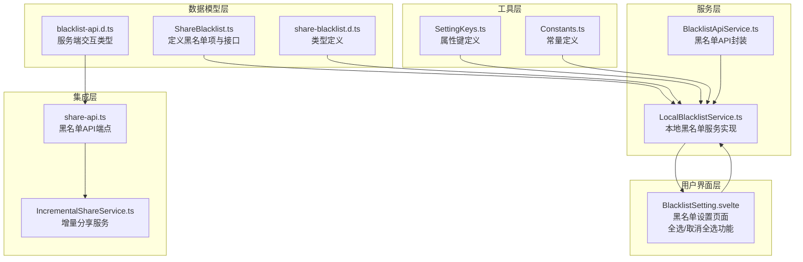
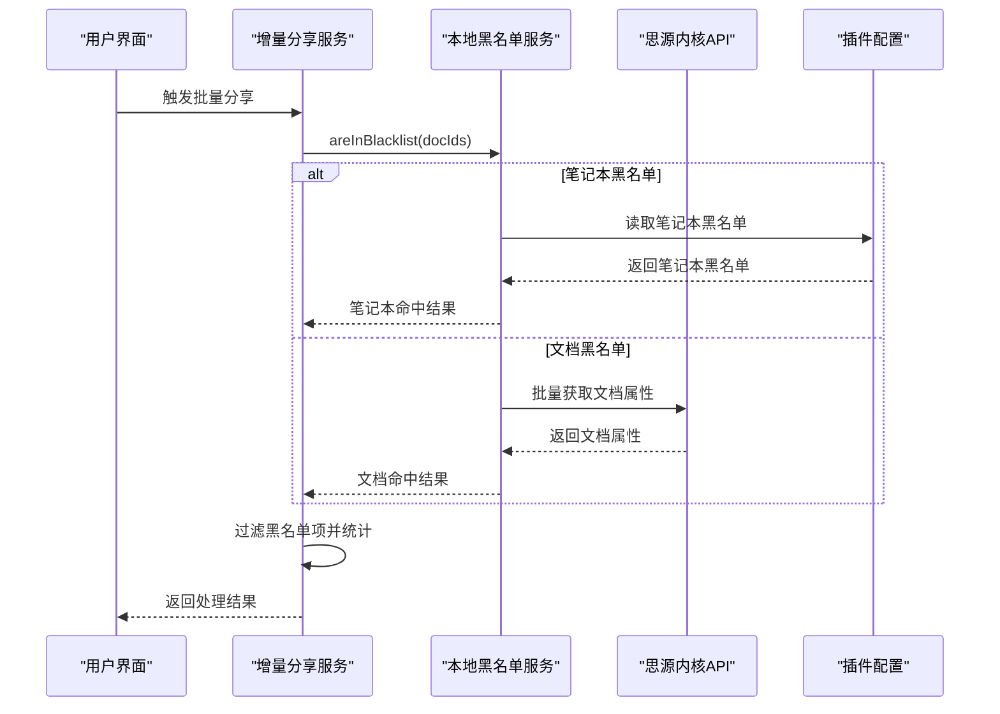
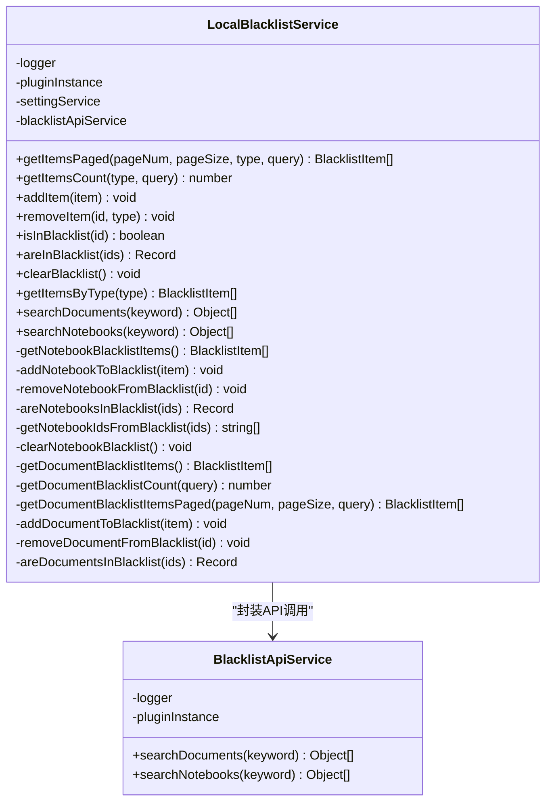
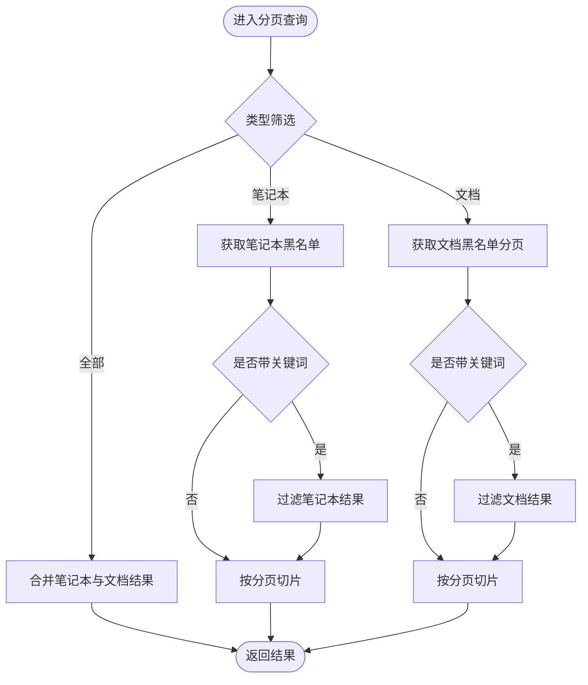
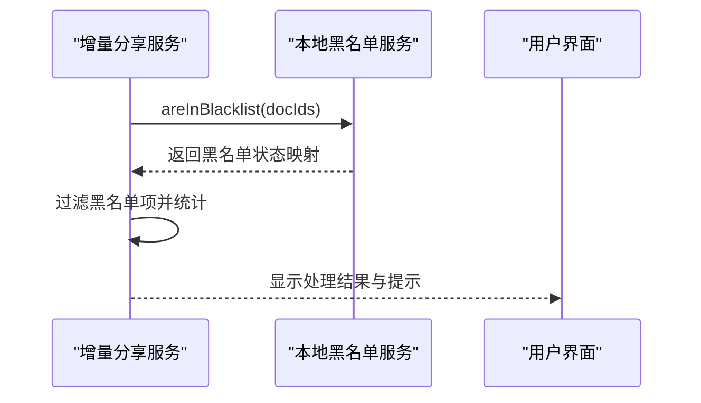
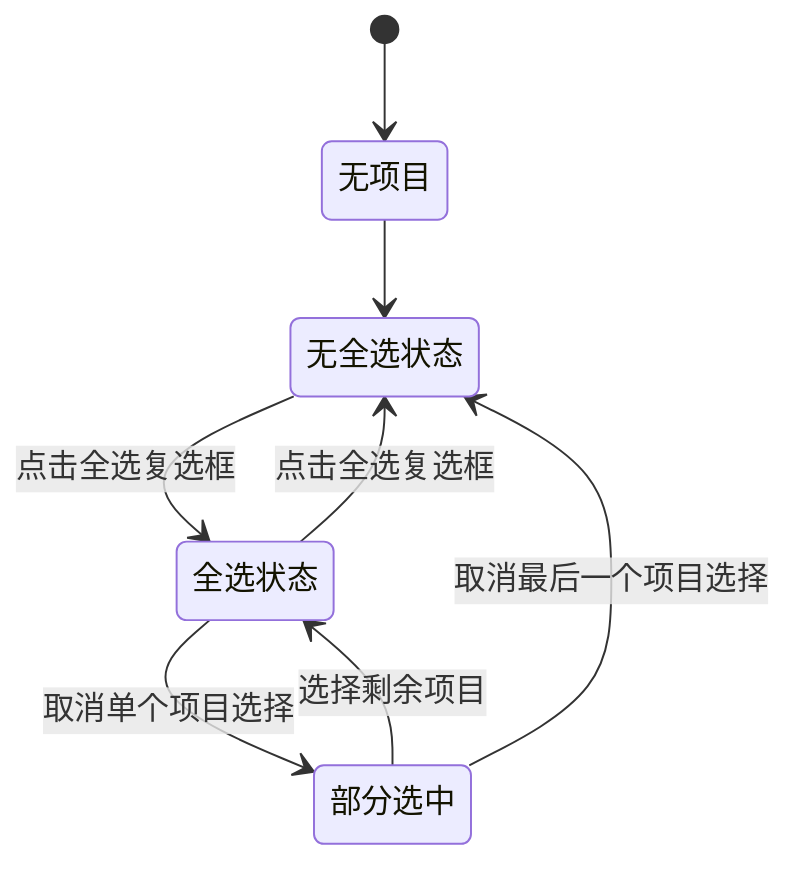
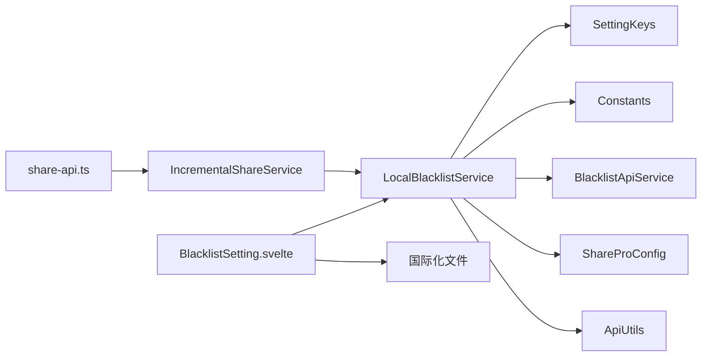

# 黑名单服务（BlacklistService）

<cite>
**本文档引用的文件**
- [ShareBlacklist.ts](file://src/models/ShareBlacklist.ts)
- [LocalBlacklistService.ts](file://src/service/LocalBlacklistService.ts)
- [BlacklistApiService.ts](file://src/service/BlacklistApiService.ts)
- [BlacklistSetting.svelte](file://src/libs/pages/setting/BlacklistSetting.svelte)
- [share-blacklist.d.ts](file://src/types/share-blacklist.d.ts)
- [blacklist-api.d.ts](file://src/types/blacklist-api.d.ts)
- [SettingKeys.ts](file://src/utils/SettingKeys.ts)
- [Constants.ts](file://src/Constants.ts)
- [IncrementalShareService.ts](file://src/service/IncrementalShareService.ts)
- [share-api.ts](file://src/api/share-api.ts)
- [zh_CN.json](file://src/i18n/zh_CN.json)
- [en_US.json](file://src/i18n/en_US.json)
</cite>

## 更新摘要
**变更内容**
- 更新了 LocalBlacklistService 的 removeItem 方法签名，增加类型参数支持
- 新增 BlacklistSetting.svelte 的全选/取消全选功能实现
- 改进了表单验证和可访问性支持
- 增强了批量操作的用户体验

## 目录
1. [简介](#简介)
2. [项目结构](#项目结构)
3. [核心组件](#核心组件)
4. [架构概览](#架构概览)
5. [详细组件分析](#详细组件分析)
6. [依赖关系分析](#依赖关系分析)
7. [性能考虑](#性能考虑)
8. [故障排查指南](#故障排查指南)
9. [结论](#结论)
10. [附录](#附录)

## 简介
本文件系统性阐述思源笔记分享专业版的黑名单服务设计与实现，重点覆盖以下方面：
- 黑名单机制设计理念：文档ID过滤、批量操作控制、权限管理策略
- LocalBlacklistService 的实现细节：本地存储管理、黑名单维护、实时查询优化
- ShareBlacklist 数据模型结构、黑名单规则匹配算法、动态更新机制
- 黑名单的导入导出功能、批量操作支持、性能优化策略（索引、缓存）
- 使用示例：如何添加/移除黑名单项、批量处理黑名单文档、监控黑名单效果
- 黑名单与分享服务的集成方式和拦截机制
- **新增**：全选/取消全选功能、改进的表单验证和可访问性支持

## 项目结构
黑名单服务相关代码主要分布在以下模块：
- 数据模型层：定义黑名单项、配置与接口
- 服务层：本地黑名单服务、黑名单API服务
- 用户界面层：黑名单设置页面，支持全选/取消全选
- 集成层：与增量分享服务的集成点
- 工具层：常量与设置键定义

**图表来源**
- [ShareBlacklist.ts:1-99](file://src/models/ShareBlacklist.ts#L1-L99)
- [LocalBlacklistService.ts:1-655](file://src/service/LocalBlacklistService.ts#L1-L655)
- [BlacklistApiService.ts:1-76](file://src/service/BlacklistApiService.ts#L1-L76)
- [BlacklistSetting.svelte:1-797](file://src/libs/pages/setting/BlacklistSetting.svelte#L1-L797)
- [share-blacklist.d.ts:1-114](file://src/types/share-blacklist.d.ts#L1-L114)
- [blacklist-api.d.ts:1-99](file://src/types/blacklist-api.d.ts#L1-L99)
- [SettingKeys.ts:1-75](file://src/utils/SettingKeys.ts#L1-L75)
- [Constants.ts:1-20](file://src/Constants.ts#L1-L20)
- [IncrementalShareService.ts:280-479](file://src/service/IncrementalShareService.ts#L280-L479)
- [share-api.ts:220-240](file://src/api/share-api.ts#L220-L240)

**章节来源**
- [ShareBlacklist.ts:1-99](file://src/models/ShareBlacklist.ts#L1-L99)
- [LocalBlacklistService.ts:1-655](file://src/service/LocalBlacklistService.ts#L1-L655)
- [BlacklistApiService.ts:1-76](file://src/service/BlacklistApiService.ts#L1-L76)
- [BlacklistSetting.svelte:1-797](file://src/libs/pages/setting/BlacklistSetting.svelte#L1-L797)
- [share-blacklist.d.ts:1-114](file://src/types/share-blacklist.d.ts#L1-L114)
- [blacklist-api.d.ts:1-99](file://src/types/blacklist-api.d.ts#L1-L99)
- [SettingKeys.ts:1-75](file://src/utils/SettingKeys.ts#L1-L75)
- [Constants.ts:1-20](file://src/Constants.ts#L1-L20)
- [IncrementalShareService.ts:280-479](file://src/service/IncrementalShareService.ts#L280-L479)
- [share-api.ts:220-240](file://src/api/share-api.ts#L220-L240)

## 核心组件
本节聚焦黑名单服务的核心接口与数据模型，阐明其职责边界与扩展点。

- 黑名单项类型与接口
  - 支持两种类型：笔记本（notebook）与文档（document）
  - 包含标识符、名称、类型、添加时间与备注等字段
  - 提供单项与批量操作接口，支持分页与搜索

- 黑名单配置
  - 包含笔记本黑名单列表、文档黑名单列表与开关标志
  - 用于控制增量分享流程中的过滤行为

- 黑名单API类型
  - 定义服务端交互所需的请求与响应结构
  - 支持添加、删除、检查与列表查询

- **新增**：黑名单设置界面
  - 支持全选/取消全选功能
  - 改进的表单验证和可访问性支持
  - 实时搜索和筛选功能

**章节来源**
- [ShareBlacklist.ts:18-78](file://src/models/ShareBlacklist.ts#L18-L78)
- [ShareBlacklist.ts:83-98](file://src/models/ShareBlacklist.ts#L83-L98)
- [share-blacklist.d.ts:18-93](file://src/types/share-blacklist.d.ts#L18-L93)
- [blacklist-api.d.ts:18-98](file://src/types/blacklist-api.d.ts#L18-L98)
- [BlacklistSetting.svelte:270-286](file://src/libs/pages/setting/BlacklistSetting.svelte#L270-L286)

## 架构概览
黑名单服务采用"本地存储 + 思源内核API"的混合架构：
- 笔记本黑名单：持久化存储于插件配置中，便于全局生效与跨文档继承
- 文档黑名单：通过文档属性标记，实现细粒度控制
- 查询路径：本地服务统一聚合笔记本与文档黑名单，提供批量检查能力
- 集成路径：增量分享服务在批量分享前调用黑名单检查，自动跳过命中项
- **新增**：用户界面层提供全选/取消全选功能，提升批量操作效率

**图表来源**
- [IncrementalShareService.ts:286-364](file://src/service/IncrementalShareService.ts#L286-L364)
- [LocalBlacklistService.ts:221-249](file://src/service/LocalBlacklistService.ts#L221-L249)
- [LocalBlacklistService.ts:393-414](file://src/service/LocalBlacklistService.ts#L393-L414)
- [LocalBlacklistService.ts:631-656](file://src/service/LocalBlacklistService.ts#L631-L656)

## 详细组件分析

### LocalBlacklistService 实现详解
LocalBlacklistService 是黑名单服务的核心实现，负责：
- 本地存储管理：笔记本黑名单写入插件配置；文档黑名单写入文档属性
- 黑名单维护：添加、移除、清空、分页查询、搜索
- 实时查询优化：批量检查、按类型筛选、分页与搜索组合

**图表来源**
- [LocalBlacklistService.ts:31-655](file://src/service/LocalBlacklistService.ts#L31-L655)
- [BlacklistApiService.ts:22-75](file://src/service/BlacklistApiService.ts#L22-L75)

#### 存储与同步机制
- 笔记本黑名单：写入插件配置的增量分享配置中，支持同步到服务端
- 文档黑名单：通过设置文档属性实现，移除时使用特殊删除值
- 配置同步：通过工具函数将本地配置同步至服务端，保证多端一致性

**章节来源**
- [LocalBlacklistService.ts:326-354](file://src/service/LocalBlacklistService.ts#L326-L354)
- [LocalBlacklistService.ts:591-606](file://src/service/LocalBlacklistService.ts#L591-L606)
- [SettingKeys.ts:58-61](file://src/utils/SettingKeys.ts#L58-L61)

#### 批量检查与查询优化
- 批量检查：同时检测笔记本与文档黑名单，合并结果
- 笔记本检查：基于内存集合快速判断，复杂度 O(n)
- 文档检查：批量获取文档属性，逐项判断，复杂度 O(n)
- 分页与搜索：支持按类型与关键词筛选，提升大列表场景下的可用性

**章节来源**
- [LocalBlacklistService.ts:221-249](file://src/service/LocalBlacklistService.ts#L221-L249)
- [LocalBlacklistService.ts:393-414](file://src/service/LocalBlacklistService.ts#L393-L414)
- [LocalBlacklistService.ts:631-656](file://src/service/LocalBlacklistService.ts#L631-L656)
- [LocalBlacklistService.ts:50-118](file://src/service/LocalBlacklistService.ts#L50-L118)
- [LocalBlacklistService.ts:125-163](file://src/service/LocalBlacklistService.ts#L125-L163)

#### 分页与搜索算法

**图表来源**
- [LocalBlacklistService.ts:50-118](file://src/service/LocalBlacklistService.ts#L50-L118)
- [LocalBlacklistService.ts:541-586](file://src/service/LocalBlacklistService.ts#L541-L586)

### BlacklistApiService 封装
BlacklistApiService 封装了与黑名单相关的内核API调用，包括：
- 搜索文档：基于内容与标签的模糊匹配
- 搜索笔记本：基于名称的精确匹配

该服务被 LocalBlacklistService 复用，确保查询逻辑的一致性与可测试性。

**章节来源**
- [BlacklistApiService.ts:34-74](file://src/service/BlacklistApiService.ts#L34-L74)

### 数据模型与类型定义
- 黑名单项：包含标识符、名称、类型、添加时间与备注
- 黑名单接口：提供添加、移除、检查、批量检查、清空、按类型获取等方法
- 黑名单配置：包含笔记本黑名单列表、文档黑名单列表与开关标志
- 服务端交互类型：定义添加、删除、检查与列表查询的请求/响应结构

**章节来源**
- [ShareBlacklist.ts:18-98](file://src/models/ShareBlacklist.ts#L18-L98)
- [share-blacklist.d.ts:18-93](file://src/types/share-blacklist.d.ts#L18-L93)
- [blacklist-api.d.ts:18-98](file://src/types/blacklist-api.d.ts#L18-L98)

### 与分享服务的集成
增量分享服务在批量分享前调用黑名单检查，自动跳过命中黑名单的文档，并统计跳过数量与结果。该流程通过分页检查避免一次性查询过多文档导致的性能问题。

**图表来源**
- [IncrementalShareService.ts:286-364](file://src/service/IncrementalShareService.ts#L286-L364)

**章节来源**
- [IncrementalShareService.ts:286-364](file://src/service/IncrementalShareService.ts#L286-L364)

### **新增**：黑名单设置界面增强功能

#### 全选/取消全选功能
BlacklistSetting.svelte 页面提供了直观的全选/取消全选功能，显著提升了批量操作效率：

- **全选逻辑**：当所有可见项目都被选中时，复选框显示为全选状态
- **取消全选**：点击全选复选框可取消所有项目的选中状态
- **状态同步**：全选状态与每个项目的选择状态保持同步

**图表来源**
- [BlacklistSetting.svelte:270-286](file://src/libs/pages/setting/BlacklistSetting.svelte#L270-L286)

#### 改进的表单验证和可访问性支持
- **必填字段验证**：名称和目标ID字段的实时验证
- **可访问性改进**：使用适当的ARIA标签和键盘导航支持
- **错误处理**：友好的错误消息和状态反馈

**章节来源**
- [BlacklistSetting.svelte:180-219](file://src/libs/pages/setting/BlacklistSetting.svelte#L180-L219)
- [BlacklistSetting.svelte:270-286](file://src/libs/pages/setting/BlacklistSetting.svelte#L270-L286)

## 依赖关系分析
- LocalBlacklistService 依赖：
  - SettingKeys：文档黑名单属性键
  - Constants：存储文件名、分页大小、删除值等常量
  - BlacklistApiService：封装内核API调用
  - ShareProConfig：插件配置结构
  - ApiUtils：获取内核API实例

- 与分享服务的耦合：
  - IncrementalShareService 通过 LocalBlacklistService 的批量检查接口集成黑名单
  - 通过分页检查降低一次性查询压力

- **新增**：用户界面依赖
  - BlacklistSetting.svelte 依赖 LocalBlacklistService 进行数据操作
  - 国际化文件提供多语言支持

**图表来源**
- [LocalBlacklistService.ts:10-20](file://src/service/LocalBlacklistService.ts#L10-L20)
- [SettingKeys.ts:58-61](file://src/utils/SettingKeys.ts#L58-L61)
- [Constants.ts:15-19](file://src/Constants.ts#L15-L19)
- [IncrementalShareService.ts:286-364](file://src/service/IncrementalShareService.ts#L286-L364)
- [share-api.ts:224-228](file://src/api/share-api.ts#L224-L228)
- [BlacklistSetting.svelte:102-105](file://src/libs/pages/setting/BlacklistSetting.svelte#L102-L105)

**章节来源**
- [LocalBlacklistService.ts:10-20](file://src/service/LocalBlacklistService.ts#L10-L20)
- [SettingKeys.ts:58-61](file://src/utils/SettingKeys.ts#L58-L61)
- [Constants.ts:15-19](file://src/Constants.ts#L15-L19)
- [IncrementalShareService.ts:286-364](file://src/service/IncrementalShareService.ts#L286-L364)
- [share-api.ts:224-228](file://src/api/share-api.ts#L224-L228)
- [BlacklistSetting.svelte:102-105](file://src/libs/pages/setting/BlacklistSetting.svelte#L102-L105)

## 性能考虑
- 批量检查优化
  - 笔记本黑名单：基于内存集合快速判断，适合大规模文档场景
  - 文档黑名单：批量获取属性，减少多次往返调用
- 分页与搜索
  - 支持分页加载与关键词过滤，避免一次性加载全部数据
- 存储策略
  - 笔记本黑名单持久化于插件配置，读取成本低
  - 文档黑名单通过属性标记，写入成本低但读取需批量API调用
- 并发与队列
  - 增量分享服务在检查后使用队列与并发控制，避免阻塞
- **新增**：界面性能优化
  - 全选功能使用 Set 数据结构，提高状态管理效率
  - 防抖搜索减少不必要的API调用

**章节来源**
- [LocalBlacklistService.ts:221-249](file://src/service/LocalBlacklistService.ts#L221-L249)
- [LocalBlacklistService.ts:50-118](file://src/service/LocalBlacklistService.ts#L50-L118)
- [IncrementalShareService.ts:286-364](file://src/service/IncrementalShareService.ts#L286-L364)
- [BlacklistSetting.svelte:270-286](file://src/libs/pages/setting/BlacklistSetting.svelte#L270-L286)

## 故障排查指南
- 添加/移除失败
  - 检查插件配置写入权限与网络同步状态
  - 确认文档属性键是否正确（删除时使用特殊值）
- 查询结果异常
  - 确认分页参数与关键词过滤是否正确
  - 检查内核API连接状态与SQL查询语句
- 性能问题
  - 减少一次性查询数量，使用分页与批量检查
  - 避免频繁清空文档黑名单（无法批量清空，需手动提供ID）
- **新增**：界面操作问题
  - 全选功能失效：检查 Set 数据结构的状态同步
  - 表单验证错误：确认必填字段是否正确填写
  - 可访问性问题：检查ARIA标签和键盘导航支持

**章节来源**
- [LocalBlacklistService.ts:170-202](file://src/service/LocalBlacklistService.ts#L170-L202)
- [LocalBlacklistService.ts:591-626](file://src/service/LocalBlacklistService.ts#L591-L626)
- [LocalBlacklistService.ts:508-534](file://src/service/LocalBlacklistService.ts#L508-L534)
- [BlacklistSetting.svelte:180-219](file://src/libs/pages/setting/BlacklistSetting.svelte#L180-L219)
- [BlacklistSetting.svelte:270-286](file://src/libs/pages/setting/BlacklistSetting.svelte#L270-L286)

## 结论
黑名单服务通过"本地存储 + 内核API"的混合架构实现了灵活而高效的文档过滤能力。LocalBlacklistService 提供了完善的增删改查、批量检查与分页搜索能力，并与增量分享服务无缝集成，有效保障了分享流程的安全性与可控性。

**最新改进**：
- **全选/取消全选功能**：显著提升批量操作效率，支持大量黑名单项的快速管理
- **增强的表单验证**：确保数据完整性，提供更好的用户体验
- **可访问性支持**：改善键盘导航和屏幕阅读器支持
- **改进的错误处理**：更友好的错误消息和状态反馈

未来可在以下方面持续优化：
- 引入文档黑名单的批量清空机制
- 增加黑名单导入导出功能
- 优化文档属性批量获取的性能
- 扩展黑名单规则的匹配算法

## 附录

### 使用示例与最佳实践
- 添加黑名单项
  - 笔记本：调用添加方法，选择类型为笔记本，填写笔记本ID与名称
  - 文档：调用添加方法，选择类型为文档，填写文档ID与标题
- 移除黑名单项
  - **更新**：现在支持通过 removeItem(id, type) 方法直接指定类型
  - 通过ID移除，服务会自动判断类型并执行对应操作
- 批量处理
  - 使用批量检查接口一次性获取多个文档的黑名单状态
  - 在增量分享前进行预检查，自动跳过黑名单项
  - **新增**：使用全选功能快速选择多个黑名单项进行批量删除
- 监控效果
  - 查看增量分享结果中的跳过数量与详情
  - 通过分页查询与关键词搜索定位特定条目
  - **新增**：利用改进的表单验证确保操作的准确性

**章节来源**
- [LocalBlacklistService.ts:168-202](file://src/service/LocalBlacklistService.ts#L168-L202)
- [LocalBlacklistService.ts:221-249](file://src/service/LocalBlacklistService.ts#L221-L249)
- [IncrementalShareService.ts:286-364](file://src/service/IncrementalShareService.ts#L286-L364)
- [BlacklistSetting.svelte:270-286](file://src/libs/pages/setting/BlacklistSetting.svelte#L270-L286)

### 黑名单与分享服务的集成点
- 增量分享服务在批量分享前调用黑名单检查
- 对命中黑名单的文档进行跳过处理，并统计结果
- 保持与服务端配置的同步，确保一致性
- **新增**：用户界面提供直观的操作反馈和状态指示

**章节来源**
- [IncrementalShareService.ts:286-364](file://src/service/IncrementalShareService.ts#L286-L364)
- [share-api.ts:224-228](file://src/api/share-api.ts#L224-L228)
- [BlacklistSetting.svelte:102-105](file://src/libs/pages/setting/BlacklistSetting.svelte#L102-L105)

### **新增**：全选/取消全选功能使用指南
- **全选所有项目**：点击表格顶部的全选复选框
- **取消全选**：再次点击全选复选框或取消单个项目选择
- **批量删除**：选择多个项目后点击删除按钮
- **状态指示**：全选复选框会根据选中状态自动更新

**章节来源**
- [BlacklistSetting.svelte:270-286](file://src/libs/pages/setting/BlacklistSetting.svelte#L270-L286)