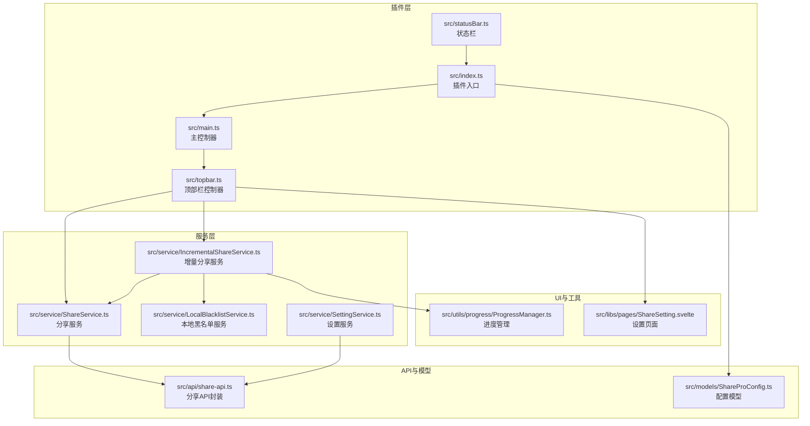
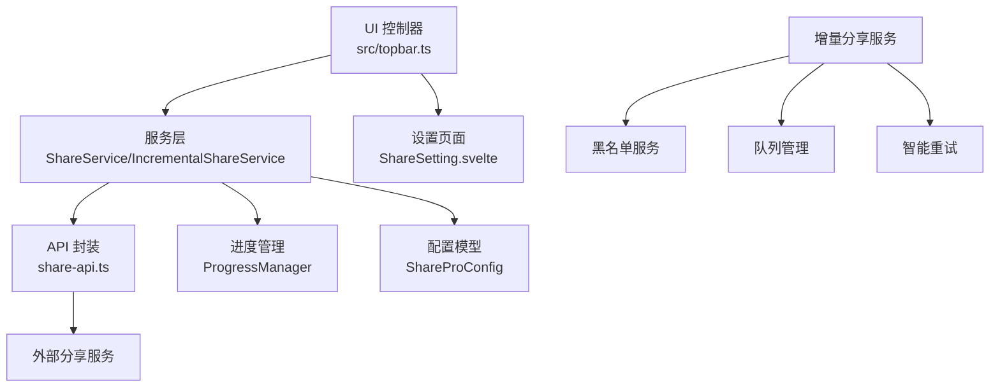
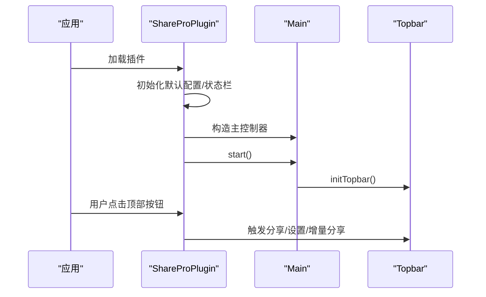
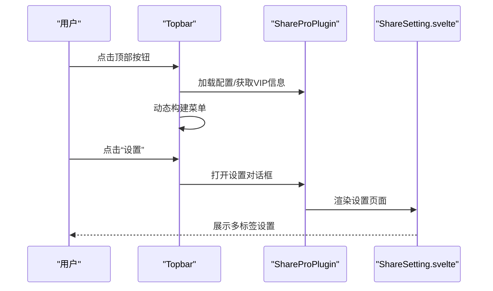
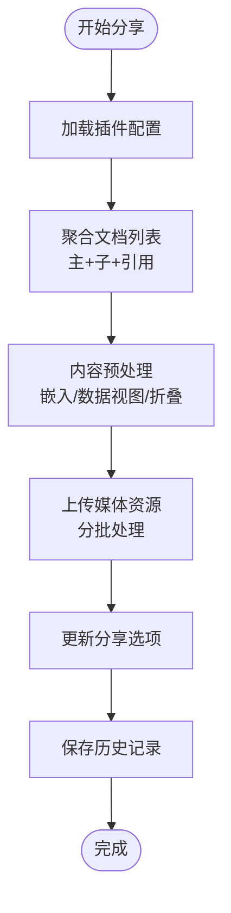
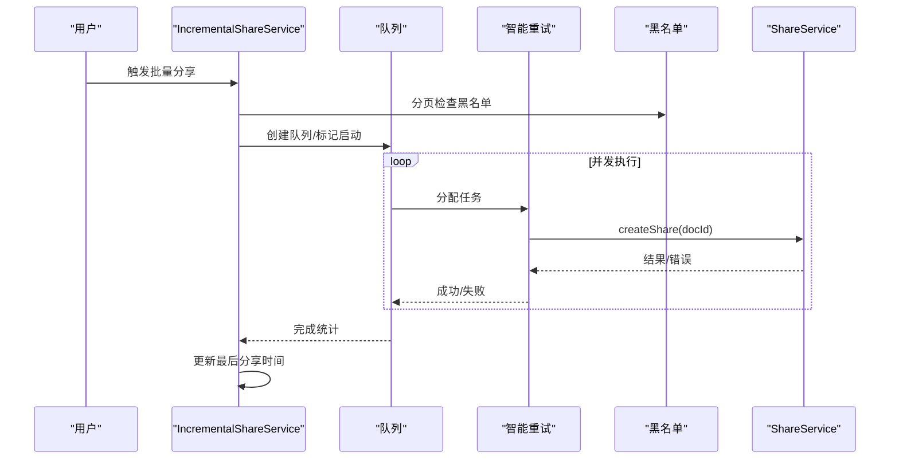
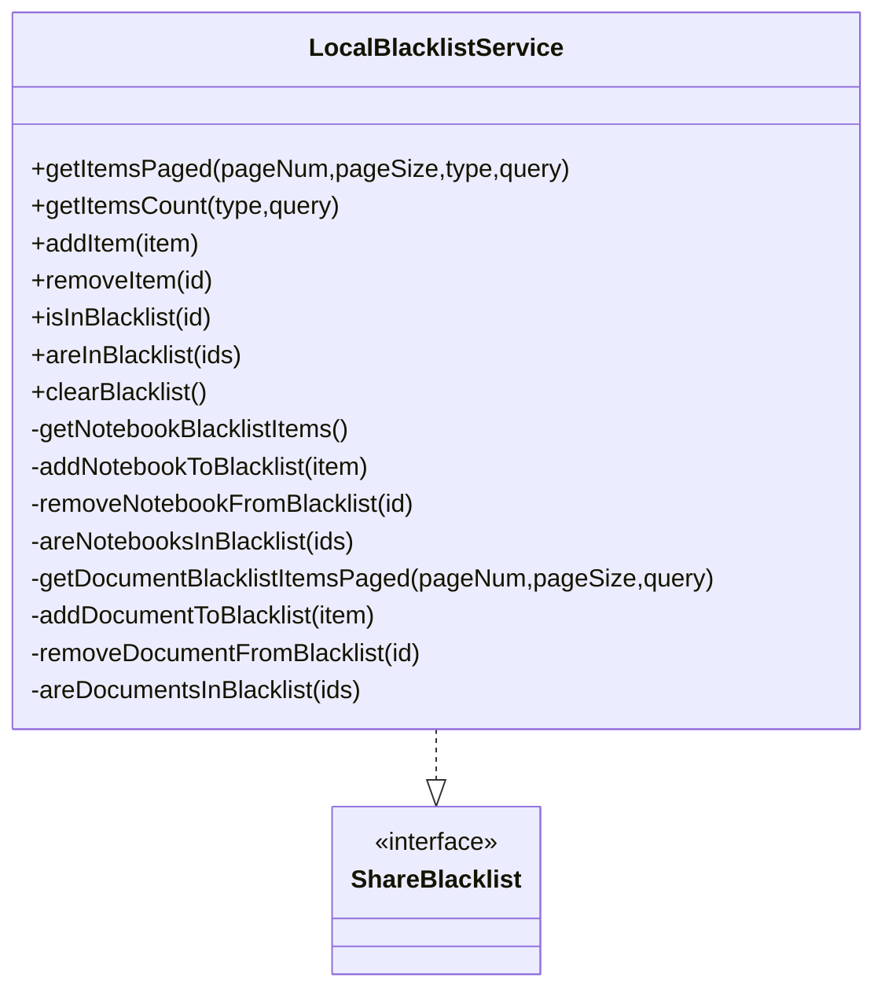
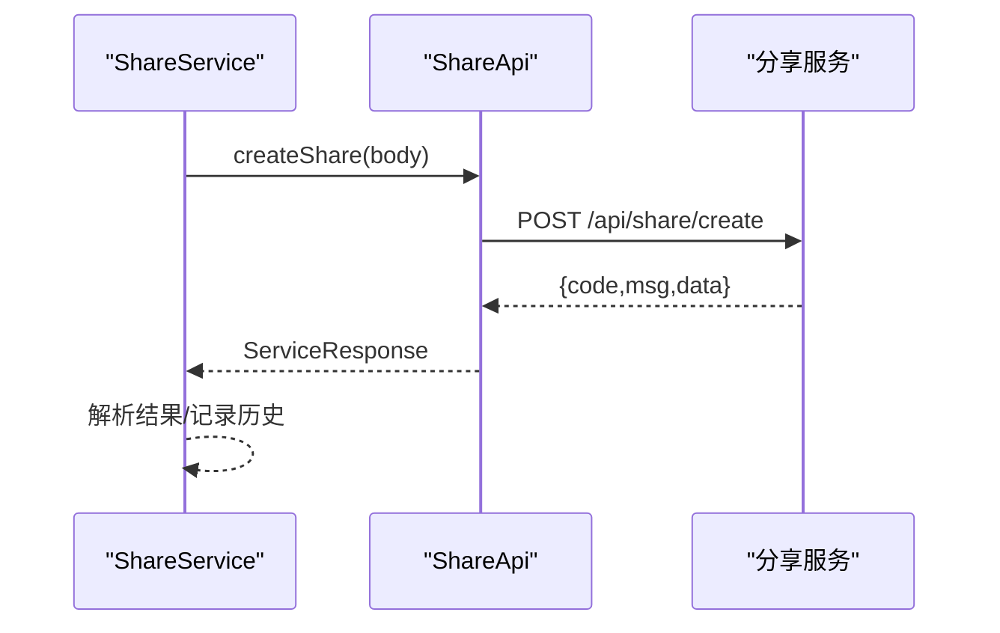
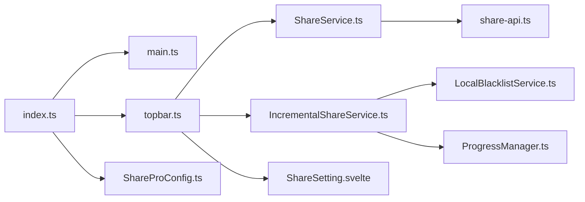

# 架构设计

<cite>
**本文引用的文件**
- [package.json](file://package.json)
- [plugin.json](file://plugin.json)
- [src/index.ts](file://src/index.ts)
- [src/main.ts](file://src/main.ts)
- [src/topbar.ts](file://src/topbar.ts)
- [src/statusBar.ts](file://src/statusBar.ts)
- [src/models/ShareProConfig.ts](file://src/models/ShareProConfig.ts)
- [src/api/share-api.ts](file://src/api/share-api.ts)
- [src/service/ShareService.ts](file://src/service/ShareService.ts)
- [src/service/IncrementalShareService.ts](file://src/service/IncrementalShareService.ts)
- [src/service/LocalBlacklistService.ts](file://src/service/LocalBlacklistService.ts)
- [src/service/SettingService.ts](file://src/service/SettingService.ts)
- [src/utils/progress/ProgressManager.ts](file://src/utils/progress/ProgressManager.ts)
- [src/libs/pages/ShareSetting.svelte](file://src/libs/pages/ShareSetting.svelte)
- [README.md](file://README.md)
</cite>

## 目录
1. [简介](#简介)
2. [项目结构](#项目结构)
3. [核心组件](#核心组件)
4. [架构总览](#架构总览)
5. [详细组件分析](#详细组件分析)
6. [依赖关系分析](#依赖关系分析)
7. [性能考量](#性能考量)
8. [故障排查指南](#故障排查指南)
9. [结论](#结论)
10. [附录](#附录)

## 简介
本文件为“思源笔记分享专业版”项目的架构设计文档，面向产品与工程团队，系统化阐述系统的高层设计、架构模式、模块化与分层结构、组件交互关系、服务层与事件驱动设计、数据流与集成模式、技术决策与权衡、基础设施与可扩展性、部署拓扑以及安全、监控与灾备等横切关注点。文档同时记录技术栈、第三方依赖与版本兼容性，帮助读者快速理解并高效参与开发与运维。

## 项目结构
项目采用前端插件与服务端接口协同的架构，核心由插件入口、UI 控制器、服务层、API 封装、工具与进度管理、配置模型等组成。整体遵循“插件入口 -> UI 控制器 -> 服务层 -> API 封装”的分层设计，配合增量分享与黑名单等特性形成完整的分享能力闭环。

图表来源
- [src/index.ts:33-178](file://src/index.ts#L33-L178)
- [src/main.ts:12-34](file://src/main.ts#L12-L34)
- [src/topbar.ts:26-297](file://src/topbar.ts#L26-L297)
- [src/statusBar.ts:12-32](file://src/statusBar.ts#L12-L32)
- [src/service/ShareService.ts:40-1195](file://src/service/ShareService.ts#L40-L1195)
- [src/service/IncrementalShareService.ts:98-690](file://src/service/IncrementalShareService.ts#L98-L690)
- [src/service/LocalBlacklistService.ts:31-658](file://src/service/LocalBlacklistService.ts#L31-L658)
- [src/service/SettingService.ts:18-39](file://src/service/SettingService.ts#L18-L39)
- [src/api/share-api.ts:16-240](file://src/api/share-api.ts#L16-L240)
- [src/models/ShareProConfig.ts:13-40](file://src/models/ShareProConfig.ts#L13-L40)
- [src/libs/pages/ShareSetting.svelte:10-119](file://src/libs/pages/ShareSetting.svelte#L10-L119)
- [src/utils/progress/ProgressManager.ts:8-238](file://src/utils/progress/ProgressManager.ts#L8-L238)

章节来源
- [src/index.ts:33-178](file://src/index.ts#L33-L178)
- [src/main.ts:12-34](file://src/main.ts#L12-L34)
- [src/topbar.ts:26-297](file://src/topbar.ts#L26-L297)
- [src/statusBar.ts:12-32](file://src/statusBar.ts#L12-L32)
- [src/models/ShareProConfig.ts:13-40](file://src/models/ShareProConfig.ts#L13-L40)
- [src/api/share-api.ts:16-240](file://src/api/share-api.ts#L16-L240)
- [src/service/ShareService.ts:40-1195](file://src/service/ShareService.ts#L40-L1195)
- [src/service/IncrementalShareService.ts:98-690](file://src/service/IncrementalShareService.ts#L98-L690)
- [src/service/LocalBlacklistService.ts:31-658](file://src/service/LocalBlacklistService.ts#L31-L658)
- [src/service/SettingService.ts:18-39](file://src/service/SettingService.ts#L18-L39)
- [src/utils/progress/ProgressManager.ts:8-238](file://src/utils/progress/ProgressManager.ts#L8-L238)
- [src/libs/pages/ShareSetting.svelte:10-119](file://src/libs/pages/ShareSetting.svelte#L10-L119)

## 核心组件
- 插件入口与生命周期
  - 插件类负责加载默认配置、初始化状态栏、实例化服务与控制器，并在 onload/onunload 生命周期中完成资源管理。
- 顶部栏控制器
  - 负责渲染顶部按钮、菜单、右键设置入口，以及增量分享 UI 的弹窗展示。
- 分享服务
  - 统一的分享入口，负责文档聚合、内容预处理、媒体资源处理、历史记录维护与进度上报。
- 增量分享服务
  - 支持变更检测、并发控制、队列管理、智能重试与黑名单过滤，保障大规模文档增量同步的稳定性。
- 黑名单服务
  - 提供笔记本与文档两级黑名单管理，支持分页查询、批量检查与动态同步。
- 设置服务
  - 提供配置同步与读取能力，支撑应用配置在本地与服务端之间的一致性。
- API 封装
  - 对外服务接口进行统一封装，屏蔽底层网络细节，提供清晰的业务方法。
- 配置模型
  - 描述插件配置、服务端 API 地址与令牌、应用配置等关键参数。
- 进度管理
  - 提供批量任务进度跟踪、资源处理事件监听与完成态判定，支撑 UI 与日志反馈。

章节来源
- [src/index.ts:33-178](file://src/index.ts#L33-L178)
- [src/topbar.ts:26-297](file://src/topbar.ts#L26-L297)
- [src/service/ShareService.ts:40-1195](file://src/service/ShareService.ts#L40-L1195)
- [src/service/IncrementalShareService.ts:98-690](file://src/service/IncrementalShareService.ts#L98-L690)
- [src/service/LocalBlacklistService.ts:31-658](file://src/service/LocalBlacklistService.ts#L31-L658)
- [src/service/SettingService.ts:18-39](file://src/service/SettingService.ts#L18-L39)
- [src/api/share-api.ts:16-240](file://src/api/share-api.ts#L16-L240)
- [src/models/ShareProConfig.ts:13-40](file://src/models/ShareProConfig.ts#L13-L40)
- [src/utils/progress/ProgressManager.ts:8-238](file://src/utils/progress/ProgressManager.ts#L8-L238)

## 架构总览
系统采用“插件入口 -> UI 控制器 -> 服务层 -> API 封装 -> 外部服务”的分层架构，结合事件驱动与进度管理，实现从单文档到多文档、从增量到批量的完整分享流程。UI 通过 Svelte 组件化实现，服务层通过 TypeScript 类封装业务逻辑，API 层对服务端接口进行统一封装，配置模型贯穿全局。

图表来源
- [src/topbar.ts:26-297](file://src/topbar.ts#L26-L297)
- [src/service/ShareService.ts:40-1195](file://src/service/ShareService.ts#L40-L1195)
- [src/service/IncrementalShareService.ts:98-690](file://src/service/IncrementalShareService.ts#L98-L690)
- [src/service/LocalBlacklistService.ts:31-658](file://src/service/LocalBlacklistService.ts#L31-L658)
- [src/api/share-api.ts:16-240](file://src/api/share-api.ts#L16-L240)
- [src/libs/pages/ShareSetting.svelte:10-119](file://src/libs/pages/ShareSetting.svelte#L10-L119)
- [src/utils/progress/ProgressManager.ts:8-238](file://src/utils/progress/ProgressManager.ts#L8-L238)
- [src/models/ShareProConfig.ts:13-40](file://src/models/ShareProConfig.ts#L13-L40)

## 详细组件分析

### 插件入口与主控制器
- 插件入口负责：
  - 初始化日志、前端环境识别、状态栏、服务实例化与默认配置加载。
  - 提供设置对话框打开、增量分享 UI 触发等公共接口。
- 主控制器负责：
  - 启动顶部栏初始化与增量分享 UI 展示。

图表来源
- [src/index.ts:33-178](file://src/index.ts#L33-L178)
- [src/main.ts:12-34](file://src/main.ts#L12-L34)
- [src/topbar.ts:26-297](file://src/topbar.ts#L26-L297)

章节来源
- [src/index.ts:33-178](file://src/index.ts#L33-L178)
- [src/main.ts:12-34](file://src/main.ts#L12-L34)

### 顶部栏控制器与设置页面
- 顶部栏控制器：
  - 注册顶部按钮与右键菜单，根据 VIP 信息与文档状态动态呈现菜单项。
  - 支持菜单项：开始/取消分享、重新分享、查看文章、增量分享、分享管理、设置等。
  - 支持增量分享 UI 的弹窗展示。
- 设置页面：
  - 基于 Svelte 的多标签页设置界面，包含基础、自定义、文档、SEO、增量分享、黑名单管理等标签。

图表来源
- [src/topbar.ts:26-297](file://src/topbar.ts#L26-L297)
- [src/index.ts:73-95](file://src/index.ts#L73-L95)
- [src/libs/pages/ShareSetting.svelte:10-119](file://src/libs/pages/ShareSetting.svelte#L10-L119)

章节来源
- [src/topbar.ts:26-297](file://src/topbar.ts#L26-L297)
- [src/libs/pages/ShareSetting.svelte:10-119](file://src/libs/pages/ShareSetting.svelte#L10-L119)

### 分享服务（MVC 与服务层）
- MVC 角色划分：
  - Model：配置模型、历史记录模型、服务响应模型。
  - View：Svelte 页面组件（设置、增量分享 UI）。
  - Controller：顶部栏控制器与服务层协调。
- 服务层职责：
  - 文档聚合：支持主文档 + 子文档 + 引用文档的扁平化聚合。
  - 内容预处理：嵌入块、数据视图、折叠块等处理。
  - 媒体资源处理：图片与数据视图媒体的分批上传与进度上报。
  - 历史记录：本地历史记录与缓存管理。
  - 进度管理：通过事件驱动与进度管理器上报状态。

图表来源
- [src/service/ShareService.ts:101-226](file://src/service/ShareService.ts#L101-L226)
- [src/service/ShareService.ts:531-674](file://src/service/ShareService.ts#L531-L674)
- [src/service/ShareService.ts:676-800](file://src/service/ShareService.ts#L676-L800)
- [src/utils/progress/ProgressManager.ts:8-238](file://src/utils/progress/ProgressManager.ts#L8-L238)

章节来源
- [src/service/ShareService.ts:40-1195](file://src/service/ShareService.ts#L40-L1195)
- [src/utils/progress/ProgressManager.ts:8-238](file://src/utils/progress/ProgressManager.ts#L8-L238)

### 增量分享服务（事件驱动与队列）
- 变更检测：
  - 分页扫描文档，基于本地历史与缓存进行变更检测，Web Worker 加速。
- 并发与队列：
  - 并发控制（默认 5），队列管理（创建/启动/暂停/完成），任务状态跟踪。
- 智能重试：
  - 网络错误指数退避；5xx 错误延迟重试；4xx 错误立即失败并记录。
- 黑名单过滤：
  - 分页检查黑名单，跳过在黑名单中的文档。
- 最后分享时间同步：
  - 成功分享后更新配置并同步至服务端。

图表来源
- [src/service/IncrementalShareService.ts:269-351](file://src/service/IncrementalShareService.ts#L269-L351)
- [src/service/IncrementalShareService.ts:396-577](file://src/service/IncrementalShareService.ts#L396-L577)
- [src/service/IncrementalShareService.ts:585-659](file://src/service/IncrementalShareService.ts#L585-L659)
- [src/service/LocalBlacklistService.ts:221-249](file://src/service/LocalBlacklistService.ts#L221-L249)

章节来源
- [src/service/IncrementalShareService.ts:98-690](file://src/service/IncrementalShareService.ts#L98-L690)
- [src/service/LocalBlacklistService.ts:31-658](file://src/service/LocalBlacklistService.ts#L31-L658)

### 黑名单服务（本地持久化与查询）
- 存储策略：
  - 笔记本黑名单：存储于插件配置的 appConfig 中。
  - 文档黑名单：存储于文档属性中，避免属性爆炸。
- 查询与分页：
  - 支持笔记本/文档/全部类型分页查询、关键词搜索、批量检查。
- 动态同步：
  - 修改后同步至服务端配置，保持一致性。

图表来源
- [src/service/LocalBlacklistService.ts:31-658](file://src/service/LocalBlacklistService.ts#L31-L658)

章节来源
- [src/service/LocalBlacklistService.ts:31-658](file://src/service/LocalBlacklistService.ts#L31-L658)

### API 封装与外部服务集成
- API 封装：
  - 统一封装分享、媒体上传、设置、黑名单、历史等接口，自动注入令牌与配置。
- 外部服务：
  - 通过服务端 API 端点进行授权、分享、取消、列表、设置同步等操作。

图表来源
- [src/service/ShareService.ts:46-60](file://src/service/ShareService.ts#L46-L60)
- [src/api/share-api.ts:46-50](file://src/api/share-api.ts#L46-L50)
- [src/api/share-api.ts:173-209](file://src/api/share-api.ts#L173-L209)

章节来源
- [src/api/share-api.ts:16-240](file://src/api/share-api.ts#L16-L240)
- [src/service/ShareService.ts:40-1195](file://src/service/ShareService.ts#L40-L1195)

### 配置模型与状态栏
- 配置模型：
  - 包含思源配置、服务端 API 配置、应用配置（含增量分享配置）、是否启用新 UI 等。
- 状态栏：
  - 初始化状态栏元素，提供状态文本更新能力。

章节来源
- [src/models/ShareProConfig.ts:13-40](file://src/models/ShareProConfig.ts#L13-L40)
- [src/statusBar.ts:12-32](file://src/statusBar.ts#L12-L32)

## 依赖关系分析
- 组件耦合与内聚
  - 插件入口与主控制器低耦合，通过依赖注入方式提供服务实例。
  - 服务层高内聚，围绕分享与增量分享两大核心域组织。
  - API 封装与服务层弱耦合，通过接口契约解耦外部服务。
- 外部依赖
  - 思源内核 API、第三方分享服务、Svelte UI 框架、事件驱动库等。
- 潜在循环依赖
  - 未发现直接循环依赖；服务间通过接口与事件通信避免环状引用。

图表来源
- [src/index.ts:33-178](file://src/index.ts#L33-L178)
- [src/main.ts:12-34](file://src/main.ts#L12-L34)
- [src/topbar.ts:26-297](file://src/topbar.ts#L26-L297)
- [src/service/ShareService.ts:40-1195](file://src/service/ShareService.ts#L40-L1195)
- [src/service/IncrementalShareService.ts:98-690](file://src/service/IncrementalShareService.ts#L98-L690)
- [src/service/LocalBlacklistService.ts:31-658](file://src/service/LocalBlacklistService.ts#L31-L658)
- [src/api/share-api.ts:16-240](file://src/api/share-api.ts#L16-L240)
- [src/models/ShareProConfig.ts:13-40](file://src/models/ShareProConfig.ts#L13-L40)
- [src/libs/pages/ShareSetting.svelte:10-119](file://src/libs/pages/ShareSetting.svelte#L10-L119)
- [src/utils/progress/ProgressManager.ts:8-238](file://src/utils/progress/ProgressManager.ts#L8-L238)

章节来源
- [src/index.ts:33-178](file://src/index.ts#L33-L178)
- [src/topbar.ts:26-297](file://src/topbar.ts#L26-L297)
- [src/service/ShareService.ts:40-1195](file://src/service/ShareService.ts#L40-L1195)
- [src/service/IncrementalShareService.ts:98-690](file://src/service/IncrementalShareService.ts#L98-L690)
- [src/service/LocalBlacklistService.ts:31-658](file://src/service/LocalBlacklistService.ts#L31-L658)
- [src/api/share-api.ts:16-240](file://src/api/share-api.ts#L16-L240)
- [src/models/ShareProConfig.ts:13-40](file://src/models/ShareProConfig.ts#L13-L40)
- [src/libs/pages/ShareSetting.svelte:10-119](file://src/libs/pages/ShareSetting.svelte#L10-L119)
- [src/utils/progress/ProgressManager.ts:8-238](file://src/utils/progress/ProgressManager.ts#L8-L238)

## 性能考量
- 并发与限流
  - 增量分享默认并发 5，避免对服务端与本地资源造成过大压力。
- 分页与缓存
  - 子文档与黑名单检查采用分页，减少一次性查询压力；本地历史记录与缓存降低重复查询成本。
- 媒体资源处理
  - 媒体分批上传，减少单次请求体积；事件驱动上报资源处理进度。
- 变更检测
  - Web Worker 加速变更检测，降低主线程阻塞。
- 配置与网络
  - 配置懒加载与缓存，减少频繁 IO；服务端请求统一注入令牌，避免重复鉴权。

## 故障排查指南
- 常见问题定位
  - 分享失败：查看服务端返回码与消息，结合本地历史记录定位具体文档。
  - 媒体上传失败：检查网络与服务端可用性，关注分批上传的错误日志。
  - 增量分享中断：检查队列状态、暂停标志与黑名单过滤结果。
- 日志与监控
  - 使用统一日志器输出关键路径日志；进度管理器提供批量任务状态与错误汇总。
- 重试策略
  - 网络错误指数退避；5xx 错误延迟重试；4xx 错误立即失败并记录。

章节来源
- [src/service/ShareService.ts:253-258](file://src/service/ShareService.ts#L253-L258)
- [src/service/IncrementalShareService.ts:585-659](file://src/service/IncrementalShareService.ts#L585-L659)
- [src/utils/progress/ProgressManager.ts:8-238](file://src/utils/progress/ProgressManager.ts#L8-L238)

## 结论
本项目通过清晰的分层架构与服务化设计，实现了从单文档到多文档、从增量到批量的完整分享能力。结合事件驱动、进度管理、智能重试与黑名单过滤，系统在复杂场景下具备良好的稳定性与可维护性。建议持续优化变更检测算法、增强监控告警与灾备策略，以进一步提升用户体验与系统韧性。

## 附录

### 技术栈与版本兼容性
- 前端框架与构建
  - Svelte 4.x、Vite、TypeScript、Stylus
- 思源插件生态
  - siyuan 插件 API、Svelte 插件组件
- 第三方依赖
  - zhi-siyuan-api、zhi-blog-api、zhi-lib-base、eventemitter3、cheerio、copy-to-clipboard 等
- 版本与包管理
  - pnpm 10.32.1、Node.js 与各依赖版本详见 package.json

章节来源
- [package.json:1-54](file://package.json#L1-L54)

### 插件元数据与发布信息
- 插件名称、作者、版本、适用平台、国际化与资金支持信息
- README 提供功能概览与许可证说明

章节来源
- [plugin.json:1-35](file://plugin.json#L1-L35)
- [README.md:1-21](file://README.md#L1-L21)