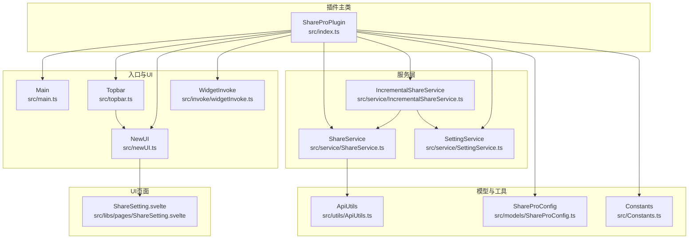
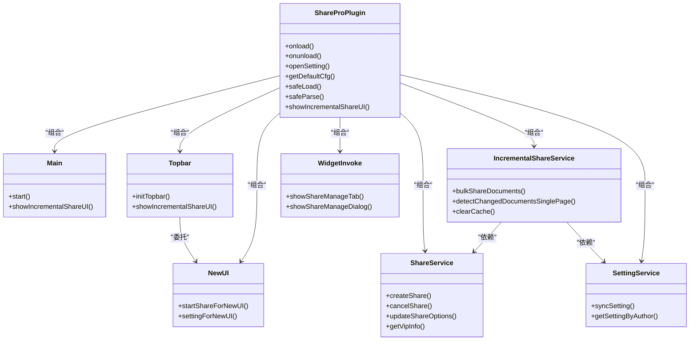
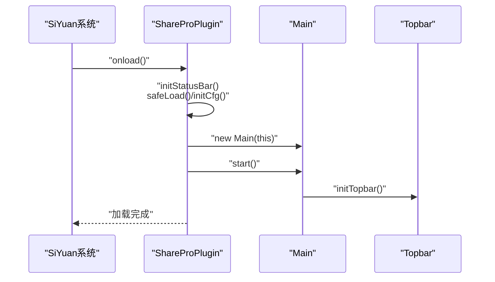
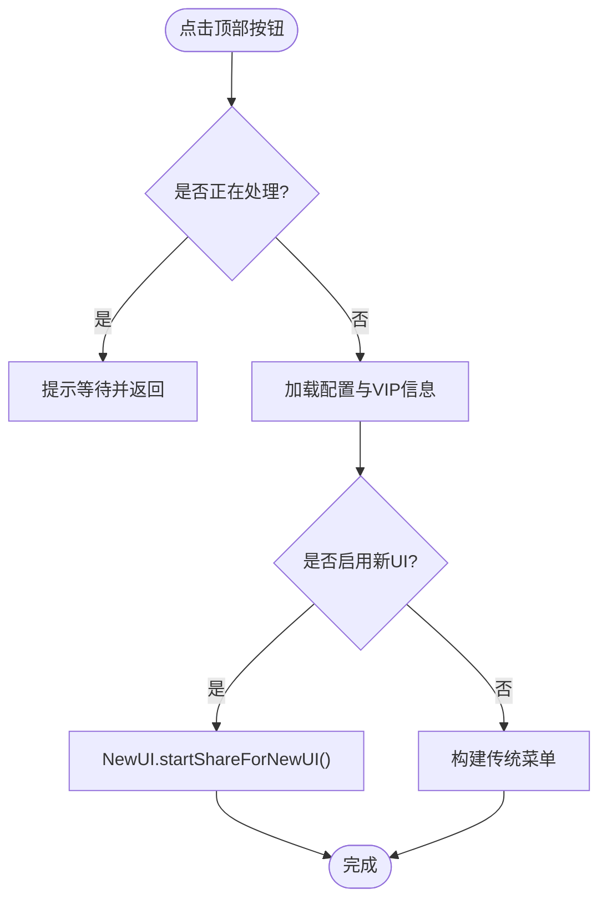
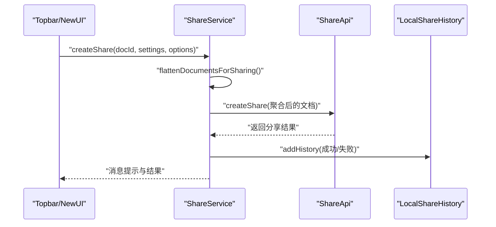
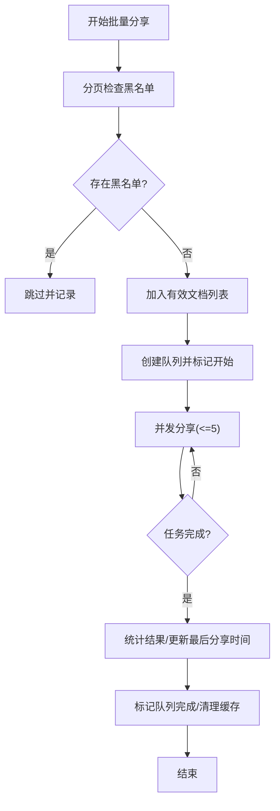
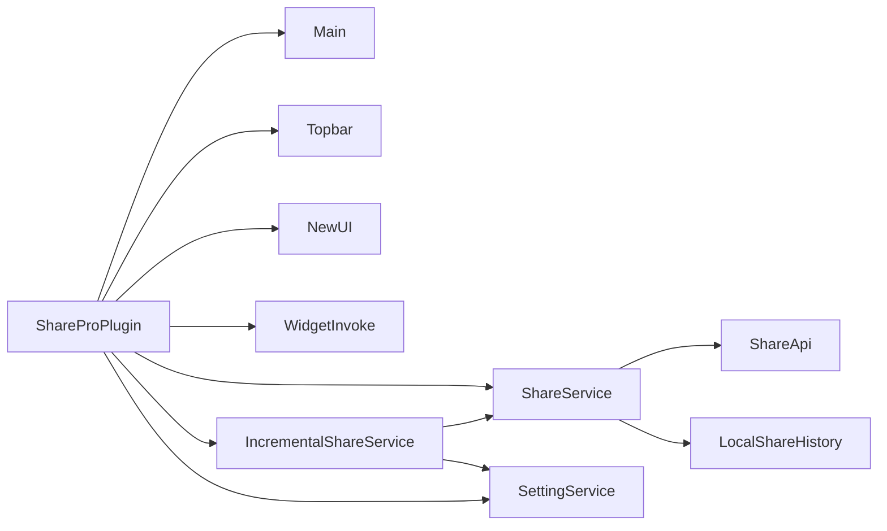

# 核心架构设计

<cite>
**本文引用的文件**   
- [src/index.ts](file://src/index.ts)
- [src/main.ts](file://src/main.ts)
- [src/topbar.ts](file://src/topbar.ts)
- [src/statusBar.ts](file://src/statusBar.ts)
- [src/newUI.ts](file://src/newUI.ts)
- [src/invoke/widgetInvoke.ts](file://src/invoke/widgetInvoke.ts)
- [src/service/ShareService.ts](file://src/service/ShareService.ts)
- [src/service/IncrementalShareService.ts](file://src/service/IncrementalShareService.ts)
- [src/service/SettingService.ts](file://src/service/SettingService.ts)
- [src/models/ShareProConfig.ts](file://src/models/ShareProConfig.ts)
- [src/utils/ApiUtils.ts](file://src/utils/ApiUtils.ts)
- [src/libs/pages/ShareSetting.svelte](file://src/libs/pages/ShareSetting.svelte)
- [plugin.json](file://plugin.json)
- [package.json](file://package.json)
- [src/Constants.ts](file://src/Constants.ts)
</cite>

## 目录
1. [引言](#引言)
2. [项目结构](#项目结构)
3. [核心组件](#核心组件)
4. [架构总览](#架构总览)
5. [详细组件分析](#详细组件分析)
6. [依赖分析](#依赖分析)
7. [性能考量](#性能考量)
8. [故障排查指南](#故障排查指南)
9. [结论](#结论)
10. [附录](#附录)

## 引言
本文件面向“思源笔记分享专业版”（Share Pro）插件，系统化梳理其核心架构设计与实现要点，重点覆盖以下主题：
- ShareProPlugin 主类的设计理念、生命周期管理与初始化流程
- 整体架构模式（MVC 思想的体现、模块化设计原则与组件间依赖关系）
- 启动流程、配置管理机制与资源加载策略
- 主入口文件的设计思路、全局状态管理与错误处理机制
- 插件与 SiYuan 笔记系统的集成方式、API 调用封装与事件处理机制
- 架构决策的技术背景、性能考虑与扩展性设计

## 项目结构
插件采用基于 TypeScript 与 Svelte 的前端架构，遵循“插件主类 + 服务层 + UI 层 + 工具与常量”的分层组织方式。核心入口为插件主类，负责生命周期与顶层协调；服务层封装业务能力；UI 层通过 Svelte 组件提供交互；工具与常量模块提供通用能力与配置。

图表来源
- [src/index.ts:33-178](file://src/index.ts#L33-L178)
- [src/main.ts:12-34](file://src/main.ts#L12-L34)
- [src/topbar.ts:26-297](file://src/topbar.ts#L26-L297)
- [src/newUI.ts:35-233](file://src/newUI.ts#L35-L233)
- [src/invoke/widgetInvoke.ts:17-80](file://src/invoke/widgetInvoke.ts#L17-L80)
- [src/service/ShareService.ts:40-800](file://src/service/ShareService.ts#L40-L800)
- [src/service/IncrementalShareService.ts:98-690](file://src/service/IncrementalShareService.ts#L98-L690)
- [src/service/SettingService.ts:18-39](file://src/service/SettingService.ts#L18-L39)
- [src/models/ShareProConfig.ts:13-40](file://src/models/ShareProConfig.ts#L13-L40)
- [src/utils/ApiUtils.ts:15-27](file://src/utils/ApiUtils.ts#L15-L27)
- [src/libs/pages/ShareSetting.svelte:10-119](file://src/libs/pages/ShareSetting.svelte#L10-L119)

章节来源
- [src/index.ts:33-178](file://src/index.ts#L33-L178)
- [src/main.ts:12-34](file://src/main.ts#L12-L34)
- [src/topbar.ts:26-297](file://src/topbar.ts#L26-L297)
- [src/newUI.ts:35-233](file://src/newUI.ts#L35-L233)
- [src/invoke/widgetInvoke.ts:17-80](file://src/invoke/widgetInvoke.ts#L17-L80)
- [src/service/ShareService.ts:40-800](file://src/service/ShareService.ts#L40-L800)
- [src/service/IncrementalShareService.ts:98-690](file://src/service/IncrementalShareService.ts#L98-L690)
- [src/service/SettingService.ts:18-39](file://src/service/SettingService.ts#L18-L39)
- [src/models/ShareProConfig.ts:13-40](file://src/models/ShareProConfig.ts#L13-L40)
- [src/utils/ApiUtils.ts:15-27](file://src/utils/ApiUtils.ts#L15-L27)
- [src/libs/pages/ShareSetting.svelte:10-119](file://src/libs/pages/ShareSetting.svelte#L10-L119)

## 核心组件
- ShareProPlugin：插件主类，继承自 SiYuan 插件基类，负责生命周期、配置加载、服务实例化与 UI 启动。
- Main：顶层入口协调器，负责初始化顶部栏 UI 并暴露增量分享入口。
- Topbar/NewUI：顶部栏与新版 UI 的承载者，负责菜单构建、上下文交互与对话框/面板渲染。
- ShareService：分享核心服务，封装文档获取、内容处理、媒体资源处理、历史记录与进度管理。
- IncrementalShareService：增量分享服务，负责变更检测、队列管理、并发控制与智能重试。
- SettingService：设置同步与读取服务，对接远端配置。
- ShareProConfig：插件配置模型，统一承载 SiYuan 与服务端配置。
- ApiUtils：统一获取 SiYuan Kernel/Blog API 的工具。
- WidgetInvoke：打开分享管理面板/对话框的调用器。
- Constants：全局常量与环境开关。
- ShareSetting.svelte：设置页 Svelte 页面，组合多个设置子页面。

章节来源
- [src/index.ts:33-178](file://src/index.ts#L33-L178)
- [src/main.ts:12-34](file://src/main.ts#L12-L34)
- [src/topbar.ts:26-297](file://src/topbar.ts#L26-L297)
- [src/newUI.ts:35-233](file://src/newUI.ts#L35-L233)
- [src/service/ShareService.ts:40-800](file://src/service/ShareService.ts#L40-L800)
- [src/service/IncrementalShareService.ts:98-690](file://src/service/IncrementalShareService.ts#L98-L690)
- [src/service/SettingService.ts:18-39](file://src/service/SettingService.ts#L18-L39)
- [src/models/ShareProConfig.ts:13-40](file://src/models/ShareProConfig.ts#L13-L40)
- [src/utils/ApiUtils.ts:15-27](file://src/utils/ApiUtils.ts#L15-L27)
- [src/invoke/widgetInvoke.ts:17-80](file://src/invoke/widgetInvoke.ts#L17-L80)
- [src/libs/pages/ShareSetting.svelte:10-119](file://src/libs/pages/ShareSetting.svelte#L10-L119)
- [src/Constants.ts:10-20](file://src/Constants.ts#L10-L20)

## 架构总览
插件采用“插件主类 + 服务层 + UI 层”的分层架构，结合 MVC 思想：
- Model：ShareProConfig、服务 DTO 与历史记录类型
- View：Svelte 组件（Topbar/NewUI/Setting 等）
- Controller：ShareProPlugin、Main、Topbar、NewUI、WidgetInvoke
- Service：ShareService、IncrementalShareService、SettingService

图表来源
- [src/index.ts:33-178](file://src/index.ts#L33-L178)
- [src/main.ts:12-34](file://src/main.ts#L12-L34)
- [src/topbar.ts:26-297](file://src/topbar.ts#L26-L297)
- [src/newUI.ts:35-233](file://src/newUI.ts#L35-L233)
- [src/invoke/widgetInvoke.ts:17-80](file://src/invoke/widgetInvoke.ts#L17-L80)
- [src/service/ShareService.ts:40-800](file://src/service/ShareService.ts#L40-L800)
- [src/service/IncrementalShareService.ts:98-690](file://src/service/IncrementalShareService.ts#L98-L690)
- [src/service/SettingService.ts:18-39](file://src/service/SettingService.ts#L18-L39)

## 详细组件分析

### ShareProPlugin 主类与生命周期
- 设计理念
  - 以“插件主类”为中心，集中管理配置、服务实例与 UI 启动，降低耦合，提升可测试性与可维护性。
  - 通过服务层抽象业务细节，UI 层专注展示与交互，符合 MVC 思想。
- 生命周期
  - onload：初始化状态栏、加载/初始化配置、启动 Main，随后输出加载日志。
  - onunload：输出卸载日志。
  - openSetting：安全加载配置并拉取 VIP 信息，弹出设置对话框并挂载 ShareSetting.svelte。
- 配置管理
  - getDefaultCfg：根据开发/生产环境选择服务端地址，填充默认 SiYuan 与服务端配置。
  - safeLoad：从本地存储安全加载配置，异常时回退默认值。
  - initCfg：首次加载时写入 inited 标记；开发模式下自动修正服务端地址。
- 错误处理
  - openSetting 中捕获异常并提示，避免崩溃；服务层内部对单文档/多文档分别处理并记录历史。

图表来源
- [src/index.ts:61-71](file://src/index.ts#L61-L71)
- [src/index.ts:150-169](file://src/index.ts#L150-L169)
- [src/main.ts:21-23](file://src/main.ts#L21-L23)
- [src/topbar.ts:41-98](file://src/topbar.ts#L41-L98)

章节来源
- [src/index.ts:33-178](file://src/index.ts#L33-L178)
- [src/statusBar.ts:12-32](file://src/statusBar.ts#L12-L32)

### Main 顶层入口协调器
- 职责
  - 保存 ShareProPlugin 实例与 Topbar 实例
  - 提供 start 启动顶部栏 UI
  - 提供 showIncrementalShareUI 便捷入口
- 设计要点
  - 保持最小职责，避免直接耦合具体 UI 细节，通过 Topbar 解耦。

章节来源
- [src/main.ts:12-34](file://src/main.ts#L12-L34)

### Topbar 顶部栏与菜单
- 职责
  - 注册顶部按钮，绑定点击与右键菜单事件
  - 根据配置决定使用新 UI 或传统菜单
  - 拉取 VIP 信息与文档分享状态，动态构建菜单项
  - 支持增量分享对话框与分享管理面板
- 锁机制
  - 使用 lock/contextLock 防止重复请求导致的状态混乱
- UI 适配
  - 根据 isMobile 选择全屏菜单或定位菜单

图表来源
- [src/topbar.ts:41-98](file://src/topbar.ts#L41-L98)
- [src/topbar.ts:113-259](file://src/topbar.ts#L113-L259)
- [src/newUI.ts:53-122](file://src/newUI.ts#L53-L122)

章节来源
- [src/topbar.ts:26-297](file://src/topbar.ts#L26-L297)
- [src/newUI.ts:35-233](file://src/newUI.ts#L35-L233)

### ShareService 分享核心服务
- 职责
  - 统一分享入口 createShare：支持单文档与多文档（子文档/引用文档）聚合
  - 统一取消入口 cancelShare：支持单/多文档取消
  - 文档内容处理：嵌入块、数据视图、折叠块、大纲/文档树
  - 媒体资源处理：图片等资源的分组上传与异步处理
  - 历史记录与进度：本地历史、缓存与进度管理
- 关键流程
  - flattenDocumentsForSharing：聚合主文档与子/引用文档，支持分页与数量限制
  - handleOne：单文档分享主流程，含错误处理与历史记录落盘
  - processAllMediaResources：媒体资源分批处理，保证顺序与稳定性

图表来源
- [src/service/ShareService.ts:235-258](file://src/service/ShareService.ts#L235-L258)
- [src/service/ShareService.ts:587-730](file://src/service/ShareService.ts#L587-L730)
- [src/service/ShareService.ts:732-800](file://src/service/ShareService.ts#L732-L800)

章节来源
- [src/service/ShareService.ts:40-800](file://src/service/ShareService.ts#L40-L800)

### IncrementalShareService 增量分享服务
- 职责
  - 变更检测：单页检测新增/更新文档，支持缓存与进度日志
  - 批量分享：并发控制（默认 5）、队列管理、任务状态更新
  - 智能重试：网络错误指数退避、5xx 延迟重试、4xx 直接失败
  - 黑名单过滤：分页检查黑名单，避免对无效文档发起请求
- 关键流程
  - detectChangedDocumentsSinglePage：单页变更检测，返回新增/更新集合
  - bulkShareDocuments：创建队列、并发分享、统计结果、更新最后分享时间
  - shareDocumentWithRetry：带重试策略的单文档分享

图表来源
- [src/service/IncrementalShareService.ts:268-351](file://src/service/IncrementalShareService.ts#L268-L351)
- [src/service/IncrementalShareService.ts:396-474](file://src/service/IncrementalShareService.ts#L396-L474)
- [src/service/IncrementalShareService.ts:479-577](file://src/service/IncrementalShareService.ts#L479-L577)
- [src/service/IncrementalShareService.ts:585-659](file://src/service/IncrementalShareService.ts#L585-L659)

章节来源
- [src/service/IncrementalShareService.ts:98-690](file://src/service/IncrementalShareService.ts#L98-L690)

### SettingService 设置服务
- 职责
  - 同步作者设置至服务端
  - 按作者查询设置
- 作用
  - 与 IncrementalShareService 协作，实现应用配置的云端同步与恢复

章节来源
- [src/service/SettingService.ts:18-39](file://src/service/SettingService.ts#L18-L39)

### ShareProConfig 配置模型
- 结构
  - siyuanConfig：SiYuan API 地址、Token、Cookie 与偏好配置
  - serviceApiConfig：服务端 API 地址、Token
  - appConfig：应用级配置（含增量分享、文档树、大纲等）
  - isCustomCssEnabled、isNewUIEnabled：功能开关
  - inited：初始化标记
- 用途
  - 作为统一配置载体，贯穿 ShareService、IncrementalShareService、UI 层

章节来源
- [src/models/ShareProConfig.ts:13-40](file://src/models/ShareProConfig.ts#L13-L40)

### ApiUtils 与 Constants
- ApiUtils
  - 提供统一获取 SiYuan Kernel/Blog API 的静态方法，便于服务层复用
- Constants
  - 定义默认语言、开发模式、默认 API 地址、存储键名、端点与分页常量

章节来源
- [src/utils/ApiUtils.ts:15-27](file://src/utils/ApiUtils.ts#L15-L27)
- [src/Constants.ts:10-20](file://src/Constants.ts#L10-L20)

### UI 页面与交互
- ShareSetting.svelte
  - 动态构建多个设置标签页（基础、自定义、文档、SEO、增量分享、黑名单）
  - 通过 onMount 初始化并挂载对应子组件
- NewUI
  - 在有 VIP 时直接挂载 ShareUI，否则引导授权或设置
  - 右键菜单进入设置页或分享管理
- WidgetInvoke
  - 打开分享管理 Tab 或 Dialog，支持重新挂载 Svelte 组件

章节来源
- [src/libs/pages/ShareSetting.svelte:10-119](file://src/libs/pages/ShareSetting.svelte#L10-L119)
- [src/newUI.ts:53-183](file://src/newUI.ts#L53-L183)
- [src/invoke/widgetInvoke.ts:26-76](file://src/invoke/widgetInvoke.ts#L26-L76)

## 依赖分析
- 组件耦合
  - ShareProPlugin 对 Main、Topbar、NewUI、WidgetInvoke、ShareService、IncrementalShareService、SettingService 具备组合关系
  - IncrementalShareService 依赖 ShareService 与 SettingService
  - ShareService 依赖 ShareApi、本地历史与进度管理
- 外部依赖
  - SiYuan 插件框架（Plugin 基类、Dialog、Menu、openTab 等）
  - zhi-* 生态（zhi-lib-base、zhi-siyuan-api、zhi-blog-api）
  - Svelte 生态（Svelte 组件与运行时）

图表来源
- [src/index.ts:33-178](file://src/index.ts#L33-L178)
- [src/service/IncrementalShareService.ts:98-690](file://src/service/IncrementalShareService.ts#L98-L690)
- [src/service/ShareService.ts:40-800](file://src/service/ShareService.ts#L40-L800)

章节来源
- [src/index.ts:33-178](file://src/index.ts#L33-L178)
- [src/service/IncrementalShareService.ts:98-690](file://src/service/IncrementalShareService.ts#L98-L690)
- [src/service/ShareService.ts:40-800](file://src/service/ShareService.ts#L40-L800)

## 性能考量
- 并发与限流
  - 增量分享默认并发 5，避免对服务端与本地资源造成过大压力
- 分页与数量限制
  - 子文档分页获取，支持最大 999 的数量上限与无限制模式
- 缓存与去重
  - 增量分享结果缓存（5 分钟），减少重复检测成本
  - 文档 ID 去重，避免重复处理
- 资源处理
  - 媒体资源分组上传（每组 5），降低请求开销
- UI 锁与防抖
  - 顶部栏与右键菜单锁，防止重复提交导致的资源浪费与状态错乱

章节来源
- [src/service/IncrementalShareService.ts:317-351](file://src/service/IncrementalShareService.ts#L317-L351)
- [src/service/IncrementalShareService.ts:174-190](file://src/service/IncrementalShareService.ts#L174-L190)
- [src/service/ShareService.ts:741-750](file://src/service/ShareService.ts#L741-L750)
- [src/topbar.ts:51-76](file://src/topbar.ts#L51-L76)

## 故障排查指南
- 配置加载失败
  - 现象：配置读取异常或为空
  - 处理：safeLoad 回退默认配置；检查本地存储键名与权限
- 分享失败
  - 单文档：记录失败历史并提示；检查 Token、VIP 状态与文档可见性
  - 多文档：通过进度管理查看失败明细，结合日志定位问题
- 增量分享无响应
  - 检查并发队列状态、是否处于暂停；确认黑名单过滤与缓存有效性
- UI 无法打开
  - 检查 isMobile 条件与菜单定位；确认 Svelte 组件挂载容器是否存在

章节来源
- [src/index.ts:126-148](file://src/index.ts#L126-L148)
- [src/service/ShareService.ts:692-730](file://src/service/ShareService.ts#L692-L730)
- [src/service/IncrementalShareService.ts:496-500](file://src/service/IncrementalShareService.ts#L496-L500)

## 结论
本插件以 ShareProPlugin 为核心，采用清晰的分层与模块化设计，结合 MVC 思想与服务化封装，实现了从配置管理、UI 交互到业务处理的完整闭环。通过并发控制、分页与缓存、智能重试与错误处理等手段，在保证用户体验的同时兼顾了性能与可维护性。未来可在以下方向持续演进：
- 更细粒度的配置隔离与热更新
- 更丰富的增量分享规则与可视化面板
- 与 SiYuan 生态更深入的集成（如工作区、标签等）

## 附录
- 插件元信息与依赖
  - plugin.json：声明插件名称、版本、兼容性与国际化资源
  - package.json：脚本、依赖与构建配置

章节来源
- [plugin.json:1-35](file://plugin.json#L1-L35)
- [package.json:1-54](file://package.json#L1-L54)