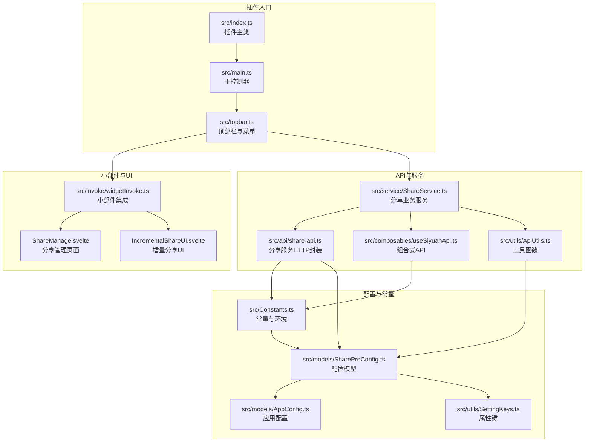
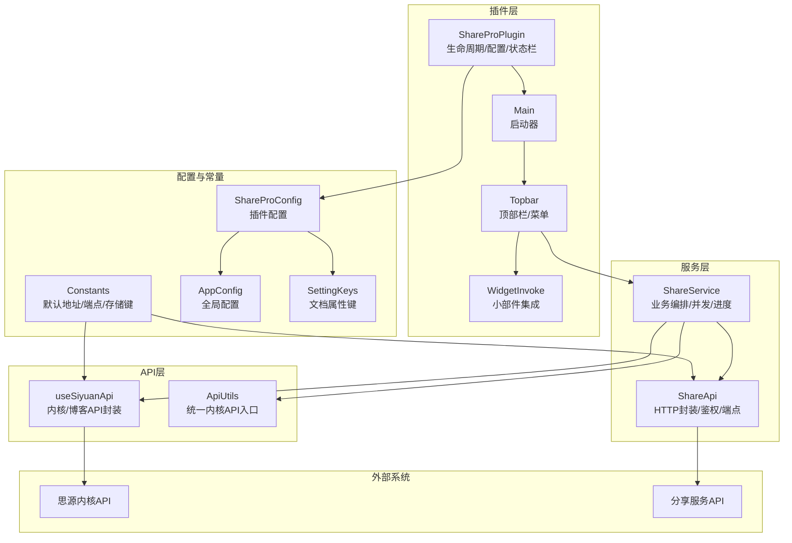
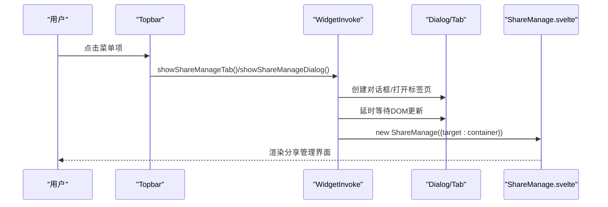
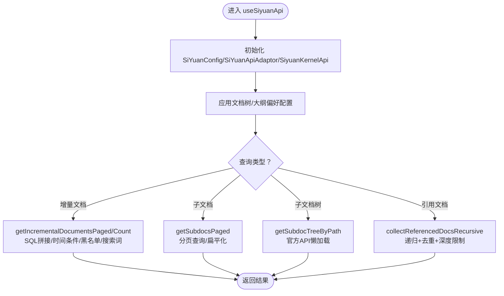
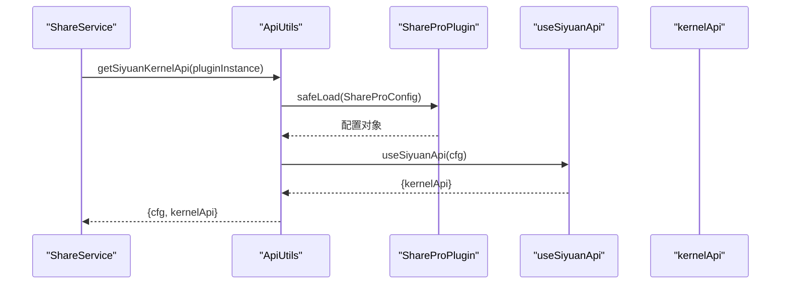
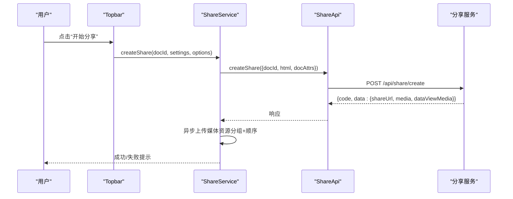
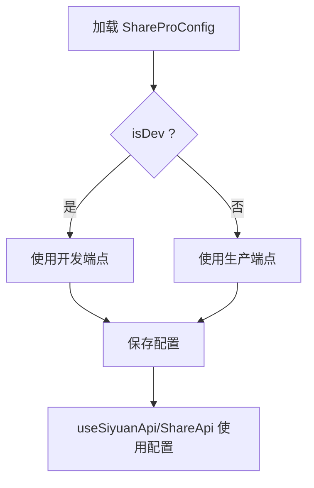
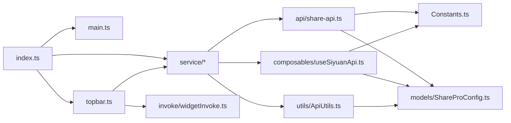

# 集成模式

<cite>
**本文引用的文件**   
- [src/index.ts](file://src/index.ts)
- [src/main.ts](file://src/main.ts)
- [src/invoke/widgetInvoke.ts](file://src/invoke/widgetInvoke.ts)
- [src/composables/useSiyuanApi.ts](file://src/composables/useSiyuanApi.ts)
- [src/utils/ApiUtils.ts](file://src/utils/ApiUtils.ts)
- [src/Constants.ts](file://src/Constants.ts)
- [src/models/ShareProConfig.ts](file://src/models/ShareProConfig.ts)
- [src/service/ShareService.ts](file://src/service/ShareService.ts)
- [src/api/share-api.ts](file://src/api/share-api.ts)
- [src/topbar.ts](file://src/topbar.ts)
- [plugin.json](file://plugin.json)
- [package.json](file://package.json)
- [src/utils/SettingKeys.ts](file://src/utils/SettingKeys.ts)
- [src/models/AppConfig.ts](file://src/models/AppConfig.ts)
- [src/types/index.d.ts](file://src/types/index.d.ts)
- [README.md](file://README.md)
</cite>

## 目录
1. [简介](#简介)
2. [项目结构](#项目结构)
3. [核心组件](#核心组件)
4. [架构总览](#架构总览)
5. [详细组件分析](#详细组件分析)
6. [依赖关系分析](#依赖关系分析)
7. [性能考量](#性能考量)
8. [故障排除指南](#故障排除指南)
9. [结论](#结论)
10. [附录](#附录)

## 简介
本文件面向“思源笔记分享专业版”插件的集成模式，系统化阐述插件与思源内核及外部分享服务的集成方式、API封装策略与调用协议，重点覆盖以下主题：
- 小部件集成模式（widgetInvoke）：如何在标签页与对话框中挂载 Svelte 组件，实现分享管理与增量分享 UI 的承载。
- 组合式 API 设计（useSiyuanApi）：对 zhi-siyuan-api 的统一封装，提供内核 API 与博客 API 的便捷访问，以及增量/子文档/引用文档的查询能力。
- 工具函数封装（ApiUtils）：统一获取内核 API 的入口，保障配置加载与 API 实例化的一致性。
- 常量与配置管理：默认 API 地址、鉴权令牌、Cookie、开发/生产环境端点、存储键名等集中管理。
- 环境变量与运行时配置切换：通过 Constants 中的 isDev 与服务端点常量，实现开发与生产的无缝切换。
- 插件与外部服务集成：分享服务的 HTTP 请求封装、鉴权头注入、响应解析与错误处理。
- 跨平台兼容性：桌面端、移动端与浏览器移动端的前端类型识别与 UI 适配。
- 测试与调试：集成测试建议、调试技巧与常见问题排查。

## 项目结构
插件采用“插件主类 + 主控制器 + 服务层 + 组合式 API + 工具类 + 常量与模型”的分层组织，配合 Svelte 页面组件实现 UI 层。

**图表来源**
- [src/index.ts:1-178](file://src/index.ts#L1-L178)
- [src/main.ts:1-34](file://src/main.ts#L1-L34)
- [src/topbar.ts:1-297](file://src/topbar.ts#L1-L297)
- [src/invoke/widgetInvoke.ts:1-80](file://src/invoke/widgetInvoke.ts#L1-L80)
- [src/composables/useSiyuanApi.ts:1-465](file://src/composables/useSiyuanApi.ts#L1-L465)
- [src/utils/ApiUtils.ts:1-27](file://src/utils/ApiUtils.ts#L1-L27)
- [src/api/share-api.ts:1-240](file://src/api/share-api.ts#L1-L240)
- [src/service/ShareService.ts:1-1251](file://src/service/ShareService.ts#L1-L1251)
- [src/Constants.ts:1-20](file://src/Constants.ts#L1-L20)
- [src/models/ShareProConfig.ts:1-40](file://src/models/ShareProConfig.ts#L1-L40)
- [src/models/AppConfig.ts:1-88](file://src/models/AppConfig.ts#L1-L88)
- [src/utils/SettingKeys.ts:1-75](file://src/utils/SettingKeys.ts#L1-L75)

**章节来源**
- [src/index.ts:1-178](file://src/index.ts#L1-L178)
- [src/main.ts:1-34](file://src/main.ts#L1-L34)
- [src/topbar.ts:1-297](file://src/topbar.ts#L1-L297)
- [src/invoke/widgetInvoke.ts:1-80](file://src/invoke/widgetInvoke.ts#L1-L80)
- [src/composables/useSiyuanApi.ts:1-465](file://src/composables/useSiyuanApi.ts#L1-L465)
- [src/utils/ApiUtils.ts:1-27](file://src/utils/ApiUtils.ts#L1-L27)
- [src/api/share-api.ts:1-240](file://src/api/share-api.ts#L1-L240)
- [src/service/ShareService.ts:1-1251](file://src/service/ShareService.ts#L1-L1251)
- [src/Constants.ts:1-20](file://src/Constants.ts#L1-L20)
- [src/models/ShareProConfig.ts:1-40](file://src/models/ShareProConfig.ts#L1-L40)
- [src/models/AppConfig.ts:1-88](file://src/models/AppConfig.ts#L1-L88)
- [src/utils/SettingKeys.ts:1-75](file://src/utils/SettingKeys.ts#L1-L75)

## 核心组件
- 插件主类（ShareProPlugin）
  - 负责插件生命周期、配置加载与初始化、状态栏集成、设置面板打开等。
  - 关键职责：加载/校验/迁移配置；实例化服务与控制器；暴露增量分享 UI 能力。
- 主控制器（Main）
  - 负责启动顶部栏 UI，委派具体交互到 Topbar。
- 顶部栏与菜单（Topbar）
  - 注册顶部按钮，提供菜单项（开始/取消分享、重新分享、查看文章、增量分享、分享管理、设置）。
  - 支持新旧 UI 切换与移动端适配。
- 小部件集成（WidgetInvoke）
  - 在标签页或对话框中挂载 Svelte 组件（分享管理、增量分享 UI），实现可复用的 UI 承载。
- 组合式 API（useSiyuanApi）
  - 统一封装 SiYuanConfig/SiYuanApiAdaptor/SiyuanKernelApi，提供增量文档查询、子文档/引用文档处理、文档树与大纲配置等。
- 工具函数（ApiUtils）
  - 提供安全获取内核 API 的统一入口，确保配置加载与 API 实例化一致。
- 分享服务（ShareService）
  - 聚合业务逻辑：单/多文档分享、取消、历史记录、媒体资源上传、进度管理、并发控制等。
- 分享服务 API（ShareApi）
  - 对外服务的 HTTP 封装，支持鉴权头注入、端点切换、响应解析与错误提示。
- 常量与配置（Constants、ShareProConfig、AppConfig、SettingKeys）
  - 集中管理默认 API 地址、鉴权令牌、Cookie、开发/生产端点、存储键名、全局开关与文档级设置键。

**章节来源**
- [src/index.ts:33-178](file://src/index.ts#L33-L178)
- [src/main.ts:12-34](file://src/main.ts#L12-L34)
- [src/topbar.ts:26-297](file://src/topbar.ts#L26-L297)
- [src/invoke/widgetInvoke.ts:17-80](file://src/invoke/widgetInvoke.ts#L17-L80)
- [src/composables/useSiyuanApi.ts:24-54](file://src/composables/useSiyuanApi.ts#L24-L54)
- [src/utils/ApiUtils.ts:15-27](file://src/utils/ApiUtils.ts#L15-L27)
- [src/service/ShareService.ts:40-1251](file://src/service/ShareService.ts#L40-L1251)
- [src/api/share-api.ts:16-240](file://src/api/share-api.ts#L16-L240)
- [src/Constants.ts:10-20](file://src/Constants.ts#L10-L20)
- [src/models/ShareProConfig.ts:13-40](file://src/models/ShareProConfig.ts#L13-L40)
- [src/models/AppConfig.ts:12-88](file://src/models/AppConfig.ts#L12-L88)
- [src/utils/SettingKeys.ts:13-75](file://src/utils/SettingKeys.ts#L13-L75)

## 架构总览
下图展示插件与思源内核、外部分享服务之间的交互关系，以及 UI 承载与业务编排的层次。

**图表来源**
- [src/index.ts:33-178](file://src/index.ts#L33-L178)
- [src/main.ts:12-34](file://src/main.ts#L12-L34)
- [src/topbar.ts:26-297](file://src/topbar.ts#L26-L297)
- [src/invoke/widgetInvoke.ts:17-80](file://src/invoke/widgetInvoke.ts#L17-L80)
- [src/service/ShareService.ts:40-1251](file://src/service/ShareService.ts#L40-L1251)
- [src/api/share-api.ts:16-240](file://src/api/share-api.ts#L16-L240)
- [src/composables/useSiyuanApi.ts:24-54](file://src/composables/useSiyuanApi.ts#L24-L54)
- [src/utils/ApiUtils.ts:15-27](file://src/utils/ApiUtils.ts#L15-L27)
- [src/Constants.ts:10-20](file://src/Constants.ts#L10-L20)
- [src/models/ShareProConfig.ts:13-40](file://src/models/ShareProConfig.ts#L13-L40)
- [src/models/AppConfig.ts:12-88](file://src/models/AppConfig.ts#L12-L88)
- [src/utils/SettingKeys.ts:13-75](file://src/utils/SettingKeys.ts#L13-L75)

## 详细组件分析

### widgetInvoke 小部件集成模式
- 功能目标：在思源标签页或对话框中挂载 Svelte 组件，承载分享管理与增量分享 UI。
- 关键行为：
  - 标签页模式：通过 openTab 打开自定义 tab，随后清空 panel 并挂载组件，便于复用与刷新。
  - 对话框模式：创建 Dialog，延时等待 DOM 更新后挂载组件，支持移动端高度自适应。
- 适用场景：分享管理、增量分享 UI、设置面板等。

**图表来源**
- [src/topbar.ts:220-227](file://src/topbar.ts#L220-L227)
- [src/invoke/widgetInvoke.ts:26-62](file://src/invoke/widgetInvoke.ts#L26-L62)

**章节来源**
- [src/invoke/widgetInvoke.ts:17-80](file://src/invoke/widgetInvoke.ts#L17-L80)
- [src/topbar.ts:220-227](file://src/topbar.ts#L220-L227)

### useSiyuanApi 组合式 API 设计
- 设计目标：对 zhi-siyuan-api 的统一封装，屏蔽配置细节，提供易用的内核/博客 API 访问与高级查询能力。
- 核心能力：
  - 初始化 SiYuanConfig/SiYuanApiAdaptor/SiyuanKernelApi，自动修正 apiUrl 与禁用 token/cookie。
  - 文档树与大纲偏好配置（全局/文档级优先级）。
  - 增量分享文档查询（分页/计数）、时间条件生成、黑名单过滤、搜索词过滤。
  - 子文档/引用文档处理（扁平化、去重、数量限制、递归深度控制）。
  - 通过官方 filetree/listDocsByPath 获取子文档树结构（支持懒加载）。
- 复杂度与性能：
  - 增量查询使用 SQL 聚合条件，注意笔记本黑名单与文档黑名单的拼接与转义。
  - 子文档分页查询（每页固定大小）与数量上限控制，避免超大集合带来的性能问题。

**图表来源**
- [src/composables/useSiyuanApi.ts:24-54](file://src/composables/useSiyuanApi.ts#L24-L54)
- [src/composables/useSiyuanApi.ts:66-215](file://src/composables/useSiyuanApi.ts#L66-L215)
- [src/composables/useSiyuanApi.ts:259-348](file://src/composables/useSiyuanApi.ts#L259-L348)
- [src/composables/useSiyuanApi.ts:358-432](file://src/composables/useSiyuanApi.ts#L358-L432)
- [src/composables/useSiyuanApi.ts:295-366](file://src/composables/useSiyuanApi.ts#L295-L366)

**章节来源**
- [src/composables/useSiyuanApi.ts:24-465](file://src/composables/useSiyuanApi.ts#L24-L465)

### ApiUtils 工具函数封装
- 设计目标：统一获取内核 API 的入口，确保配置加载与 API 实例化一致性。
- 关键行为：从插件安全加载配置，调用 useSiyuanApi 返回 kernelApi，便于服务层复用。

**图表来源**
- [src/utils/ApiUtils.ts:15-27](file://src/utils/ApiUtils.ts#L15-L27)
- [src/service/ShareService.ts:499-511](file://src/service/ShareService.ts#L499-L511)

**章节来源**
- [src/utils/ApiUtils.ts:15-27](file://src/utils/ApiUtils.ts#L15-L27)

### 分享服务与外部服务集成
- 分享服务 API（ShareApi）
  - 统一封装 HTTP 请求，自动拼接服务端点与鉴权头（Authorization）。
  - 支持文档 CRUD、媒体上传、黑名单、历史查询、配置读写等接口。
  - 开发模式下输出详细日志，便于调试。
- 分享服务（ShareService）
  - 单文档分享：获取 Post、处理嵌入块/数据视图/折叠块、调用创建分享接口、异步上传媒体资源。
  - 多文档分享：扁平化子文档与引用文档，使用并发控制与进度管理，容错处理与错误统计。
  - 取消分享：支持单/多文档，更新本地历史与缓存。
  - 媒体资源处理：图片与 DataViews 媒体分组上传，顺序处理避免后端乱序。

**图表来源**
- [src/topbar.ts:152-153](file://src/topbar.ts#L152-L153)
- [src/service/ShareService.ts:235-258](file://src/service/ShareService.ts#L235-L258)
- [src/api/share-api.ts:46-50](file://src/api/share-api.ts#L46-L50)

**章节来源**
- [src/api/share-api.ts:16-240](file://src/api/share-api.ts#L16-L240)
- [src/service/ShareService.ts:40-1251](file://src/service/ShareService.ts#L40-L1251)

### 常量配置管理与运行时切换
- 常量（Constants）
  - 默认语言、开发模式标志、默认 API 地址、鉴权令牌、Cookie、存储键名、服务端点（开发/生产）、分页大小等。
- 配置模型（ShareProConfig/AppConfig）
  - 插件配置：内核配置、服务 API 配置、应用配置（含文档树/大纲开关与层级、全局密码保护、子文档/引用文档开关、增量分享配置等）。
  - 文档属性键（SettingKeys）：统一管理文档级属性键，兼容免费版并扩展专业版字段。
- 运行时切换
  - 通过 isDev 与端点常量，在加载配置时自动切换开发/生产端点；开发模式下可强制更新服务端点。

**图表来源**
- [src/Constants.ts:10-20](file://src/Constants.ts#L10-L20)
- [src/index.ts:103-169](file://src/index.ts#L103-L169)
- [src/models/ShareProConfig.ts:13-40](file://src/models/ShareProConfig.ts#L13-L40)
- [src/models/AppConfig.ts:43-82](file://src/models/AppConfig.ts#L43-L82)
- [src/utils/SettingKeys.ts:13-75](file://src/utils/SettingKeys.ts#L13-L75)

**章节来源**
- [src/Constants.ts:10-20](file://src/Constants.ts#L10-L20)
- [src/index.ts:103-169](file://src/index.ts#L103-L169)
- [src/models/ShareProConfig.ts:13-40](file://src/models/ShareProConfig.ts#L13-L40)
- [src/models/AppConfig.ts:43-82](file://src/models/AppConfig.ts#L43-L82)
- [src/utils/SettingKeys.ts:13-75](file://src/utils/SettingKeys.ts#L13-L75)

### 跨平台兼容性与移动端优化
- 前端类型识别：通过 getFrontend 判断 mobile/browser-mobile，决定 UI 适配与对话框尺寸。
- 移动端适配：对话框/标签页宽度/高度自适应，菜单全屏展示。
- 新旧 UI 切换：通过配置项控制是否启用新 UI，兼容历史菜单模式。

**章节来源**
- [src/index.ts:45-48](file://src/index.ts#L45-L48)
- [src/topbar.ts:250-258](file://src/topbar.ts#L250-L258)
- [src/topbar.ts:60-66](file://src/topbar.ts#L60-L66)

## 依赖关系分析
- 插件主类依赖：Main、Topbar、ShareService、SettingService、IncrementalShareService、LocalBlacklistService。
- Topbar 依赖：ShareService、WidgetInvoke、NewUI、PageUtil、icons。
- ShareService 依赖：ShareApi、useSiyuanApi、ApiUtils、LocalShareHistory、ProgressManager、ResourceEventEmitter、ImageUtils、AttrUtils、SettingKeys。
- useSiyuanApi 依赖：Constants、ShareProConfig、SingleDocSetting、SettingKeys、cleanDocTitle。
- ShareApi 依赖：Constants、ShareProConfig、ServiceResponse。
- ApiUtils 依赖：ShareProConfig、useSiyuanApi、Constants。

**图表来源**
- [src/index.ts:25-58](file://src/index.ts#L25-L58)
- [src/topbar.ts:34-39](file://src/topbar.ts#L34-L39)
- [src/service/ShareService.ts:14-32](file://src/service/ShareService.ts#L14-L32)
- [src/api/share-api.ts:10-15](file://src/api/share-api.ts#L10-L15)
- [src/composables/useSiyuanApi.ts:10-17](file://src/composables/useSiyuanApi.ts#L10-L17)
- [src/utils/ApiUtils.ts:10-14](file://src/utils/ApiUtils.ts#L10-L14)
- [src/Constants.ts:10-20](file://src/Constants.ts#L10-L20)
- [src/models/ShareProConfig.ts:10-12](file://src/models/ShareProConfig.ts#L10-L12)

**章节来源**
- [src/index.ts:25-58](file://src/index.ts#L25-L58)
- [src/topbar.ts:34-39](file://src/topbar.ts#L34-L39)
- [src/service/ShareService.ts:14-32](file://src/service/ShareService.ts#L14-L32)
- [src/api/share-api.ts:10-15](file://src/api/share-api.ts#L10-L15)
- [src/composables/useSiyuanApi.ts:10-17](file://src/composables/useSiyuanApi.ts#L10-L17)
- [src/utils/ApiUtils.ts:10-14](file://src/utils/ApiUtils.ts#L10-L14)
- [src/Constants.ts:10-20](file://src/Constants.ts#L10-L20)
- [src/models/ShareProConfig.ts:10-12](file://src/models/ShareProConfig.ts#L10-L12)

## 性能考量
- 增量分享查询：合理使用时间条件与黑名单过滤，避免全表扫描；分页查询与计数分离，减少一次性数据量。
- 子文档/引用文档：设置最大数量与递归深度，避免超大规模集合；分页拉取与扁平化处理。
- 媒体资源上传：分组上传（固定批次大小），顺序处理避免后端乱序；并发控制与错误聚合，提升稳定性。
- UI 承载：标签页模式支持复用与刷新，减少重复渲染成本；对话框模式注意 DOM 更新时机。

[本节为通用指导，无需特定文件引用]

## 故障排除指南
- 配置加载失败
  - 现象：配置读取异常或默认配置回退。
  - 排查：检查 safeLoad 与 safeParse 的异常捕获；确认存储键名一致。
  - 参考：[src/index.ts:126-148](file://src/index.ts#L126-L148)
- 服务端点为空
  - 现象：提示未找到分享服务。
  - 排查：确认 serviceApiConfig.apiUrl 已正确设置；开发/生产端点切换逻辑。
  - 参考：[src/api/share-api.ts:177-209](file://src/api/share-api.ts#L177-L209)
- 媒体资源上传失败
  - 现象：图片或 DataViews 媒体上传报错。
  - 排查：检查资源 URL 拼接、Content-Type、分组上传批次；关注进度回调与错误回调。
  - 参考：[src/service/ShareService.ts:732-878](file://src/service/ShareService.ts#L732-L878)、[src/service/ShareService.ts:885-1026](file://src/service/ShareService.ts#L885-L1026)
- 并发与进度异常
  - 现象：多文档分享进度不准确或部分失败。
  - 排查：检查并发控制与进度管理器的使用；确保错误聚合与完成标记。
  - 参考：[src/service/ShareService.ts:1086-1145](file://src/service/ShareService.ts#L1086-L1145)、[src/service/ShareService.ts:1153-1229](file://src/service/ShareService.ts#L1153-L1229)
- 增量查询结果异常
  - 现象：增量文档列表为空或条件不生效。
  - 排查：检查时间条件生成、黑名单与笔记本黑名单拼接、搜索词转义。
  - 参考：[src/composables/useSiyuanApi.ts:84-152](file://src/composables/useSiyuanApi.ts#L84-L152)、[src/composables/useSiyuanApi.ts:170-215](file://src/composables/useSiyuanApi.ts#L170-L215)

**章节来源**
- [src/index.ts:126-148](file://src/index.ts#L126-L148)
- [src/api/share-api.ts:177-209](file://src/api/share-api.ts#L177-L209)
- [src/service/ShareService.ts:732-1026](file://src/service/ShareService.ts#L732-L1026)
- [src/service/ShareService.ts:1086-1229](file://src/service/ShareService.ts#L1086-L1229)
- [src/composables/useSiyuanApi.ts:84-215](file://src/composables/useSiyuanApi.ts#L84-L215)

## 结论
本集成模式通过“插件主类 + 主控制器 + 服务层 + 组合式 API + 工具函数 + 常量与配置”的分层设计，实现了与思源内核与外部分享服务的稳定集成。widgetInvoke 提供灵活的 UI 承载，useSiyuanApi 统一封装内核能力，ApiUtils 保障配置与 API 实例化的统一，ShareService 聚合业务逻辑并处理媒体资源与并发控制。结合 Constants 与配置模型，实现开发/生产环境的无缝切换与跨平台适配。建议在集成测试中覆盖增量查询、媒体上传、并发控制与错误恢复等关键路径，持续优化性能与用户体验。

[本节为总结，无需特定文件引用]

## 附录
- 插件元信息与依赖
  - 插件清单：[plugin.json:1-35](file://plugin.json#L1-L35)
  - 包管理与脚本：[package.json:1-54](file://package.json#L1-L54)
  - 说明文档：[README.md:1-21](file://README.md#L1-L21)
- 类型导出
  - 统一导出服务 API、DTO、历史、黑名单等类型定义：[src/types/index.d.ts:10-18](file://src/types/index.d.ts#L10-L18)

**章节来源**
- [plugin.json:1-35](file://plugin.json#L1-L35)
- [package.json:1-54](file://package.json#L1-L54)
- [README.md:1-21](file://README.md#L1-L21)
- [src/types/index.d.ts:10-18](file://src/types/index.d.ts#L10-L18)