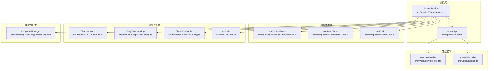
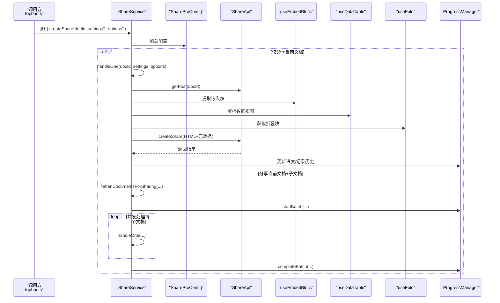
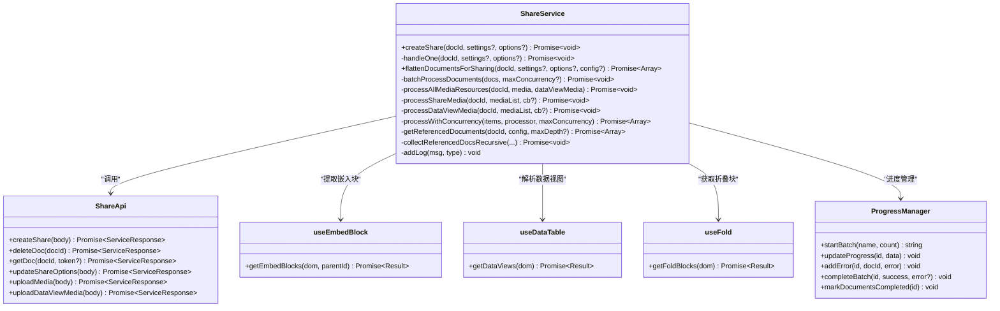
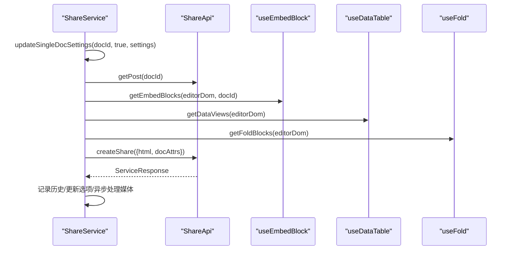
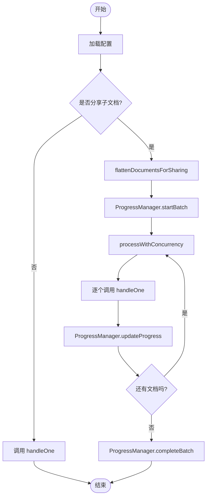
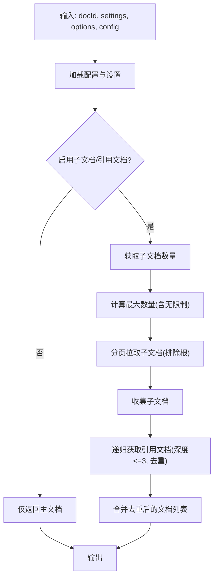
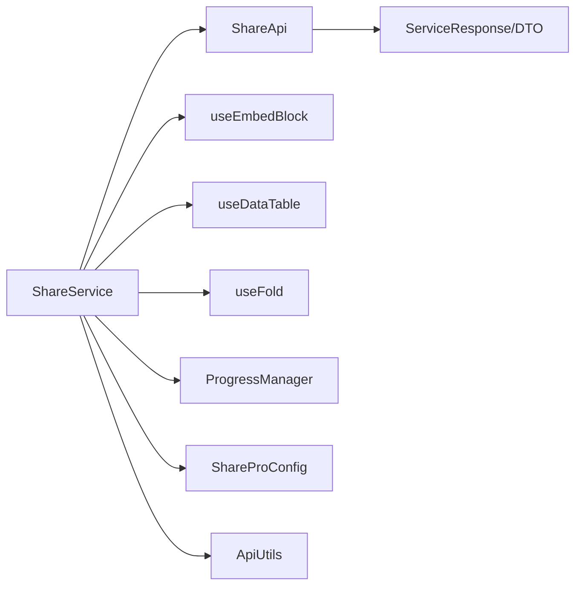

# 分享服务

<cite>
**本文引用的文件**
- [src/service/ShareService.ts](file://src/service/ShareService.ts)
- [src/api/share-api.ts](file://src/api/share-api.ts)
- [src/composables/useEmbedBlock.ts](file://src/composables/useEmbedBlock.ts)
- [src/composables/useDataTable.ts](file://src/composables/useDataTable.ts)
- [src/composables/useFold.ts](file://src/composables/useFold.ts)
- [src/models/ShareOptions.ts](file://src/models/ShareOptions.ts)
- [src/models/SingleDocSetting.ts](file://src/models/SingleDocSetting.ts)
- [src/models/ShareProConfig.ts](file://src/models/ShareProConfig.ts)
- [src/utils/ApiUtils.ts](file://src/utils/ApiUtils.ts)
- [src/utils/progress/ProgressManager.ts](file://src/utils/progress/ProgressManager.ts)
- [src/types/service-dto.d.ts](file://src/types/service-dto.d.ts)
- [src/types/index.d.ts](file://src/types/index.d.ts)
- [src/topbar.ts](file://src/topbar.ts)
</cite>

## 目录
1. [简介](#简介)
2. [项目结构](#项目结构)
3. [核心组件](#核心组件)
4. [架构总览](#架构总览)
5. [详细组件分析](#详细组件分析)
6. [依赖关系分析](#依赖关系分析)
7. [性能考量](#性能考量)
8. [故障排查指南](#故障排查指南)
9. [结论](#结论)
10. [附录](#附录)

## 简介
本文件系统性梳理“分享服务”模块，重点围绕 ShareService 类展开，覆盖以下目标：
- 全面介绍 ShareService 的核心职责与实现原理
- 深入解析单文档分享、批量文档分享、子文档分享与引用文档分享的完整流程
- 详解 handleOne 方法的“纯净分享”逻辑：文档内容提取、嵌入块处理、数据视图解析、折叠块处理
- 解释 flattenDocumentsForSharing 如何扁平化获取需要分享的文档列表，包括子文档与引用文档的递归处理机制
- 文档化 createShare 统一入口方法的调用流程与分支逻辑
- 提供 API 调用示例、参数说明与返回值格式
- 总结错误处理策略与日志记录机制

## 项目结构
分享服务相关代码主要分布在 service、api、composables、models、utils、types 等目录中。下图展示与分享服务直接相关的模块与交互关系。

图表来源
- [src/service/ShareService.ts:40-1251](file://src/service/ShareService.ts#L40-L1251)
- [src/api/share-api.ts:16-240](file://src/api/share-api.ts#L16-L240)
- [src/composables/useEmbedBlock.ts:23-85](file://src/composables/useEmbedBlock.ts#L23-L85)
- [src/composables/useDataTable.ts:22-101](file://src/composables/useDataTable.ts#L22-L101)
- [src/composables/useFold.ts:23-102](file://src/composables/useFold.ts#L23-L102)
- [src/models/ShareOptions.ts:16-27](file://src/models/ShareOptions.ts#L16-L27)
- [src/models/SingleDocSetting.ts:18-85](file://src/models/SingleDocSetting.ts#L18-L85)
- [src/models/ShareProConfig.ts:13-40](file://src/models/ShareProConfig.ts#L13-L40)
- [src/utils/ApiUtils.ts:15-27](file://src/utils/ApiUtils.ts#L15-L27)
- [src/utils/progress/ProgressManager.ts:8-238](file://src/utils/progress/ProgressManager.ts#L8-L238)
- [src/types/service-dto.d.ts:13-134](file://src/types/service-dto.d.ts#L13-L134)
- [src/types/index.d.ts:10-18](file://src/types/index.d.ts#L10-L18)

章节来源
- [src/service/ShareService.ts:40-1251](file://src/service/ShareService.ts#L40-L1251)
- [src/api/share-api.ts:16-240](file://src/api/share-api.ts#L16-L240)

## 核心组件
- ShareService：分享服务核心类，负责统一入口、文档扁平化、单文档/批量分享、资源处理、错误与日志管理。
- ShareApi：封装与后端分享服务的 HTTP 交互，提供创建分享、取消分享、更新选项、媒体上传等接口。
- useEmbedBlock/useDataTable/useFold：组合式工具，分别负责嵌入块内容提取、数据视图渲染与折叠块内容获取。
- ShareOptions/SingleDocSetting：分享选项与文档级设置的数据模型。
- ShareProConfig：插件配置模型，包含 Siyuan 与服务端 API 配置。
- ProgressManager：批量操作进度管理器，支持文档与资源处理进度跟踪与错误汇总。
- 类型定义：service-dto.d.ts 与 types/index.d.ts 提供服务端 DTO 与统一导出。

章节来源
- [src/service/ShareService.ts:40-1251](file://src/service/ShareService.ts#L40-L1251)
- [src/api/share-api.ts:16-240](file://src/api/share-api.ts#L16-L240)
- [src/composables/useEmbedBlock.ts:23-85](file://src/composables/useEmbedBlock.ts#L23-L85)
- [src/composables/useDataTable.ts:22-101](file://src/composables/useDataTable.ts#L22-L101)
- [src/composables/useFold.ts:23-102](file://src/composables/useFold.ts#L23-L102)
- [src/models/ShareOptions.ts:16-27](file://src/models/ShareOptions.ts#L16-L27)
- [src/models/SingleDocSetting.ts:18-85](file://src/models/SingleDocSetting.ts#L18-L85)
- [src/models/ShareProConfig.ts:13-40](file://src/models/ShareProConfig.ts#L13-L40)
- [src/utils/progress/ProgressManager.ts:8-238](file://src/utils/progress/ProgressManager.ts#L8-L238)
- [src/types/service-dto.d.ts:13-134](file://src/types/service-dto.d.ts#L13-L134)
- [src/types/index.d.ts:10-18](file://src/types/index.d.ts#L10-L18)

## 架构总览
下图展示分享服务的整体调用链路与关键参与者：

图表来源
- [src/service/ShareService.ts:234-258](file://src/service/ShareService.ts#L234-L258)
- [src/service/ShareService.ts:586-730](file://src/service/ShareService.ts#L586-L730)
- [src/service/ShareService.ts:101-226](file://src/service/ShareService.ts#L101-L226)
- [src/service/ShareService.ts:1153-1229](file://src/service/ShareService.ts#L1153-L1229)
- [src/api/share-api.ts:46-50](file://src/api/share-api.ts#L46-L50)
- [src/composables/useEmbedBlock.ts:33-77](file://src/composables/useEmbedBlock.ts#L33-L77)
- [src/composables/useDataTable.ts:26-95](file://src/composables/useDataTable.ts#L26-L95)
- [src/composables/useFold.ts:33-94](file://src/composables/useFold.ts#L33-L94)
- [src/utils/progress/ProgressManager.ts:12-102](file://src/utils/progress/ProgressManager.ts#L12-L102)

## 详细组件分析

### ShareService 类
- 职责概览
  - 统一入口 createShare：根据配置与设置决定单文档或批量分享
  - 单文档处理 handleOne：提取内容、处理嵌入块/数据视图/折叠块、调用后端创建分享、异步处理媒体资源
  - 文档扁平化 flattenDocumentsForSharing：支持子文档与引用文档的递归收集与去重
  - 批量处理 batchProcessDocuments：并发控制、进度管理、错误汇总
  - 资源处理 processAllMediaResources/processShareMedia/processDataViewMedia：顺序处理常规与DataViews媒体资源
  - 错误与日志：addLog、资源错误监听、历史记录持久化
- 关键方法与流程
  - createShare：加载配置 → 判断是否分享子文档 → 单文档走 handleOne；批量走 flattenDocumentsForSharing + 并发处理
  - handleOne：更新文档设置 → 获取最新 Post → 提取嵌入块/数据视图/折叠块 → 组装分享体 → 调用 ShareApi.createShare → 记录历史 → 更新分享选项 → 异步处理媒体资源
  - flattenDocumentsForSharing：基于配置与设置决定是否启用子文档/引用文档 → 分页拉取子文档 → 递归收集引用文档 → 去重合并 → 返回扁平化列表
  - batchProcessDocuments：启动进度 → 并发遍历 → 每次调用 handleOne → 实时更新进度 → 完成后标记文档完成状态
  - 资源处理：先常规媒体，后DataViews媒体，通过事件总线与进度管理器联动

图表来源
- [src/service/ShareService.ts:40-1251](file://src/service/ShareService.ts#L40-L1251)
- [src/api/share-api.ts:16-240](file://src/api/share-api.ts#L16-L240)
- [src/composables/useEmbedBlock.ts:23-85](file://src/composables/useEmbedBlock.ts#L23-L85)
- [src/composables/useDataTable.ts:22-101](file://src/composables/useDataTable.ts#L22-L101)
- [src/composables/useFold.ts:23-102](file://src/composables/useFold.ts#L23-L102)
- [src/utils/progress/ProgressManager.ts:8-238](file://src/utils/progress/ProgressManager.ts#L8-L238)

章节来源
- [src/service/ShareService.ts:234-258](file://src/service/ShareService.ts#L234-L258)
- [src/service/ShareService.ts:586-730](file://src/service/ShareService.ts#L586-L730)
- [src/service/ShareService.ts:101-226](file://src/service/ShareService.ts#L101-L226)
- [src/service/ShareService.ts:1153-1229](file://src/service/ShareService.ts#L1153-L1229)

### 单文档分享流程（handleOne）
- 步骤概览
  - 更新文档设置（写入属性）→ 获取最新 Post → 提取嵌入块、数据视图、折叠块 → 组装分享体 → 调用后端创建分享 → 记录历史 → 更新分享选项 → 异步处理媒体资源
- 关键点
  - 嵌入块：通过 useEmbedBlock 从编辑器 DOM 中定位嵌入块节点，调用内核接口获取默认视图内容
  - 数据视图：通过 useDataTable 识别数据表节点，渲染默认视图与其他视图，合并为结果对象
  - 折叠块：通过 useFold 使用事务接口临时展开标题块，提取其内容
  - 媒体资源：先常规图片，后 DataViews 图片，分批上传，事件驱动进度与错误上报

图表来源
- [src/service/ShareService.ts:586-730](file://src/service/ShareService.ts#L586-L730)
- [src/composables/useEmbedBlock.ts:33-77](file://src/composables/useEmbedBlock.ts#L33-L77)
- [src/composables/useDataTable.ts:26-95](file://src/composables/useDataTable.ts#L26-L95)
- [src/composables/useFold.ts:33-94](file://src/composables/useFold.ts#L33-L94)
- [src/api/share-api.ts:46-50](file://src/api/share-api.ts#L46-L50)

章节来源
- [src/service/ShareService.ts:586-730](file://src/service/ShareService.ts#L586-L730)
- [src/composables/useEmbedBlock.ts:33-77](file://src/composables/useEmbedBlock.ts#L33-L77)
- [src/composables/useDataTable.ts:26-95](file://src/composables/useDataTable.ts#L26-L95)
- [src/composables/useFold.ts:33-94](file://src/composables/useFold.ts#L33-L94)

### 批量文档分享流程（createShare 分支）
- 流程概览
  - 若未启用子文档分享：直接调用 handleOne
  - 若启用子文档分享：先 flattenDocumentsForSharing 获取扁平化文档列表，再 batchProcessDocuments 并发处理
- 并发控制
  - 使用 processWithConcurrency 控制并发度，保持结果顺序与错误隔离
  - 通过 ProgressManager 实时更新进度、记录错误、最终完成状态

图表来源
- [src/service/ShareService.ts:234-258](file://src/service/ShareService.ts#L234-L258)
- [src/service/ShareService.ts:101-226](file://src/service/ShareService.ts#L101-L226)
- [src/service/ShareService.ts:1153-1229](file://src/service/ShareService.ts#L1153-L1229)
- [src/utils/progress/ProgressManager.ts:12-102](file://src/utils/progress/ProgressManager.ts#L12-L102)

章节来源
- [src/service/ShareService.ts:234-258](file://src/service/ShareService.ts#L234-L258)
- [src/service/ShareService.ts:101-226](file://src/service/ShareService.ts#L101-L226)
- [src/service/ShareService.ts:1153-1229](file://src/service/ShareService.ts#L1153-L1229)

### 文档扁平化（flattenDocumentsForSharing）
- 功能要点
  - 收集主文档
  - 基于配置与文档级设置决定是否启用子文档/引用文档分享
  - 子文档：分页拉取并过滤根文档自身，应用数量限制（支持无限制与上限）
  - 引用文档：递归查询 refs 表，最大深度默认 3 层，循环引用检测
  - 去重合并，返回扁平化列表

图表来源
- [src/service/ShareService.ts:101-226](file://src/service/ShareService.ts#L101-L226)
- [src/service/ShareService.ts:268-366](file://src/service/ShareService.ts#L268-L366)

章节来源
- [src/service/ShareService.ts:101-226](file://src/service/ShareService.ts#L101-L226)
- [src/service/ShareService.ts:268-366](file://src/service/ShareService.ts#L268-L366)

### 引用文档分享（递归收集）
- SQL 查询：从 refs 表中筛选当前文档引用的其他文档，排除自身
- 递归深度：默认最大 3 层，防止过深递归导致性能问题
- 去重：使用 Set 记录已处理文档 ID，避免循环引用与重复处理

章节来源
- [src/service/ShareService.ts:268-366](file://src/service/ShareService.ts#L268-L366)

### 媒体资源处理（顺序与并发）
- 顺序策略：先常规媒体，再 DataViews 媒体，避免并发导致后端处理顺序混乱
- 分批上传：每批固定数量，逐批发送并等待结果，统计成功/失败数量
- 事件驱动：通过资源事件发射器与 ProgressManager 协同，实时更新进度与错误

章节来源
- [src/service/ShareService.ts:1032-1076](file://src/service/ShareService.ts#L1032-L1076)
- [src/service/ShareService.ts:732-878](file://src/service/ShareService.ts#L732-L878)
- [src/service/ShareService.ts:885-1026](file://src/service/ShareService.ts#L885-L1026)
- [src/utils/progress/ProgressManager.ts:36-100](file://src/utils/progress/ProgressManager.ts#L36-L100)

## 依赖关系分析
- 组件耦合
  - ShareService 对外仅暴露 createShare/cancelShare/updateShareOptions/listDoc 等有限接口，内部通过组合式工具与 ShareApi 解耦
  - 与配置的耦合通过 ShareProConfig 与 ApiUtils 统一加载，便于测试与替换
- 外部依赖
  - ShareApi 依赖后端服务端点枚举（ServiceApiKeys），返回 ServiceResponse
  - Cheerio 用于解析编辑器 DOM，提取嵌入块、数据视图、折叠块
- 潜在循环依赖
  - 未见直接循环依赖；若未来扩展，建议保持接口契约稳定，避免跨模块相互调用

图表来源
- [src/service/ShareService.ts:40-1251](file://src/service/ShareService.ts#L40-L1251)
- [src/api/share-api.ts:16-240](file://src/api/share-api.ts#L16-L240)
- [src/composables/useEmbedBlock.ts:23-85](file://src/composables/useEmbedBlock.ts#L23-L85)
- [src/composables/useDataTable.ts:22-101](file://src/composables/useDataTable.ts#L22-L101)
- [src/composables/useFold.ts:23-102](file://src/composables/useFold.ts#L23-L102)
- [src/utils/progress/ProgressManager.ts:8-238](file://src/utils/progress/ProgressManager.ts#L8-L238)
- [src/types/service-dto.d.ts:233-237](file://src/types/service-dto.d.ts#L233-L237)

章节来源
- [src/service/ShareService.ts:40-1251](file://src/service/ShareService.ts#L40-L1251)
- [src/api/share-api.ts:16-240](file://src/api/share-api.ts#L16-L240)

## 性能考量
- 子文档数量限制：默认最多 100 个，最大 999 个；支持无限制（-1），但会发出性能风险警告
- 分页拉取：子文档采用分页（每页 50）避免一次性拉取过多
- 并发控制：批量处理默认并发 10，既保证吞吐又避免过度占用资源
- 媒体上传批处理：每批 5 张，减少网络往返与后端压力
- 顺序处理媒体：避免并发导致的资源处理顺序问题

章节来源
- [src/service/ShareService.ts:150-171](file://src/service/ShareService.ts#L150-L171)
- [src/service/ShareService.ts:1178-1221](file://src/service/ShareService.ts#L1178-L1221)
- [src/service/ShareService.ts:741-745](file://src/service/ShareService.ts#L741-L745)
- [src/service/ShareService.ts:894-898](file://src/service/ShareService.ts#L894-L898)

## 故障排查指南
- 常见错误与处理
  - 分享失败：记录失败历史（含文档标题、错误信息、修改时间），并通过消息提示用户
  - 资源处理错误：监听资源事件，弹出较长显示时间的消息，便于用户查看
  - 批量处理：ProgressManager 汇总错误，最终状态根据是否有错误决定 success/error
- 日志与状态栏
  - addLog 统一记录 info/error 级日志，并更新状态栏提示
  - 进度管理：startBatch/updateProgress/addError/completeBatch/markDocumentsCompleted
- API 请求
  - ShareApi 在请求前校验服务端地址，缺失时提示初始化；请求体与头信息标准化

章节来源
- [src/service/ShareService.ts:631-657](file://src/service/ShareService.ts#L631-L657)
- [src/service/ShareService.ts:692-729](file://src/service/ShareService.ts#L692-L729)
- [src/service/ShareService.ts:1240-1247](file://src/service/ShareService.ts#L1240-L1247)
- [src/service/ShareService.ts:1195-1218](file://src/service/ShareService.ts#L1195-L1218)
- [src/api/share-api.ts:177-209](file://src/api/share-api.ts#L177-L209)
- [src/utils/progress/ProgressManager.ts:145-156](file://src/utils/progress/ProgressManager.ts#L145-L156)

## 结论
ShareService 通过清晰的职责划分与稳健的流程设计，实现了从单文档到多文档、从内容提取到资源处理的完整分享闭环。其扁平化与递归收集机制兼顾灵活性与性能，配合进度管理与错误处理，为用户提供了可靠的分享体验。

## 附录

### API 调用示例与参数说明
- createShare(docId, settings?, options?)
  - 参数
    - docId: string，必填，目标文档 ID
    - settings?: Partial<SingleDocSetting>，可选，文档级设置（如是否显示文档树/大纲、分享有效期、是否分享子文档/引用文档、子文档数量限制等）
    - options?: Partial<ShareOptions>，可选，分享选项（如密码开关与密码）
  - 行为
    - 若未启用子文档分享：仅分享当前文档
    - 若启用子文档分享：先扁平化收集文档，再并发分享
  - 返回
    - Promise<void>，具体结果通过消息提示与历史记录体现

- cancelShare(docId)
  - 参数
    - docId: string，必填
  - 行为
    - 单文档取消：调用 ShareApi.deleteDoc，清除文档设置，删除本地历史
    - 多文档取消：扁平化收集后并发取消，使用 ProgressManager 跟踪进度与错误

- updateShareOptions(docId, options)
  - 参数
    - docId: string，必填
    - options: Partial<ShareOptions>，必填
  - 行为
    - 调用 ShareApi.updateShareOptions，更新分享选项（如密码）

- listDoc(pageNum, pageSize, order, direction, search)
  - 参数
    - pageNum: number，页码（从 0 开始）
    - pageSize: number，每页大小
    - order: string，排序字段
    - direction: string，排序方向
    - search: string，搜索关键词
  - 返回
    - Promise<ServiceResponse>，包含分页数据

章节来源
- [src/service/ShareService.ts:234-258](file://src/service/ShareService.ts#L234-L258)
- [src/service/ShareService.ts:404-496](file://src/service/ShareService.ts#L404-L496)
- [src/service/ShareService.ts:519-541](file://src/service/ShareService.ts#L519-L541)
- [src/service/ShareService.ts:543-552](file://src/service/ShareService.ts#L543-L552)
- [src/api/share-api.ts:46-50](file://src/api/share-api.ts#L46-L50)
- [src/api/share-api.ts:107-111](file://src/api/share-api.ts#L107-L111)
- [src/api/share-api.ts:73-77](file://src/api/share-api.ts#L73-L77)

### 返回值格式
- ServiceResponse
  - code: number，状态码（0 表示成功）
  - msg: string，消息
  - data: any，具体数据

- DocDTO/PageResponseDTO
  - DocDTO：包含 docId、author、docDomain、data(title/dateCreated/dateUpdated)、media、status、createdAt
  - PageResponseDTO：包含 total/pageSize/pageNum/pageTotal/data/order/direction/search

章节来源
- [src/api/share-api.ts:233-237](file://src/api/share-api.ts#L233-L237)
- [src/types/service-dto.d.ts:98-134](file://src/types/service-dto.d.ts#L98-L134)

### 使用示例（调用方参考）
- 顶部栏触发分享
  - 调用 this.shareService.createShare(docCheck.docId) 完成分享
- 增量分享服务中触发分享
  - 在增量分享服务中调用 await this.shareService.createShare(docId)

章节来源
- [src/topbar.ts:151-167](file://src/topbar.ts#L151-L167)
- [src/service/IncrementalShareService.ts](file://src/service/IncrementalShareService.ts#L597)