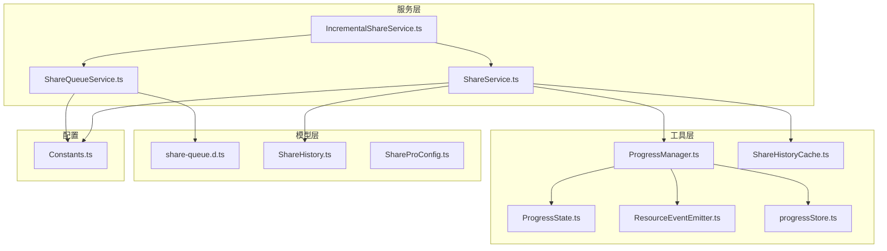
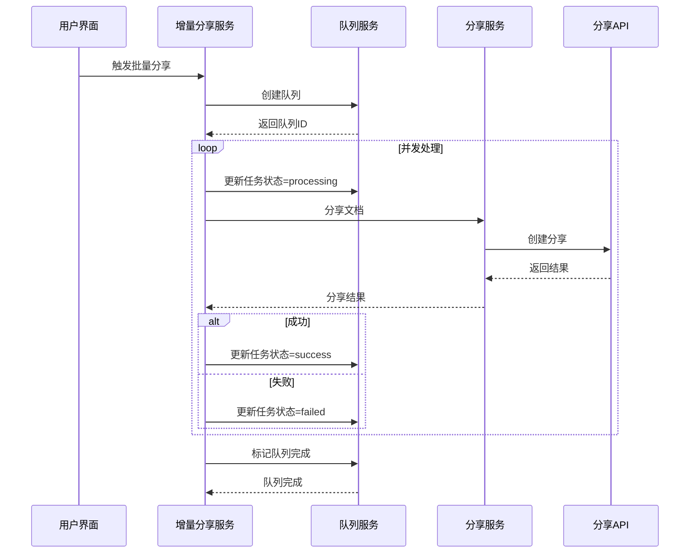
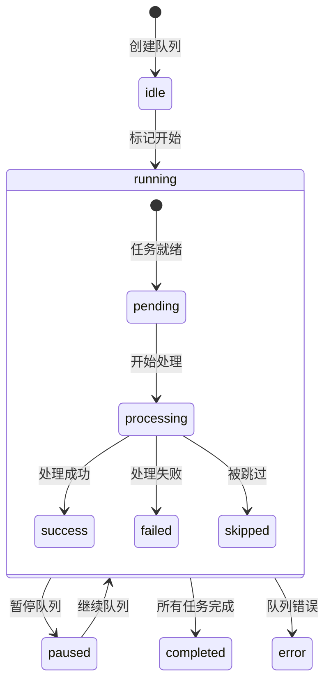
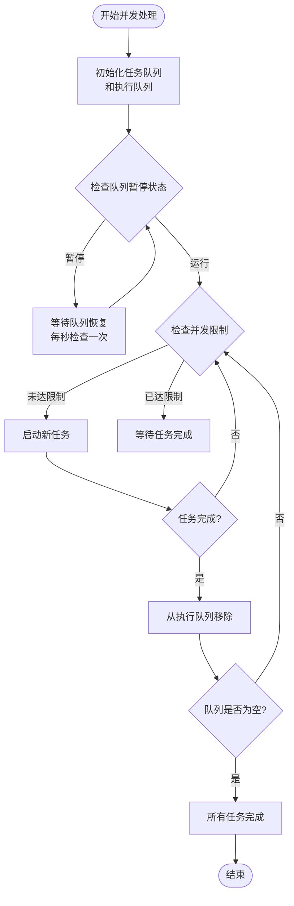
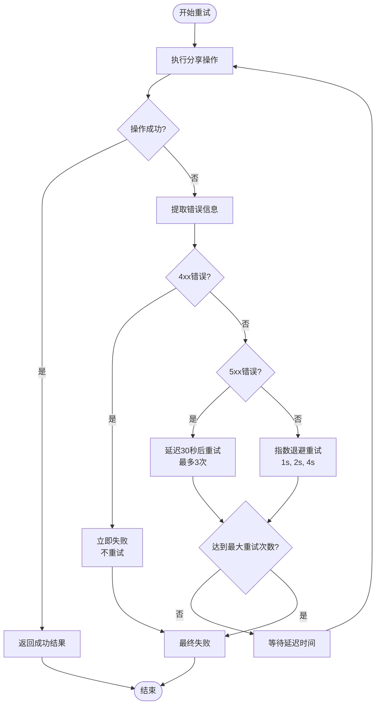
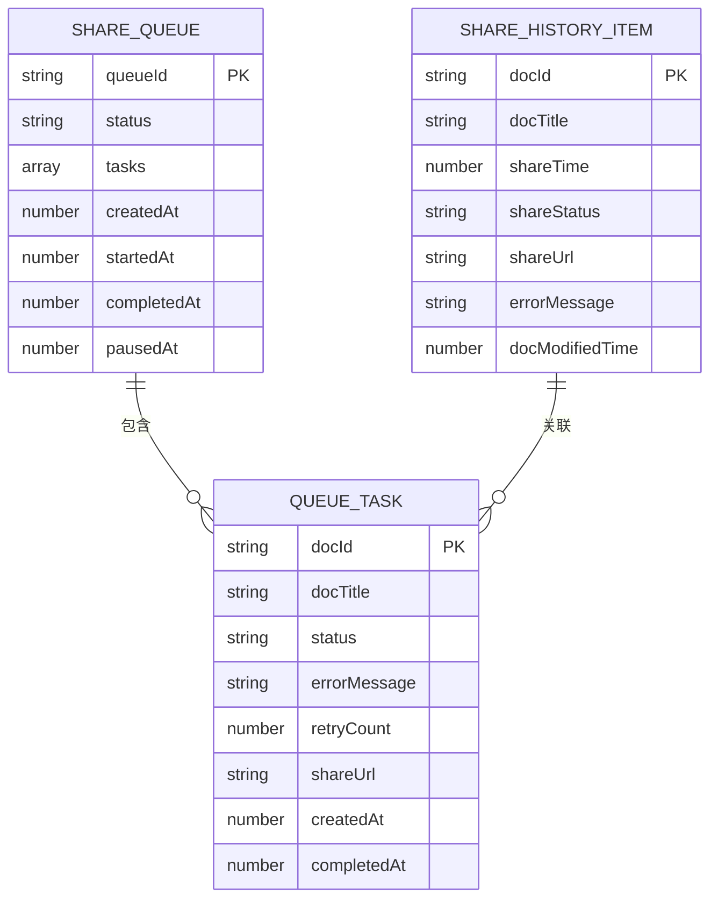
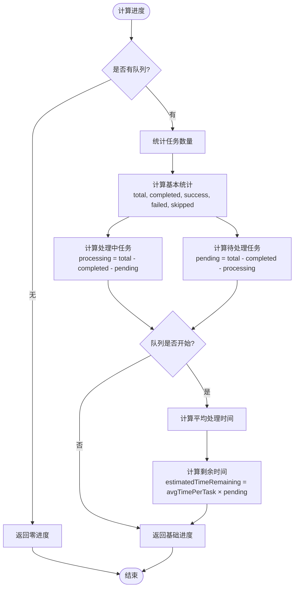
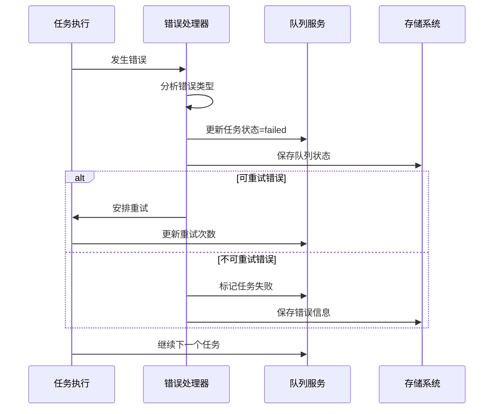
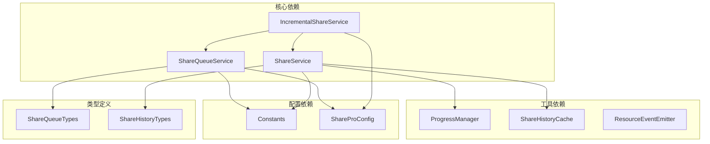
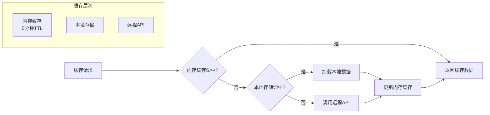

# 分享队列服务

<cite>
**本文档引用的文件**
- [ShareQueueService.ts](file://src/service/ShareQueueService.ts)
- [share-queue.d.ts](file://src/types/share-queue.d.ts)
- [IncrementalShareService.ts](file://src/service/IncrementalShareService.ts)
- [ShareService.ts](file://src/service/ShareService.ts)
- [ProgressManager.ts](file://src/utils/progress/ProgressManager.ts)
- [ProgressState.ts](file://src/utils/progress/ProgressState.ts)
- [ResourceEventEmitter.ts](file://src/utils/progress/ResourceEventEmitter.ts)
- [progressStore.ts](file://src/utils/progress/progressStore.ts)
- [ShareHistory.ts](file://src/models/ShareHistory.ts)
- [ShareHistoryCache.ts](file://src/utils/ShareHistoryCache.ts)
- [ShareProConfig.ts](file://src/models/ShareProConfig.ts)
- [Constants.ts](file://src/Constants.ts)
</cite>

## 目录
1. [简介](#简介)
2. [项目结构](#项目结构)
3. [核心组件](#核心组件)
4. [架构概览](#架构概览)
5. [详细组件分析](#详细组件分析)
6. [依赖分析](#依赖分析)
7. [性能考虑](#性能考虑)
8. [故障排除指南](#故障排除指南)
9. [结论](#结论)
10. [附录](#附录)

## 简介

分享队列服务模块是 Siyuan 插件分享 Pro 的核心组件，负责管理大规模文档分享任务的排队、调度和执行。该模块提供了完整的队列生命周期管理、并发控制、持久化存储、进度跟踪和错误处理机制。

本模块特别设计用于处理增量分享场景，能够高效地管理大量文档的分享任务，同时提供实时的进度反馈和可靠的错误恢复能力。

## 项目结构

分享队列服务模块位于插件的 service 层，与进度管理、历史记录和配置管理模块协同工作：

**图表来源**
- [ShareQueueService.ts:1-299](file://src/service/ShareQueueService.ts#L1-L299)
- [IncrementalShareService.ts:1-690](file://src/service/IncrementalShareService.ts#L1-L690)
- [ShareService.ts:1-1251](file://src/service/ShareService.ts#L1-L1251)

**章节来源**
- [ShareQueueService.ts:1-299](file://src/service/ShareQueueService.ts#L1-L299)
- [IncrementalShareService.ts:1-690](file://src/service/IncrementalShareService.ts#L1-L690)

## 核心组件

### ShareQueueService 类

ShareQueueService 是队列管理的核心类，提供完整的队列生命周期管理功能：

#### 主要职责
- 队列创建和初始化
- 任务状态管理
- 队列暂停和恢复
- 进度跟踪和通知
- 持久化存储管理

#### 关键特性
- **状态管理**：支持 idle、running、paused、completed、error 五种状态
- **任务状态**：pending、processing、success、failed、skipped
- **并发控制**：通过外部服务控制并发数
- **持久化**：基于插件配置的持久化存储
- **进度通知**：支持多回调监听器

**章节来源**
- [ShareQueueService.ts:24-299](file://src/service/ShareQueueService.ts#L24-L299)
- [share-queue.d.ts:13-149](file://src/types/share-queue.d.ts#L13-L149)

### IncrementalShareService 类

增量分享服务负责协调队列管理和实际的分享操作：

#### 主要功能
- 变更检测和文档筛选
- 队列创建和管理
- 并发控制的批量分享
- 智能重试机制
- 进度跟踪和状态更新

#### 关键算法
- **并发控制**：使用滑动窗口机制控制最大并发数
- **智能重试**：针对不同错误类型的差异化重试策略
- **缓存管理**：5分钟TTL的内存缓存机制

**章节来源**
- [IncrementalShareService.ts:98-690](file://src/service/IncrementalShareService.ts#L98-L690)

### 进度管理系统

独立的进度管理模块提供统一的进度跟踪能力：

#### ProgressManager
- **批量操作管理**：支持多个文档的并发处理进度跟踪
- **资源处理跟踪**：专门处理媒体资源的异步处理进度
- **事件驱动**：基于事件发射器的解耦设计
- **状态存储**：使用 Svelte store 进行响应式状态管理

**章节来源**
- [ProgressManager.ts:1-238](file://src/utils/progress/ProgressManager.ts#L1-L238)
- [ProgressState.ts:1-27](file://src/utils/progress/ProgressState.ts#L1-L27)

## 架构概览

分享队列服务采用分层架构设计，各组件职责明确，通过接口和事件进行松耦合通信：

**图表来源**
- [IncrementalShareService.ts:269-351](file://src/service/IncrementalShareService.ts#L269-L351)
- [ShareQueueService.ts:105-125](file://src/service/ShareQueueService.ts#L105-L125)

## 详细组件分析

### 队列管理机制

#### 队列状态流转

#### 任务状态管理

每个任务包含完整的信息追踪：
- **基础信息**：文档ID、标题、创建时间
- **状态信息**：当前状态、完成时间、重试次数
- **结果信息**：分享URL、错误信息
- **时间戳**：精确的时间追踪

**章节来源**
- [share-queue.d.ts:23-63](file://src/types/share-queue.d.ts#L23-L63)
- [ShareQueueService.ts:105-125](file://src/service/ShareQueueService.ts#L105-L125)

### 并发控制策略

#### 滑动窗口并发控制

增量分享服务实现了高效的并发控制机制：

**图表来源**
- [IncrementalShareService.ts:479-577](file://src/service/IncrementalShareService.ts#L479-L577)

#### 并发数配置

系统支持灵活的并发数配置：
- **默认并发数**：5个任务同时执行
- **动态调整**：可通过配置参数调整并发限制
- **资源保护**：避免过度并发导致系统资源耗尽

**章节来源**
- [IncrementalShareService.ts:317-317](file://src/service/IncrementalShareService.ts#L317-L317)

### 智能重试机制

#### 错误分类和处理策略

**图表来源**
- [IncrementalShareService.ts:585-659](file://src/service/IncrementalShareService.ts#L585-L659)

#### 重试配置参数

| 参数 | 默认值 | 说明 |
|------|--------|------|
| maxRetries | 3 | 最大重试次数 |
| initialDelay | 1000ms | 初始延迟时间 |
| serverErrorDelay | 30000ms | 服务器错误延迟 |

**章节来源**
- [IncrementalShareService.ts:29-44](file://src/service/IncrementalShareService.ts#L29-L44)
- [IncrementalShareService.ts:585-659](file://src/service/IncrementalShareService.ts#L585-L659)

### 持久化存储机制

#### 存储策略

**图表来源**
- [ShareQueueService.ts:232-253](file://src/service/ShareQueueService.ts#L232-L253)
- [share-queue.d.ts:68-103](file://src/types/share-queue.d.ts#L68-L103)

#### 恢复机制

系统具备完整的队列恢复能力：
- **自动恢复**：插件启动时自动尝试恢复未完成队列
- **状态修复**：运行中的队列自动转换为暂停状态
- **数据完整性**：确保恢复后的队列状态一致性和数据完整性

**章节来源**
- [ShareQueueService.ts:232-253](file://src/service/ShareQueueService.ts#L232-L253)
- [IncrementalShareService.ts:134-139](file://src/service/IncrementalShareService.ts#L134-L139)

### 进度跟踪和监控

#### 进度计算算法

**图表来源**
- [ShareQueueService.ts:130-170](file://src/service/ShareQueueService.ts#L130-L170)

#### 进度回调机制

系统支持多回调监听器模式：
- **注册机制**：通过 onProgress 方法注册进度回调
- **通知机制**：任务状态变化时自动通知所有回调
- **异常处理**：单个回调异常不影响其他回调执行

**章节来源**
- [ShareQueueService.ts:271-297](file://src/service/ShareQueueService.ts#L271-L297)

### 错误处理和恢复

#### 错误分类处理

| 错误类型 | 处理策略 | 重试行为 |
|----------|----------|----------|
| 4xx客户端错误 | 立即失败，不重试 | 不适用 |
| 5xx服务器错误 | 延迟重试（30秒） | 最多3次 |
| 网络异常 | 指数退避重试 | 1s, 2s, 4s |
| 超时错误 | 固定延迟重试 | 10秒 |
| 资源限制 | 等待释放后重试 | 30秒 |

#### 错误恢复流程

**图表来源**
- [IncrementalShareService.ts:614-659](file://src/service/IncrementalShareService.ts#L614-L659)
- [ShareQueueService.ts:105-125](file://src/service/ShareQueueService.ts#L105-L125)

**章节来源**
- [IncrementalShareService.ts:614-689](file://src/service/IncrementalShareService.ts#L614-L689)

## 依赖分析

### 组件间依赖关系

**图表来源**
- [ShareQueueService.ts:10-14](file://src/service/ShareQueueService.ts#L10-L14)
- [IncrementalShareService.ts:13-24](file://src/service/IncrementalShareService.ts#L13-L24)

### 外部依赖

#### 核心依赖包

| 依赖包 | 版本 | 用途 |
|--------|------|------|
| zhi-lib-base | 最新版 | 日志记录和通用工具 |
| siyuan | 最新版 | Siyuan API 访问 |
| eventemitter3 | 最新版 | 事件发射器 |
| svelte/store | 最新版 | 响应式状态管理 |

#### 配置依赖

- **存储名称**：`share-pro.json`
- **队列存储键**：`share_queue`
- **开发模式检测**：通过环境变量判断

**章节来源**
- [Constants.ts:15-15](file://src/Constants.ts#L15-L15)
- [ShareQueueService.ts:16-16](file://src/service/ShareQueueService.ts#L16-L16)

## 性能考虑

### 并发性能优化

#### 并发控制策略

1. **滑动窗口机制**：确保任务执行的有序性和资源控制
2. **动态调整**：根据系统负载动态调整并发数
3. **资源监控**：监控内存和CPU使用情况

#### 缓存优化

**图表来源**
- [ShareHistoryCache.ts:31-44](file://src/utils/ShareHistoryCache.ts#L31-L44)

#### 内存管理

- **缓存清理**：自动清理过期缓存数据
- **内存监控**：定期检查内存使用情况
- **垃圾回收**：及时释放不再使用的对象引用

### 网络性能优化

#### 请求优化

1. **批量处理**：合并相似的API请求
2. **超时控制**：合理设置请求超时时间
3. **连接复用**：重用HTTP连接减少开销

#### 错误重试优化

- **指数退避**：避免频繁重试造成服务器压力
- **错误分类**：不同类型错误采用不同重试策略
- **最大重试次数**：防止无限重试消耗资源

## 故障排除指南

### 常见问题诊断

#### 队列无法恢复

**症状**：插件启动后队列状态异常
**排查步骤**：
1. 检查存储文件是否存在
2. 验证队列数据格式是否正确
3. 查看日志中的错误信息

**解决方案**：
- 清除损坏的队列数据
- 重新创建队列
- 检查存储权限

#### 并发处理异常

**症状**：任务执行卡住或内存泄漏
**排查步骤**：
1. 检查并发数配置是否合理
2. 监控系统资源使用情况
3. 查看任务执行日志

**解决方案**：
- 调整并发数设置
- 实施资源限制
- 优化任务处理逻辑

#### 进度跟踪失效

**症状**：进度条不更新或显示错误
**排查步骤**：
1. 检查回调注册是否正常
2. 验证进度计算逻辑
3. 查看事件发射器状态

**解决方案**：
- 重新注册进度回调
- 修复进度计算算法
- 检查事件发射器配置

### 调试工具使用

#### 日志级别配置

| 日志级别 | 用途 | 建议场景 |
|----------|------|----------|
| debug | 详细调试信息 | 开发阶段 |
| info | 一般运行信息 | 生产监控 |
| warn | 警告信息 | 异常处理 |
| error | 错误信息 | 故障排查 |

#### 性能监控指标

- **队列吞吐量**：每秒处理任务数
- **平均处理时间**：单个任务平均耗时
- **并发利用率**：实际并发数与配置并发数比值
- **错误率**：失败任务占总任务比例

**章节来源**
- [ShareQueueService.ts:258-266](file://src/service/ShareQueueService.ts#L258-L266)
- [IncrementalShareService.ts:686-688](file://src/service/IncrementalShareService.ts#L686-L688)

## 结论

分享队列服务模块提供了完整的大规模文档分享解决方案，具有以下核心优势：

### 技术优势

1. **可靠性**：完善的错误处理和重试机制
2. **可扩展性**：灵活的并发控制和动态调整能力
3. **可观测性**：全面的进度跟踪和监控功能
4. **持久性**：可靠的队列持久化和恢复机制

### 设计亮点

- **分层架构**：清晰的职责分离和模块化设计
- **事件驱动**：松耦合的组件通信机制
- **缓存优化**：多层次的性能优化策略
- **配置灵活**：支持运行时参数调整

### 应用场景

该模块特别适用于以下场景：
- 大规模文档批量分享
- 增量分享和定时同步
- 需要可靠进度跟踪的应用
- 对错误恢复有严格要求的系统

通过合理的配置和监控，该模块能够稳定地处理大量并发任务，为用户提供可靠的分享服务体验。

## 附录

### 配置参数参考

| 参数名称 | 类型 | 默认值 | 说明 |
|----------|------|--------|------|
| maxConcurrentTasks | number | 5 | 最大并发任务数 |
| queueStorageKey | string | share_queue | 队列存储键名 |
| cacheTTL | number | 300000 | 缓存TTL（毫秒） |
| retryMaxAttempts | number | 3 | 最大重试次数 |
| retryInitialDelay | number | 1000 | 初始重试延迟（毫秒） |

### API 接口参考

#### 队列管理接口

- `createQueue(documents)` - 创建新队列
- `getCurrentQueue()` - 获取当前队列
- `pauseQueue()` - 暂停队列
- `resumeQueue()` - 继续队列
- `updateTaskStatus(docId, status)` - 更新任务状态
- `getProgress()` - 获取进度信息

#### 进度管理接口

- `onProgress(callback)` - 注册进度回调
- `removeProgressCallback(callback)` - 移除进度回调
- `markQueueStarted()` - 标记队列开始
- `markQueueCompleted()` - 标记队列完成

### 最佳实践建议

1. **合理配置并发数**：根据系统资源调整并发限制
2. **监控队列状态**：定期检查队列健康状况
3. **优化错误处理**：针对不同错误类型制定相应策略
4. **实施缓存策略**：充分利用缓存提高性能
5. **定期清理数据**：及时清理过期的队列和缓存数据