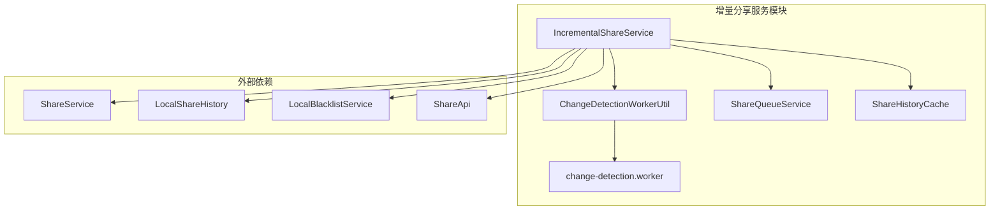
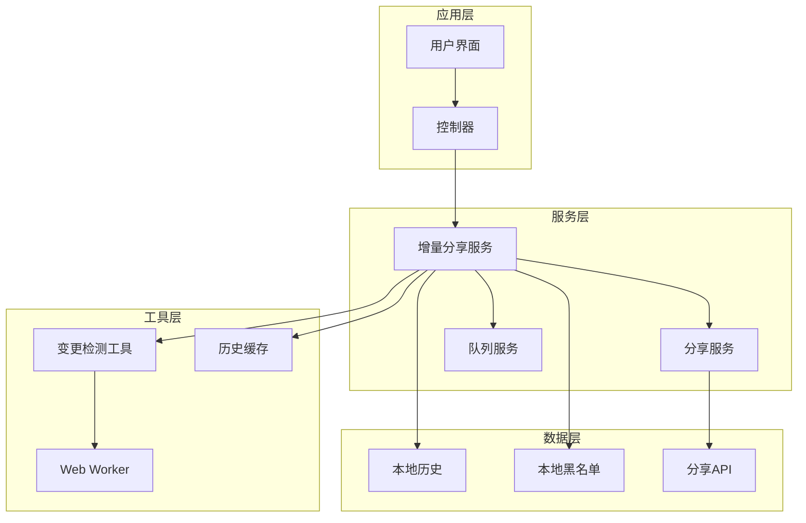
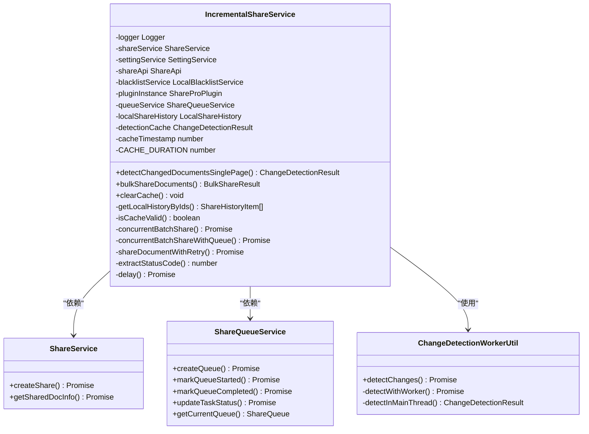
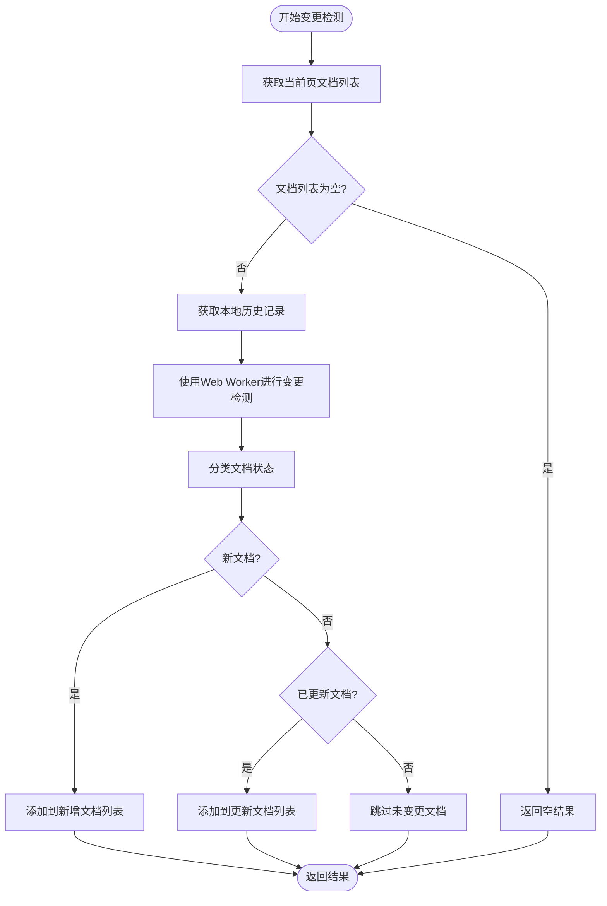
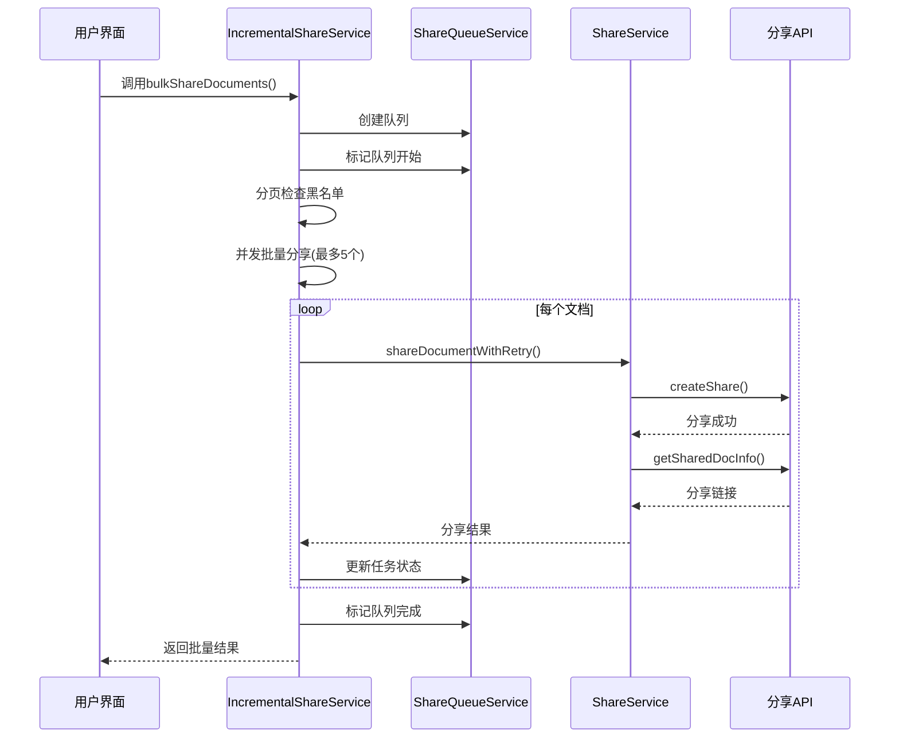
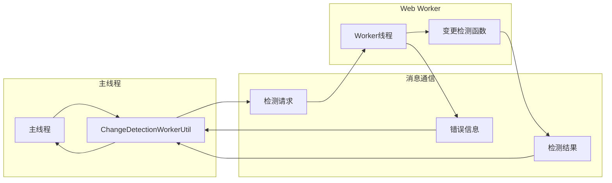
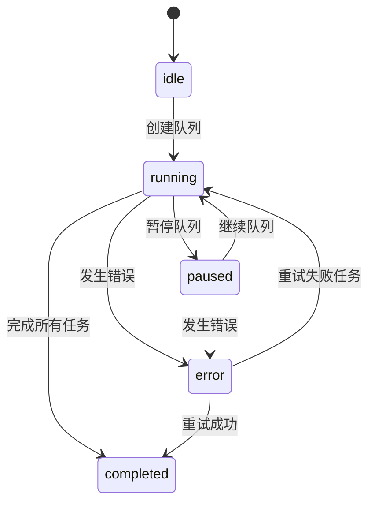
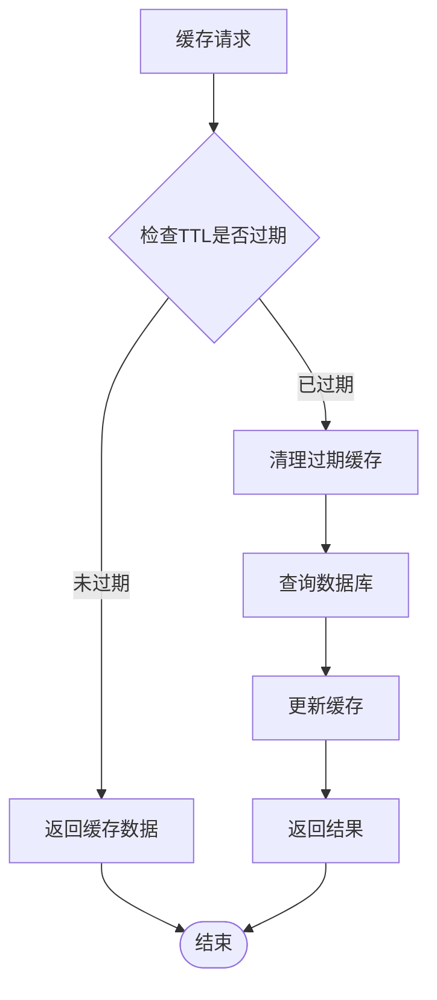
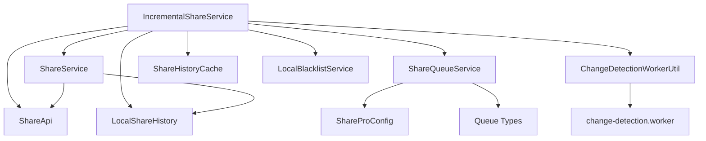
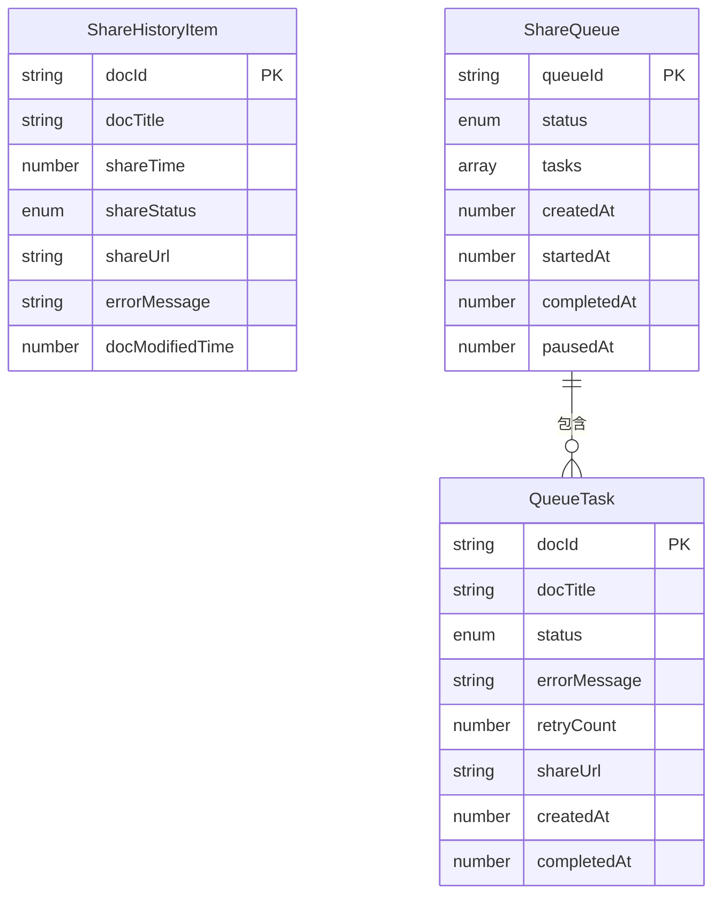

# 增量分享服务

<cite>
**本文档引用的文件**
- [IncrementalShareService.ts](file://src/service/IncrementalShareService.ts)
- [change-detection.worker.ts](file://src/workers/change-detection.worker.ts)
- [ShareQueueService.ts](file://src/service/ShareQueueService.ts)
- [ChangeDetectionWorkerUtil.ts](file://src/utils/ChangeDetectionWorkerUtil.ts)
- [ShareHistoryCache.ts](file://src/utils/ShareHistoryCache.ts)
- [ShareService.ts](file://src/service/ShareService.ts)
- [share-history.d.ts](file://src/types/share-history.d.ts)
- [share-queue.d.ts](file://src/types/share-queue.d.ts)
- [ShareProConfig.ts](file://src/models/ShareProConfig.ts)
- [AppConfig.ts](file://src/models/AppConfig.ts)
- [incremental-share-context-2025-12-04.md](file://docs/incremental-share-context-2025-12-04.md)
</cite>

## 目录
1. [简介](#简介)
2. [项目结构](#项目结构)
3. [核心组件](#核心组件)
4. [架构概览](#架构概览)
5. [详细组件分析](#详细组件分析)
6. [依赖关系分析](#依赖关系分析)
7. [性能考量](#性能考量)
8. [故障排除指南](#故障排除指南)
9. [结论](#结论)
10. [附录](#附录)

## 简介
增量分享服务模块是 SiYuan 思源笔记分享 Pro 插件的重要组成部分，专门用于高效处理大量文档的增量分享场景。该模块实现了智能增量分享算法，通过变更检测、差异计算和增量标记等机制，大幅减少了不必要的分享操作，提升了整体性能和用户体验。

本模块的核心特性包括：
- 智能变更检测算法，仅处理发生变化的文档
- 基于 Web Worker 的高性能变更检测
- 智能并发控制和断点续传功能
- 完善的错误处理和重试机制
- 内存缓存优化，减少重复查询开销

## 项目结构
增量分享服务模块位于插件的 service 层，采用分层架构设计，确保了良好的代码组织和可维护性。



**图表来源**
- [IncrementalShareService.ts:1-690](file://src/service/IncrementalShareService.ts#L1-L690)
- [ChangeDetectionWorkerUtil.ts:1-148](file://src/utils/ChangeDetectionWorkerUtil.ts#L1-L148)
- [ShareQueueService.ts:1-299](file://src/service/ShareQueueService.ts#L1-L299)

**章节来源**
- [IncrementalShareService.ts:1-690](file://src/service/IncrementalShareService.ts#L1-L690)
- [ShareQueueService.ts:1-299](file://src/service/ShareQueueService.ts#L1-L299)

## 核心组件
增量分享服务模块由多个核心组件组成，每个组件都有明确的职责分工：

### IncrementalShareService 类
这是整个模块的核心类，负责协调所有增量分享相关的操作。它提供了完整的 API 接口，包括变更检测、批量分享、队列管理等功能。

### ChangeDetectionWorkerUtil 工具类
提供 Web Worker 变更检测能力，支持主线程回退机制，确保在各种环境下都能正常工作。

### change-detection.worker 线程
独立的 Web Worker 线程，专门处理文档变更检测任务，避免阻塞主线程。

### ShareQueueService 队列管理器
负责管理分享任务队列，支持并发控制、断点续传和进度跟踪。

### ShareHistoryCache 缓存系统
提供内存级别的缓存机制，减少重复查询的开销，提升整体性能。

**章节来源**
- [IncrementalShareService.ts:98-129](file://src/service/IncrementalShareService.ts#L98-L129)
- [ChangeDetectionWorkerUtil.ts:17-59](file://src/utils/ChangeDetectionWorkerUtil.ts#L17-L59)
- [ShareQueueService.ts:24-33](file://src/service/ShareQueueService.ts#L24-L33)

## 架构概览
增量分享服务采用分层架构设计，各层之间职责清晰，耦合度低，便于维护和扩展。



**图表来源**
- [IncrementalShareService.ts:100-125](file://src/service/IncrementalShareService.ts#L100-L125)
- [ShareQueueService.ts:26-33](file://src/service/ShareQueueService.ts#L26-L33)

## 详细组件分析

### IncrementalShareService 类分析

#### 类结构图


**图表来源**
- [IncrementalShareService.ts:98-129](file://src/service/IncrementalShareService.ts#L98-L129)
- [ShareService.ts:40-56](file://src/service/ShareService.ts#L40-L56)
- [ShareQueueService.ts:24-33](file://src/service/ShareQueueService.ts#L24-L33)
- [ChangeDetectionWorkerUtil.ts:17-59](file://src/utils/ChangeDetectionWorkerUtil.ts#L17-L59)

#### 变更检测算法实现
增量分享服务的核心在于其智能的变更检测算法。该算法通过比较文档的修改时间和历史记录来确定文档状态。



**图表来源**
- [IncrementalShareService.ts:160-210](file://src/service/IncrementalShareService.ts#L160-L210)
- [ChangeDetectionWorkerUtil.ts:36-59](file://src/utils/ChangeDetectionWorkerUtil.ts#L36-L59)

#### 批量分享流程
批量分享功能支持并发控制和断点续传，确保在大量文档分享场景下的稳定性和效率。



**图表来源**
- [IncrementalShareService.ts:270-351](file://src/service/IncrementalShareService.ts#L270-L351)
- [ShareQueueService.ts:38-60](file://src/service/ShareQueueService.ts#L38-L60)
- [ShareService.ts:62-64](file://src/service/ShareService.ts#L62-L64)

**章节来源**
- [IncrementalShareService.ts:160-351](file://src/service/IncrementalShareService.ts#L160-L351)

### Web Worker 变更检测机制

#### Worker 线程架构
Web Worker 机制是增量分享服务性能优化的关键。它通过独立线程处理变更检测任务，避免阻塞主线程。



**图表来源**
- [change-detection.worker.ts:49-72](file://src/workers/change-detection.worker.ts#L49-L72)
- [ChangeDetectionWorkerUtil.ts:64-85](file://src/utils/ChangeDetectionWorkerUtil.ts#L64-L85)

#### 变更检测算法细节
Web Worker 中的变更检测算法采用了高效的哈希表和集合数据结构，确保 O(n) 时间复杂度。

**章节来源**
- [change-detection.worker.ts:77-145](file://src/workers/change-detection.worker.ts#L77-L145)
- [ChangeDetectionWorkerUtil.ts:90-136](file://src/utils/ChangeDetectionWorkerUtil.ts#L90-L136)

### 队列管理系统

#### 队列状态机
队列管理系统实现了完整的状态管理机制，支持暂停、继续、重试等操作。



**图表来源**
- [ShareQueueService.ts:13-18](file://src/service/ShareQueueService.ts#L13-L18)
- [ShareQueueService.ts:72-93](file://src/service/ShareQueueService.ts#L72-L93)

#### 进度跟踪机制
队列系统提供了详细的进度跟踪功能，包括任务状态统计和预估剩余时间计算。

**章节来源**
- [ShareQueueService.ts:130-170](file://src/service/ShareQueueService.ts#L130-L170)
- [ShareQueueService.ts:232-253](file://src/service/ShareQueueService.ts#L232-L253)

### 缓存系统设计

#### 缓存策略
ShareHistoryCache 采用了基于 TTL 的内存缓存策略，有效减少了重复查询的开销。



**图表来源**
- [ShareHistoryCache.ts:31-44](file://src/utils/ShareHistoryCache.ts#L31-L44)
- [ShareHistoryCache.ts:52-56](file://src/utils/ShareHistoryCache.ts#L52-L56)

**章节来源**
- [ShareHistoryCache.ts:19-87](file://src/utils/ShareHistoryCache.ts#L19-L87)

## 依赖关系分析

### 组件依赖图
增量分享服务模块的依赖关系相对简单，主要依赖于核心服务和工具类。



**图表来源**
- [IncrementalShareService.ts:100-125](file://src/service/IncrementalShareService.ts#L100-L125)
- [ChangeDetectionWorkerUtil.ts:18-31](file://src/utils/ChangeDetectionWorkerUtil.ts#L18-L31)
- [ShareQueueService.ts:26-33](file://src/service/ShareQueueService.ts#L26-L33)

### 数据类型关系
模块使用了多种 TypeScript 接口来定义数据结构，确保类型安全。



**图表来源**
- [share-history.d.ts:13-48](file://src/types/share-history.d.ts#L13-L48)
- [share-queue.d.ts:23-103](file://src/types/share-queue.d.ts#L23-L103)

**章节来源**
- [share-history.d.ts:13-48](file://src/types/share-history.d.ts#L13-L48)
- [share-queue.d.ts:23-148](file://src/types/share-queue.d.ts#L23-L148)

## 性能考量

### 并发控制策略
增量分享服务采用了智能的并发控制策略，通过限制同时执行的任务数量来平衡性能和稳定性。

### 缓存优化
- **TTL 缓存**：5分钟有效期，减少重复查询
- **内存缓存**：避免频繁的本地存储访问
- **批量查询**：分页处理，避免一次性查询过多文档

### 错误处理和重试机制
系统实现了多层次的错误处理和重试机制：
- **网络错误**：指数退避策略（1s, 2s, 4s）
- **服务器错误**：30秒延迟重试
- **客户端错误**：立即失败，不重试

### 内存管理
- **垃圾回收**：及时释放不再使用的对象
- **缓存清理**：定期清理过期缓存
- **队列管理**：及时清理已完成的任务

## 故障排除指南

### 常见问题及解决方案

#### 变更检测结果异常
**问题**：变更检测返回空结果或错误结果
**可能原因**：
- Web Worker 初始化失败
- 文档历史记录缺失
- 缓存数据过期

**解决方法**：
1. 检查 Web Worker 支持情况
2. 清理缓存并重新加载历史记录
3. 验证文档修改时间戳的有效性

#### 批量分享失败
**问题**：批量分享过程中出现部分失败
**可能原因**：
- 网络连接不稳定
- 服务器响应超时
- 文档权限问题

**解决方法**：
1. 检查网络连接状态
2. 查看失败任务的详细错误信息
3. 重试失败的任务
4. 检查文档的分享权限

#### 队列管理问题
**问题**：队列无法正常暂停或继续
**可能原因**：
- 队列状态同步问题
- 任务状态更新失败
- 存储异常

**解决方法**：
1. 检查队列状态是否正确
2. 重新启动队列服务
3. 清理队列并重新创建

**章节来源**
- [IncrementalShareService.ts:585-688](file://src/service/IncrementalShareService.ts#L585-L688)
- [ShareQueueService.ts:72-100](file://src/service/ShareQueueService.ts#L72-L100)

## 结论
增量分享服务模块通过精心设计的架构和算法，成功解决了大量文档增量分享场景下的性能和稳定性问题。其核心优势包括：

1. **高性能变更检测**：通过 Web Worker 和智能算法，大幅提升了变更检测效率
2. **智能并发控制**：合理的并发策略确保了系统的稳定性和响应性
3. **完善的错误处理**：多层次的错误处理和重试机制提高了系统的可靠性
4. **灵活的队列管理**：支持断点续传和进度跟踪，提升了用户体验
5. **高效的缓存系统**：内存缓存和TTL机制减少了重复查询开销

该模块为 SiYuan 思源笔记的增量分享功能提供了坚实的技术基础，能够有效处理大规模文档的分享需求，是现代知识管理工具中不可或缺的重要组件。

## 附录

### 使用示例

#### 基本使用流程
```typescript
// 创建增量分享服务实例
const incrementalShareService = new IncrementalShareService(
  pluginInstance,
  shareService,
  settingService,
  blacklistService
);

// 检测变更文档
const changedDocs = await incrementalShareService.detectChangedDocumentsSinglePage(
  getPageDocuments,
  0,
  50
);

// 批量分享文档
const result = await incrementalShareService.bulkShareDocuments([
  { docId: "doc1", docTitle: "文档1" },
  { docId: "doc2", docTitle: "文档2" }
]);
```

#### 高级配置选项
```typescript
// 配置增量分享参数
const config = {
  enabled: true,
  lastShareTime: Date.now() - 24 * 60 * 60 * 1000,
  notebookBlacklist: []
};

// 更新配置
await settingService.saveSettingConfig(config);
```

### 性能优化建议

#### 大规模文档处理
1. **合理设置分页大小**：根据系统性能调整每页文档数量
2. **监控内存使用**：定期检查缓存大小和内存占用
3. **优化网络请求**：合理设置重试间隔和超时时间

#### 系统监控
1. **日志记录**：启用详细的日志记录以便问题诊断
2. **性能指标**：监控变更检测时间和队列处理速度
3. **错误统计**：定期分析错误类型和发生频率