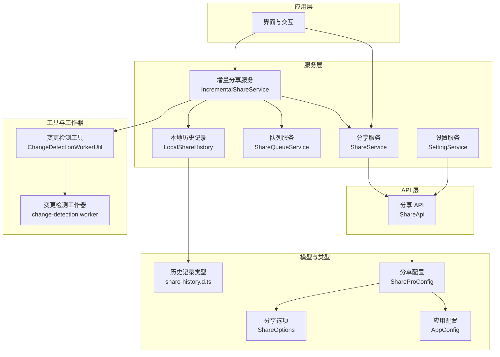
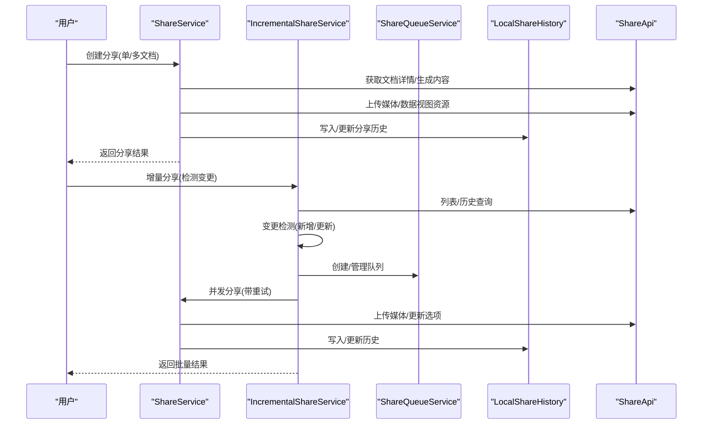
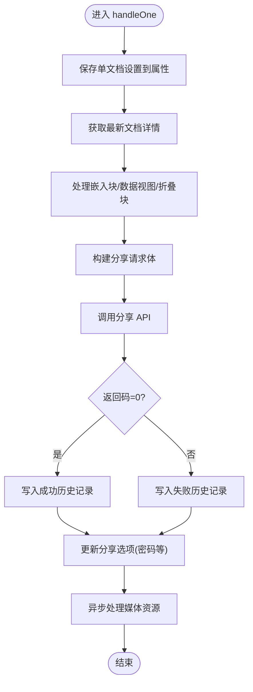
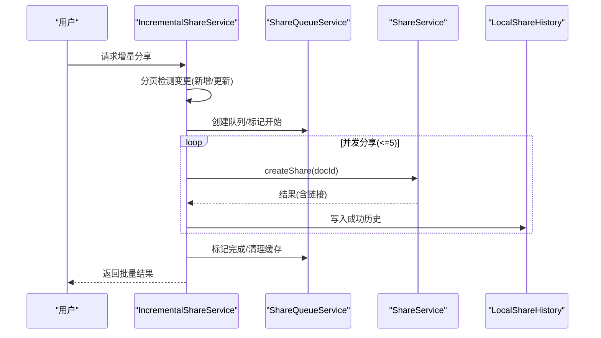
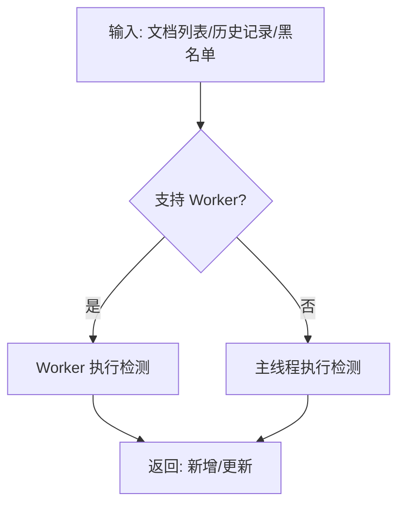
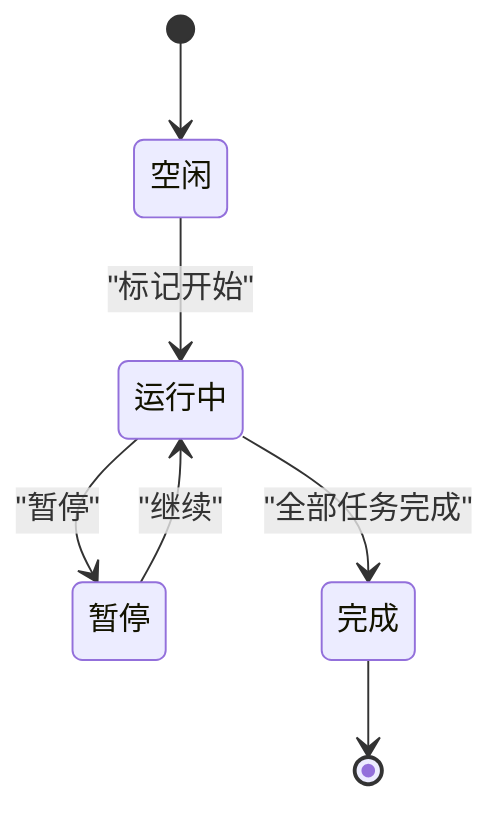
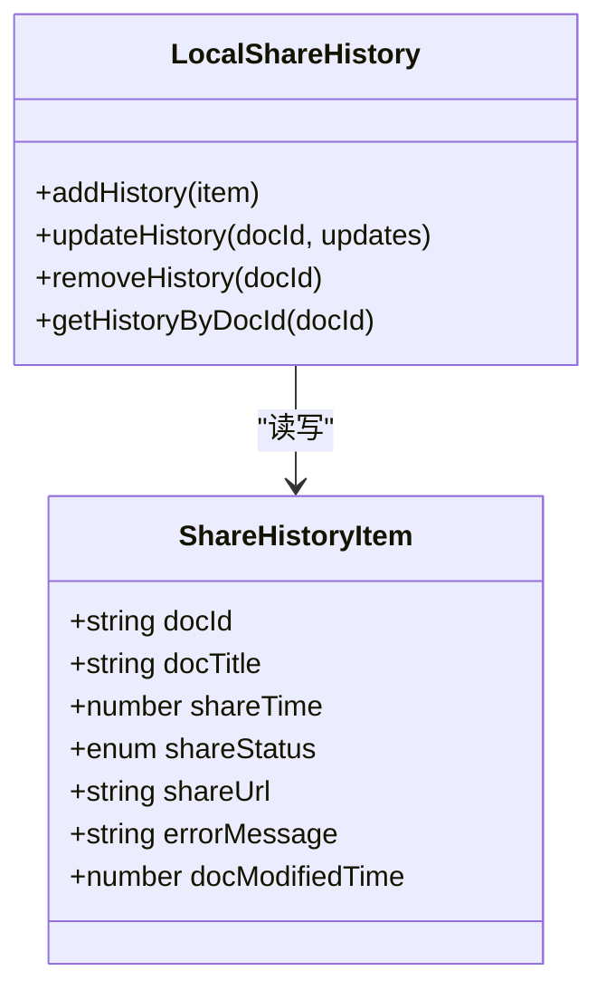
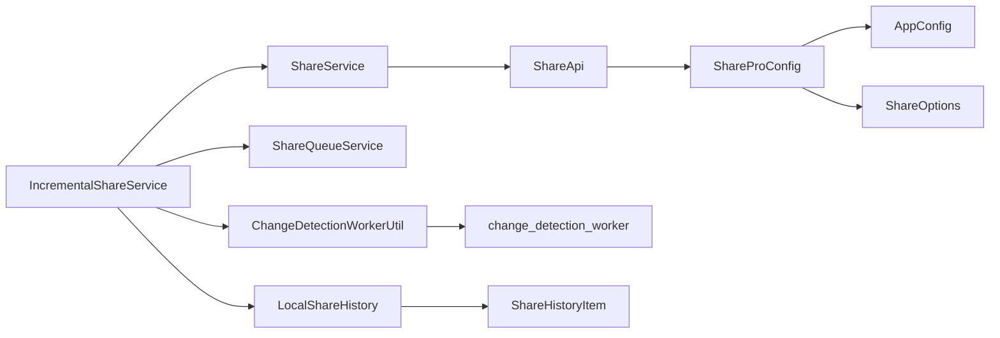

# 核心功能

<cite>
**本文引用的文件**   
- [src/service/ShareService.ts](file://src/service/ShareService.ts)
- [src/service/IncrementalShareService.ts](file://src/service/IncrementalShareService.ts)
- [src/service/SettingService.ts](file://src/service/SettingService.ts)
- [src/service/ShareQueueService.ts](file://src/service/ShareQueueService.ts)
- [src/service/LocalShareHistory.ts](file://src/service/LocalShareHistory.ts)
- [src/api/share-api.ts](file://src/api/share-api.ts)
- [src/utils/ChangeDetectionWorkerUtil.ts](file://src/utils/ChangeDetectionWorkerUtil.ts)
- [src/workers/change-detection.worker.ts](file://src/workers/change-detection.worker.ts)
- [src/models/ShareProConfig.ts](file://src/models/ShareProConfig.ts)
- [src/models/AppConfig.ts](file://src/models/AppConfig.ts)
- [src/models/ShareOptions.ts](file://src/models/ShareOptions.ts)
- [src/types/share-history.d.ts](file://src/types/share-history.d.ts)
- [src/utils/ShareHistoryUtils.ts](file://src/utils/ShareHistoryUtils.ts)
</cite>

## 目录
1. [简介](#简介)
2. [项目结构](#项目结构)
3. [核心组件](#核心组件)
4. [架构总览](#架构总览)
5. [详细组件分析](#详细组件分析)
6. [依赖关系分析](#依赖关系分析)
7. [性能考量](#性能考量)
8. [故障排查指南](#故障排查指南)
9. [结论](#结论)
10. [附录](#附录)

## 简介
本文件面向“思源笔记分享专业版”的核心功能，系统化梳理分享服务、增量分享服务、设置服务与相关基础设施，覆盖以下主题：
- 单文档分享、批量文档分享、子文档分享、引用文档分享的实现原理与使用方法
- 智能增量分享算法、变更检测机制与断点续传能力
- 配置管理、权限控制与历史追踪系统
- API 接口说明、参数定义与返回值格式
- 实际使用场景与最佳实践
- 常见问题与性能优化建议

## 项目结构
项目采用模块化组织，围绕“服务层”“模型层”“工具层”“类型层”“API 层”展开，核心功能集中在 service 与 api 目录，配合 utils 与 workers 提供高性能与可维护性。

图表来源
- [src/service/ShareService.ts:1-120](file://src/service/ShareService.ts#L1-L120)
- [src/service/IncrementalShareService.ts:1-130](file://src/service/IncrementalShareService.ts#L1-L130)
- [src/service/ShareQueueService.ts:1-60](file://src/service/ShareQueueService.ts#L1-L60)
- [src/service/LocalShareHistory.ts:1-40](file://src/service/LocalShareHistory.ts#L1-L40)
- [src/api/share-api.ts:16-60](file://src/api/share-api.ts#L16-L60)
- [src/utils/ChangeDetectionWorkerUtil.ts:17-60](file://src/utils/ChangeDetectionWorkerUtil.ts#L17-L60)
- [src/workers/change-detection.worker.ts:14-47](file://src/workers/change-detection.worker.ts#L14-L47)
- [src/models/ShareProConfig.ts:13-37](file://src/models/ShareProConfig.ts#L13-L37)
- [src/models/AppConfig.ts:12-85](file://src/models/AppConfig.ts#L12-L85)
- [src/models/ShareOptions.ts:16-24](file://src/models/ShareOptions.ts#L16-L24)
- [src/types/share-history.d.ts:13-59](file://src/types/share-history.d.ts#L13-L59)

章节来源
- [src/service/ShareService.ts:1-120](file://src/service/ShareService.ts#L1-L120)
- [src/service/IncrementalShareService.ts:1-130](file://src/service/IncrementalShareService.ts#L1-L130)
- [src/service/ShareQueueService.ts:1-60](file://src/service/ShareQueueService.ts#L1-L60)
- [src/service/LocalShareHistory.ts:1-40](file://src/service/LocalShareHistory.ts#L1-L40)
- [src/api/share-api.ts:16-60](file://src/api/share-api.ts#L16-L60)
- [src/utils/ChangeDetectionWorkerUtil.ts:17-60](file://src/utils/ChangeDetectionWorkerUtil.ts#L17-L60)
- [src/workers/change-detection.worker.ts:14-47](file://src/workers/change-detection.worker.ts#L14-L47)
- [src/models/ShareProConfig.ts:13-37](file://src/models/ShareProConfig.ts#L13-L37)
- [src/models/AppConfig.ts:12-85](file://src/models/AppConfig.ts#L12-L85)
- [src/models/ShareOptions.ts:16-24](file://src/models/ShareOptions.ts#L16-L24)
- [src/types/share-history.d.ts:13-59](file://src/types/share-history.d.ts#L13-L59)

## 核心组件
- 分享服务（ShareService）：统一的分享入口，负责单文档与多文档（含子文档、引用文档）分享流程编排、资源处理、历史记录与进度管理。
- 增量分享服务（IncrementalShareService）：基于变更检测的智能增量分享，支持并发控制、队列管理、断点续传与智能重试。
- 设置服务（SettingService）：提供作者维度的配置同步与读取能力。
- 队列服务（ShareQueueService）：持久化队列、任务状态管理、进度统计与失败重试。
- 本地历史记录（LocalShareHistory）：基于思源文档属性的本地历史记录存储与查询。
- 分享 API（ShareApi）：封装分享服务端接口调用，统一鉴权与错误处理。
- 变更检测工具（ChangeDetectionWorkerUtil 与 change-detection.worker）：在主线程或工作器中执行变更检测，区分新增与更新文档。
- 配置模型（ShareProConfig、AppConfig、ShareOptions）：集中管理分享所需的全局与文档级配置。

章节来源
- [src/service/ShareService.ts:40-258](file://src/service/ShareService.ts#L40-L258)
- [src/service/IncrementalShareService.ts:98-129](file://src/service/IncrementalShareService.ts#L98-L129)
- [src/service/SettingService.ts:18-36](file://src/service/SettingService.ts#L18-L36)
- [src/service/ShareQueueService.ts:24-60](file://src/service/ShareQueueService.ts#L24-L60)
- [src/service/LocalShareHistory.ts:23-52](file://src/service/LocalShareHistory.ts#L23-L52)
- [src/api/share-api.ts:16-240](file://src/api/share-api.ts#L16-L240)
- [src/utils/ChangeDetectionWorkerUtil.ts:17-60](file://src/utils/ChangeDetectionWorkerUtil.ts#L17-L60)
- [src/workers/change-detection.worker.ts:14-47](file://src/workers/change-detection.worker.ts#L14-L47)
- [src/models/ShareProConfig.ts:13-37](file://src/models/ShareProConfig.ts#L13-L37)
- [src/models/AppConfig.ts:12-85](file://src/models/AppConfig.ts#L12-L85)
- [src/models/ShareOptions.ts:16-24](file://src/models/ShareOptions.ts#L16-L24)

## 架构总览
分享体系由“服务层”协调“工具层”与“API 层”，通过“配置模型”与“类型约束”保证一致性；“队列服务”与“历史记录”提供持久化与可观测性；“变更检测”驱动增量分享。

图表来源
- [src/service/ShareService.ts:235-674](file://src/service/ShareService.ts#L235-L674)
- [src/service/IncrementalShareService.ts:160-351](file://src/service/IncrementalShareService.ts#L160-L351)
- [src/service/ShareQueueService.ts:38-60](file://src/service/ShareQueueService.ts#L38-L60)
- [src/service/LocalShareHistory.ts:31-52](file://src/service/LocalShareHistory.ts#L31-L52)
- [src/api/share-api.ts:46-111](file://src/api/share-api.ts#L46-L111)

## 详细组件分析

### 分享服务（ShareService）
职责与特性
- 统一入口：对外暴露创建分享与取消分享的公开方法，内部根据配置决定单文档或多文档处理。
- 多文档聚合：支持子文档与引用文档的扁平化收集，内置数量限制与分页拉取，避免超大规模导致性能问题。
- 资源处理：对图片与数据视图媒体进行分批上传，支持进度回调与错误记录。
- 历史追踪：无论成功与否均写入本地历史记录，便于后续增量检测与 UI 展示。
- 权限与选项：支持更新分享选项（如密码），并结合文档属性持久化单文档设置。

关键流程（单文档分享）

图表来源
- [src/service/ShareService.ts:531-674](file://src/service/ShareService.ts#L531-L674)
- [src/api/share-api.ts:46-111](file://src/api/share-api.ts#L46-L111)
- [src/service/LocalShareHistory.ts:31-52](file://src/service/LocalShareHistory.ts#L31-L52)

章节来源
- [src/service/ShareService.ts:101-226](file://src/service/ShareService.ts#L101-L226)
- [src/service/ShareService.ts:235-674](file://src/service/ShareService.ts#L235-L674)
- [src/service/ShareService.ts:442-485](file://src/service/ShareService.ts#L442-L485)

### 增量分享服务（IncrementalShareService）
职责与特性
- 变更检测：分页拉取文档列表，结合本地历史记录与黑名单，区分“新增”与“已更新”两类文档。
- 并发与队列：支持并发控制（默认 5），队列持久化与状态管理，支持暂停/继续与失败重试。
- 断点续传：队列恢复、任务状态持久化，失败任务可重置为待处理。
- 智能重试：对网络错误采用指数退避，对 5xx 错误延时重试，对 4xx 错误快速失败并记录。
- 缓存与性能：检测结果缓存（5 分钟），减少重复计算。

关键流程（增量分享）

图表来源
- [src/service/IncrementalShareService.ts:160-351](file://src/service/IncrementalShareService.ts#L160-L351)
- [src/service/IncrementalShareService.ts:396-577](file://src/service/IncrementalShareService.ts#L396-L577)
- [src/service/ShareQueueService.ts:38-60](file://src/service/ShareQueueService.ts#L38-L60)
- [src/service/ShareService.ts:235-258](file://src/service/ShareService.ts#L235-L258)
- [src/service/LocalShareHistory.ts:31-52](file://src/service/LocalShareHistory.ts#L31-L52)

章节来源
- [src/service/IncrementalShareService.ts:160-351](file://src/service/IncrementalShareService.ts#L160-L351)
- [src/service/IncrementalShareService.ts:396-577](file://src/service/IncrementalShareService.ts#L396-L577)
- [src/service/IncrementalShareService.ts:585-688](file://src/service/IncrementalShareService.ts#L585-L688)

### 变更检测机制
- 工具层：优先使用 Web Worker 执行检测，若不可用则回退主线程，避免阻塞 UI。
- 工作器：接收文档列表、历史记录与黑名单，输出“新增/更新/未变更/黑名单计数”。
- 算法要点：基于文档修改时间戳与历史记录对比，仅处理“新增/更新”两类文档，提升增量效率。

图表来源
- [src/utils/ChangeDetectionWorkerUtil.ts:36-59](file://src/utils/ChangeDetectionWorkerUtil.ts#L36-L59)
- [src/utils/ChangeDetectionWorkerUtil.ts:89-136](file://src/utils/ChangeDetectionWorkerUtil.ts#L89-L136)
- [src/workers/change-detection.worker.ts:49-72](file://src/workers/change-detection.worker.ts#L49-L72)
- [src/workers/change-detection.worker.ts:77-145](file://src/workers/change-detection.worker.ts#L77-L145)

章节来源
- [src/utils/ChangeDetectionWorkerUtil.ts:36-136](file://src/utils/ChangeDetectionWorkerUtil.ts#L36-L136)
- [src/workers/change-detection.worker.ts:49-145](file://src/workers/change-detection.worker.ts#L49-L145)

### 队列与断点续传
- 队列创建：为批量任务生成唯一 ID，初始状态为“空闲”，任务状态包含“待处理/处理中/成功/失败/跳过”。
- 暂停/继续：支持运行中暂停，恢复后自动转为“已暂停”，等待用户继续。
- 失败重试：失败任务可重置为“待处理”，并记录重试次数。
- 进度统计：估算剩余时间，提供总任务、已完成、成功、失败、处理中、待处理等指标。

图表来源
- [src/service/ShareQueueService.ts:38-60](file://src/service/ShareQueueService.ts#L38-L60)
- [src/service/ShareQueueService.ts:105-125](file://src/service/ShareQueueService.ts#L105-L125)
- [src/service/ShareQueueService.ts:199-217](file://src/service/ShareQueueService.ts#L199-L217)

章节来源
- [src/service/ShareQueueService.ts:38-217](file://src/service/ShareQueueService.ts#L38-L217)

### 历史追踪系统
- 存储位置：基于思源文档属性存储，键名由设置键常量定义。
- 数据结构：包含文档 ID、标题、分享时间、状态、分享链接、错误信息、文档修改时间戳等。
- 版本兼容：写入时附加版本号与更新时间，读取时进行版本兼容处理。
- 服务端转换：提供 DTO 到历史项的转换工具，用于服务端数据适配。

图表来源
- [src/types/share-history.d.ts:13-59](file://src/types/share-history.d.ts#L13-L59)
- [src/service/LocalShareHistory.ts:31-127](file://src/service/LocalShareHistory.ts#L31-L127)
- [src/utils/ShareHistoryUtils.ts:15-29](file://src/utils/ShareHistoryUtils.ts#L15-L29)

章节来源
- [src/types/share-history.d.ts:13-59](file://src/types/share-history.d.ts#L13-L59)
- [src/service/LocalShareHistory.ts:31-127](file://src/service/LocalShareHistory.ts#L31-L127)
- [src/utils/ShareHistoryUtils.ts:15-29](file://src/utils/ShareHistoryUtils.ts#L15-L29)

### 设置服务与权限控制
- 设置同步：支持按作者维度读取/保存配置，用于站点级配置下发与同步。
- 权限控制：通过请求头携带令牌访问受保护接口，如获取 VIP 信息、删除分享等。

章节来源
- [src/service/SettingService.ts:18-36](file://src/service/SettingService.ts#L18-L36)
- [src/api/share-api.ts:25-59](file://src/api/share-api.ts#L25-L59)
- [src/api/share-api.ts:90-102](file://src/api/share-api.ts#L90-L102)

### API 接口说明
- 获取文档详情：GET 分享文档信息（需授权）
- 删除文档：删除分享（需授权）
- 创建分享：提交 HTML 内容与文档属性
- 上传媒体：分批上传图片资源
- 上传数据视图媒体：上传数据视图资源
- 列表文档：分页获取分享列表
- 更新分享选项：仅更新选项（如密码），不重新上传内容
- 黑名单接口：分页列表、添加、删除、批量检查
- 历史记录：按文档 ID 批量获取历史

章节来源
- [src/api/share-api.ts:25-160](file://src/api/share-api.ts#L25-L160)
- [src/api/share-api.ts:212-239](file://src/api/share-api.ts#L212-L239)

## 依赖关系分析
- 分享服务依赖 API 层进行服务端交互，依赖工具层处理媒体与嵌入块、数据视图、折叠块等。
- 增量服务依赖分享服务进行具体分享，依赖队列服务进行任务编排，依赖历史记录与变更检测工具进行智能增量。
- 配置模型贯穿服务层与 API 层，确保全局与文档级配置的一致性。

图表来源
- [src/service/ShareService.ts:40-56](file://src/service/ShareService.ts#L40-L56)
- [src/service/IncrementalShareService.ts:98-129](file://src/service/IncrementalShareService.ts#L98-L129)
- [src/service/ShareQueueService.ts:24-33](file://src/service/ShareQueueService.ts#L24-L33)
- [src/service/LocalShareHistory.ts:23-29](file://src/service/LocalShareHistory.ts#L23-L29)
- [src/utils/ChangeDetectionWorkerUtil.ts:17-20](file://src/utils/ChangeDetectionWorkerUtil.ts#L17-L20)
- [src/workers/change-detection.worker.ts:14-16](file://src/workers/change-detection.worker.ts#L14-L16)
- [src/api/share-api.ts:16-23](file://src/api/share-api.ts#L16-L23)
- [src/models/ShareProConfig.ts:13-37](file://src/models/ShareProConfig.ts#L13-L37)
- [src/models/AppConfig.ts:12-85](file://src/models/AppConfig.ts#L12-L85)
- [src/models/ShareOptions.ts:16-24](file://src/models/ShareOptions.ts#L16-L24)
- [src/types/share-history.d.ts:13-59](file://src/types/share-history.d.ts#L13-L59)

章节来源
- [src/service/ShareService.ts:40-56](file://src/service/ShareService.ts#L40-L56)
- [src/service/IncrementalShareService.ts:98-129](file://src/service/IncrementalShareService.ts#L98-L129)
- [src/service/ShareQueueService.ts:24-33](file://src/service/ShareQueueService.ts#L24-L33)
- [src/service/LocalShareHistory.ts:23-29](file://src/service/LocalShareHistory.ts#L23-L29)
- [src/utils/ChangeDetectionWorkerUtil.ts:17-20](file://src/utils/ChangeDetectionWorkerUtil.ts#L17-L20)
- [src/workers/change-detection.worker.ts:14-16](file://src/workers/change-detection.worker.ts#L14-L16)
- [src/api/share-api.ts:16-23](file://src/api/share-api.ts#L16-L23)
- [src/models/ShareProConfig.ts:13-37](file://src/models/ShareProConfig.ts#L13-L37)
- [src/models/AppConfig.ts:12-85](file://src/models/AppConfig.ts#L12-L85)
- [src/models/ShareOptions.ts:16-24](file://src/models/ShareOptions.ts#L16-L24)
- [src/types/share-history.d.ts:13-59](file://src/types/share-history.d.ts#L13-L59)

## 性能考量
- 并发控制：增量分享默认并发 5，避免对服务端与本地造成过大压力。
- 分页与限制：子文档/引用文档分页拉取，支持最大数量限制与无限制模式（谨慎使用）。
- 缓存策略：变更检测结果缓存 5 分钟，减少重复计算。
- 资源分批：媒体资源按组上传，降低单次请求体积与失败概率。
- 队列持久化：失败任务可恢复，避免中断后全部重头开始。

## 故障排查指南
- 分享失败记录：无论成功与否，都会写入本地历史记录，可通过历史项查看错误信息与文档修改时间。
- 智能重试：网络错误采用指数退避，5xx 错误延时重试，4xx 错误快速失败并记录日志。
- 队列恢复：启动时尝试恢复未完成队列，若处于“运行中”则自动转为“已暂停”，等待手动继续。
- 黑名单过滤：批量分享前会分页检查黑名单，避免对黑名单文档重复尝试。

章节来源
- [src/service/ShareService.ts:580-674](file://src/service/ShareService.ts#L580-L674)
- [src/service/IncrementalShareService.ts:585-688](file://src/service/IncrementalShareService.ts#L585-L688)
- [src/service/ShareQueueService.ts:232-253](file://src/service/ShareQueueService.ts#L232-L253)
- [src/service/IncrementalShareService.ts:359-364](file://src/service/IncrementalShareService.ts#L359-L364)

## 结论
该体系以“服务层”为核心，结合“变更检测”“队列管理”“历史追踪”“配置模型”等模块，实现了从单文档到批量、从全量到增量的完整分享能力。通过并发控制、断点续传与智能重试，兼顾了可靠性与性能；通过本地历史记录与类型约束，提升了可观测性与可维护性。

## 附录

### 使用场景与最佳实践
- 单文档分享：适合临时分享某篇文档，无需子文档/引用文档联动。
- 批量分享：适合定期发布系列文章，建议开启并发控制与队列管理。
- 子文档分享：适合知识库/手册类文档，注意数量限制与分页策略。
- 引用文档分享：适合跨文档引用场景，建议配合黑名单避免循环引用。
- 增量分享：适合持续更新的文档集合，建议合理设置并发与缓存策略。

### 关键配置项（AppConfig）
- 子文档分享开关与层级
- 目录大纲开关与层级
- 全局密码保护与展示
- 增量分享开关与最后分享时间
- 笔记本黑名单（增量分享）

章节来源
- [src/models/AppConfig.ts:49-81](file://src/models/AppConfig.ts#L49-L81)