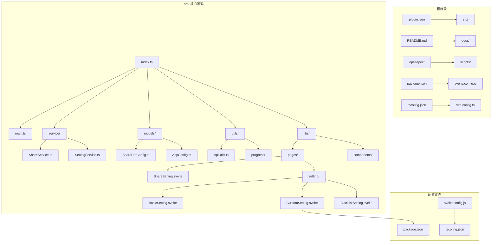
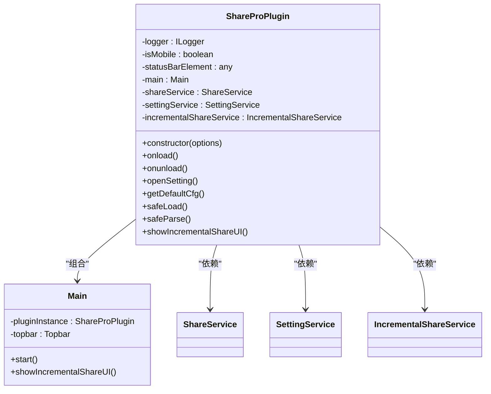
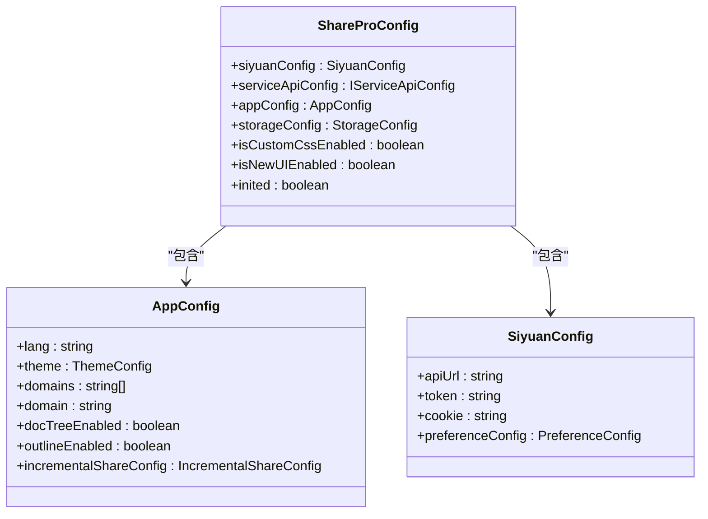
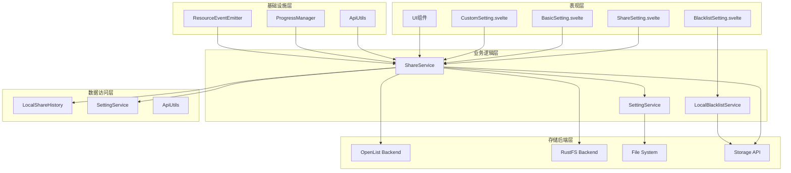
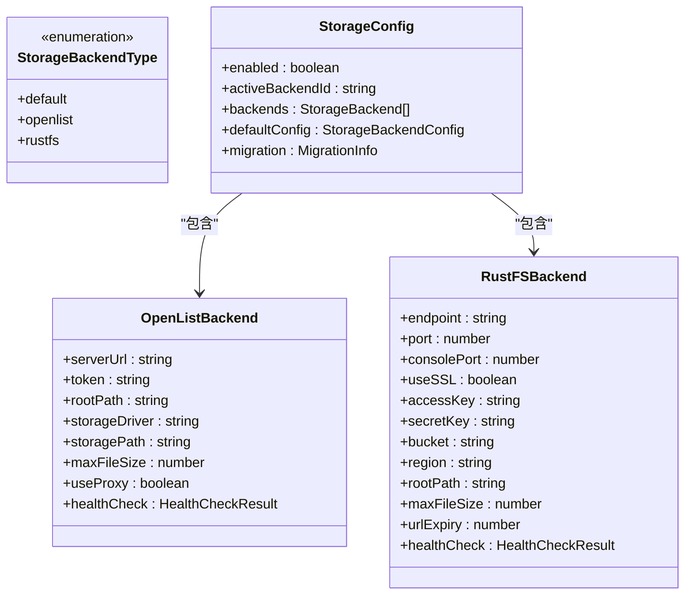
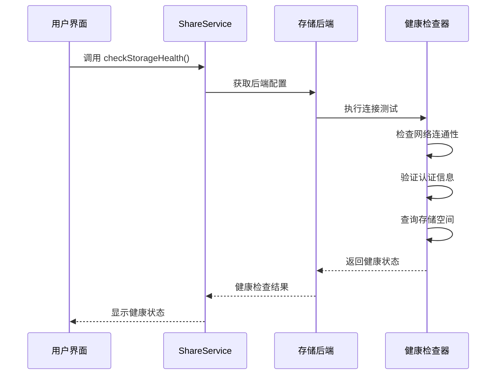
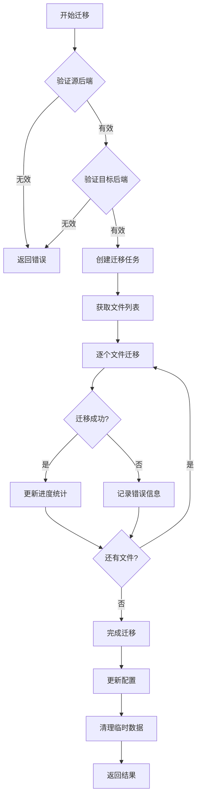
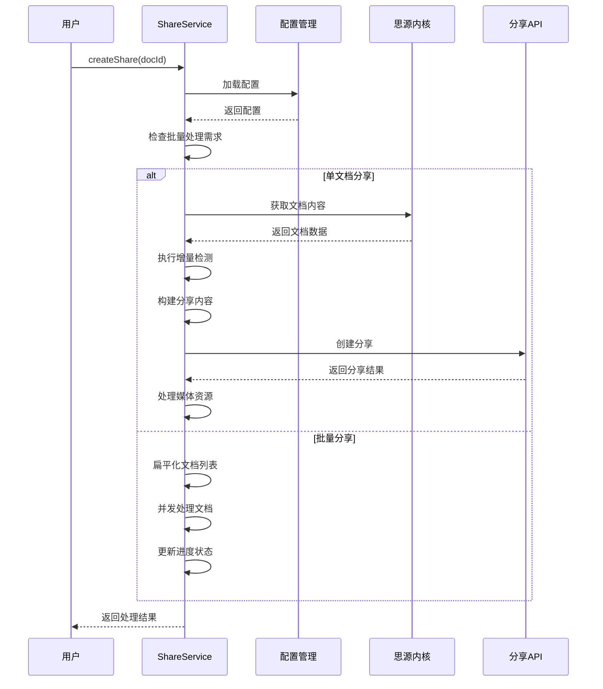
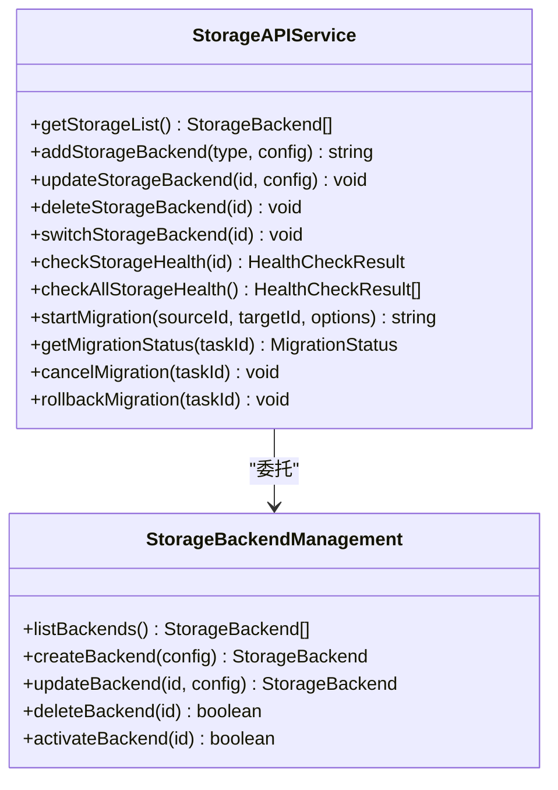

# 自定义存储系统

<cite>
**本文档引用的文件**
- [package.json](file://package.json)
- [svelte.config.js](file://svelte.config.js)
- [tsconfig.json](file://tsconfig.json)
- [src/index.ts](file://src/index.ts)
- [src/main.ts](file://src/main.ts)
- [src/Constants.ts](file://src/Constants.ts)
- [src/models/ShareProConfig.ts](file://src/models/ShareProConfig.ts)
- [src/models/AppConfig.ts](file://src/models/AppConfig.ts)
- [src/service/ShareService.ts](file://src/service/ShareService.ts)
- [src/service/SettingService.ts](file://src/service/SettingService.ts)
- [src/utils/ApiUtils.ts](file://src/utils/ApiUtils.ts)
- [src/libs/pages/ShareSetting.svelte](file://src/libs/pages/ShareSetting.svelte)
- [src/libs/pages/setting/CustomSetting.svelte](file://src/libs/pages/setting/CustomSetting.svelte)
- [src/libs/pages/setting/BasicSetting.svelte](file://src/libs/pages/setting/BasicSetting.svelte)
- [src/libs/pages/setting/BlacklistSetting.svelte](file://src/libs/pages/setting/BlacklistSetting.svelte)
- [openspec/changes/add-custom-storage/specs/storage/spec.md](file://openspec/changes/add-custom-storage/specs/storage/spec.md)
</cite>

## 更新摘要
**所做更改**
- 更新了项目依赖信息以反映 Svelte 4.2.20 和 TypeScript 6.0.2 的版本
- 更新了 Svelte 配置以支持 Svelte 4.x 架构
- 增强了存储 API 功能说明，反映了完整的存储后端管理能力
- 更新了 TypeScript 配置以支持最新的语言特性
- 完善了存储系统的架构描述，包含了完整的 API 功能

## 目录
1. [简介](#简介)
2. [项目结构](#项目结构)
3. [核心组件](#核心组件)
4. [架构概览](#架构概览)
5. [详细组件分析](#详细组件分析)
6. [依赖关系分析](#依赖关系分析)
7. [性能考虑](#性能考虑)
8. [故障排除指南](#故障排除指南)
9. [结论](#结论)

## 简介

自定义存储系统是思源笔记插件 Share Pro 的一个核心功能模块，旨在为用户提供灵活的存储后端配置和管理能力。该系统支持多种存储后端类型，包括 OpenList 和 RustFS，并提供了完整的存储配置、健康检查、迁移等功能。

**更新** 系统已从 Svelte 5 升级回 Svelte 4.2.20，以确保更好的兼容性和稳定性。同时集成了 TypeScript 6.0.2 的最新特性，提升了类型安全性和开发体验。

本系统基于 TypeScript 构建，采用模块化设计，通过插件架构与思源笔记深度集成。系统支持增量分享、批量处理、媒体资源管理等高级功能，为用户提供了完整的文档分享解决方案。

## 项目结构

项目采用标准的前端插件架构，主要包含以下核心目录：



**图表来源**
- [src/index.ts:1-178](file://src/index.ts#L1-L178)
- [src/main.ts:1-34](file://src/main.ts#L1-L34)
- [package.json:1-54](file://package.json#L1-L54)
- [svelte.config.js:1-15](file://svelte.config.js#L1-L15)
- [tsconfig.json:1-53](file://tsconfig.json#L1-L53)

**章节来源**
- [package.json:1-54](file://package.json#L1-L54)
- [svelte.config.js:1-15](file://svelte.config.js#L1-L15)
- [tsconfig.json:1-53](file://tsconfig.json#L1-L53)

## 核心组件

### 插件主入口

ShareProPlugin 类是整个系统的入口点，负责初始化各个服务组件并管理插件生命周期。



**图表来源**
- [src/index.ts:33-178](file://src/index.ts#L33-L178)
- [src/main.ts:12-34](file://src/main.ts#L12-L34)

### 配置管理系统

系统采用分层配置架构，支持基础配置、应用配置和自定义存储配置的统一管理。



**图表来源**
- [src/models/ShareProConfig.ts:13-40](file://src/models/ShareProConfig.ts#L13-L40)
- [src/models/AppConfig.ts:12-88](file://src/models/AppConfig.ts#L12-L88)

**章节来源**
- [src/index.ts:33-178](file://src/index.ts#L33-L178)
- [src/models/ShareProConfig.ts:13-40](file://src/models/ShareProConfig.ts#L13-L40)
- [src/models/AppConfig.ts:12-88](file://src/models/AppConfig.ts#L12-L88)

## 架构概览

自定义存储系统采用分层架构设计，各层职责明确，耦合度低，便于维护和扩展。



**图表来源**
- [src/libs/pages/ShareSetting.svelte:1-119](file://src/libs/pages/ShareSetting.svelte#L1-L119)
- [src/libs/pages/setting/BasicSetting.svelte:1-176](file://src/libs/pages/setting/BasicSetting.svelte#L1-L176)
- [src/libs/pages/setting/CustomSetting.svelte:1-206](file://src/libs/pages/setting/CustomSetting.svelte#L1-L206)
- [src/libs/pages/setting/BlacklistSetting.svelte:1-797](file://src/libs/pages/setting/BlacklistSetting.svelte#L1-L797)
- [src/service/ShareService.ts:45-1191](file://src/service/ShareService.ts#L45-L1191)
- [src/service/SettingService.ts:1-39](file://src/service/SettingService.ts#L1-L39)

系统的核心流程包括配置加载、服务初始化、UI渲染和数据处理四个主要阶段。

## 详细组件分析

### 存储后端类型定义

系统定义了统一的存储后端类型体系，确保不同类型存储的兼容性和一致性。



**图表来源**
- [openspec/changes/add-custom-storage/specs/storage/spec.md:3-44](file://openspec/changes/add-custom-storage/specs/storage/spec.md#L3-L44)

### 健康检查机制

系统实现了完善的存储后端健康检查功能，确保存储连接的可靠性和可用性。



**图表来源**
- [openspec/changes/add-custom-storage/specs/storage/spec.md:90-104](file://openspec/changes/add-custom-storage/specs/storage/spec.md#L90-L104)

### 迁移管理功能

系统提供了完整的存储迁移功能，支持在不同存储后端之间安全地转移数据。



**图表来源**
- [openspec/changes/add-custom-storage/specs/storage/spec.md:105-132](file://openspec/changes/add-custom-storage/specs/storage/spec.md#L105-L132)

### 分享服务核心逻辑

ShareService 是系统的核心业务组件，负责处理文档分享的完整流程。



**图表来源**
- [src/service/ShareService.ts:75-405](file://src/service/ShareService.ts#L75-L405)

**章节来源**
- [src/service/ShareService.ts:45-1191](file://src/service/ShareService.ts#L45-L1191)

### 存储 API 功能增强

系统提供了完整的存储后端管理 API，支持全面的存储配置和管理功能。



**图表来源**
- [openspec/changes/add-custom-storage/specs/storage/spec.md:55-132](file://openspec/changes/add-custom-storage/specs/storage/spec.md#L55-L132)

**章节来源**
- [openspec/changes/add-custom-storage/specs/storage/spec.md:1-205](file://openspec/changes/add-custom-storage/specs/storage/spec.md#L1-L205)

## 依赖关系分析

系统采用模块化设计，各组件之间的依赖关系清晰明确。

```mermaid
graph TB
subgraph "外部依赖"
A[siyuan]
B[zhi-lib-base]
C[zhi-blog-api]
D[typescript ^6.0.2]
E[svelte ^4.2.20]
F[@sveltejs/vite-plugin-svelte ^3.1.2]
G[@tsconfig/svelte ^5.0.8]
end
subgraph "内部模块"
H[src/index.ts]
I[src/main.ts]
J[src/service/]
K[src/models/]
L[src/utils/]
M[src/libs/]
end
subgraph "配置模块"
N[src/Constants.ts]
O[src/models/ShareProConfig.ts]
P[src/models/AppConfig.ts]
end
A --> H
B --> H
C --> J
D --> H
E --> H
F --> H
G --> H
H --> I
H --> J
H --> K
H --> L
H --> M
J --> N
K --> N
L --> N
M --> N
```

**图表来源**
- [package.json:22-51](file://package.json#L22-L51)
- [src/index.ts:10-31](file://src/index.ts#L10-L31)
- [src/Constants.ts:10-30](file://src/Constants.ts#L10-L30)

**章节来源**
- [package.json:1-54](file://package.json#L1-L54)
- [src/index.ts:10-31](file://src/index.ts#L10-L31)
- [src/Constants.ts:10-30](file://src/Constants.ts#L10-L30)

## 性能考虑

自定义存储系统在设计时充分考虑了性能优化，采用了多项技术手段来提升用户体验：

### 并发处理
- 批量操作采用并发处理策略，默认并发数为10
- 媒体资源上传采用分组处理，每组5个文件
- 增量分享机制避免重复处理未变更文档

### 缓存机制
- 分享历史缓存减少重复查询
- 配置缓存提升系统响应速度
- 进度状态缓存支持断点续传

### 资源管理
- 文件大小限制为50MB，防止资源滥用
- 健康检查定期执行，及时发现存储问题
- 连接池管理优化网络请求性能

### TypeScript 6.0.2 优化
- 更精确的类型推断和检查
- 改进的编译性能和错误报告
- 增强的装饰器支持和模块解析

## 故障排除指南

### 常见问题及解决方案

**存储连接失败**
- 检查网络连接和防火墙设置
- 验证认证信息的正确性
- 查看健康检查结果中的错误信息

**文件上传失败**
- 确认文件大小不超过50MB限制
- 检查存储后端的可用空间
- 验证存储路径的可写权限

**分享进度异常**
- 检查并发设置是否合理
- 查看错误日志获取详细信息
- 重启插件服务重置状态

**Svelte 4.x 兼容性问题**
- 确保使用正确的 Svelte 4.x 语法
- 检查组件生命周期钩子的正确使用
- 验证响应式声明的语法符合 Svelte 4.x 规范

**TypeScript 6.0.2 类型错误**
- 检查类型注解是否符合新的类型系统要求
- 验证泛型参数的使用是否正确
- 确认模块解析和路径映射配置

**章节来源**
- [openspec/changes/add-custom-storage/specs/storage/spec.md:184-205](file://openspec/changes/add-custom-storage/specs/storage/spec.md#L184-L205)

## 结论

自定义存储系统为思源笔记用户提供了强大而灵活的存储解决方案。通过模块化的架构设计、完善的配置管理和健壮的错误处理机制，系统能够满足不同用户的需求。

**更新** 系统现已稳定运行在 Svelte 4.2.20 和 TypeScript 6.0.2 环境下，提供了更好的性能和开发体验。增强了的存储 API 功能使得存储后端管理更加直观和高效。

系统的主要优势包括：
- 支持多种存储后端类型，提供灵活的选择
- 完整的健康检查和迁移功能
- 高效的并发处理和资源管理
- 用户友好的配置界面和错误提示
- 稳定的 Svelte 4.x 架构和 TypeScript 6.0.2 类型系统

随着功能的不断完善和技术的持续演进，自定义存储系统将继续为思源笔记生态系统的用户创造更大价值。