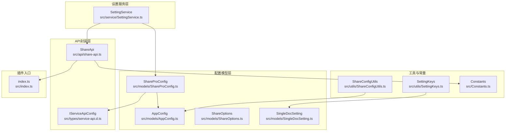
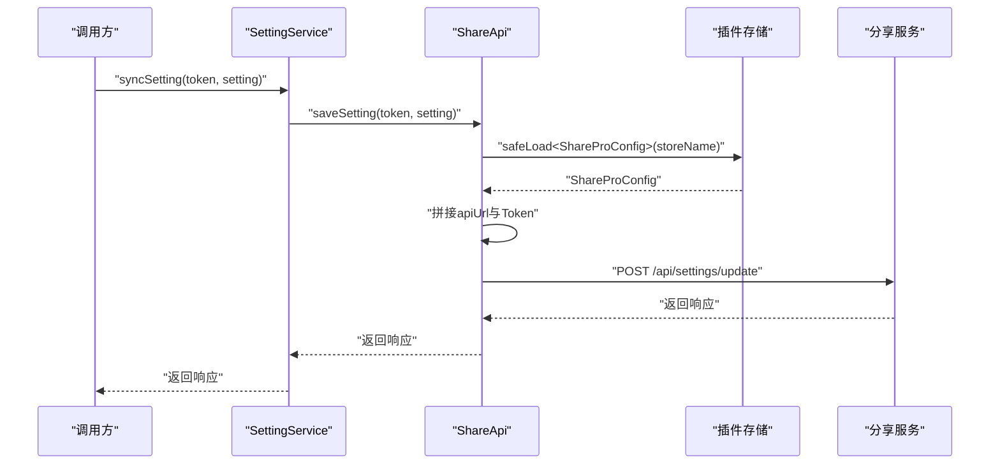
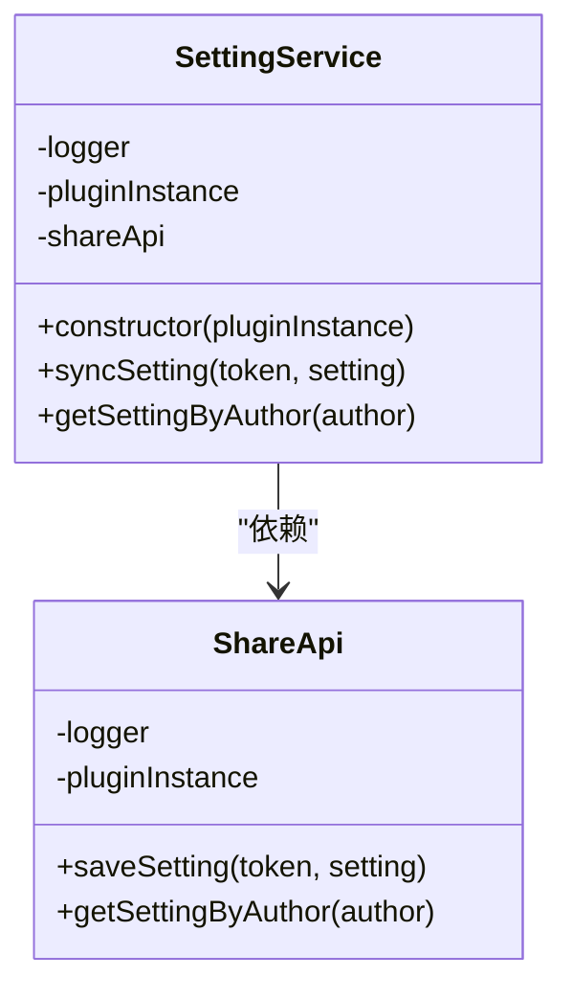
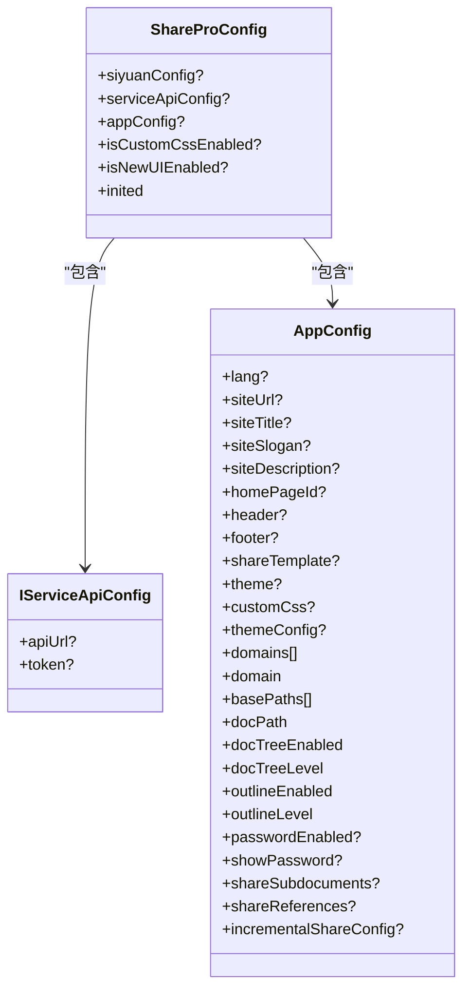
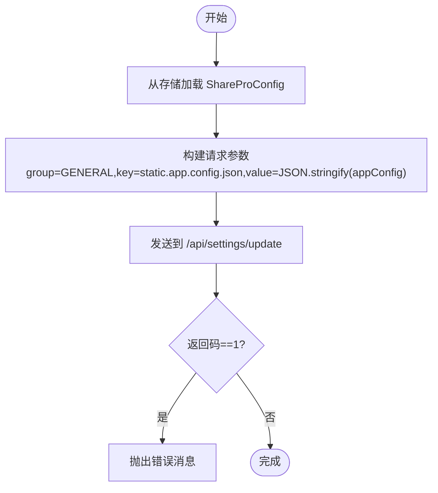
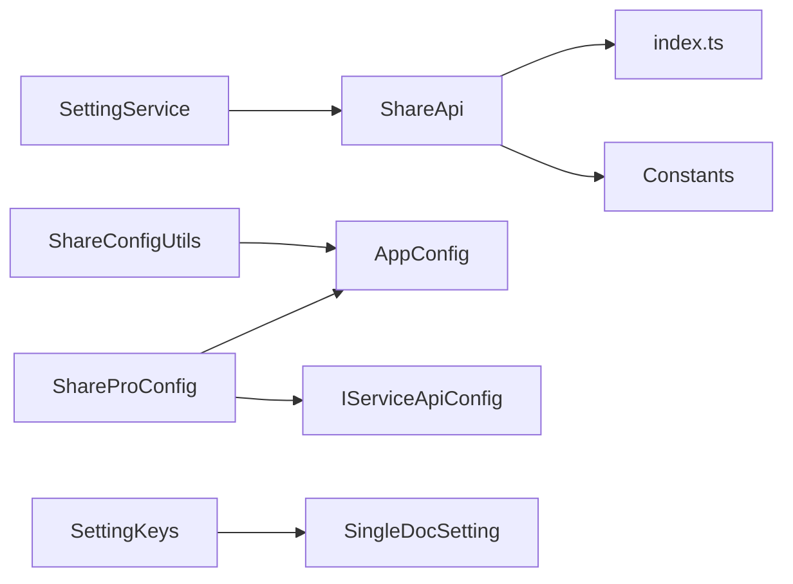

# 设置服务

<cite>
**本文引用的文件**
- [SettingService.ts](file://src/service/SettingService.ts)
- [ShareProConfig.ts](file://src/models/ShareProConfig.ts)
- [AppConfig.ts](file://src/models/AppConfig.ts)
- [SettingKeys.ts](file://src/utils/SettingKeys.ts)
- [ShareConfigUtils.ts](file://src/utils/ShareConfigUtils.ts)
- [ShareOptions.ts](file://src/models/ShareOptions.ts)
- [SingleDocSetting.ts](file://src/models/SingleDocSetting.ts)
- [service-api.d.ts](file://src/types/service-api.d.ts)
- [share-api.ts](file://src/api/share-api.ts)
- [Constants.ts](file://src/Constants.ts)
- [index.ts](file://src/index.ts)
</cite>

## 目录
1. [简介](#简介)
2. [项目结构](#项目结构)
3. [核心组件](#核心组件)
4. [架构总览](#架构总览)
5. [详细组件分析](#详细组件分析)
6. [依赖关系分析](#依赖关系分析)
7. [性能与缓存策略](#性能与缓存策略)
8. [故障排查指南](#故障排查指南)
9. [结论](#结论)
10. [附录：配置示例与最佳实践](#附录配置示例与最佳实践)

## 简介
本文件聚焦于设置服务模块，系统性阐述 SettingService 的配置管理能力与实现原理；详解 ShareProConfig 与 AppConfig 数据模型的设计与用途，并说明二者在“全局配置”与“应用配置”上的区别；梳理配置的加载、保存、同步与验证机制；文档化配置项的分类管理（分享选项、SEO 设置、权限控制、性能参数）；给出配置迁移、版本兼容性与默认值处理的实现细节；并提供配置修改的实时生效机制与缓存策略建议，以及具体配置示例与最佳实践。

## 项目结构
设置服务模块位于 src/service/ 下，核心入口为 SettingService；配置数据模型位于 src/models/；配置键常量与默认值工具位于 src/utils/；对外 API 封装位于 src/api/；类型定义位于 src/types/；全局常量位于 src/Constants.ts；插件主入口 index.ts 提供安全读取配置的能力。

图表来源
- [SettingService.ts:18-36](file://src/service/SettingService.ts#L18-L36)
- [ShareProConfig.ts:13-37](file://src/models/ShareProConfig.ts#L13-L37)
- [AppConfig.ts:12-85](file://src/models/AppConfig.ts#L12-L85)
- [ShareOptions.ts:16-24](file://src/models/ShareOptions.ts#L16-L24)
- [SingleDocSetting.ts:18-82](file://src/models/SingleDocSetting.ts#L18-L82)
- [SettingKeys.ts:13-72](file://src/utils/SettingKeys.ts#L13-L72)
- [ShareConfigUtils.ts:16-42](file://src/utils/ShareConfigUtils.ts#L16-L42)
- [share-api.ts:16-239](file://src/api/share-api.ts#L16-L239)
- [service-api.d.ts:13-16](file://src/types/service-api.d.ts#L13-L16)
- [Constants.ts:10-19](file://src/Constants.ts#L10-L19)
- [index.ts:74](file://src/index.ts#L74)

章节来源
- [SettingService.ts:18-36](file://src/service/SettingService.ts#L18-L36)
- [ShareProConfig.ts:13-37](file://src/models/ShareProConfig.ts#L13-L37)
- [AppConfig.ts:12-85](file://src/models/AppConfig.ts#L12-L85)
- [share-api.ts:16-239](file://src/api/share-api.ts#L16-L239)
- [Constants.ts:10-19](file://src/Constants.ts#L10-L19)

## 核心组件
- SettingService：提供配置同步与按作者查询配置的能力，内部通过 ShareApi 调用后端设置接口。
- ShareProConfig：顶层配置对象，包含服务端 API 配置、应用配置、是否启用新 UI、是否启用自定义 CSS、以及初始化标记等字段。
- AppConfig：应用级配置，涵盖站点信息、主题、域名与路径、文档树/大纲、密码保护、子文档分享、引用文档分享、增量分享等。
- ShareOptions：单次分享的可选参数（如密码）。
- SingleDocSetting：针对单篇文档的分享设置（如文档树/大纲、有效期、子文档/引用分享等）。
- ShareConfigUtils：提供默认应用配置、主题映射、增量分享默认启用策略、以及将本地配置同步到服务端的逻辑。
- ShareApi：封装与分享服务的交互，负责保存/读取配置、媒体上传、黑名单、历史记录等。
- IServiceApiConfig：服务端 API 访问所需的最小配置（URL 与 Token）。
- Constants：全局常量（如存储键名、默认语言、开发模式开关等）。

章节来源
- [SettingService.ts:18-36](file://src/service/SettingService.ts#L18-L36)
- [ShareProConfig.ts:13-37](file://src/models/ShareProConfig.ts#L13-L37)
- [AppConfig.ts:12-85](file://src/models/AppConfig.ts#L12-L85)
- [ShareOptions.ts:16-24](file://src/models/ShareOptions.ts#L16-L24)
- [SingleDocSetting.ts:18-82](file://src/models/SingleDocSetting.ts#L18-L82)
- [ShareConfigUtils.ts:16-82](file://src/utils/ShareConfigUtils.ts#L16-L82)
- [share-api.ts:16-239](file://src/api/share-api.ts#L16-L239)
- [service-api.d.ts:13-16](file://src/types/service-api.d.ts#L13-L16)
- [Constants.ts:10-19](file://src/Constants.ts#L10-L19)

## 架构总览
SettingService 作为配置管理的门面，仅负责调用 ShareApi 完成配置的保存与查询；ShareApi 负责从插件存储中读取 ShareProConfig，拼接服务端地址与 Token，发起 HTTP 请求；服务端接口以“分组+键”的形式存储配置，键固定为“static.app.config.json”。

图表来源
- [SettingService.ts:29-31](file://src/service/SettingService.ts#L29-L31)
- [share-api.ts:90-102](file://src/api/share-api.ts#L90-L102)
- [index.ts:125](file://src/index.ts#L125)
- [Constants.ts:15](file://src/Constants.ts#L15)

## 详细组件分析

### SettingService 组件分析
- 职责
  - 将本地配置同步到服务端（覆盖式写入）。
  - 按作者维度拉取静态应用配置。
- 关键点
  - 通过 ShareApi.saveSetting 完成同步。
  - 通过 ShareApi.getSettingByAuthor 拉取作者配置。
- 错误处理
  - 返回码非成功时抛出错误消息（由调用方捕获）。

图表来源
- [SettingService.ts:18-36](file://src/service/SettingService.ts#L18-L36)
- [share-api.ts:79-102](file://src/api/share-api.ts#L79-L102)

章节来源
- [SettingService.ts:18-36](file://src/service/SettingService.ts#L18-L36)
- [share-api.ts:79-102](file://src/api/share-api.ts#L79-L102)

### ShareProConfig 与 AppConfig 数据模型
- ShareProConfig
  - 字段要点：服务端 API 配置（apiUrl/token）、Cookie、偏好设置（标题修复、文档树、大纲等）、应用配置对象、是否启用新 UI、是否启用自定义 CSS、初始化标记。
  - 作用：作为顶层容器，承载服务端访问凭据与应用配置对象，便于统一持久化与传输。
- AppConfig
  - 字段要点：站点信息（URL、标题、标语、描述、首页 ID、页头页脚、分享模板）、主题（模式、亮/暗主题、主题版本）、自定义 CSS 列表、主题配置（Logo）、域名与路径、文档树/大纲开关与层级、密码保护开关、子文档分享、引用文档分享、增量分享配置（开关、上次分享时间、笔记本黑名单）。
  - 设计意图：将“应用级”配置抽象为单一对象，便于默认值注入、序列化/反序列化、跨模块共享与同步。

图表来源
- [ShareProConfig.ts:13-37](file://src/models/ShareProConfig.ts#L13-L37)
- [service-api.d.ts:13-16](file://src/types/service-api.d.ts#L13-L16)
- [AppConfig.ts:12-85](file://src/models/AppConfig.ts#L12-L85)

章节来源
- [ShareProConfig.ts:13-37](file://src/models/ShareProConfig.ts#L13-L37)
- [AppConfig.ts:12-85](file://src/models/AppConfig.ts#L12-L85)
- [service-api.d.ts:13-16](file://src/types/service-api.d.ts#L13-L16)

### 配置加载、保存、同步与验证机制
- 加载
  - 插件入口提供安全读取方法，从指定存储键加载 ShareProConfig。
  - ShareApi 在每次请求前从存储中读取配置，确保使用最新服务端地址与 Token。
- 保存
  - SettingService.syncSetting 将 AppConfig 序列化为字符串后提交至服务端。
  - 服务端以“分组=GENERAL、键=static.app.config.json”的方式存储。
- 同步
  - ShareConfigUtils.syncAppConfig 提供统一的同步流程：读取 appConfig -> 调用 SettingService -> 服务端返回码校验。
- 验证
  - 服务端返回码为 1 视为失败，抛出错误消息；调用方可据此提示用户或重试。

图表来源
- [share-api.ts:90-102](file://src/api/share-api.ts#L90-L102)
- [ShareConfigUtils.ts:74-80](file://src/utils/ShareConfigUtils.ts#L74-L80)

章节来源
- [index.ts:74](file://src/index.ts#L74)
- [share-api.ts:177-209](file://src/api/share-api.ts#L177-L209)
- [share-api.ts:90-102](file://src/api/share-api.ts#L90-L102)
- [ShareConfigUtils.ts:74-80](file://src/utils/ShareConfigUtils.ts#L74-L80)

### 配置项分类管理
- 分享选项
  - 单次分享密码：通过 ShareOptions.passwordEnabled/password 控制。
  - 单文档分享选项：通过 SingleDocSetting.expiresTime/docTreeEnable/docTreeLevel/outlineEnable/outlineLevel/... 控制。
- SEO 设置
  - 站点标题、标语、描述、首页 ID、分享模板等由 AppConfig.siteTitle/siteSlogan/siteDescription/homePageId/shareTemplate 等字段承载。
- 权限控制
  - 全局密码保护：AppConfig.passwordEnabled/showPassword。
  - 黑名单：通过 ShareApi 的黑名单接口进行管理（与配置项互补）。
- 性能参数
  - 文档树/大纲层级：docTreeLevel/outlineLevel。
  - 增量分享：incrementalShareConfig.enabled/lastShareTime/notebookBlacklist。
  - 自定义 CSS：isCustomCssEnabled 与 customCss 列表。

章节来源
- [ShareOptions.ts:16-24](file://src/models/ShareOptions.ts#L16-L24)
- [SingleDocSetting.ts:18-82](file://src/models/SingleDocSetting.ts#L18-L82)
- [AppConfig.ts:12-85](file://src/models/AppConfig.ts#L12-L85)
- [share-api.ts:116-151](file://src/api/share-api.ts#L116-L151)

### 配置迁移、版本兼容性与默认值处理
- 默认值
  - ShareConfigUtils.DefaultAppConfig 提供站点信息、主题、增量分享默认启用、子文档分享默认禁用等默认值。
- 版本兼容
  - 主题版本字段 themeVersion 与 versionMap 映射主题版本号，用于兼容不同主题版本。
- 迁移
  - 新增字段采用可选属性设计（?），避免旧配置缺失导致解析失败；调用方在读取时需做存在性判断与兜底赋值。

章节来源
- [ShareConfigUtils.ts:16-42](file://src/utils/ShareConfigUtils.ts#L16-L42)
- [ShareConfigUtils.ts:64-72](file://src/utils/ShareConfigUtils.ts#L64-L72)
- [AppConfig.ts:12-85](file://src/models/AppConfig.ts#L12-L85)

### 实时生效机制与缓存策略
- 实时生效
  - 通过 SettingService.syncSetting 将最新配置推送到服务端；调用方可选择在配置变更后立即触发同步。
- 缓存策略
  - ShareApi 在请求前从存储读取最新配置，确保每次请求都使用最新 Token 与服务端地址。
  - 建议：前端 UI 可在配置变更后刷新页面或局部更新，避免因浏览器缓存导致展示陈旧。

章节来源
- [share-api.ts:177-209](file://src/api/share-api.ts#L177-L209)
- [SettingService.ts:29-31](file://src/service/SettingService.ts#L29-L31)

## 依赖关系分析
SettingService 依赖 ShareApi；ShareApi 依赖插件存储与服务端 API；ShareProConfig 包含 AppConfig 与 IServiceApiConfig；默认配置与主题映射来自 ShareConfigUtils；配置键常量来自 SettingKeys；全局常量来自 Constants。

图表来源
- [SettingService.ts:18-36](file://src/service/SettingService.ts#L18-L36)
- [share-api.ts:16-239](file://src/api/share-api.ts#L16-L239)
- [ShareProConfig.ts:13-37](file://src/models/ShareProConfig.ts#L13-L37)
- [AppConfig.ts:12-85](file://src/models/AppConfig.ts#L12-L85)
- [ShareConfigUtils.ts:16-82](file://src/utils/ShareConfigUtils.ts#L16-L82)
- [SettingKeys.ts:13-72](file://src/utils/SettingKeys.ts#L13-L72)
- [Constants.ts:10-19](file://src/Constants.ts#L10-L19)
- [index.ts:74](file://src/index.ts#L74)

章节来源
- [SettingService.ts:18-36](file://src/service/SettingService.ts#L18-L36)
- [share-api.ts:16-239](file://src/api/share-api.ts#L16-L239)
- [ShareProConfig.ts:13-37](file://src/models/ShareProConfig.ts#L13-L37)
- [AppConfig.ts:12-85](file://src/models/AppConfig.ts#L12-L85)
- [ShareConfigUtils.ts:16-82](file://src/utils/ShareConfigUtils.ts#L16-L82)
- [SettingKeys.ts:13-72](file://src/utils/SettingKeys.ts#L13-L72)
- [Constants.ts:10-19](file://src/Constants.ts#L10-L19)
- [index.ts:74](file://src/index.ts#L74)

## 性能与缓存策略
- 请求合并：批量更新配置时尽量减少网络往返，一次同步多个字段。
- 本地缓存：在 UI 层对 AppConfig 做浅拷贝缓存，变更时只更新差异字段再提交。
- 主题资源：利用 versionMap 与主题版本字段，避免重复下载相同版本的主题资源。
- 重试与降级：在网络异常时，记录错误并提示用户稍后重试，必要时回退到默认配置。

## 故障排查指南
- 未找到分享服务
  - 现象：请求前提示“未找到分享服务，请先初始化”。
  - 排查：确认 ShareProConfig.serviceApiConfig.apiUrl 已正确设置。
- 同步失败
  - 现象：返回码为 1，抛出错误消息。
  - 排查：检查 Token 是否有效、服务端是否可达、配置格式是否符合预期。
- 配置未生效
  - 现象：界面仍显示旧配置。
  - 排查：确认已调用 syncSetting 并等待服务端返回；检查浏览器缓存与页面刷新。

章节来源
- [share-api.ts:180-183](file://src/api/share-api.ts#L180-L183)
- [share-api.ts:79-102](file://src/api/share-api.ts#L79-L102)

## 结论
SettingService 以轻量门面的方式整合了配置的保存与查询；ShareProConfig 与 AppConfig 将“全局配置”与“应用配置”清晰分离；通过 ShareConfigUtils 的默认值与主题映射，提升了版本兼容性与易用性；结合 ShareApi 的统一请求封装，实现了配置的可靠同步与验证。建议在实际使用中遵循“变更即同步”的原则，并配合前端缓存与错误重试策略，确保配置修改的实时性与稳定性。

## 附录：配置示例与最佳实践
- 示例一：启用增量分享并设置主题
  - 在 AppConfig 中将 incrementalShareConfig.enabled 设为 true，并设置 theme.mode/lightTheme/darkTheme/themeVersion。
- 示例二：启用密码保护
  - 在 AppConfig 中设置 passwordEnabled=true；在 ShareOptions 中设置 passwordEnabled=true 与 password。
- 示例三：文档树与大纲层级
  - 在 AppConfig 中设置 docTreeEnabled=true/docTreeLevel=3/outlineEnabled=true/outlineLevel=2。
- 最佳实践
  - 默认值优先：使用 ShareConfigUtils.DefaultAppConfig 作为基线，仅覆盖需要的字段。
  - 渐进迁移：新增字段采用可选属性，逐步替换旧字段。
  - 实时同步：在配置面板保存后立即调用 syncSetting，避免用户感知延迟。
  - 错误提示：对返回码进行统一处理，向用户反馈明确的错误信息。