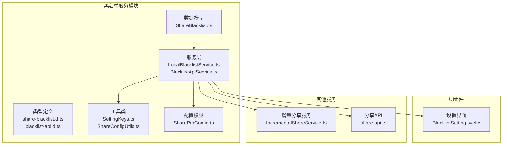
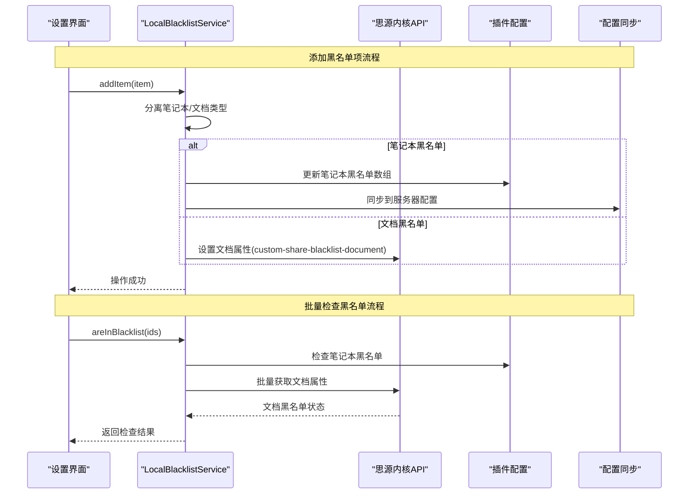
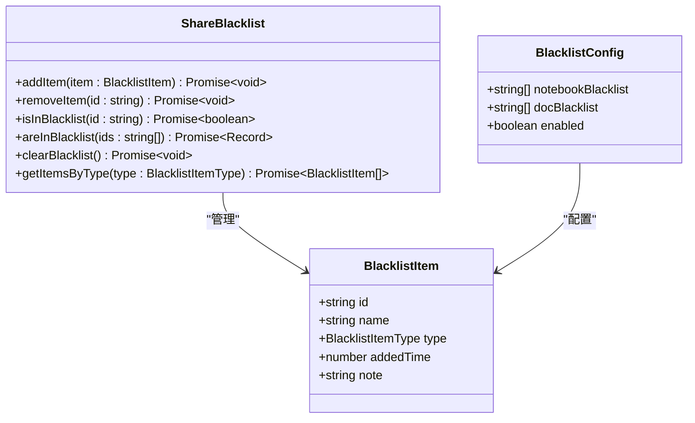
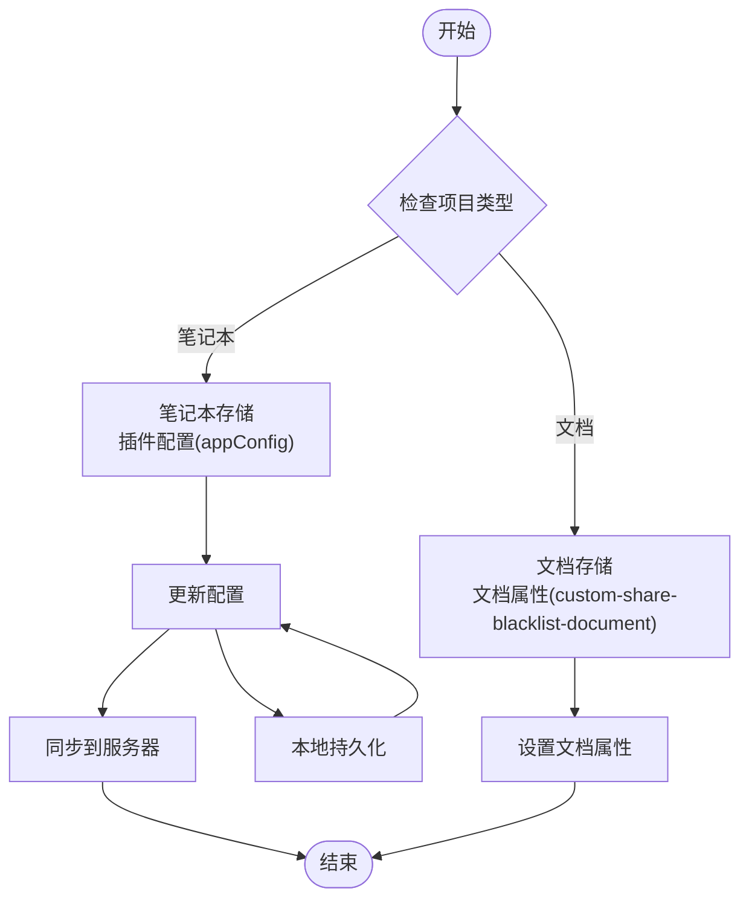
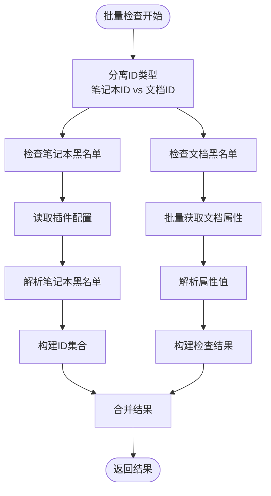
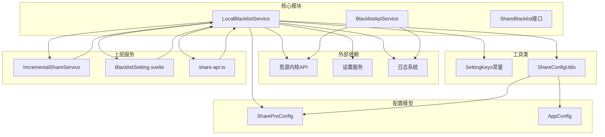

# 黑名单服务

<cite>
**本文引用的文件**
- [ShareBlacklist.ts](file://src/models/ShareBlacklist.ts)
- [LocalBlacklistService.ts](file://src/service/LocalBlacklistService.ts)
- [BlacklistApiService.ts](file://src/service/BlacklistApiService.ts)
- [share-blacklist.d.ts](file://src/types/share-blacklist.d.ts)
- [blacklist-api.d.ts](file://src/types/blacklist-api.d.ts)
- [SettingKeys.ts](file://src/utils/SettingKeys.ts)
- [ShareConfigUtils.ts](file://src/utils/ShareConfigUtils.ts)
- [ShareProConfig.ts](file://src/models/ShareProConfig.ts)
- [IncrementalShareService.ts](file://src/service/IncrementalShareService.ts)
- [BlacklistSetting.svelte](file://src/libs/pages/setting/BlacklistSetting.svelte)
- [share-api.ts](file://src/api/share-api.ts)
</cite>

## 目录
1. [简介](#简介)
2. [项目结构](#项目结构)
3. [核心组件](#核心组件)
4. [架构概览](#架构概览)
5. [详细组件分析](#详细组件分析)
6. [依赖关系分析](#依赖关系分析)
7. [性能考虑](#性能考虑)
8. [故障排除指南](#故障排除指南)
9. [结论](#结论)
10. [附录](#附录)

## 简介

黑名单服务模块是思源笔记分享专业版的重要组成部分，负责管理和控制文档及笔记本的分享权限。该模块实现了本地和远程黑名单的双重管理机制，提供了完整的黑名单生命周期管理功能，包括添加、删除、查询和批量操作等核心功能。

本模块的核心价值在于通过黑名单机制精确控制特定文档的分享权限，确保用户能够灵活地管理哪些内容可以被分享，哪些内容应该被限制访问。通过本地存储和远程同步的结合，既保证了操作的实时性，又确保了跨设备的一致性。

## 项目结构

黑名单服务模块在项目中的组织结构如下：



**图表来源**
- [ShareBlacklist.ts:1-99](file://src/models/ShareBlacklist.ts#L1-L99)
- [LocalBlacklistService.ts:1-658](file://src/service/LocalBlacklistService.ts#L1-L658)
- [BlacklistApiService.ts:1-76](file://src/service/BlacklistApiService.ts#L1-L76)

**章节来源**
- [ShareBlacklist.ts:1-99](file://src/models/ShareBlacklist.ts#L1-L99)
- [LocalBlacklistService.ts:1-658](file://src/service/LocalBlacklistService.ts#L1-L658)
- [BlacklistApiService.ts:1-76](file://src/service/BlacklistApiService.ts#L1-L76)

## 核心组件

### ShareBlacklist 接口

ShareBlacklist 接口定义了黑名单管理的核心能力，包括基本的增删查改操作和高级功能：

- **基础操作**：addItem、removeItem、isInBlacklist、areInBlacklist、clearBlacklist
- **查询功能**：getItemsByType、getItemsCount、getItemsPaged
- **搜索功能**：searchDocuments、searchNotebooks
- **分页支持**：完整的分页加载机制

### LocalBlacklistService 实现

LocalBlacklistService 是黑名单服务的主要实现类，提供了完整的本地黑名单管理功能：

- **存储策略**：笔记本黑名单存储在插件配置中，文档黑名单存储在文档属性中
- **查询优化**：支持分页查询、关键词搜索和类型筛选
- **批量操作**：高效的批量黑名单检查和管理
- **同步机制**：本地修改自动同步到服务器配置

**章节来源**
- [ShareBlacklist.ts:48-78](file://src/models/ShareBlacklist.ts#L48-L78)
- [LocalBlacklistService.ts:31-41](file://src/service/LocalBlacklistService.ts#L31-L41)

## 架构概览

黑名单服务采用分层架构设计，实现了本地存储与远程同步的有机结合：



**图表来源**
- [LocalBlacklistService.ts:168-202](file://src/service/LocalBlacklistService.ts#L168-L202)
- [LocalBlacklistService.ts:221-249](file://src/service/LocalBlacklistService.ts#L221-L249)

**章节来源**
- [LocalBlacklistService.ts:168-249](file://src/service/LocalBlacklistService.ts#L168-L249)

## 详细组件分析

### ShareBlacklist 数据模型

ShareBlacklist 数据模型定义了黑名单条目的完整结构：



**图表来源**
- [ShareBlacklist.ts:18-43](file://src/models/ShareBlacklist.ts#L18-L43)
- [ShareBlacklist.ts:48-78](file://src/models/ShareBlacklist.ts#L48-L78)
- [ShareBlacklist.ts:83-98](file://src/models/ShareBlacklist.ts#L83-L98)

#### 字段详细说明

| 字段名 | 类型 | 必填 | 描述 | 默认值 |
|--------|------|------|------|--------|
| id | string | 是 | 项目ID（笔记本ID或文档ID） | - |
| name | string | 是 | 项目名称（笔记本名称或文档标题） | - |
| type | BlacklistItemType | 是 | 项目类型（notebook/document） | - |
| addedTime | number | 是 | 添加时间戳（毫秒） | 当前时间 |
| note | string | 否 | 备注信息 | undefined |

**章节来源**
- [ShareBlacklist.ts:18-43](file://src/models/ShareBlacklist.ts#L18-L43)

### LocalBlacklistService 核心功能

#### 存储机制设计

LocalBlacklistService 采用了分层存储策略来优化性能和用户体验：



**图表来源**
- [LocalBlacklistService.ts:326-360](file://src/service/LocalBlacklistService.ts#L326-L360)
- [LocalBlacklistService.ts:591-606](file://src/service/LocalBlacklistService.ts#L591-L606)

#### 批量检查算法

批量检查是黑名单服务的核心性能优化点，采用了并行处理和缓存策略：



**图表来源**
- [LocalBlacklistService.ts:221-249](file://src/service/LocalBlacklistService.ts#L221-L249)
- [LocalBlacklistService.ts:393-414](file://src/service/LocalBlacklistService.ts#L393-L414)

**章节来源**
- [LocalBlacklistService.ts:221-249](file://src/service/LocalBlacklistService.ts#L221-L249)
- [LocalBlacklistService.ts:393-414](file://src/service/LocalBlacklistService.ts#L393-L414)

### BlacklistApiService 辅助功能

BlacklistApiService 提供了与思源内核API交互的能力：

- **文档搜索**：基于关键词的文档检索功能
- **笔记本搜索**：笔记本列表的快速查找
- **属性管理**：文档属性的设置和获取

**章节来源**
- [BlacklistApiService.ts:34-74](file://src/service/BlacklistApiService.ts#L34-L74)

## 依赖关系分析

黑名单服务模块的依赖关系体现了清晰的分层架构：



**图表来源**
- [LocalBlacklistService.ts:10-19](file://src/service/LocalBlacklistService.ts#L10-L19)
- [BlacklistApiService.ts:10-13](file://src/service/BlacklistApiService.ts#L10-L13)

**章节来源**
- [LocalBlacklistService.ts:10-19](file://src/service/LocalBlacklistService.ts#L10-L19)
- [BlacklistApiService.ts:10-13](file://src/service/BlacklistApiService.ts#L10-L13)

## 性能考虑

### 查询优化策略

黑名单服务在设计时充分考虑了性能优化：

1. **分页加载**：支持大数据集的分页查询，避免一次性加载大量数据
2. **批量操作**：文档黑名单采用批量属性获取，减少API调用次数
3. **缓存机制**：利用Set数据结构进行快速查找，时间复杂度O(1)
4. **并行处理**：笔记本和文档黑名单检查并行执行

### 存储优化

- **轻量级文档属性**：文档黑名单仅存储布尔属性，避免属性爆炸
- **配置集中管理**：笔记本黑名单集中存储在插件配置中，便于批量操作
- **增量同步**：本地修改即时生效，定期同步到服务器

### 内存管理

- **流式处理**：分页查询支持大列表的流式处理
- **及时释放**：查询完成后及时释放中间结果
- **防抖机制**：搜索输入采用防抖策略，减少不必要的查询

## 故障排除指南

### 常见问题及解决方案

#### 1. 黑名单检查失败

**症状**：批量检查返回部分false或异常

**可能原因**：
- 文档属性获取失败
- 配置读取异常
- 网络连接问题

**解决步骤**：
1. 检查插件配置是否正确加载
2. 验证文档属性是否存在
3. 确认网络连接状态
4. 查看日志获取详细错误信息

#### 2. 同步失败

**症状**：本地修改无法同步到服务器

**可能原因**：
- 服务器配置错误
- Token失效
- 网络超时

**解决步骤**：
1. 验证服务器URL配置
2. 检查Token有效性
3. 确认网络连接稳定
4. 重新登录获取新Token

#### 3. 性能问题

**症状**：大批量操作响应缓慢

**优化建议**：
1. 使用分页查询替代全量加载
2. 减少不必要的搜索操作
3. 合理设置分页大小
4. 利用缓存机制

**章节来源**
- [LocalBlacklistService.ts:114-118](file://src/service/LocalBlacklistService.ts#L114-L118)
- [LocalBlacklistService.ts:198-202](file://src/service/LocalBlacklistService.ts#L198-L202)

## 结论

黑名单服务模块通过精心设计的架构和优化策略，成功实现了高效、可靠的黑名单管理功能。其核心优势包括：

1. **双存储策略**：笔记本和文档采用不同的存储方式，平衡了性能和灵活性
2. **完整的功能集**：从基础的增删查改到高级的批量操作和分页查询
3. **优秀的性能表现**：通过并行处理、缓存和分页等技术优化
4. **良好的扩展性**：清晰的接口设计和模块化架构

该模块为思源笔记分享专业版提供了强大的内容控制能力，用户可以通过黑名单精确管理分享权限，确保内容安全和隐私保护。

## 附录

### 配置示例

#### 基本配置
```json
{
  "incrementalShareConfig": {
    "enabled": true,
    "notebookBlacklist": [
      {
        "id": "notebook-id-001",
        "name": "保密文档",
        "type": "notebook",
        "addedTime": 1701436800000,
        "note": "禁止分享的笔记本"
      }
    ]
  }
}
```

#### 黑名单规则配置
```typescript
// 笔记本黑名单规则
const notebookBlacklistRules = [
  {
    id: "notebook-id-001",
    name: "财务报告",
    type: "notebook",
    addedTime: Date.now(),
    note: "季度财务报告"
  }
];

// 文档黑名单规则  
const documentBlacklistRules = [
  {
    id: "doc-id-001",
    name: "机密协议",
    type: "document",
    addedTime: Date.now(),
    note: "法律合规文档"
  }
];
```

### 使用场景

#### 场景1：企业文档管理
- 将敏感部门的笔记本加入黑名单
- 禁止特定项目的文档分享
- 通过备注说明禁止分享的原因

#### 场景2：个人隐私保护
- 将包含个人信息的文档加入黑名单
- 禁止特定日期生成的临时文档分享
- 通过分类管理不同类型的隐私内容

#### 场景3：团队协作控制
- 为不同团队设置不同的黑名单规则
- 动态调整黑名单以适应项目需求
- 通过备注记录权限变更历史

### 最佳实践

1. **合理使用黑名单**：只对确实需要限制的内容使用黑名单
2. **定期清理**：定期审查和清理不再需要的黑名单项
3. **备份配置**：定期备份插件配置，防止意外丢失
4. **监控性能**：关注黑名单操作的性能表现，及时优化
5. **文档记录**：为重要的黑名单决策添加备注说明