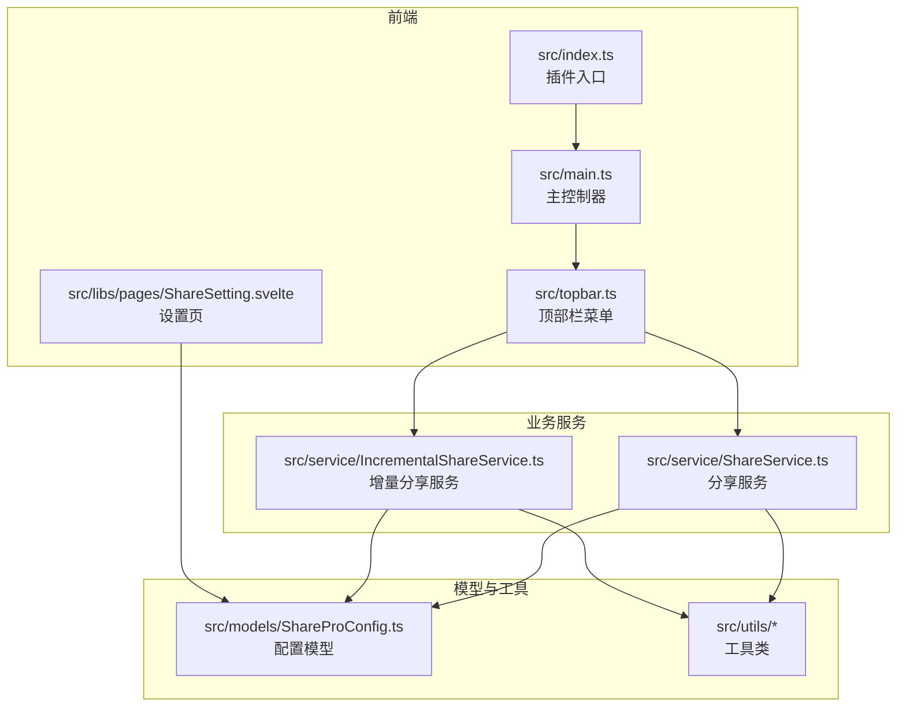
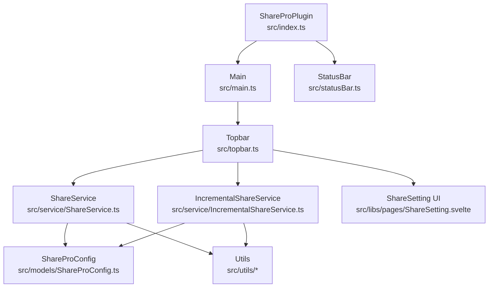
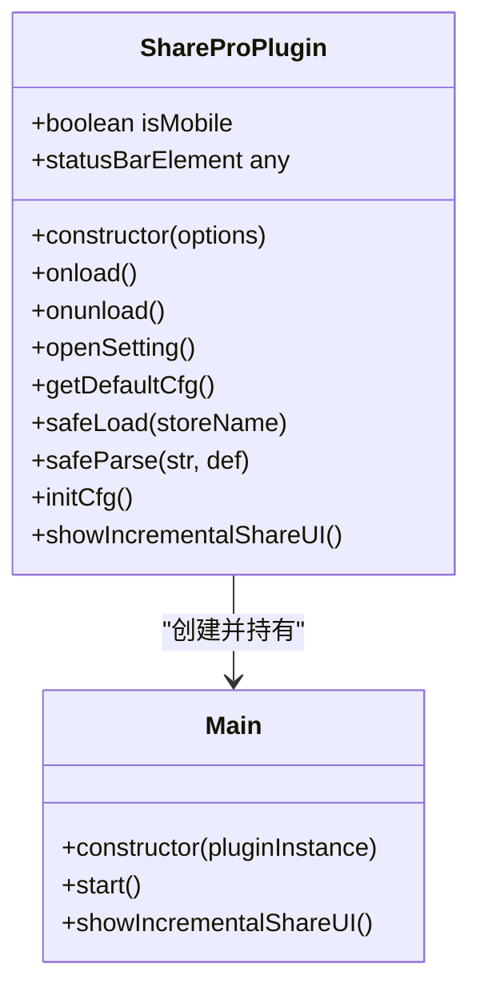
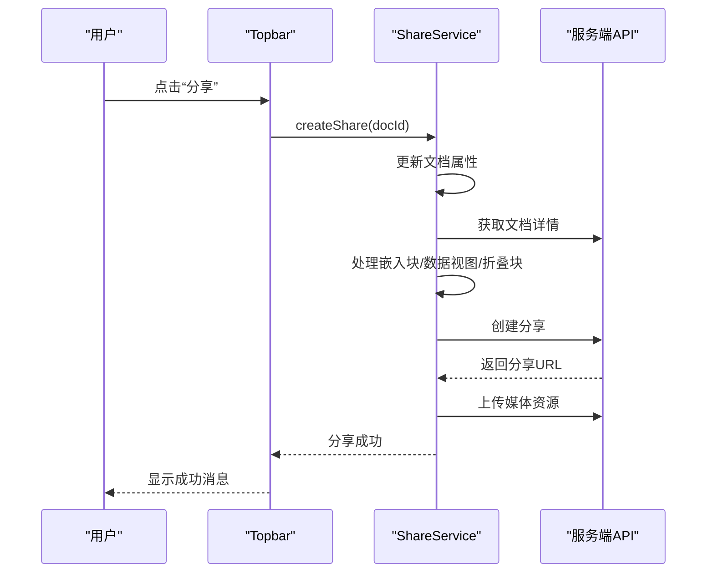
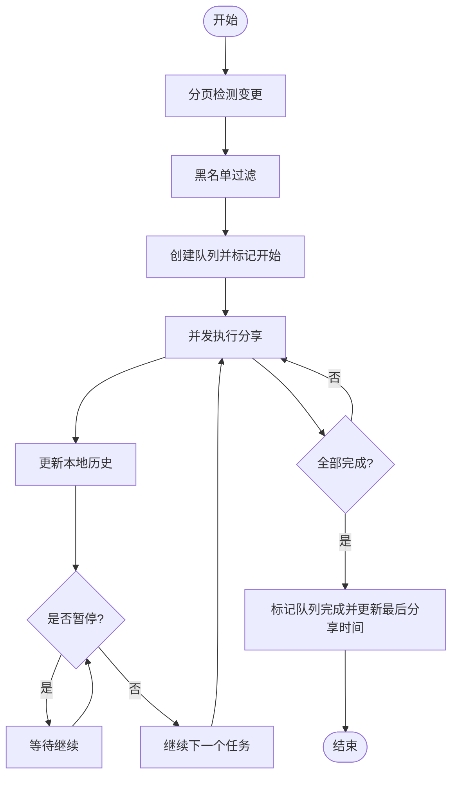
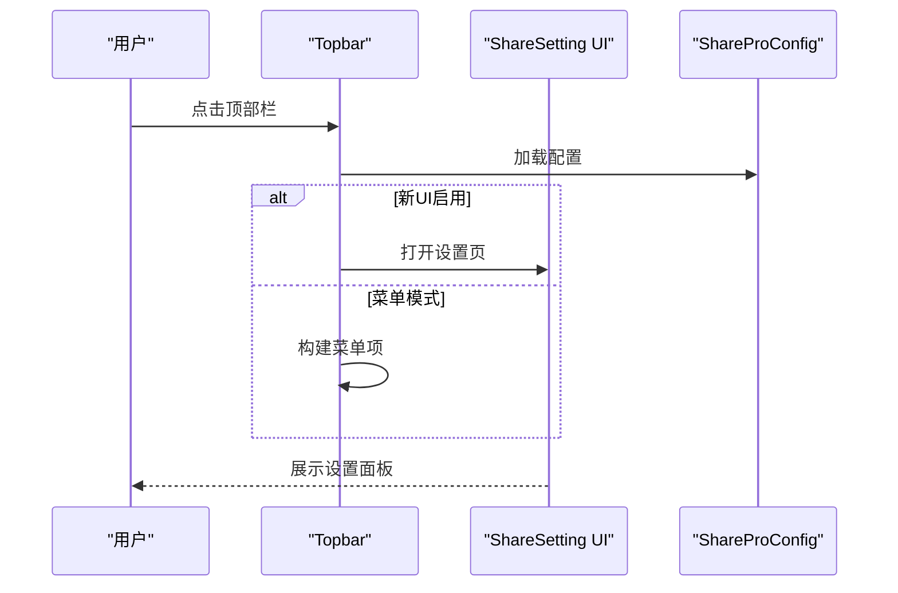
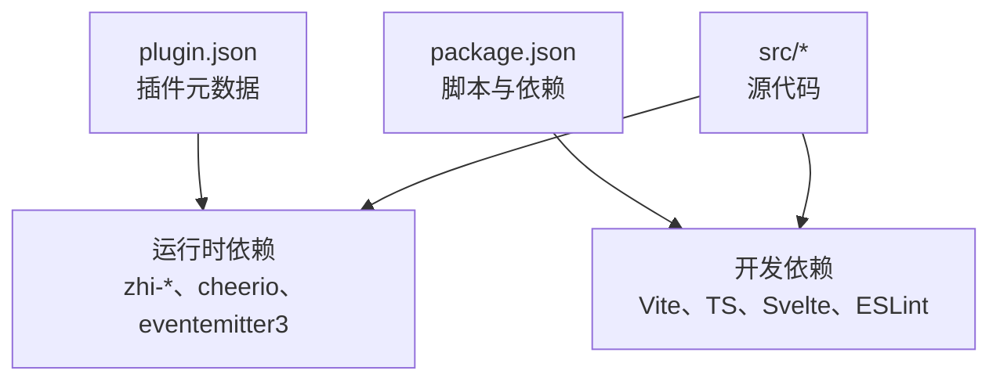

# 项目概述

<cite>
**本文档引用的文件**
- [README_zh_CN.md](file://README_zh_CN.md)
- [plugin.json](file://plugin.json)
- [package.json](file://package.json)
- [src/index.ts](file://src/index.ts)
- [src/main.ts](file://src/main.ts)
- [src/topbar.ts](file://src/topbar.ts)
- [src/statusBar.ts](file://src/statusBar.ts)
- [src/Constants.ts](file://src/Constants.ts)
- [src/models/ShareProConfig.ts](file://src/models/ShareProConfig.ts)
- [src/service/ShareService.ts](file://src/service/ShareService.ts)
- [src/service/IncrementalShareService.ts](file://src/service/IncrementalShareService.ts)
- [src/libs/pages/ShareSetting.svelte](file://src/libs/pages/ShareSetting.svelte)
- [docs/incremental-share-context-2025-12-04.md](file://docs/incremental-share-context-2025-12-04.md)
</cite>

## 目录
1. [简介](#简介)
2. [项目结构](#项目结构)
3. [核心组件](#核心组件)
4. [架构总览](#架构总览)
5. [详细组件分析](#详细组件分析)
6. [依赖关系分析](#依赖关系分析)
7. [性能考虑](#性能考虑)
8. [故障排除指南](#故障排除指南)
9. [结论](#结论)
10. [附录](#附录)

## 简介
思源笔记在线分享专业版（SiYuan Online Share Pro）是一个专为思源笔记（SiYuan Note）设计的一键分享插件，旨在帮助用户快速、便捷地将笔记内容发布到线上平台。项目提供以下核心能力：
- 单文档分享：一键分享当前打开的笔记文档
- 批量分享：支持对多个文档进行批量处理
- 增量分享：基于变更检测的智能分享，仅对新增或更新的文档进行处理，提升效率并降低资源消耗
- 设置与管理：提供丰富的分享配置、个性化设置、SEO优化以及黑名单管理
- 商业价值与开源贡献：在提供专业功能的同时，保持商业授权与开源社区的协作

此外，项目还提供官方公告、注册码购买与试用申请渠道，以及针对用户的特殊优惠活动说明。

**章节来源**
- [README_zh_CN.md:1-17](file://README_zh_CN.md#L1-L17)
- [plugin.json:1-35](file://plugin.json#L1-L35)

## 项目结构
项目采用模块化组织方式，前端使用 Svelte + TypeScript + Vite 构建，后端接口通过服务端 API 进行交互。核心目录与职责如下：
- src：核心源代码
  - api：分享相关的 API 定义与封装
  - composables：可复用的组合式逻辑（如数据表、嵌入块、折叠块等）
  - models：数据模型（配置、历史、黑名单等）
  - service：业务服务（分享、增量分享、设置、队列等）
  - utils：工具类（消息、进度、图像、配置等）
  - workers：Web Worker（如变更检测）
  - libs：页面与组件（设置页、增量分享 UI 等）
  - 入口文件：index.ts、main.ts、topbar.ts、statusBar.ts
- docs：功能设计与开发上下文文档
- openspec：开放规范与提案
- scripts：构建与发布脚本
- 根目录配置：package.json、plugin.json、README 等

**图表来源**
- [src/index.ts:33-59](file://src/index.ts#L33-L59)
- [src/main.ts:12-31](file://src/main.ts#L12-L31)
- [src/topbar.ts:26-98](file://src/topbar.ts#L26-L98)
- [src/service/ShareService.ts:40-56](file://src/service/ShareService.ts#L40-L56)
- [src/service/IncrementalShareService.ts:98-129](file://src/service/IncrementalShareService.ts#L98-L129)
- [src/models/ShareProConfig.ts:13-37](file://src/models/ShareProConfig.ts#L13-L37)

**章节来源**
- [src/index.ts:10-59](file://src/index.ts#L10-L59)
- [src/main.ts:12-31](file://src/main.ts#L12-L31)
- [src/topbar.ts:26-98](file://src/topbar.ts#L26-L98)
- [src/libs/pages/ShareSetting.svelte:10-116](file://src/libs/pages/ShareSetting.svelte#L10-L116)

## 核心组件
- 插件入口与生命周期
  - ShareProPlugin：负责插件初始化、配置加载、服务实例化与 UI 展示
  - 主控制器 Main：负责顶部栏初始化与增量分享 UI 的展示
- 分享服务
  - ShareService：统一的分享入口，支持单文档分享、批量分享、取消分享、历史记录与媒体资源处理
- 增量分享服务
  - IncrementalShareService：基于变更检测的智能分享，支持并发控制、队列管理、黑名单过滤与重试机制
- UI 与设置
  - 顶部栏菜单 Topbar：提供一键分享、取消分享、重新分享、查看文章、增量分享、分享管理与设置入口
  - 设置页 ShareSetting：基础设置、个性化设置、文档设置、SEO 设置、增量分享设置与黑名单管理
- 配置与常量
  - ShareProConfig：插件配置模型，包含思源 API 配置、服务 API 配置、应用配置与 UI 开关
  - Constants：开发/生产环境常量、默认 API 地址与存储键名

**章节来源**
- [src/index.ts:33-177](file://src/index.ts#L33-L177)
- [src/main.ts:12-31](file://src/main.ts#L12-L31)
- [src/service/ShareService.ts:40-258](file://src/service/ShareService.ts#L40-L258)
- [src/service/IncrementalShareService.ts:98-689](file://src/service/IncrementalShareService.ts#L98-L689)
- [src/topbar.ts:26-296](file://src/topbar.ts#L26-L296)
- [src/libs/pages/ShareSetting.svelte:10-116](file://src/libs/pages/ShareSetting.svelte#L10-L116)
- [src/models/ShareProConfig.ts:13-37](file://src/models/ShareProConfig.ts#L13-L37)
- [src/Constants.ts:10-20](file://src/Constants.ts#L10-L20)

## 架构总览
整体架构围绕“插件入口 → 顶部栏菜单 → 分享服务/增量分享服务 → 服务端 API”的链路展开，配合本地配置、历史缓存与 UI 组件，形成完整的分享闭环。

**图表来源**
- [src/index.ts:33-66](file://src/index.ts#L33-L66)
- [src/main.ts:21-31](file://src/main.ts#L21-L31)
- [src/topbar.ts:41-98](file://src/topbar.ts#L41-L98)
- [src/service/ShareService.ts:40-56](file://src/service/ShareService.ts#L40-L56)
- [src/service/IncrementalShareService.ts:98-129](file://src/service/IncrementalShareService.ts#L98-L129)
- [src/models/ShareProConfig.ts:13-37](file://src/models/ShareProConfig.ts#L13-L37)
- [src/libs/pages/ShareSetting.svelte:10-116](file://src/libs/pages/ShareSetting.svelte#L10-L116)
- [src/statusBar.ts:12-31](file://src/statusBar.ts#L12-L31)

## 详细组件分析

### 插件入口与生命周期（ShareProPlugin）
- 职责
  - 初始化日志、移动端判断与主控制器
  - 实例化分享服务、设置服务与增量分享服务
  - 提供默认配置、安全加载配置与增量分享 UI 展示
- 关键点
  - 通过 Constants 判断开发/生产环境，设置服务端地址
  - 使用本地黑名单服务替代传统黑名单服务
  - 支持从状态栏进入增量分享 UI

**图表来源**
- [src/index.ts:33-177](file://src/index.ts#L33-L177)
- [src/main.ts:12-31](file://src/main.ts#L12-L31)

**章节来源**
- [src/index.ts:33-177](file://src/index.ts#L33-L177)
- [src/main.ts:12-31](file://src/main.ts#L12-L31)
- [src/Constants.ts:10-20](file://src/Constants.ts#L10-L20)

### 分享服务（ShareService）
- 职责
  - 统一的分享入口：单文档分享、批量分享、取消分享
  - 文档树与大纲处理：支持文档树与目录大纲的生成与应用
  - 媒体资源处理：图片与数据视图表资源的提取与上传
  - 历史记录与错误处理：记录分享历史、缓存与错误日志
- 关键流程
  - 单文档分享：更新文档属性、获取文档详情、处理嵌入块/数据视图/折叠块、构造分享请求、上传媒体资源
  - 批量分享：对多文档进行分页与并发控制，逐个调用单文档分享逻辑
  - 取消分享：支持单文档与多文档取消，清理本地历史并更新状态

**图表来源**
- [src/topbar.ts:113-155](file://src/topbar.ts#L113-L155)
- [src/service/ShareService.ts:235-258](file://src/service/ShareService.ts#L235-L258)
- [src/service/ShareService.ts:531-674](file://src/service/ShareService.ts#L531-L674)

**章节来源**
- [src/service/ShareService.ts:40-258](file://src/service/ShareService.ts#L40-L258)
- [src/service/ShareService.ts:531-674](file://src/service/ShareService.ts#L531-L674)

### 增量分享服务（IncrementalShareService）
- 职责
  - 变更检测：基于本地历史与服务端文档列表，识别新增、更新与未变更文档
  - 批量分享：支持并发控制、队列管理、黑名单过滤与智能重试
  - 配置同步：更新最后分享时间并同步到服务端
- 关键流程
  - 变更检测：分页获取文档，查询本地历史，使用 Web Worker 进行变更对比
  - 批量分享：分页检查黑名单，创建队列并并发执行，更新任务状态与历史记录
  - 智能重试：网络错误指数退避、5xx 错误延迟重试、4xx 错误立即失败

**图表来源**
- [src/service/IncrementalShareService.ts:160-210](file://src/service/IncrementalShareService.ts#L160-L210)
- [src/service/IncrementalShareService.ts:270-351](file://src/service/IncrementalShareService.ts#L270-L351)
- [src/service/IncrementalShareService.ts:396-577](file://src/service/IncrementalShareService.ts#L396-L577)

**章节来源**
- [src/service/IncrementalShareService.ts:98-689](file://src/service/IncrementalShareService.ts#L98-L689)
- [docs/incremental-share-context-2025-12-04.md:17-65](file://docs/incremental-share-context-2025-12-04.md#L17-L65)

### 顶部栏菜单与设置（Topbar 与 ShareSetting）
- 顶部栏菜单
  - 提供一键分享、取消分享、重新分享、查看文章、增量分享、分享管理与设置入口
  - 支持新旧 UI 模式切换，移动端适配
- 设置页
  - 基础设置、个性化设置、文档设置、SEO 设置、增量分享设置与黑名单管理
  - 通过 Tabs 组织，支持国际化文本

**图表来源**
- [src/topbar.ts:41-98](file://src/topbar.ts#L41-L98)
- [src/libs/pages/ShareSetting.svelte:38-106](file://src/libs/pages/ShareSetting.svelte#L38-L106)
- [src/models/ShareProConfig.ts:13-37](file://src/models/ShareProConfig.ts#L13-L37)

**章节来源**
- [src/topbar.ts:26-296](file://src/topbar.ts#L26-L296)
- [src/libs/pages/ShareSetting.svelte:10-116](file://src/libs/pages/ShareSetting.svelte#L10-L116)

## 依赖关系分析
- 运行时依赖
  - Svelte：UI 框架
  - zhi-siyuan-api、zhi-blog-api：与思源笔记 API 交互
  - cheerio：HTML 解析与处理
  - eventemitter3：事件驱动
  - copy-to-clipboard：复制到剪贴板
- 构建与开发依赖
  - Vite、TypeScript、Svelte 插件、ESLint、Prettier 等
- 插件元数据
  - plugin.json：名称、作者、版本、兼容性、国际化与资助信息
  - package.json：脚本、依赖与包管理器

**图表来源**
- [plugin.json:1-35](file://plugin.json#L1-L35)
- [package.json:10-51](file://package.json#L10-L51)

**章节来源**
- [plugin.json:1-35](file://plugin.json#L1-L35)
- [package.json:10-51](file://package.json#L10-L51)

## 性能考虑
- 并发控制与队列
  - 增量分享支持并发控制与队列管理，避免对服务端造成过大压力
- 分页与限流
  - 子文档与历史记录查询采用分页策略，限制最大数量，防止性能风险
- 媒体资源处理
  - 媒体资源分组上传，按批次处理，减少请求开销
- 缓存与本地存储
  - 本地历史缓存与本地存储结合，减少重复请求与提升响应速度

**章节来源**
- [src/service/IncrementalShareService.ts:310-351](file://src/service/IncrementalShareService.ts#L310-L351)
- [src/service/ShareService.ts:148-190](file://src/service/ShareService.ts#L148-L190)
- [src/service/ShareService.ts:676-800](file://src/service/ShareService.ts#L676-L800)

## 故障排除指南
- 常见问题
  - 分享失败：检查服务端返回状态与错误信息，查看日志输出；单文档与多文档错误分别处理
  - 媒体资源上传失败：检查图片 URL、内容类型与网络连接；按批次重试
  - 增量分享队列异常：检查队列状态、暂停标志与任务状态更新
- 建议步骤
  - 查看控制台日志，定位具体环节
  - 确认配置正确（服务端地址、令牌、Cookie）
  - 检查网络连通性与服务端可用性
  - 清理缓存与重试

**章节来源**
- [src/service/ShareService.ts:531-674](file://src/service/ShareService.ts#L531-L674)
- [src/service/IncrementalShareService.ts:585-659](file://src/service/IncrementalShareService.ts#L585-L659)

## 结论
思源笔记在线分享专业版通过模块化的架构设计与完善的业务服务，实现了从单文档到批量、再到增量分享的全场景覆盖。项目在保证易用性的同时，兼顾性能与稳定性，提供了丰富的配置与管理能力。结合官方公告与注册码体系，项目在商业价值与用户体验之间取得了良好平衡。

## 附录
- 许可证信息
  - 项目使用 MIT 许可证，允许自由使用与修改，需保留版权与许可声明
- 官方公告与注册码
  - 官方公告与注册码购买页面可通过 README 与 plugin.json 中的链接访问
- 特殊优惠活动
  - 可通过邮件申请 30 天免费试用注册码，详见 README

**章节来源**
- [package.json:9](file://package.json#L9)
- [README_zh_CN.md:13-17](file://README_zh_CN.md#L13-L17)
- [plugin.json:30-34](file://plugin.json#L30-L34)